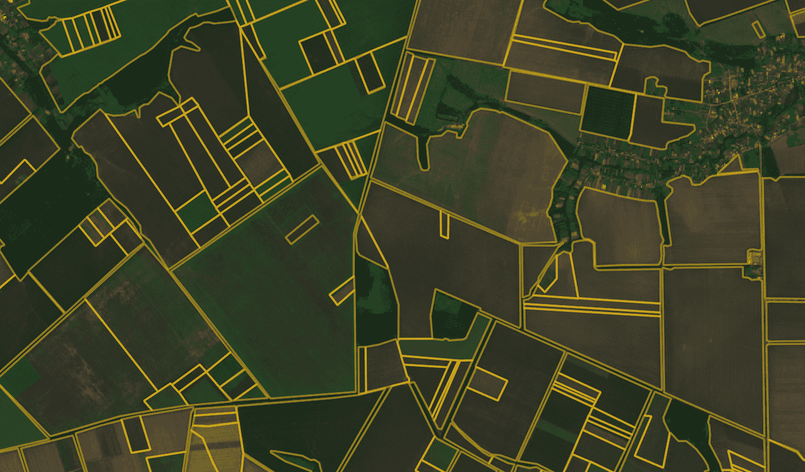
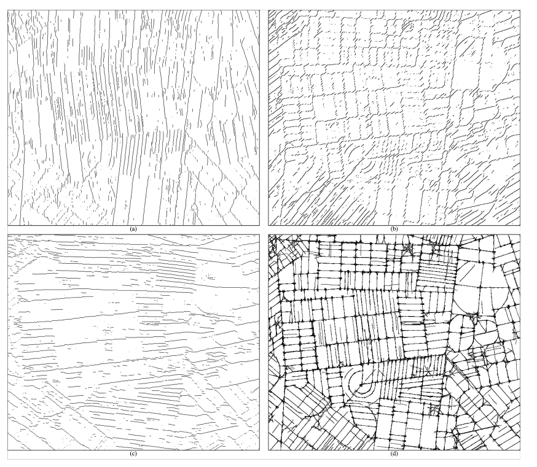
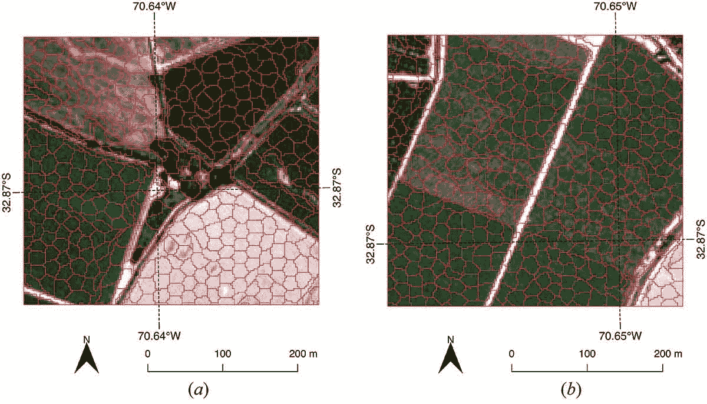
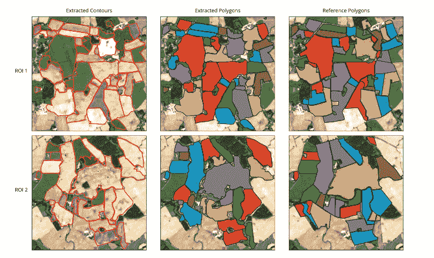
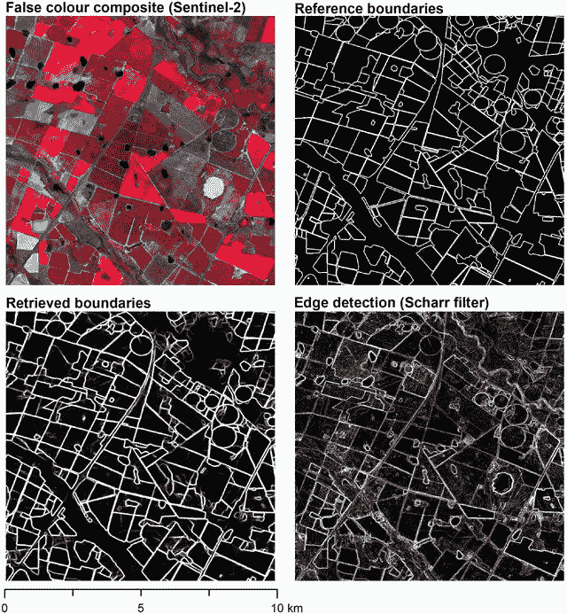
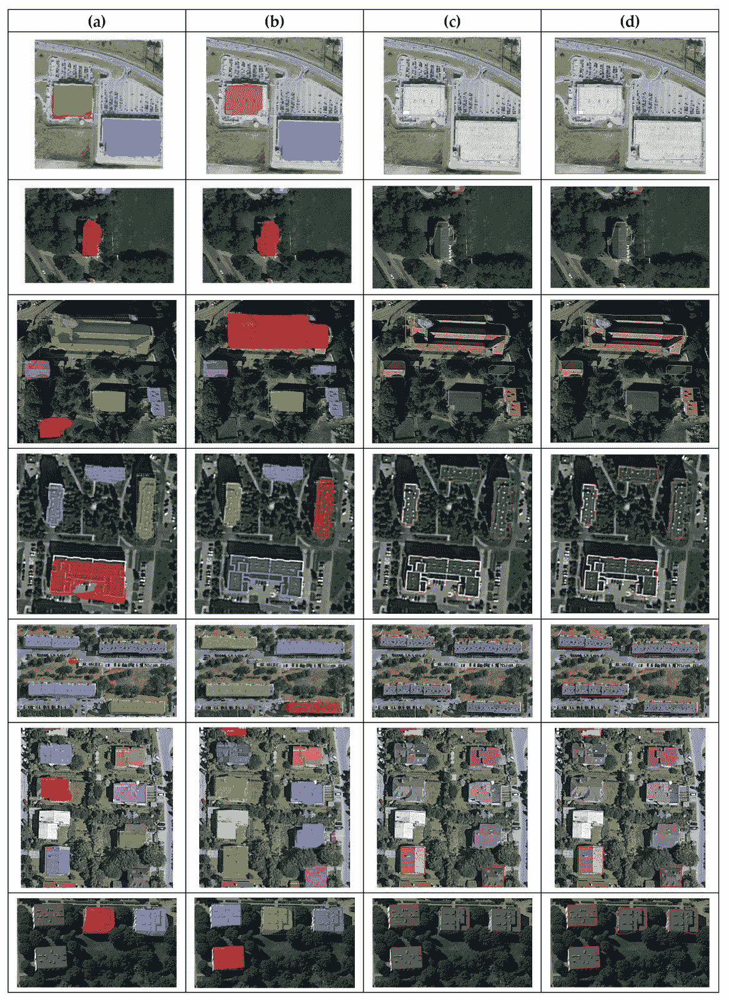
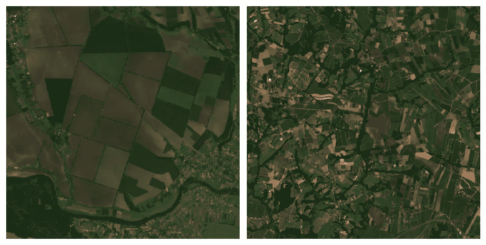
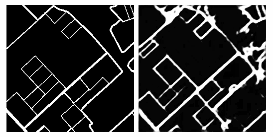

# сrор场边界检测:方法和主要挑战

> 原文：<https://medium.com/geekculture/%D1%81r%D0%BE%D1%80-field-boundary-detection-approaches-and-main-challenges-46e37dd276bc?source=collection_archive---------0----------------------->

今天，我们拥有强大的工具，通过技术发展来改善农业管理和绩效优化。遥感，如卫星图像处理，就是一个很好的例子。

土地使用统计在现代农业和商业中的重要性是不可否认的。准确和最新的土地利用制图需要精确的土地分类，如果没有实地边界的最终检测，这是很复杂的。

通常，现有地图基于历史行政地图或基于观测数据人工开发。第一个不符合高精度。第二个问题涉及大量的手工劳动，随着要创建或更新的地图数量的增加而增加。这两者都经不起时间可变性的审查。在这种情况下，产量预测将不会产生准确的估计，并可能导致短缺或扰乱特定商品市场。

作物面积保护是农业管理中的另一个领域，从这种地图中受益匪浅。考虑到发达国家和发展中国家耕地的共同消费增长趋势，保护确保了产量并保持了土壤肥力。

因此，作物田地边界检测问题存在于多个领域中，并且尽管已经存在许多解决方案，但仍在开发中。让我们重点关注其中的一些解决方案，并讨论您在实施过程中可能面临的主要优势和挑战。

# 经典计算机视觉方法的地块边界检测

从传统技术的角度来看，栅格分析可以解决这个问题。论文[在多时相卫星图像中的农田边界划定](https://www.researchgate.net/publication/329817494_Boundary_Delineation_of_Agricultural_Fields_in_Multitemporal_Satellite_Imagery)深入讨论了这种方法。一组研究人员的目标是开发一种算法，从卫星图像中检测新西兰农田的边界。

该过程从选择红色、近红外(NIR)和短波红外(SWIR)波段的七个连续日期开始。该算法涉及广泛的图像分析(即波段),计算每个小径向窗口(如原始论文建议的半径为 5 个像素)的标准偏差，得到平均的图，与方向滤波器卷积以找到潜在的线，因此每个方向滤波器产生一个图像(论文中有 16 个滤波器)。图 1 显示了其中的一些。然后，对得到的图像进行阈值处理，并对每个像素使用逐元素或运算进行组合。在矢量化步骤中，线被细化、平滑，如果修剪线没有形成闭合轮廓，则会被延伸和过滤掉。最终的结果是，一张边界地图已经准备好了。

然而，精度评估的结论是，这种方法是适用的，误差不超过 20 米就足够了。更严格的评估给出的准确率只有 59%。

当我们试图在研究中实现这种逻辑时，我们发现这种设置非常脆弱。必须应用几个不同的阈值，但是这些阈值对于在春天拍摄的图像有效，而对于在秋天拍摄的图像没有提供好的结果。

*Figure1\. Responses from three of the 16 directional operators were processed by (2) and before after all sieving by length, showing (a) 0°, (b) 45°, and © 100° (101.25)°; and (d) the final raster line work after connectivity analysis and removal of short fragments in each directional response, and then combining all 16 into a single layer.*

# 用于边界检测的经典机器学习算法

对于我们这样的任务，单靠经典的计算机视觉方法并不能产生很好的结果。另一方面，深度学习方法需要大量的标记数据。有没有办法用小数据集达到足够合理的精确度？

经典的机器学习算法通常在有限的数据集上工作得最好。论文提出了其中一条流水线:[通过凝聚分割进行农业地块圈定的机器学习方法](https://www.tandfonline.com/doi/full/10.1080/01431161.2016.1278312)。研究小组使用了从计算的指数，即归一化差异植被指数(NDVI)，归一化差异水指数(NDWI)和光谱形状指数(SSI)中得出的图像。这种图像使他们能够获得超像素，即像素的局部集群，为下一步制作额外的特征地图。研究人员训练 RUSboost 分类器对像素进行二元分类。

这种技术使一个团队达到了 92%的准确率，这在给定少量数据和相对简单的数据预处理程序和模型训练的情况下是令人印象深刻的。

*Figure 2\. Superpixel segmentation of two small areas. The borders of each superpixel are shown in red.*

# 基于图形的轮廓搜索

轮廓寻找是可以应用于地块边界检测任务的另一种技术。这个想法是在论文[中提出的，使用基于图形的生长等高线从遥感图像中提取农田](https://www.researchgate.net/publication/340534499_Extracting_Agricultural_Fields_from_Remote_Sensing_Imagery_Using_Graph-Based_Growing_Contours)。

主动轮廓发现，也称为“蛇”，在计算机视觉中并不新鲜。然而，正如作者所讨论的，一些常见的缺点是可以解决的，比如跳过粗糙的角落。此外，提到这一点会增加算法的复杂性。基尔大学的研究人员选择了石勒苏益格-荷尔斯泰因州一个以农业用地为主的主题区域。在实际轮廓寻找之前，执行一系列变换来处理该任务，特别是双线性滤波，YUV 和 RGB 色彩空间之间的色彩空间变换采用梯度寻找局部各向异性。

最后，预处理图像由允许主动轮廓发现的信息特征图组成，因为这样的过程是基于内部和外部能量的概念。梯度图像为前者提供了丰富的信息，而亚像素变换为后者提供了丰富的信息。然而，主动轮廓寻找的方法改变了。首先，基于从预处理步骤得到的描述符，在最可能的点中播种潜在场。接下来，加权图构建从种子作为第一个节点开始。这样的图将被构建为一个圆，但是权重分配和重新计算允许最终删除权重太小的顶点和边。获得的轮廓然后变换其边界是提取对象的多边形。

在现有的土地利用地图上进行评估，该方法检测到了总面积的 99%,损失的土地不到 9%。然而，作者指出，靠近城市地区的田地边界往往提取不正确。作为一个可能的后处理步骤，他们建议过滤掉城市结构。

*Figure 3\. Field extraction results for the two ROIs show extracted contours, corresponding extracted polygons, and the reference dataset for comparison*

# 卷积神经网络方法

深度神经网络有助于解决经典计算机视觉方法的缺点，并可以发现更复杂的模式。另一个研究小组在论文“边缘上的深度学习:用卷积神经网络从卫星图像中提取场边界”中使用最先进的神经网络架构 ResUNet 来处理边界检测任务。主要的兴趣区域是南非 120，000 平方公里的“玉米四边形”作者使用常规的 Sentinel-2，主要是绿色、蓝色、红色和近红外波段。对图像没有做太多的预处理，但标记部分是至关重要的:为了将基于区域和基于边缘的检测结合起来，研究人员将田地边界标记为一类，将整个田地区域标记为另一类。结果相当不错，总体准确率达到了 90%。

我们尝试了这种架构，但是我们只有单一的阶级界限。此外，作为基准，我们使用了一些其他的架构——原始的 UNet 和 UNet++。ResNet 的表现几乎和 UNet 一样。不过，UNet++的表现比另外两个要好。或许，还有一点也很重要:通常，边界是肉眼可见的。我们认为算法发现这种模式是显而易见的。因此，我们使用常规的红色、蓝色和绿色波段，省略了近红外波段。这可能是我们追求的下一步。

*Figure 4\. Comparison of the boundaries retrieved by our model against reference boundaries and edges detected with a Scharr filter for a 10-km × 10-km region in the test region.*

# 其他物体的卷积神经网络边界检测

来自波兰地理空间工程和大地测量研究所的研究团队基于实例分割方法进行了场边界检测。作为研究区域，他们选择了华沙的一部分，并用类别标签标记对象。

已经选择了用于训练 Mask R-CNN 的领先架构，并补充了另一个“迷你网络”,该网络指向在哪里寻找感兴趣的模式。这种网络是区域提议网络(RPN ),广泛应用于各种对象检测任务。研究人员表明，增强型快速边缘区域 CNN (FER-CNN)成功地对卫星图像上的建筑物进行了分类，并具有明显更好的边界估计。这里研究人员的创新点是什么？

与最初提出的 RPN 相比，FER-CNN 在特征地图的几个分辨率上预测区域。一个特征地图可以缩小 2、4 或 8 倍，提出区域建议，我们将选择那些在多个比例上一致的区域。与传统的轮廓发现算法相比，结果显示了该方法惊人的精度。除了非常准确之外，他们还报告了由遮挡和阴影造成的错误数量的减少，这表明该方法非常稳健。论文[使用快速边缘区域卷积神经网络](https://www.mdpi.com/2072-4292/12/14/2240/htm)对卫星图像中的建筑物进行检测、分类和边界正则化描述了所有细节。

虽然城市中的建筑与开放空间中的田野不是同一物体，但是对于感兴趣的任务来说，规则边界的想法也是可行的。相同的标注可以应用于仅仅是一个类的字段，或者我们可以同时结合两个任务，字段描述和分类，为字段定义几种类型。值得注意的是，第二种方法需要花费更多的时间在标记程序上。

*Figure 5\. Results comparison of experimental architectures (a, b, d) and conventional method (/c)*

# 实际挑战以及我们如何应对它们

尽管在场边界检测方面取得了巨大的进步，但仍有一些问题需要解决以提高精度。

首先，不同的地点可能有具体的特点，这使得开发“一刀切”的方法更加困难。在我们的研究中遇到的一个例子是，乌克兰的油田比其他许多地方都要大。例如，当比较本地油田和南非油田时，差异是惊人的。

*Figure 6\. Satellite images of Ukrainian fields (left) and South Africa (right), scale, and resolution preserved.*

解决这个问题的一种方法可能是为不同的位置训练不同的模型，或者用来自其他站点的图像扩展数据集。无论如何，这带来了另一个问题:标签数据。与精确标记不同，收集图像并不耗费时间和资源。

季节变化和田间种植的作物类型给探测任务带来了挑战。例如，即使用肉眼看，位置相近的种植小麦的田地，尽管是两块地，也可能看起来像一大片。当对看不见的数据进行操作时，这个问题可能会降低解决方案的可伸缩性。从由可见和不可见光谱组成的卫星图像中可以获得复合层的多种组合。其中一些可能会提供有意义的见解和发现。例如，近红外波段广泛用于此类任务。然而，关于其他复合材料和组合的性能的文献和报道并不多。

*Figure 7\. An example of ground truth boundaries mask (left) and predicted mask (right) {our research}*

还有一种想法是检测道路，并基于图形将它们连接起来，正如论文“[从高分辨率卫星图像中提取道路网络的基于分层图形的分割](https://www.researchgate.net/publication/314729725_Hierarchical_graph-based_segmentation_for_extracting_road_networks_from_high-resolution_satellite_images)所建议的那样，并作为副产品导出字段边界。这种方法没有产生很大的效果。我们到处都可以找到道路，但田野却不一样。此外，并不是所有的领域和边界都像普通道路一样遵循直线模式。

# 结论

遥感技术使人类能够自动完成以前无法想象的任务。一个实际的例子是场边界检测，它对于几个领域是至关重要的。过去，人们试图用经典的计算机视觉技术来实现自动化。由于今天的计算资源比这些算法所犯的错误更便宜，深度学习算法在这里更成功。当前的神经网络是复杂的系统，产生比它们的前辈好得多的结果。