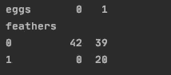
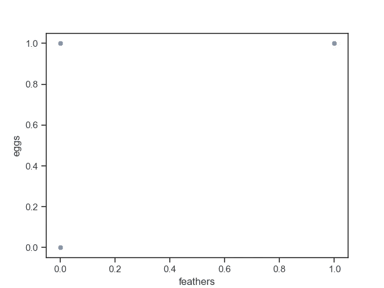
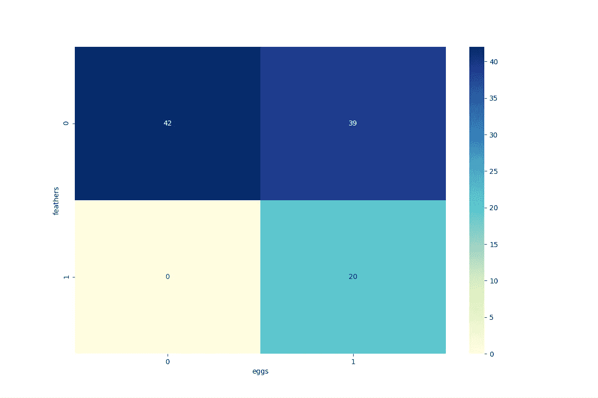
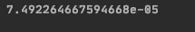
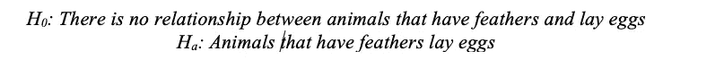

# 使用 Python 进行卡方检验

> 原文：<https://medium.com/geekculture/00-machine-learning-notes-chi-squared-test-d9e64542cce0?source=collection_archive---------9----------------------->

本文是对使用统计测试来执行机器学习分类任务的低级介绍。我打算在广泛的基础上介绍这些概念，以便传达数学和机器学习之间的重叠。

我在 Kaggle 上发现了一个很棒的数据集，叫做动物园数据。

[](https://www.kaggle.com/raghunathangrdr/zoo-data-dataset) [## 动物园数据集

### Kaggle 是世界上最大的数据科学社区，拥有强大的工具和资源来帮助您实现您的数据…

www.kaggle.com](https://www.kaggle.com/raghunathangrdr/zoo-data-dataset) 

如果您打算用不同的参数重新创建这个演示，请使用上面的链接下载. csv。

现在我们有了数据集，让我们来回答这个问题:“有羽毛的动物会下蛋吗？”

```
import pandas as pd
from scipy.stats import chi2_contingency
import seaborn as sns
import matplotlib.pyplot as plt
```

注意:根据我的经验，有时当我在 Windows 上时，我在使用 pip 安装库时会遇到问题。避免 pip 错误的一个方法是使用轮子构建库。我喜欢创建一个专门存放我的车轮的文件夹。然后我从这里下载([https://www.lfd.uci.edu/~gohlke/pythonlibs/](https://www.lfd.uci.edu/~gohlke/pythonlibs/))。在命令提示符下，您需要做的就是:

```
cd \C:\path\to\wheel\
pip install your_wheel.whl
```

如果您正在努力安装库，希望您可以利用这个技巧。我导入 Pandas 来处理数据帧，并从。csv，SciPy 中用于执行卡方检验的模块，Seaborn 和 PyPlot to graph。

```
path = '/Users/amadzarak/PycharmProjects/Kaggle/zoo_data-1.csv'
zooData = pd.read_csv(path)
```

这里我只是声明了一个名为 path 的变量，它是 zoo_data-1 文件的完整路径。然后我声明了从 Pandas 调用 read_csv 函数的变量 zooData，并输入了 path 变量。现在我们有一个熊猫数据框架。

```
contingency= pd.crosstab(zooData['feathers'], zooData['eggs'])
```

这是我关注数据框中的两列的地方。让我们先来看看目前为止我们所拥有的:



Output by running: print(contingency)

解释这个输出的含义似乎是谨慎的。数据集基于值 0 和 1 来指示指定属性的存在。因此，第一栏可以翻译为:“不下蛋。”所以，生蛋和长羽毛的动物的数量是 20。

```
c, p, dof, expected = chi2_contingency(contingency)
```

这里我们声明完成卡方检验所需的变量。我可以通过打印变量来检查工作。例如，我想确保自由度是正确的，因此我简单地运行:print(dof)。因为输出“1”对于 2x2 的数据表是正确的，所以我确信到目前为止我没有出错。

绘制这个数据集的一个挑战是找出一个好的图表样式。散点图不适合显示数据:



可以看出，这是一个尴尬的展示。所以我选定了一张热图。

热图是我们展示数据的好方法。



所以我们来分析一下我们所拥有的。我们有一个 p 值和我们的问题。



our p-value.

对于卡方检验，问题需要采用无效假设和替代假设的形式。



p 值小于 0.05，这意味着我们在 95%的置信度下拒绝零假设。无效假设是蛋和羽毛是独立的。根据我们正在研究的数据，人们可以得出结论，有羽毛的动物会产卵。

总结:我记得在我高中的统计课上，进行卡方检验是多么乏味。Python 是一个非常好的工具。我震惊于诚实是如此容易，因为我以前的经历会让我相信这一点。执行这样的测试可以帮助制作机器学习分类器的过程。

```
import pandas as pd
from scipy.stats import chi2_contingency
import seaborn as sns
import matplotlib.pyplot as plt
path = '/Users/amadzarak/PycharmProjects/Kaggle/zoo_data-1.csv'
zooData = pd.read_csv(path)
contingency= pd.crosstab(zooData['feathers'], zooData['eggs'])
#print(contingency)
c, p, dof, expected = chi2_contingency(contingency)
print(p)
plt.figure(figsize=(12,8))
sns.heatmap(contingency, annot=True, cmap="YlGnBu")
plt.show()
```

全部代码。