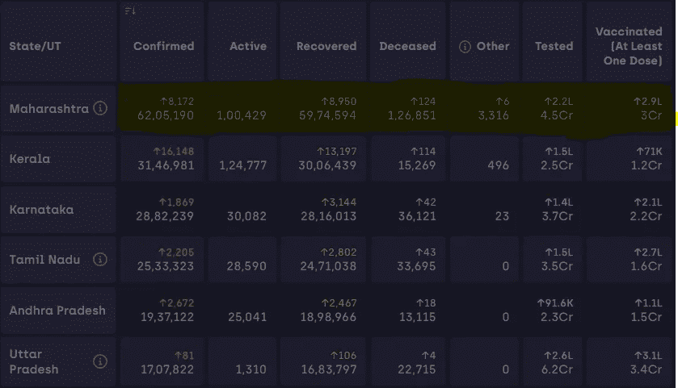
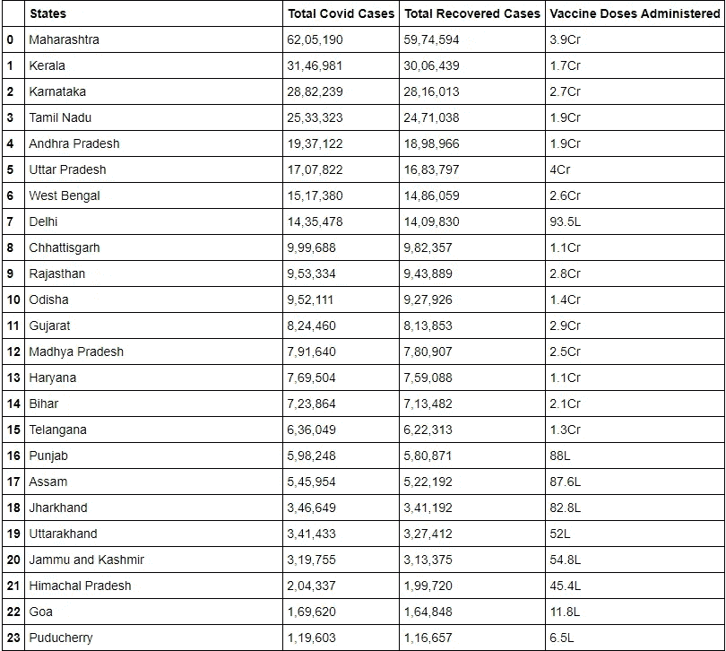

# 数据科学👨‍💻:使用 Python 废弃数据

> 原文：<https://medium.com/geekculture/1-data-science-scrapping-data-e244669e74e2?source=collection_archive---------12----------------------->

这是关于数据科学概念的整个系列。这是第一个关于数据废弃的博客，或者我们可以说是数据科学中的数据收集过程。请务必关注我，这样您就可以更新以下系列。

> 当某件事足够重要时，即使胜算对你不利，你也要去做。
> 
> ~埃隆·马斯克

> **简介**

这个博客主要是从网站数据中搜集基本数据。数据科学就是与数据打交道。因此，数据科学最重要的部分之一就是数据收集。所以这里我们从网页上抓取数据。有许多收集数据的方法。对于数据抓取，我使用了以下库:

(1) **硒**:铬驱动

(2) **美汤**:网刮

(3) **熊猫**:数据操作

为此，我们从 **Covid 19 印度仪表板数据**中抓取数据。

> 链接:[https://www.covid19india.org/](https://www.covid19india.org/)
> 
> 关于[数据收集的更多信息。](https://www.questionpro.com/blog/data-collection/)

> **概述:**

我通过三个主要步骤完成了这一过程:

(1)使用 selenium chrome web drive 访问网页。

(2)用美汤刮数据。

(3)将数据转换为 pandas 数据框，并将数据保存为 CSV 文件。

> **编码实现:**

如需完整代码，请查看本博客末尾的实现链接。

## **安装依赖关系:**

```
pip install selenium pandas beautifulsoup4
```

## **导入依赖关系:**

```
**from** **selenium** **import** webdriver
**from** **bs4** **import** BeautifulSoup
**import** **pandas** **as** **pd**
```

## **设置 Chrome 驱动:**

从这个[链接](https://chromedriver.chromium.org/downloads)下载 Chrome 驱动。

解压文件，在你喜欢的地方设置文件，然后 ***在环境变量中添加 PATH 变量。***

我在**系统变量**中添加了路径。

我将 chrome 驱动程序添加到我的工作目录中。

```
driver = webdriver.Chrome("chromedriver")
```

你必须添加你的 chromedriver.exe 路径。

## **网页信息:**

我们有很多关于印度 covid 情况的信息。我们获取表格，特别是关于 covid 病例总数、完全康复病例数和每个州的疫苗剂量的列。

列出州名、covid 病例总数、治愈病例总数和疫苗剂量的空列表。

```
states = []
total_covid_cases = []
total_recoverd_cases = []
vaccinated_people = []
```

将网页的 Url 添加到驱动程序中，这样我们就可以获得特定网页的源代码。

```
driver.get("https://www.covid19india.org/")
```

## **刮取数据:**

```
content = driver.page_source
soup = BeautifulSoup(content)
```

首先，我们获得页面的源代码，然后创建一个漂亮的 Soup 对象，以便我们可以对它执行一些操作。

现在我们必须知道我们要获取什么，类名是什么，什么特定的标签包含我们想要的信息。所有这些问答我们都可以通过**查看网页**得到。为此，你必须有一点点关于 HTML 和 CSS 的**知识。**

因此，对于我们的 Covid 数据，我们抓取包含在*‘表格容器’*类之间的整个表格。Soup 有一个内置的函数 find，它将查找我们的模式的第一次出现。

```
table = soup.find('div',attrs={'class':'table-container'})
```

在这条线的上面，意味着在特定的网页中查找 div 标签，这个标签有一个类名*‘table container’*。

现在我们有了一个表，但是我们只想获取一些列，所以我们必须再次过滤这个表。

```
data = []
row_data = []
**for** index , item **in** enumerate(table.find_all('div' , attrs={'class' : 'total'})):
    **if** index%6 == 0 **and** index != 0:
        data.append(row_data)
        row_data = []
    row_data.append(item.text)
```

在这里，我们首先从表中取出所有数据，并制作一个列表结构 的 ***列表。因此，data[0]表示 covid19 dashboard India 网页上表格的第一列。***



The highlighted area we get by using data[0]

现在，在获得列表结构列表后，我们使用 python 中的特殊循环，将值添加到空列表中。

```
**for** d **in** data:
    total_covid_cases.append(d[0])
    total_recoverd_cases.append(d[2])
    vaccinated_people.append(d[-1])
```

只要关注代码，你就会明白。很简单…👍

```
**for** item **in** table.find_all('div',attrs={'class':'state-name'}):
    states.append(item.text)
```

之后，我们将州名添加到州列表中。对于 state name，我们必须获取所有的 div 标签，并将类作为“state-name”。

## **将数据转换为熊猫数据帧:**

```
data = pd.DataFrame({'States':states , 
'Total Covid Cases':total_covid_cases,
'Total Recovered Cases':total_recoverd_cases,
'Vaccine Doses Administered':vaccinated_people})
```

我们得到这样的结果。



## **将数据帧保存为 CSV:**

```
data.to_csv('covid-report-statewise.csv')
```

通过使用 ***to_csv*** 功能我们可以将数据帧转换成 csv 文件。

> **代码:**

[](https://github.com/manthan89-py/Data-Science/tree/master/Practical%201%20Scrapping%20the%20Data) [## man than 89-py/数据科学

### 这个知识库包含了我们大学数据科学学科的实践。-man than 89-py/数据科学

github.com](https://github.com/manthan89-py/Data-Science/tree/master/Practical%201%20Scrapping%20the%20Data) 

> **结论:**

我们可以通过使用 web scrapping 库(如 beautiful soup、scrappy 等)从网页中获取任何数据。在转换成 pandas 后，我们可以对该数据应用所有 Pandas 函数。

更多关于**熊猫**功能[在这里。](https://pandas.pydata.org/pandas-docs/stable/reference/general_functions.html)

更多关于**美汤** [在这里。](https://beautiful-soup-4.readthedocs.io/en/latest/)

> **领英:**

 [## 印度古吉拉特邦苏拉特曼丹·比卡第亚-查罗特科技大学|…

### 查看 Manthan Bhikadiya 在世界上最大的职业社区 LinkedIn 上的个人资料。Manthan 有 2 个工作列在…

www.linkedin.com](https://www.linkedin.com/in/manthanbhikadiya/) 

> **更多项目和博客:**

***项目:***

[](https://github.com/manthan89-py) [## manthan89-py -概述

### 对 AI、深度学习、机器学习、计算机视觉、区块链、Flutter 感兴趣😇。做一些竞争性的…

github.com](https://github.com/manthan89-py) 

***博客:***

[](https://manthan-bhikadiya.medium.com/) [## 曼丹·比卡第亚·🖋-中等

### 阅读曼丹·比丘迪亚·🖋在媒介上的作品。对人工智能、深度学习、机器学习、计算机视觉感兴趣…

manthan-bhikadiya.medium.com](https://manthan-bhikadiya.medium.com/) 

> **最后备注:**

**感谢阅读！如果你喜欢这篇文章，请点击**👏**尽可能多的按按钮。这将意味着很多，并鼓励我继续分享我的知识。如果你喜欢我的内容，请在 medium 上关注我，我会尽可能多地发布博客。**