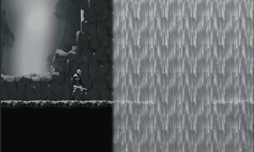
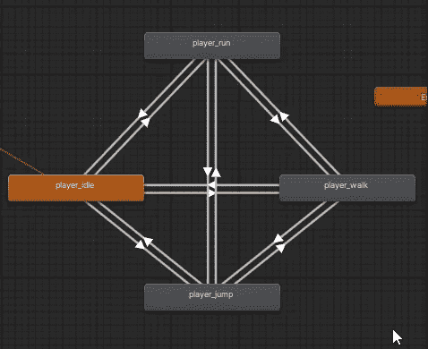

# 一行代码，你的 2D 播放器就会看到它在往哪里走

> 原文：<https://medium.com/geekculture/1-line-of-code-and-your-2d-player-will-look-where-its-going-8c1f4d1991a5?source=collection_archive---------22----------------------->

**目标**:让一个 2D(精灵)角色看起来和它运动的方向一样

你有一个动画精灵，你的角色。你让它动起来。你让它跑或走。然后跳。所有这些都有相应的动画，即一系列精灵。

但是等等！当你向右移动时，就可以了。当你向左移动…就像**月球漫步**。

你知道吗？而是你的角色只是个小精灵。你得告诉**看运动方向**。以下是如何在一行代码中实现的，这对于其他动画来说是高度可重用的。

假设你有这些动画和它们之间的过渡。让我们选择其中一个并添加一个状态机行为。

这是一行代码。在进入状态时，我们获取对 sprite 渲染器组件的引用。它有两个布尔属性，flipX 和 flipY，我们可以**用 Velocity.x ≥ 0 语句**设置。通过只在进入状态时动作，我们将在退出时修改精灵，所以如果我们向左移动然后停止，角色将保持面向左。

现在您需要做的就是将状态机行为附加到任何需要这个特性的状态。

如果你喜欢，就鼓掌吧！看看我的游戏或者给我买杯咖啡:感谢每一种支持！！

