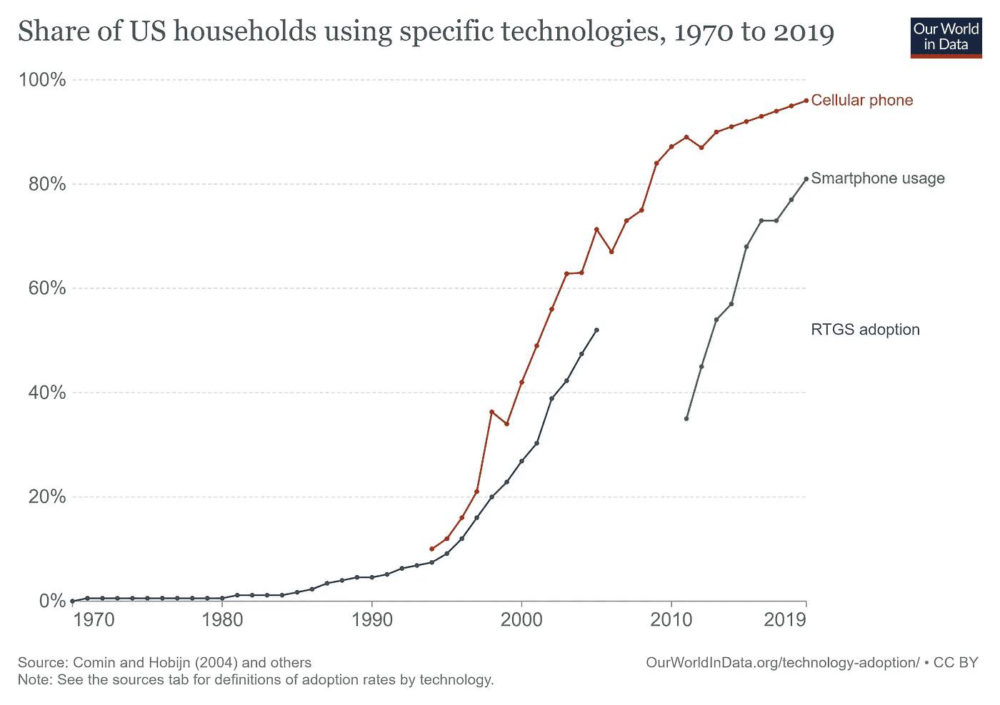

# 100 万美元的比特币:富达对 BTC 牛市前所未有的预测是正确的吗？

> 原文：<https://medium.com/geekculture/1-million-bitcoin-could-fidelity-be-right-about-a-btc-bull-run-like-never-before-dbd2b58d64f4?source=collection_archive---------2----------------------->

## 富达对金融市场略知一二，尤丽安·蒂莫尔更是如此。

Image courtesy of [Canva](https://canva.com)

根据[chain analysis](https://blog.chainalysis.com/reports/bitcoin-market-data-exchanges-trading)的数据，散户投资者持有所有比特币的 96%，而专业投资者仅占 4%。然而，任何一天所有加密货币市场活动的 85%来自后者。

随着 crypto 在这些大玩家的核心圈子里越来越受欢迎，他们对整个加密货币市场的影响也越来越大。在我看来，这是福也是祸，但我会把它留在那里。然而，如果这些机构巨鲸要吞噬加密领域的行动，我们谨慎的做法是关注他们所说的话，这样我们就能受益。

其中一个怪物是富达投资，它管理着超过 3.2 万亿美元的资产(然而，我从其他来源看到了 7 万亿和 11 万亿美元，包括他们的网站)。笨重的美钞哥斯拉在密码领域有重大进展，我们将会谈到它。我们正看着你，蒂莫尔先生。

让我们得到它。

# 什么是保真(好像你不知道)？

富达投资是一家金融资产管理公司，总部设在马萨诸塞州波士顿。自 1946 年成立以来，没有什么能阻止它成为该街区最大的资产管理公司之一。但是，你不可能像他们说的那样，把他们都拿下。据《华尔街日报》在一篇报道该公司对房地产泡沫反应的文章中称，

这家总部位于波士顿的公司是美国最大的共同基金管理公司之一，其管理的资产在 2008 年下降了 25%，从一年前的 1.6 万亿美元降至 1.2 万亿美元(T4)。"

最重要的是，

“富达银行昨天说，它已经获得初步批准，向美国财政部出售 700 万美元的优先股，作为国会 10 月份批准的 7000 亿美元银行救助计划的一部分。”

但是嘿。它们还在，所以这些生存本能值得称赞。好了，够了。再来说说保真更好的一面。

在 2017 年加密的最后一轮牛市中，富达大头说:“嘿，让我们来点那个。”之后，你开始在加密活动中见到富达首席执行官阿比盖尔·约翰逊。随后，2018 年，富达推出了富达数字资产，你我都不能用(嗯，至少我不能用)。这是因为它为机构和高净值投资者提供教育、托管和交易。例如，虽然我找不到富达的数据，但我知道，要投资像 Bridgewater 这样的公司，你需要至少 1000 万美元的净资产，否则他们不会跟你谈。除了向你道别。当然，在此期间，富达数字资产呈指数级增长。事实上，据报道，他们已经雇佣了 100 多名员工来处理加密货币账户，并在 2021 年 3 月推出了他们的[比特币 ETF](https://www.cnbc.com/2021/03/24/fidelity-to-launch-bitcoin-etf-as-investment-giant-builds-its-digital-asset-business-.html) 。所以，你可以看到，他们是认真的想参与行动。以至于他们的全球宏观经济学领袖尤丽安·蒂莫尔主持了一系列网络研讨会，其中一个名为“理解比特币”。虽然我不能链接到网上研讨会，但这里有一个关于[/r/加密货币](https://www.reddit.com/r/CryptoCurrency/comments/pjrmf2/fidelity_internationals_digital_asset_webinar/)的摘要。

此外，如果你想看看[富达的比特币入门](https://www.fidelity.com/viewpoints/active-investor/beyond-bitcoin)，欢迎你。

# 富达的库存到流量(S2F)模型

据我所知，蒂莫尔对比特币的兴趣是在 2019 年 PlanB 的[中型文章](/@100trillionUSD/bitcoin-stock-to-flow-cross-asset-model-50d260feed12)之后兴起的。比特币的 S2F 模型使用当前供应量(存量)和新发行供应量(流量)的比率来预测比特币的趋势。截至目前，PlanB 的模型还没有达到目标，但蒂莫尔认为这是因为他们没有考虑需求。因此，蒂莫尔[预测](https://news.coincu.com/11242-according-to-fidelity-ceo-bitcoin-is-ready-to-continue-its-upward-trend/)比特币将跟随增长向上，类似于 70 年代的黄金。他将比特币的增长曲线比作“智能手机或互联网”。这意味着最初的缓慢采用，然后是急剧的指数增长，之后逐渐减少，产生如下图。

Image courtesy of [Our World in Data](https://ourworldindata.org/)

因此，蒂莫尔的模型预测比特币将在 2030 年达到 100 万美元。然后它会开始变平。你可以通过他的推特账户在这里[看到。在他基于 S2F 的模型之后，蒂莫尔决定将 BTC 作为通胀对冲。](https://twitter.com/TimmerFidelity/status/1420735794176745483/photo/1)

# 富达对通货膨胀的关注

全球各地的政府都像疯子一样印钞票。很大程度上，当问题出现时，他们会印更多的钱来解决这个问题。然而，基础经济学告诉我们，一个东西越多，它的价值就越低。现在，美元、英镑、欧元和许多其他法定货币都在以前所未有的高价印钞。到目前为止，仅美国在 2021 年就印刷了 6 万亿美元。

因此，东西的价格会上涨。然而，这些钱实际上并没有被印出来。反而是借的，但是向谁借呢？我相信你能猜到。没错。是美联储和各国央行。这些机构购买美国债券，给我们现金。目前，美国欠美联储 22 万亿美元的短期债务，其余的分散在世界各地。但是，是的，我们欠自己一笔天文数字的钱。现在，对债券的需求保持低利率。因此，美联储购买我们的债务，将利率维持在低水平，甚至不存在。然而，所有这一切意味着通货膨胀必须继续，人们想知道他们可以把钱放在哪里，这样至少可以保持其价值，如果不增加的话。尽管如此，尽管有传统信仰，蒂莫尔并不认为比特币或黄金是对抗通胀的好选择。那么，我们该如何处理这些信息呢？

# 比特币作为通胀对冲工具

比特币和黄金设法保持了它们的价值，这是它们应该做的。但是，你看，你不能像炒股那样对黄金或比特币复利。因此，由于股息的原因，股票的表现比通货膨胀率要好得多。然而，蒂莫尔假定，BTC 将有更高的回报，由于其性能指标和黄金的价格活动在 70 年代的相关性。为了让你知道 BTC 与 70 年代的淘金热相比处于什么位置，蒂莫尔断言，“我们正处于大规模爆发的边缘，就像我们今年早些时候看到的那样。”蒂莫尔还预测 2022 年初会有 10 万美元的 BTC。在这种增长预测和债券利率保持低位的情况下，这对比特币意味着什么？

# BTC 如何取代债券？

早些时候，我们认识到有多少政府正在疯狂印钞。此外，我们已经建立了比特币的潜在增长曲线，它将轻松超越债券。而且，美联储以外的个人和机构购买债券，但是当你的债券表现比其他对冲差的时候，你觉得那些债券持有人会怎么做？他们将抛售债券，购买比特币或其他一些能够对冲通胀的货币，这正是他们所寻求的。结合这些事实，美联储向 NPR 发布声明称“它将不再先发制人地踩刹车来防止经济过热。”即使投资于债券的数万亿美元中的一小部分进入了比特币市场，这也将是一场规模巨大的繁荣。然而，请记住，在我们达到这些收益之前，我们仍然会看到 BTC 的波动，所以当它发生时，做好买入的准备。时间会证明一切。

# 结论

我们快速浏览了富达进入加密领域的举动，蒂莫尔关于比特币成为百万美元硬币的模型和预测，以及 BTC 如何取代债券成为传统投资者的避险选择。时间一如既往的会说真话，但是你也看到了一些有能力有经验的人说的话，那就看你自己了。你知道崩盘即将来临，那将是买入 BTC 股票的时候。所以，除非你挖沟去买豆子和水，否则就用你多余的钱去买蘸酱。因为当衰退结束时，BTC 可能会上升到你从未见过的高度，你最终可以开始像富人那样赚钱:不是通过收入，而是通过资产所有权。

你准备自己买比特币吗？

哦，还有一件事，如果你想让**直接支持我的写作**，你可以通过我的链接**注册成为媒体** [**。当你这么做的时候，你的部分订阅会归我。另外，**](https://tcgunterwriter.medium.com/membership) **[**阅读更多的**](https://tcgunterwriter.medium.com) 对我的工作也有帮助。谢谢你。**