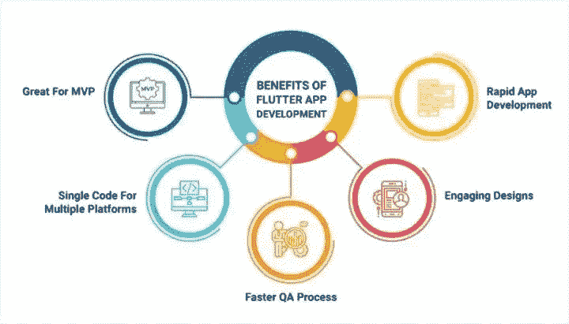
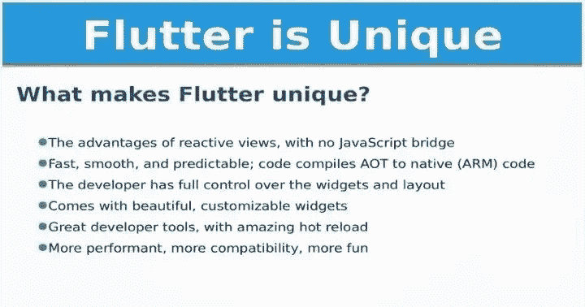

# 在即将到来的应用开发项目中使用 Flutter 的 10 大优势

> 原文：<https://medium.com/geekculture/10-advantages-to-use-flutter-for-upcoming-app-development-projects-e8425fcf2616?source=collection_archive---------15----------------------->

> 【Flutter 现在可以进行企业应用开发的 10 个原因

在选择构建应用的技术时，有几个因素需要考虑。但首先，让我们思考两个关键的想法。

它们是构建一个移动 app 的时间长度和价格。[几个框架](https://www.arkasoftwares.com/blog/hybrid-mobile-app-development-frameworks/)现在减少了这两个因素。Flutter 开发框架已经成为最流行的选择之一。

在这篇文章中，你将了解为什么 Flutter 对你或你的企业来说可能是一个**明智的决定**。

# 颤振是用来做什么的

谷歌有一个跨平台的技术叫做 Flutter。有了这个工具集，程序员总是能够从特定的代码源为 iOS 和 Android 创建应用程序。听起来有辨识度？是的，跨平台技术，包括 Iconic、Cordova、Xamarin 或 React Native，都重申了同样的承诺。

> 那么，像 Flutter 这样的新框架是必不可少的吗？

开发者可以用 Flutter 创建一个应用程序。他们发现采用跨平台编程更简单，因为它有单一的软件来源和现成的小工具。

这使得它更加实用，并为 Android(作为设计技术)和 iOS 用户(作为 Cupertino)提供了更快的速度。

如果你经营一家公司，你只需要雇佣几个 iOS 程序员、Android 程序员和网站设计师。

成本管理也是 Flutter 的另一个特点。公司现在更关心为几个平台创建移动应用程序的成本。

**颤振统计**

颤振是 2020 年的一个重要发展模式，预计将持续一段时间。根据 Statista 的数据，Google Flutter 是 2019 年第二大最受欢迎的应用开发平台。

Flutter 应用对公司来说有着如此重大的好处。事实上，市场上充斥着 Flutter 应用程序的实例。此外，基于 Flutter 的应用程序“仙鱼”已经以超过 5000 万种不同的方式安装，在全球拥有大约 1000 万用户。

堆栈溢出研究表明，由于其带来的好处，Flutter 是 2020 年全球开发者中最受欢迎的工具和平台之一。

但是和很多程序一样，Flutter 有优点也有缺点。

因此，我们将在以下段落中概述颤振 app 开发 **nt** 的 [**优势，并根据我们的专业知识提供一些指导。**](https://www.arkasoftwares.com/blog/why-flutter-for-mobile-app-development/)

## **1。开源和自由软件**

首先，谷歌建立了一个用于软件开发的开源 UI 工具，名为 Flutter。该框架提供了一种简单的方法来从公共开发者论坛获取文档并提出错误。

换句话说，它有助于应用程序开发人员的学习和发展。事实上，每一个组件都被完整地描述，并提供了适应性、质量和自主性等机会，这是开源程序的另一个特点。

## **2。多平台方法**

使用 Flutter，您可以编写一次代码，并使用它来开发各种设备的应用程序。

与本机框架相比，这大大减少了为多个平台编写代码所需的时间和精力。最小化总成本和规划已经完成。

Flutter 创建的解决方案可以部署在 iOS、Android、网站和桌面上。

## 3.**有效的 UI 引擎**

在 **Flutter 框架**中有几个小部件提供 UI 实现。系统中已经包含了一千多个小部件。

它极大地加速和简化了构建漂亮用户界面的过程。

颤振也提供了两组设计类型。它使设计师能够构建在体验方面与原生应用最相似的用户界面。

## 4.**几个开源软件选项**

如果你的 Flutter 项目需要，你很有可能找到一个可以帮助你创建更多高级功能的包。

世界各地的程序员创建的许多现成的库可以在 Pub 上找到。戴夫。

在那里可以找到像开关和按钮这样的简单包，以及更复杂的包，包括媒体播放器或地图。开发人员不断更新和扩展这些包。

## 5.**性能**

与原生脚本语言相比，Flutter 的性能名列前茅，优于其他跨平台解决方案。Flutter 采用每秒 60 帧的标准帧速率。(FPS)。

系统画布用于显示 Flutter Dart 的代码。这进一步提高了程序的性能。建筑是一切开始的地方。这里是对 Flutter 和 React Native 架构的比较，这两个框架都非常流行。

可以看出，React Native 的基础包括两个组件:JavaScript 语言链接和本机方面。

React 原生软件是使用 JavaScript 开发的。但是，它仍然使用网桥与蓝牙或网络摄像头等本机设备进行通信。

该应用程序在 Flutter 中的运行速度比 React Native 快得多，因为它不需要桥来与本机组件进行交互。请注意，Flutter 正在不断更新，平台的性能将随着每个新版本的发布而提高。

## 6.**热换料和开发**

Flutter 应用程序的构建既有趣又快速，因为它具有非凡的热重新加载能力。使用 Flutter，您可以查看您的代码修改，而无需每次都重新编译移动应用程序。

因为实时查看软件中的修改很简单，所以您有更多的可能性来实时探索脚本和解决错误。

## 7.**动画 gif**

漂亮的应用程序通常包括几个活动的部分，给程序一种“活着”的感觉。使用 Flutter，开发人员的生活变得更加简单，这是在考虑图形的情况下开发的。

[**为阿联酋不同企业开发移动应用**](https://www.arkasoftwares.com/mobile-app-development-company-dubai)****再一次令人愉快，因为实现和管理动画比使用本地解决方案更简单。****

****Reflect 是具有各种运动的颤振程序的理想插图。证明颤振平台能力的最好方法就是应用这种技术。****

## ****8.**在质量管理上花费更少的精力******

****质量保证程序会影响构建应用程序所需的时间和费用。****

****在颤振的情况下，这个周期要短得多。单一代码库会影响测试时间。****

****如果软件已经在其中一个网络环境中测试过，您可以确信它将在所有网络环境中正常运行。总之，节省了时间和金钱，因为只需要创建一次单元测试来覆盖所有设备。****

## ****9.**支持创业******

****Flutter 的两种基本方法是最有吸引力的跨平台开发选择。****

****它以最实惠的价格提供最快的上市时间。Flutter 是作为一种强有力的工具开发出来的，可以快速进入 MVP 商品市场。****

****Flutter 应用软件承诺将上市时间缩短近两倍。****

## ******10。越来越受欢迎和开发者社区******

****有一个强大的开发社区致力于改善 Flutter。这些人在 Pub 上发布了成千上万的产品。戴夫。****

****您可以在软件的每个包中至少使用一个小部件。****

****如果您对 Flutter 有问题，在使用该工具时遇到困难，或者对该框架有任何疑问，您可能会很快在网上找到解决方案。****

****GitHub 问题或 StackOverflow 查询很可能涵盖了您要搜索的内容。****

****使用 Flutter 标签提问；StackOverflow 上有很多 Flutter 程序员很乐意帮助你。****

## ****为什么要尝试 Flutter？****

****为了帮助您决定 Flutter 是否是您组织的最佳选择，以下是它的一些最显著的优势:****

********

*   ****真实的表演****
*   ****富有表现力的用户界面****
*   ****一个代码用于前端和后端****
*   ****一项开源事业****
*   ****适用于最低可行产品(MVP)****
*   ****加速代码开发缩短了上市速度****
*   ****适用于任何特定平台，包括 web****

****事实上，大多数大企业都在 Flutter 中构建了当前实现的一小部分。当他们意识到颤振的优势时，他们开始改变额外的截面。****

## ******结论******

****在社区的帮助下， **Flutter 框架**将会是一个不断扩展的框架。****

****正如你所看到的，在创建应用程序时使用 Flutter 有很多好处。如果你正在考虑创建一个智能手机应用程序，Flutter 应该是你的第一选择。****

****你可以和一个 app flutter 设计师一起工作，让你的愿景成为现实。****

****与本地或跨平台应用程序开发不同，使用 Flutter 进行应用程序开发有几个好处。使用 Flutter 创建的应用程序将会更快更便宜。此外，该平台的网络仍在扩展。****