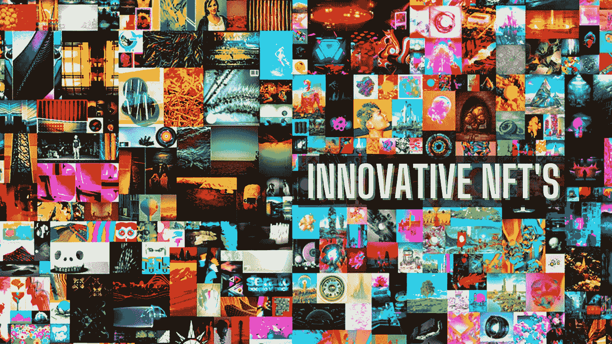
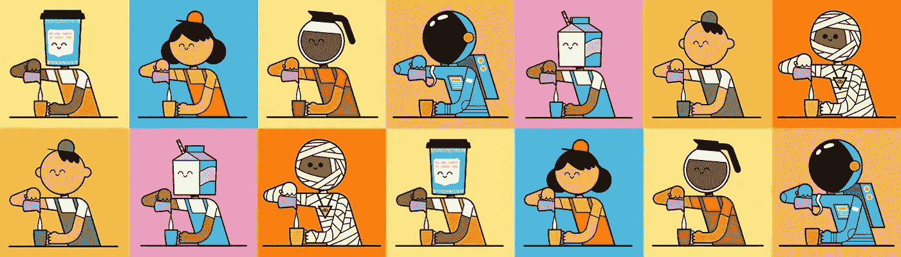
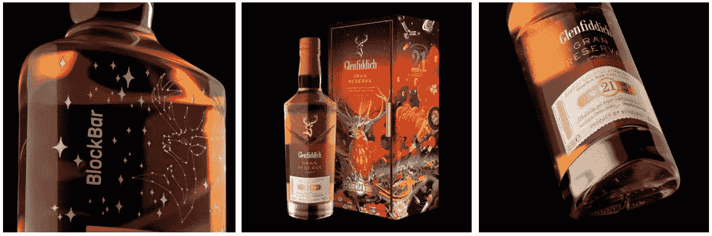
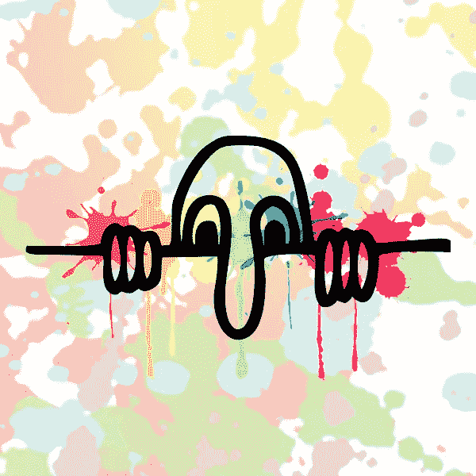
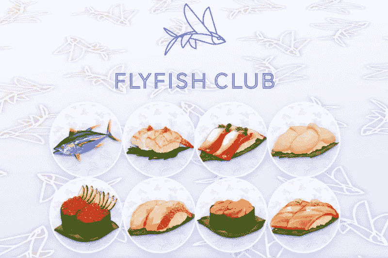
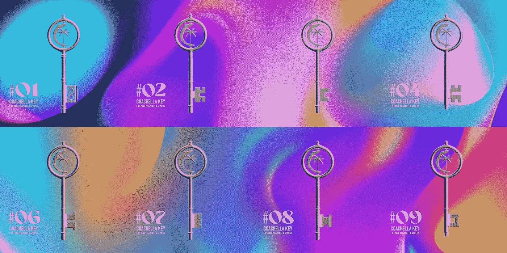

# 10 个令人惊叹和创新的 NFT

> 原文：<https://medium.com/geekculture/10-amazing-and-innovative-nfts-b30adfab3b01?source=collection_archive---------9----------------------->

## 以下是每个人都应该知道的最佳创新 NFT。

自 2010 年代末问世以来，不可替代代币(NFT)因其性质而获得了广泛关注。NFT 是区块链代币，可作为其支持的任何资产的所有权和真实性的证明。当 NFT 在 2021 年 NFT 繁荣期间推动加密市场时，这些虚拟令牌的潜力被释放出来。这种狂热让许多品牌和个人为创新的 NFT 产品开发出相当古怪的想法，其中大多数产品都以实用性作为其通用卖点(USP)。虽然许多怀疑者说 NFT 仅仅是针对无辜和智能加密消费者的骗局，但许多基于实用程序的 NFT 模型已经形成了巨大的社区和良好的声誉。基于通过这种模式取得的成功，每天都有许多企业家和品牌进入 NFT 市场。在这篇博客中，我们将看看 10 个这样的创新的非功能性思维，它们是让我们发笑的创新思维的顶尖例子。

# 10 个令人惊叹和创新的 NFT

**1。**

****

****Crypto Baristas****

**由 Coffee Bros 开发的 Crypto Baristas 是 NFT 收集的 60 个独特的倒咖啡角色，在 Rarible 上销售。该合资企业已经启动，通过现实世界的项目服务于咖啡社区。该项目的利润也将帮助咖啡公司开发他们自己的咖啡，以寻求国际认可。如果你的目标是为某个社区服务，你也可以创建像 Crypto Baristas 这样的生成性 NFT。**

****2。** [**格兰菲迪威士忌**](https://bit.ly/39TtLA5)**

****

****Glenfiddich Whisky****

**广受欢迎的威士忌品牌格兰菲迪(Glenfiddich)的所有者——威廉·格兰特父子酿酒公司(William Grant and Son Distillers)——最近以每瓶 1.8 万美元的价格出售了 15 瓶稀有的 46 年陈酿威士忌，同时还有支持这些瓶子的 NFTs。这里的 NFT 跟踪瓶子的来源和内容，它们作为投资。此外，只有在公司赎回 NFT 时，才能取回瓶子。这里的主要思想是，即使有人出售他们的 NFT，买家也可以信任这笔交易。如果你有实物资产，你也可以创建支持实物资产的 NFT，不考虑行业。**

****3。******(来自凯宾·史密斯)******

********

******Killroy Was Here******

****风靡一时的经典电影《店员和杰伊》(Clerks and Jay)和《无声鲍勃反击战》(Silent Bob Strike Back)的导演凯宾·史密斯带着电影《基尔罗伊曾在这里》(Killroy that Here)再次回归但是，这一次的主要区别是，这部电影是以 5，555 个 NFT 的形式，另外还包含独家幕后内容。这个想法已经在电影界引起了足够的关注。一些提示表明，NFTs 和电影主角的特殊版本可以归买家所有，没有版权问题。你也可以创建一个 NFT 市场来销售这种独特的基于公用事业的非功能性食品并获得回报。****

******4。** [**飞鱼俱乐部**](https://www.flyfishclub.com/)****

********

******FlyFish Club******

****旨在为其持有人提供独特的用餐体验，FlyFish Club 是一家会员专属的高级餐厅，即将开业。俱乐部有两种类型的通行证——FlyFish 和 FlyFish Omakase，后一种类型的所有者可以从餐厅获得更多独家优惠。你也可以将你的 NFTs 链接到一个真实的实用程序，在专业开发公司的帮助下获得收入。****

******5。** [**科切拉·NFT**](https://nft.coachella.com/)****

********

******Coachella NFT******

****美国著名的音乐节现在已经开始以 NFTs 的形式出售终身会员门票。有了这些代币，持有者除了可以免费参加他们在现实和虚拟世界的所有活动外，还可以独占前排，享受特别的晚餐，会见表演者。如果你想创建这样的产生兴趣和收入的 NFT，你可以从联系一个先锋开发者开始。****

******6。VeeFriends******

****作为让 NFT 爱好者和企业家加里·维纳查克接触到的 NFT，VeeFriends 是第一批病毒式传播的基于实用的 NFT 系列之一。持有人可以参加加里的所有研讨会和会议，而一些独家会员甚至可以会见他并得到他的指导。555 只“礼物羊”的持有者每年会收到六次由 Vaynerchuk 亲自寄给他们的礼物。同样，你也可以通过联系一些 NFT 创作公司，建立一个 NFT 社区来分享你的知识。****

******7。午夜社团创始人通行证******

****游戏网站 YouTuber 的一个视频游戏项目《午夜社会》不仅仅是游戏中的资产。据了解，这些 NFT 将授权持有人在游戏的管理决策中拥有发言权。你也可以通过一个经验丰富的区块链开发公司的帮助来创建你的游戏 NFT 市场。****

******8。女人的世界******

****作为一项为妇女领导的组织筹集资金以解决性别不平等问题的举措，妇女世界是一个具有社会意识的 NFT 项目。到目前为止，去年第一轮 10，000 份 NFT 很快销售一空，第二批将很快投放市场。你也可以通过创建创成式 NFT 来使用这项技术，任何帮助都可以从专业的区块链公司获得。****

******9。倩碧超级乐观派******

****另一个 NFT 系列提供倩碧的免费产品，包括难以获得的口红，Meta Optimist NFTs 将成为现代时代忠诚的关键。该品牌社交媒体手柄上的人们给出的最佳“乐观”故事的 NFTs。同样，你也可以通过一个著名的 NFT 市场开发公司在 NFT 市场创建你的品牌。****

******10。塔伦蒂诺 NFT 收藏馆******

****好莱坞著名传奇人物昆汀·塔伦蒂诺决定出售他 1994 年电影《低俗小说》中的一些场景。导演曾表示，除了场景脚本，NFTs 将揭示人物和情节的不为人知的秘密。还可以为自己的创意作品打造生成式 NFT，拉近与粉丝的距离。****