# 面向 Laravel 开发人员的 10 多种令人惊叹的开发工具🛠👨🏻‍💻 2023

> 原文：<https://medium.com/geekculture/10-amazing-dev-tools-for-laravel-developers-2022-f011a1dccea2?source=collection_archive---------24----------------------->

想在从事 Laravel 项目的同时加快开发过程吗？好吧，那就收藏这些为 Laravel 开发者准备的**最佳开发工具**。虽然，在开始收集之前，我们先简单了解一下 laravel。

它是一个框架，因其高度的安全性和身份验证而在许多组织中使用。学习这种语言非常容易，因为这种语言的语法非常容易理解和使用。

# 什么是 Laravel 框架？

[Laravel](https://laravel.com/docs/8.x) 是一个免费开源的 PHP web 框架，非常有表现力，语法优雅。Laravel 用于设计定制软件产品。

它是一个引人注目的模型视图控制器(MVC)架构模式 PHP 框架，是一个开源的 web 应用程序开发，旨在为需要一个简单而丰富的工具包来构建全功能 web 应用程序的开发人员提供。

Laravel 通过遵循精炼的编码标准和架构模式，让您毫不费力地生成专业的 web 应用程序。

# Laravel 框架有什么好处？

*   它为自动化测试提供了一个方便的环境。
*   Laravel 提供了很好的授权和认证级别。
*   它有一个非常简单和干净的 API，有助于集成邮件服务。
*   当有更多的技术漏洞时，可以使用 laravel 轻松修复
*   它提供了一种非常简单且富有表现力的路由方法
*   不仅是邮件服务，它还可以很容易地与其他工具集成，并有助于交付快速的 web 应用程序
*   它有助于很好地处理错误和期望
*   它可以非常有效地配置和管理计划任务

**功能:**

*   类自动加载
*   IOC 容器
*   移民
*   查询生成器
*   Artisan 控制台
*   数据库播种
*   单元测试

# 什么是 Laravel 工具和包？

Laravel 是市场上最受欢迎的应用之一，非常简单易学。这在开发人员中更受欢迎，因为它不包含产品的任何功能。使用 Laravel 项目时，强烈建议使用 [**Laravel 管理模板**](https://themeselection.com/item/category/laravel-admin-templates/) 。使用管理模板会节省你很多时间。

laravel 工具和包旨在提供许多 web 项目功能，如集成、认证、授权等。当您选择一个 Laravel 包和工具时，您实际上可以以不同的方式使用它们来访问数据库、性能依赖以及更多。

因此，在这里我们已经涵盖了一些最好的，以帮助您加快您的发展。

现在，让我们开始…！！

# [Laravel Debugbar](https://github.com/barryvdh/laravel-debugbar)

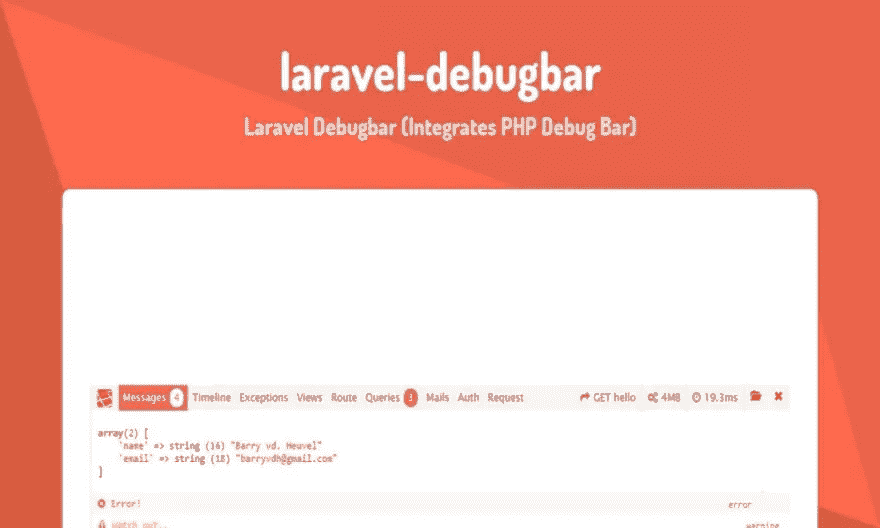

这是一个集成 [PHP 调试栏](http://phpdebugbar.com/)和 Laravel 的包。它包括一个服务提供者来注册 debugbar 并将其附加到输出中。您可以通过 Laravel 发布资产并进行配置。它引导一些收集器与 Laravel 一起工作，并实现了几个定制的数据收集器，专门用于 Laravel。它被配置为显示重定向和(jQuery) Ajax 请求。(在下拉菜单中显示)阅读[文档](http://phpdebugbar.com/docs/)了解更多配置选项。

[Laravel Debugbar](https://github.com/barryvdh/laravel-debugbar) 是一款强烈推荐的调试 Laravel 应用程序的工具。该工具定期更新最新的 Laravel 版本。该工具显示在浏览器的底部，同时提供调试信息。它还显示了路线，使用参数呈现的模板提供了详细信息。它允许开发者添加消息。

# [IDE 助手](https://github.com/barryvdh/laravel-ide-helper)

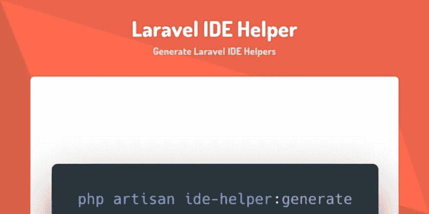

该包生成帮助器文件，使您的 IDE 能够提供准确的自动完成功能。生成是基于项目中的文件完成的，因此它们总是最新的。

# [拉勒维尔廷克](https://github.com/laravel/tinker)

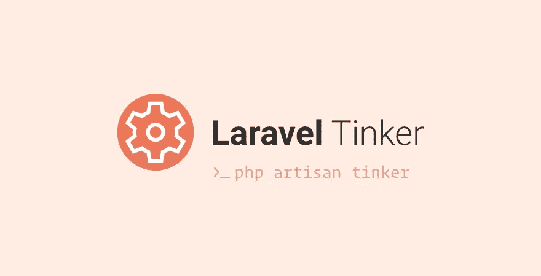

[Laravel Tinker](https://github.com/laravel/tinker) 允许你通过命令行与任何使用 Laravel 框架的项目进行交互。它允许用户访问所有的事件和对象。Tinker 是一个可选的插件，所以我们应该用 5.4 以后的 Laravel 版本手动安装。

# [拉勒维尔委托](https://github.com/Zizaco/entrust)

在 Laravel 中，Entrust 是一个添加基于角色的权限的安全过程。它有四个新表，包括角色、角色用户、权限和权限角色。在不同级别的类别下设置角色。

# [拉勒维尔社交名媛](https://github.com/laravel/socialite)

Laravel Socialite 为 OAuth 认证提供了一个富于表现力的、流畅的接口，包括脸书、Twitter、Google、LinkedIn、GitHub、GitLab 和 Bitbucket。它处理几乎所有你害怕编写的样板社会认证代码。

[Laravel socialist](https://github.com/laravel/socialite)使您能够更无缝地处理 OAuth 认证。该工具允许用户通过脸书、LinkedIn、Instagram、Twitter、Google、Bitbucket 等社交网站登录。这是流行的 Laravel 特性之一，通常在大多数 Laravel 开发中使用。

**特色:**

*   它很容易使用
*   包含您可能需要的几乎所有社会身份验证代码实例
*   拥有许多提供商的强大社区支持

# [拉勒维尔混音](https://github.com/laravel-mix/laravel-mix)

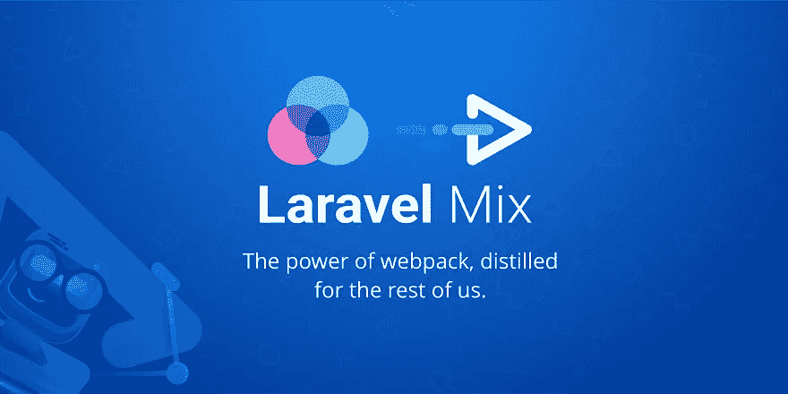

Laravel Mix 为您的应用程序定义基本的 [webpack](http://github.com/webpack/webpack) 构建步骤提供了一个干净、流畅的 API。Mix 支持几种常见的 CSS 和 JavaScript 预处理器。

**功能:**

*   提供广泛的 API，满足您几乎所有的需求
*   作为 Webpack 的包装器工作，并允许扩展它
*   消除了与设置和运行 Webpack 相关的所有困难
*   使用现代 JavaScript 工具和框架:Vue。JS 反应过来。JS，Preact，TypeScript，Babel，CoffeeScript。
*   将 Less、Sass 和 Stylus 转换和打包成 CSS 文件
*   支持浏览器同步、热重装、资产版本控制、开箱即用的源代码映射

# [Sneat Bootstrap 5 HTML Laravel 管理模板](https://themeselection.com/item/sneat-bootstrap-laravel-admin-template/)(最好的 Laravel 管理模板💥)

[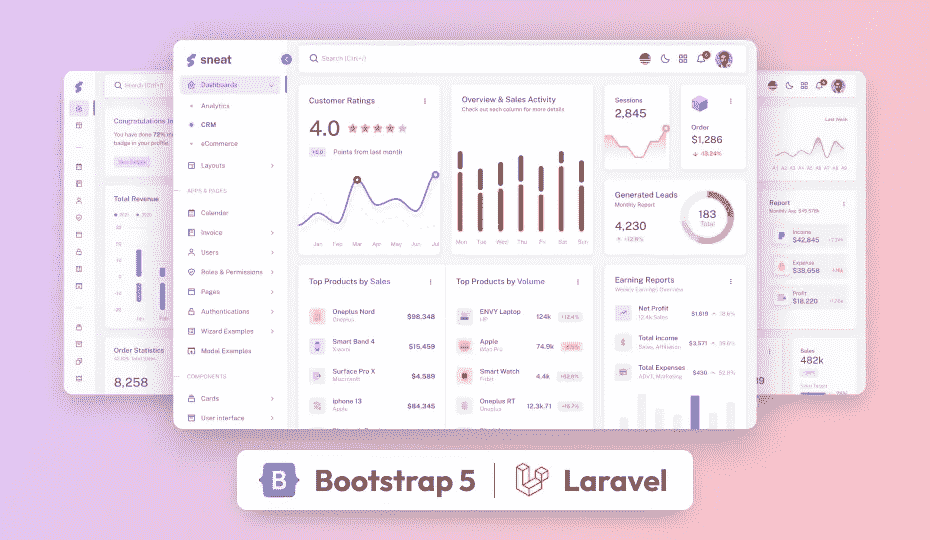](https://themeselection.com/item/sneat-bootstrap-laravel-admin-template/)

[**Sneat Bootstrap 5 HTML Laravel Admin Template**](https://themeselection.com/item/sneat-bootstrap-laravel-admin-template/)

[**Sneat Bootstrap 5 HTML Laravel 管理模板**](https://themeselection.com/item/sneat-bootstrap-laravel-admin-template/) 是基于 [**Laravel 9**](https://laravel.com/) 和 [**Bootstrap 5**](https://getbootstrap.com/) 的最新开发人员友好的&高度可定制的管理模板。此外，最高的行业标准被认为是给你带来最好的 laravel 引导管理模板，不仅仅是快🚀易于使用，但高度可扩展。

此外，这款 [**自举仪表板模板**](https://themeselection.com/item/category/bootstrap-admin-templates/) 还可以让您构建任何类型的 web 应用程序。例如，您可以创建:

*   SaaS 平台
*   项目管理应用程序
*   电子商务后端
*   CRM 系统
*   分析应用
*   银行应用
*   教育应用
*   健身应用和更多…

此外，您可以使用这个最具创新性的 **Laravel 9 管理模板**来创建引人注目、高质量、高性能的 Web 应用程序。此外，您的应用将完全响应，确保它们在桌面、平板电脑和移动设备上看起来令人惊叹，功能完美。

**特色:**

*   基于**自举 5**
*   **拉韦尔 9**
*   集成的 **CRUD 应用**
*   **垂直&水平**布局
*   默认、边框和半暗主题
*   **亮&暗**模式支持
*   **Jetstream** 和 **ACL 就绪**
*   **汉化** & **RTL 就绪**
*   3 仪表板
*   2 个图表库和更多。

喜欢这个令人印象深刻的 [Laravel 管理面板](https://themeselection.com/item/category/laravel-admin-templates/)的[管理仪表板 UI](https://themeselection.com/item/category/ui-kits/) ？然后查看这个 Sneat 管理模板的 UI 工具包。

[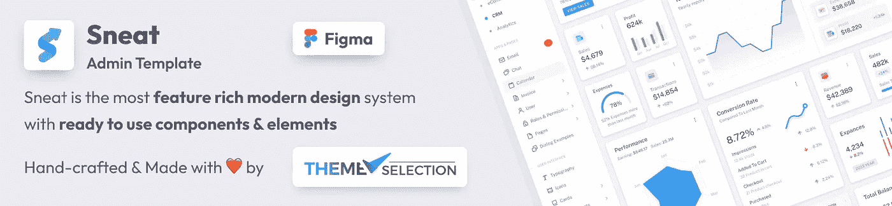](https://themeselection.com/item/sneat-figma-admin-dashboard-builder-ui-kit/)

[**Sneat Admin Dashboard Builder UI Kit**](https://themeselection.com/item/sneat-figma-admin-dashboard-builder-ui-kit/)World’s #1 Drag & Drop Dashboard builder & UI Kit with Atomic Design System 🚀

# [Laravel Websockets](https://github.com/beyondcode/laravel-websockets)

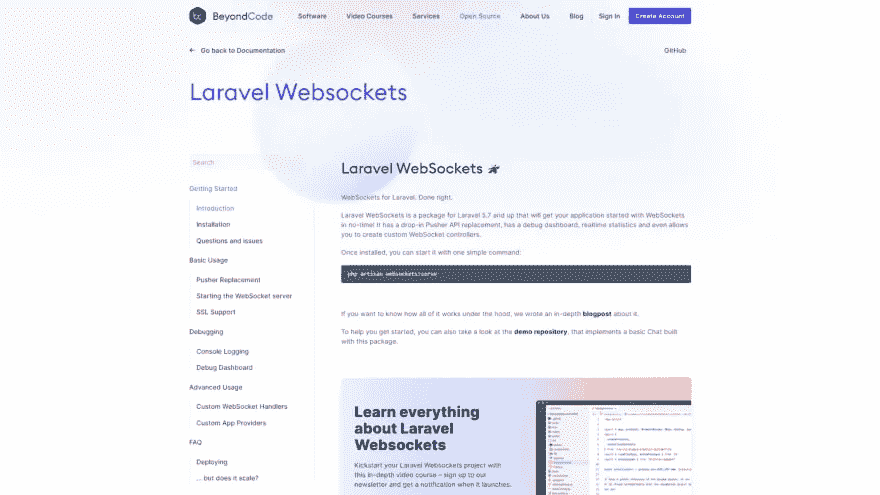

为您的 Laravel 应用程序带来 WebSockets 的强大功能。插入式推送器替换、SSL 支持、Laravel Echo 支持和调试仪表板只是它的一些功能。

**功能:**

*   完全处理 WebSockets 服务器端
*   取代 Pusher 和 Laravel Echo 服务器
*   是基于棘轮的，但不需要您自己设置棘轮
*   附带实时调试仪表板
*   提供一个实时图表，供您检查 WebSockets 关键指标(峰值连接数、发送的消息数和接收的 API 消息数)
*   支持在多租户应用中使用
*   附带 pusher 消息协议(您已经拥有的所有支持 Pusher 的包也将与 Laravel WebSockets 一起工作)
*   完全兼容 Laravel Echo
*   保留所有主要的推送器功能(私有和在线通道，推送器 HTTP API)

# [InfyOm Laravel 发电机](https://github.com/InfyOmLabs/laravel-generator)

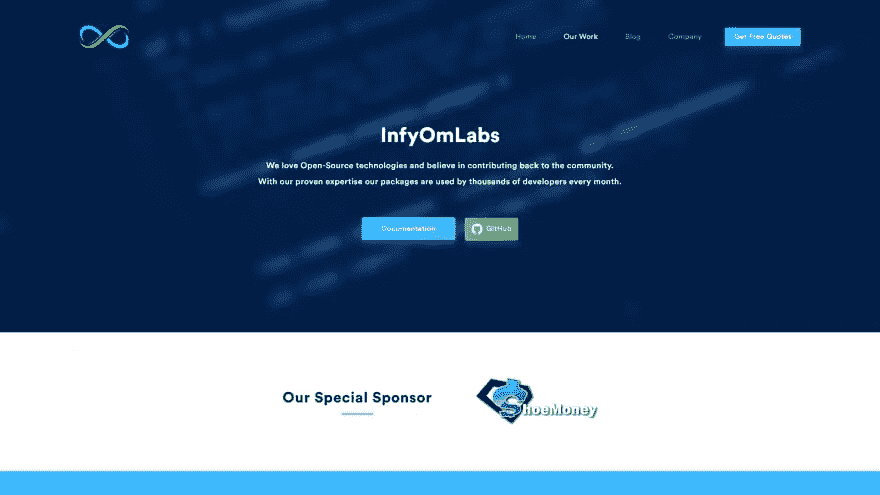

在几分钟内生成一个[管理面板](https://themeselection.com/item/category/admin-templates/)、CRUDs 和 API，以及大量其他功能和 3 个不同主题的定制。

# [护照](https://github.com/laravel/passport)

Laravel Passport 是最简单的 API 认证工具。这是一个完整的 Auth2 服务器实现，非常容易使用。

# [Laravel 租赁](https://github.com/tenancy/multi-tenant)

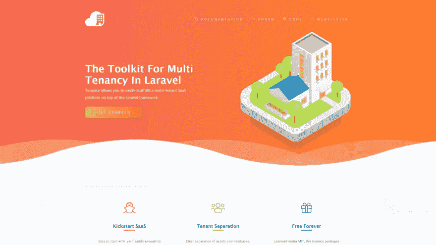

不引人注目的 Laravel 包让你的应用成为多租户。为多个网站提供服务，每个网站都有一个或多个来自相同代码库的主机名。但是具有资产、数据库和覆盖每个租户的逻辑的能力的明确分离。

**特色:**

*   简化开发过程
*   提供了一个强大的界面来监控和调试应用程序的许多方面
*   扩展开发过程的视野，提供对广泛信息的直接访问
*   减少 bug，并给他们一些如何改进应用程序的想法
*   给人一种进入应用程序的请求的感觉。清楚地了解所有正在运行的异常、数据库查询、邮件、日志条目、缓存操作、通知等等
*   收集有关执行所有必要命令和查询所需时间的信息。

# [拉勒维尔黄昏](https://github.com/laravel/dusk)

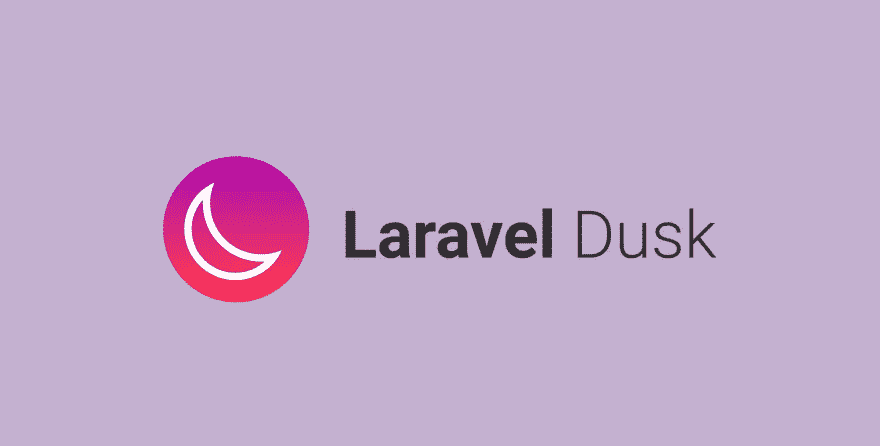

Laravel Dusk 提供了一个富于表现力、易于使用的浏览器自动化和测试 API。默认情况下，Dusk 不要求您在机器上安装 JDK 或 Selenium。相反，Dusk 使用独立的 Chromedriver。但是，您可以随意使用任何其他 Selenium 驱动程序。

如果你想测试你的应用程序，从用户的角度看它是如何工作的，试试 Laravel Dusk。该工具通过开发人员友好的 API 提供自动化浏览器测试。Laravel Dusk 默认自带 Chromedriver。

**功能:**

*   不要求你安装 JDK 或硒(但你可以自由使用任何硒驱动程序，如果你愿意)
*   是使用 JavaScript 的 web 应用程序的强大工具
*   简化测试应用程序中各种可点击元素的过程
*   保存崩溃测试的屏幕截图和浏览器控制台输出，这样您就可以看到哪里出错了

# [Materio vue fy vue js Laravel 管理模板](https://themeselection.com/item/materio-vuetify-vuejs-laravel-admin-template/)

[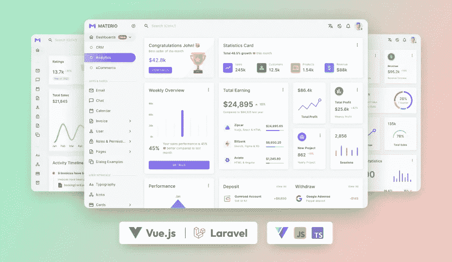](https://themeselection.com/item/materio-vuetify-vuejs-laravel-admin-template/)

它是开发者友好的，功能丰富，高度可定制的 Laravel 管理模板。此外，您可以使用这个最好的 [laravel 管理模板](https://themeselection.com/products/category/laravel-admin-templates/)来创建引人注目、高质量、高性能的单页面应用程序。Materio 还配备了宝贵的功能，旨在帮助您创建完全符合您想象的优质应用程序。

此外，Materio Vuetify Vuejs Laravel 管理模板的功能极其丰富，它还允许您构建任何类型的 web 应用程序，如 CRM、分析应用程序、教育应用程序、健身应用程序、分析应用程序等。

**功能:**

*   纯 VueJS，没有 jQuery 依赖
*   使用 Vue CLI 创建
*   有 TypeScript 和 JavaScript 版本
*   利用 Vuex、Vue 路由器、网络包
*   代码分割，延迟加载
*   旋转木马(图像滑块)
*   剪贴板(复制到剪贴板)
*   API 就绪的 JWT 认证流程
*   访问控制(即使在 CRUD 操作上)
*   Laravel 护照
*   拉勒维尔圣所

您还可以检查这个管理仪表板模板的 [React 管理面板](https://themeselection.com/item/category/react-admin-templates/)版本

[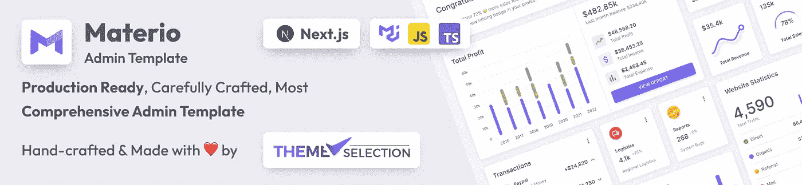](https://themeselection.com/item/materio-mui-react-nextjs-admin-template/)

[**Materio MUI React Next js Admin Template**](https://themeselection.com/item/materio-mui-react-nextjs-admin-template/)

# [Laravel 打包工](https://github.com/Jeroen-G/Laravel-Packager)

这个包为你提供了一个简单的工具来建立一个新的包，它将让你专注于包的开发而不是样板文件

# [Laravel 测试工具](https://chrome.google.com/webstore/detail/laravel-testtools/ddieaepnbjhgcbddafciempnibnfnakl?)

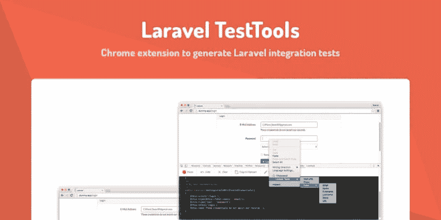

Chrome 扩展，用于在使用应用程序时生成 Laravel 集成测试。当您浏览网站时，创建您的 Laravel 集成测试。

# [PHPStrom](https://www.jetbrains.com/phpstorm/)

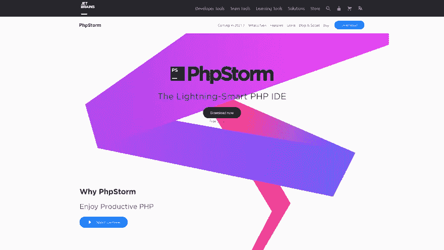

PHPStrom 是一个用于 Laravel 开发的智能 IDE。它提供了多种功能，例如快速和安全的重构、智能代码导航、高效的代码格式化程序以及简单的调试和测试。该 IDE 将通过以一致的性能更快地调试代码来提高开发人员的生产率。

# [比特桶](https://bitbucket.org/product)

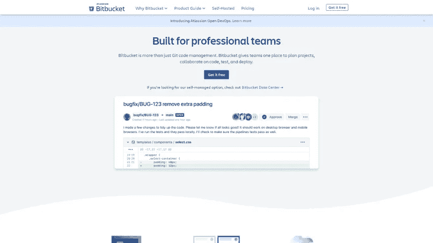

如果你是开发者，你一定对 GitHub 或者 Bitbucket 相当熟悉。两者都提供 git 服务，您可以根据您的项目和应用程序需求选择一个。Bitbucket 是小型企业 Laravel 应用程序的理想选择。这有助于您避免与有限数量的合作者共享代码库。你也可以使用 Bitbucket 作为私有存储库，这样更灵活。

# 结论:

这就是 2023 年 Laravel Developers 的**最佳开发工具集。这里的目的是节省您的时间，并提供最好的开发工具。**

由于其易于部署和定制的集成级别，许多公司希望在他们的组织中部署这些 Laravel 应用程序。

这里提到的大多数工具都提供了高级别的授权和认证。此外，它们都是开发人员易于使用的。

所以，根据你的需要和要求选择一个。此外，建议您认为我们应该在此列表中考虑的任何其他 laravel 工具。

# 关于我们

我们在 [**ThemeSelection**](https://themeselection.com/) ，提供精选的高品质、现代设计、专业易用的高级免费 [**管理面板**](https://themeselection.com/item/category/admin-templates/) ，如 [**引导管理模板**](https://themeselection.com/products/category/bootstrap-admin-templates/) 、 [**反应管理模板**](https://themeselection.com/item/category/react-admin-templates/) **、**[**Asp.NET 核心管理模板**](https://themeselection.com/item/category/asp-net-dashboard/) **、** [**VueJS**](https://themeselection.com/item/category/vuejs-admin-templates/)

如果你正在寻找 [**免费管理模板**](https://themeselection.com/item/category/free-admin-templates/) 、UI 套件和主题，请访问我们的网站！！

*原载于 2021 年 10 月 26 日*[*https://dev . to*](https://dev.to/theme_selection/10-best-laravel-dev-tools-for-faster-development-4m3j)*。*