# 2022 年学习编程的 10 个最佳免费网站

> 原文：<https://medium.com/geekculture/10-best-free-websites-to-learn-programming-in-2022-e636f4642a26?source=collection_archive---------2----------------------->

## 不用上大学，使用这些免费网站就可以成为程序员。

[Image by Freepik](http://freepik.com/)

从教育到生物学，编程几乎应用于每个领域。预计未来美国需要 100 万程序员。

在过去，学习编程很难，因为几乎没有资源和人员来教授编程。互联网的兴起使得寻找学习编程的资源变得前所未有的容易。现在有无数的在线教程、网站和其他资源可以帮助您开始编程。

如果你去上大学或者训练营，你可以更快地学习编程。然而，你也可以使用免费网站学习编程。在这篇博文中，我将谈谈学习编程的 10 个最好的免费网站。让我们开始吧！

# 1.极客论坛

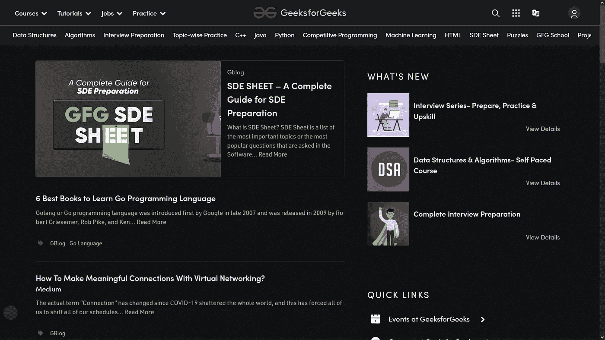

[GeeksforGeeks](https://www.geeksforgeeks.org/)

我要提到的第一个网站是 geeksforgeeks。在这里，您可以找到许多不同语言的课程，以及教程、测验和竞争性编程。还可以学习很多课题，比如数据结构，算法，机器学习。你可以把这个网站想象成一所在线大学。完成教程后，你甚至可以获得证书。此外，该网站还为您提供编程技巧和窍门。简而言之，geeksforgeeks 还为初学者和高级程序员提供了各种教程。

以下是 geeksforgeeks 学习编程的一些优势:

*   Geeksforgeeks 为计算机科学学生和专业人士提供了丰富的资源。
*   该网站帮助用户了解最新的计算机科学新闻和进展，并帮助他们在计算机科学领域找到工作。
*   这个网站还提供了一个社区来联系编程爱好者。

# 2.自由代码营

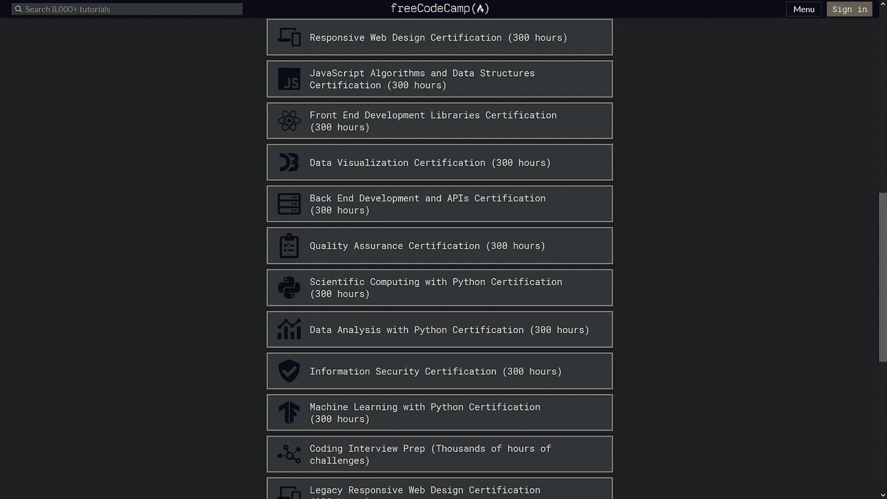

[FreeCodeCamp](https://www.freecodecamp.org/)

我推荐的第二个网站是 FreeCodeCamp。该网站是首批提供免费在线培训的网站之一。在这里，你可以找到非常高质量的培训。

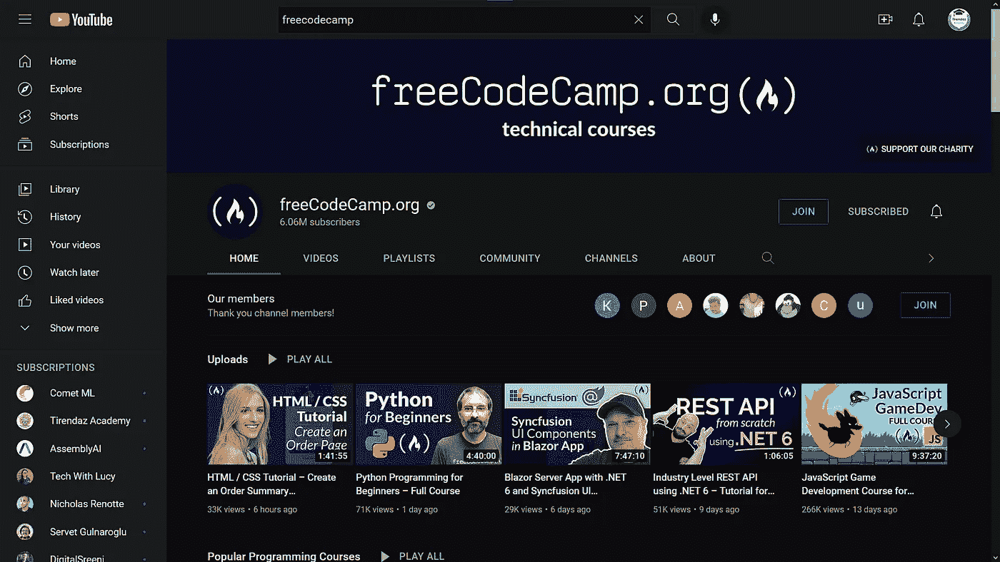

[FreeCodeCamp](https://www.youtube.com/c/Freecodecamp)

这个网站也有一个 youtube 频道。我也喜欢关注这个频道。不同培训师准备的视频都很牛逼。在这里，您可以找到与该软件相关的每个领域的视频。FreeCodeCamp 有数千小时的编码挑战。你可以通过 FreeCodeCamp 中的教程轻松学习编程。

下面是 freecodecamp 学习编程的一些优势:

*   Freecodecamp 提供了各种各样的编码挑战，可以帮助你提高技能。
*   该网站还有一个开发者社区，可以提供支持和建议。
*   你总能找到新的东西来学习，因为这个网站会不断更新新的内容。
*   这个网站是准备编码面试和会见其他开发人员的好方法。

# 3.堆栈溢出

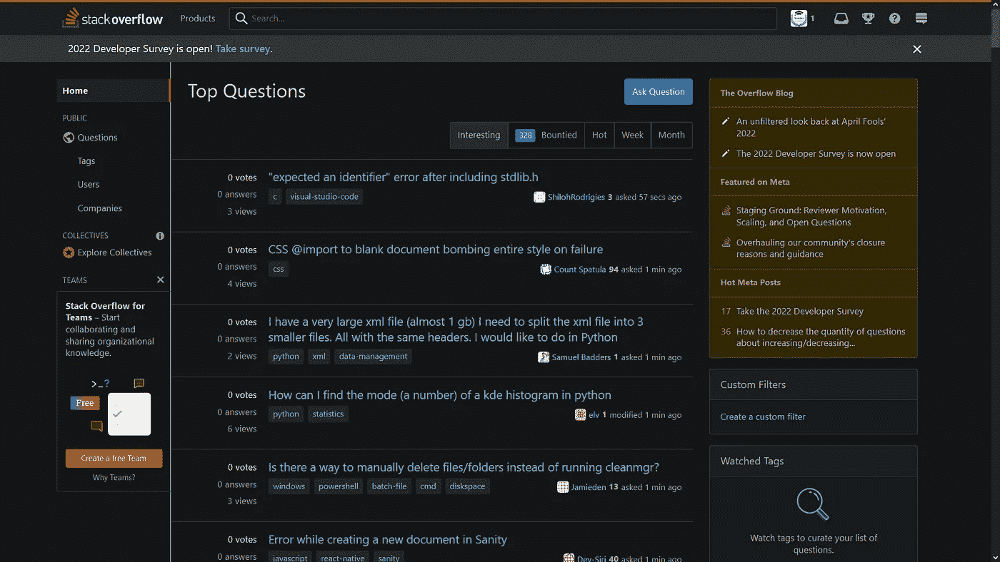

[Stack Overflow](https://stackoverflow.com/)

在做项目时，你有时会出错。努力解决这些错误会让你进步。当得到一个错误，你会在互联网上探索，对不对？堆栈溢出是找到问题解决方案的好地方。如果你看不到与你问题相关的解决方案，你可以在这里写。你可能会在短时间内找到你的问题的答案。简而言之，这个网站是开发者提问或回答问题的地方。也可以通过答题来提升自己。你解决的每一个问题都会为你赢得分数。提高分数可以更容易找到工作。这个网站很受程序员的欢迎。

下面是堆栈溢出对学习编程的一些好处:

*   堆栈溢出是寻找编码问题答案的重要资源。
*   这个网站允许你发现新的编码挑战。
*   使用堆栈溢出可以认识新朋友。
*   这个网站也是了解最新编码技术的好地方。

# 4.开源代码库

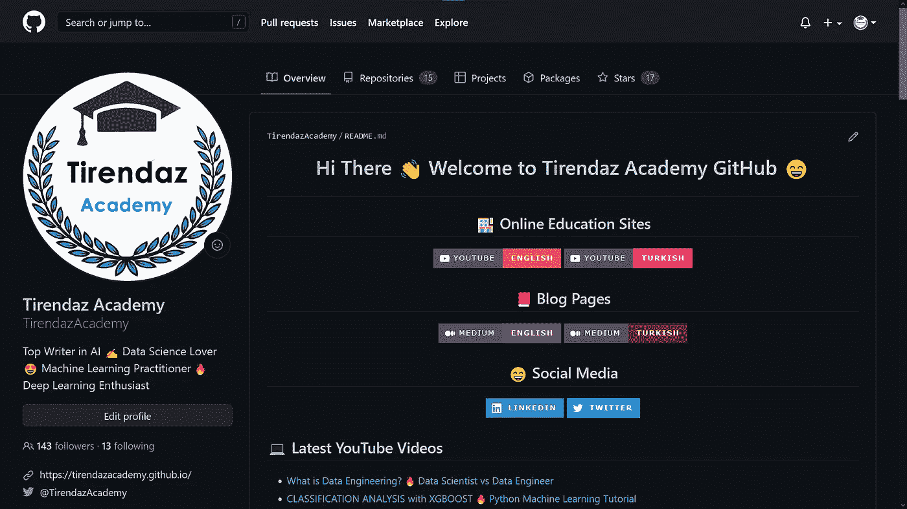

[My GitHub Page](https://github.com/TirendazAcademy)

Github 是软件项目之王。在这里，你既可以免费存储你的项目文件，也可以找到各种学习编程的教程。你可以看看任何领域的精彩回复。在这些回购中，你可以发现与你的领域相关的最佳资源。Github 包含许多开源项目。你可以通过参与这些项目来提高自己。许多公司甚至雇佣项目贡献者。这也是找工作的好方法。

下面是 github 学习编程的一些优势:

*   Github 允许开发人员共享代码并在项目上合作。
*   你可以很容易地在这个网站上找到与你的领域相关的代码片段和例子。
*   这个网站是了解编程社区最新趋势的好方法。
*   这个网站帮助你与其他开发者联系，并为你的项目寻找合作者。

# 5.Reddit

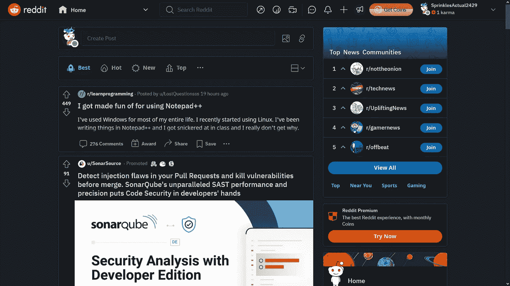

[Reddit](https://www.reddit.com/)

独自工作时很难保持动力。通过加入各种网络，你既可以提高效率，又可以利用普通人的智慧。Reddit 是一个在线平台，所有级别的开发人员都可以使用。在这里，您可以找到各种软件主题的数百个子主题。你可以加入你感兴趣领域的团体，分享你的代码，提出你的问题。使用 reddit 很简单，但是记住你必须遵守一些规则。

以下是 reddit 对于学习编程的一些优势:

*   Reddit 提供了广泛的编程资源。
*   它允许你和其他程序员联系。

# 6.厨师长

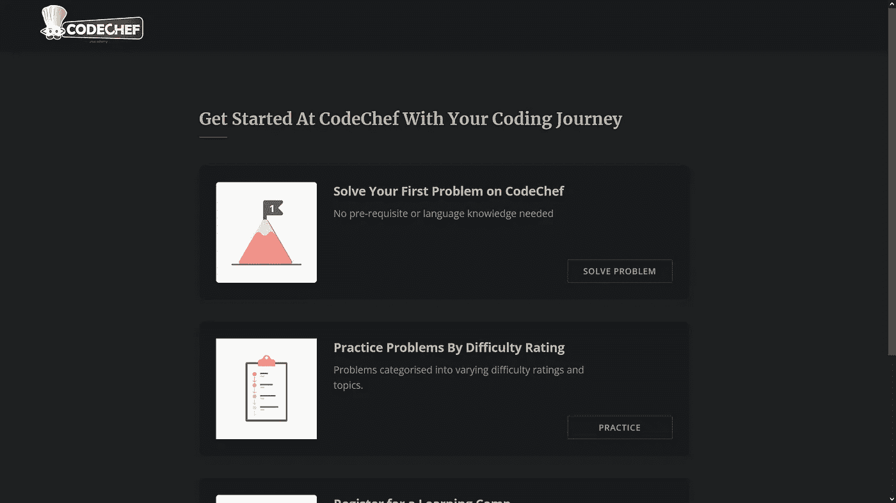

[Codechef](https://www.codechef.com/)

学习编程时，你会遇到许多问题。一个好的软件工程师应该有解决问题的技能。一个好的软件工程师应该有解决问题的技能。Codechef 帮助您发展这一技能。你可以解决问题，并在这个网站上提交，并与其他用户的解决方案进行比较。

Codechef 是一个来自印度的非营利性网站。你可以在这个网站上找到各种挑战和比赛。如果你想通过竞赛学习编程，这个网站就是为你准备的。你可以考虑把 [HackerRank](https://www.hackerrank.com/) 作为这个网站的替代，但是 HackerRank 对新手来说有点难。

以下是 codechef 对于学习编程的一些优势:

*   Codechef 提供了各种需要解决的编程挑战。
*   这个网站有一个很大的程序员社区可以互动。
*   这个网站也有一个系统来跟踪进展和排名用户。

# 7.代码学院

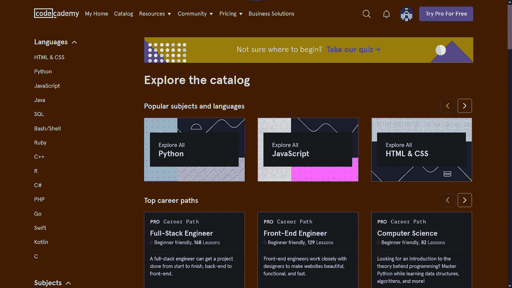

[Codeacademy](https://www.codecademy.com)

Codecademy 是一个极好的地方，提供各种编程语言的免费编码课程，如 Python、Java、Go、JavaScript、Ruby、SQL、C++、C#和 Swift。通过完成这里的培训，你可以获得各种编程技能，并建立一个职业生涯。

学习编程时，要达到下一个水平，你需要完成许多任务。通过完成这些任务，你可以进入新的阶段。这种连续渐进系统有助于用户主动学习。

下面是 codeacademy 学习编程的一些优势:

*   codeacademy 中的课程具有互动性和吸引力。
*   Codeacademy 为用户提供即时反馈。
*   Codeacademy 有内置的代码编辑器。

# 8.SoloLearn

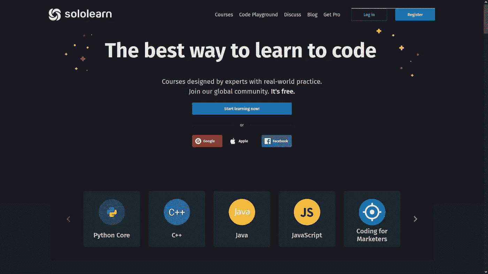

[Sololearn](https://www.sololearn.com/home)

你想在手机上学习编程吗？想要的话 SoloLearn 就是王道。SoloLearn 有一个适用于 iOS 和 Android 的移动应用程序。这个网站是提高你技术技能的完美平台。在这里，您可以找到许多免费的编程课程和真实世界的实践。如果你想学习 HTML 和 CSS 或者更高级的语言，可以使用这个网站。你也可以通过这个网站的论坛得到其他学生的帮助。

下面是 sololearn 学习编程的一些优势:

*   你可以在手机上使用 sololearn。
*   这个网站提供了一个讨论和支持的社区
*   它还提供了组织良好、易于理解的课程材料

# 9.w3 学校

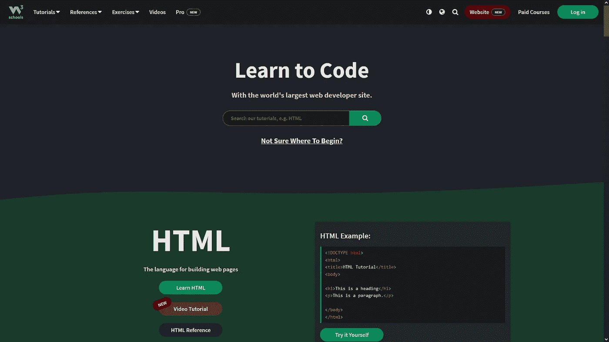

[W3schools](https://www.google.com/url?sa=t&rct=j&q=&esrc=s&source=web&cd=&cad=rja&uact=8&ved=2ahUKEwic1PWdkL35AhVCX_EDHW7VCLsQFnoECAcQAQ&url=https%3A%2F%2Fwww.w3schools.com%2F&usg=AOvVaw3Z63kcF6aawsbVZrfSzalJ)

如果您曾经执行过 web 编程项目，您可能听说过 w3schools 网站。这个网站是一个学习许多编程语言，尤其是 web 编程的在线教育场所。在编程部分，您可以找到关于 Python、Java 甚至 Python 的 Django 开发框架的教程。简而言之，W3Schools 提供学习、测试和培训。通过这里的例子，你可以提高你的编程技能。

下面是 w3schools 学习编程的一些优势:

*   W3Schools 提供全面的培训，尤其是网络编程方面的培训。
*   这个网站提供了一个在线代码编辑器，可以让你试验代码。

# 10.中等

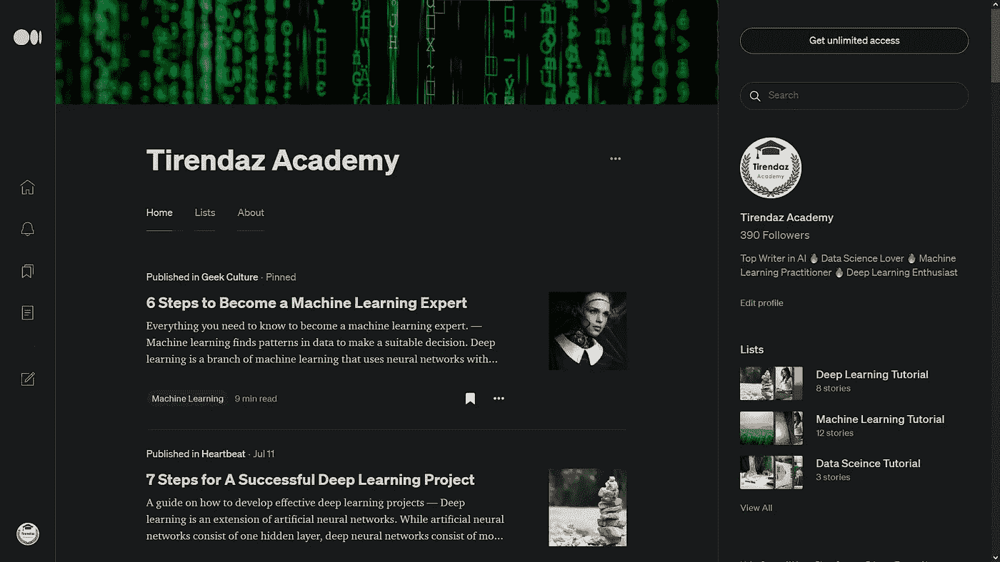

[My Medium Page](/@tirendazacademy)

我要提到的最后一个学习编程的网站是 Medium 网站。我正在积极使用这个网站。如你所知，你可以在 Twitter 上使用有限数量的字符。Twitter 开发者建立这个网站是为了打字不受字符限制。在这里你可以保存你喜欢的帖子，然后像在 Twitter 上一样阅读它们。

科技期刊上的学术文章通常是具体的，只有一定水平的人才能理解。但是在这个网站上，你可以找到很多实用的帖子和动手的例子。你可以在这个网站上通过写作来分享你所知道的。因此，如果你有 100 个追随者，你既可以丰富你的投资组合，又可以赚钱。

以下是学习编程的媒介的一些优点:

*   Medium 是学习编程的绝佳平台，因为它提供了广泛的主题和资源。
*   该网站易于使用和导航，非常适合初学者。
*   medium 上的搜索功能对于查找特定主题或资源非常有用。
*   它还提供了一个 RSS 源，可以很容易地获得最新的内容。

# 结论

[Image by Freepik](http://freepik.com/)

通过学习编程，您可以在 web 编程、游戏开发和移动应用程序等领域执行项目。了解编程可以让你在教育、生物、金融和人工智能等领域构建项目。此外，在学习编程的同时，还可以获得逻辑思维和解决问题的能力。如果你是一个好的程序员，你可以更容易地找到工作，甚至开始你的创业。

在这篇博文中，我向你展示了 10 个学习编程的免费网站。不用上大学，使用这些免费网站就可以成为程序员。你知道其他的网站吗？请在评论中告诉我。

就是这样。感谢您的阅读。我希望你喜欢它。别忘了在 YouTube 上关注我们👍

[提伦达兹艾](https://tirendazacademy.medium.com/?source=post_page-----e636f4642a26--------------------------------)

## 用 Python 实践机器学习

[View list](https://tirendazacademy.medium.com/list/handson-machine-learning-with-python-24dbaf45d18a?source=post_page-----e636f4642a26--------------------------------)19 stories

如果这篇文章有帮助，请点击拍手👏按钮几下，以示支持👇