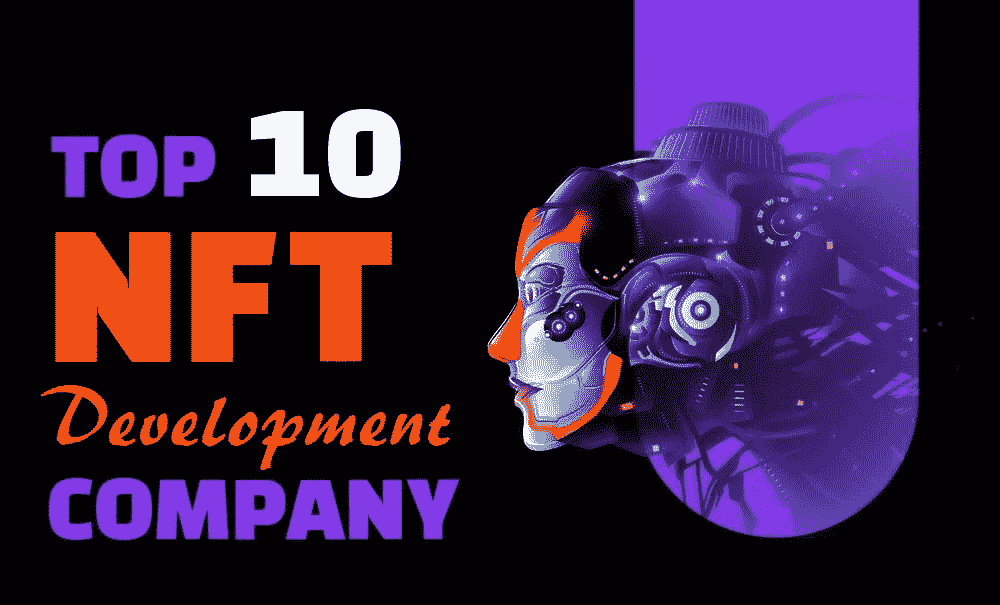
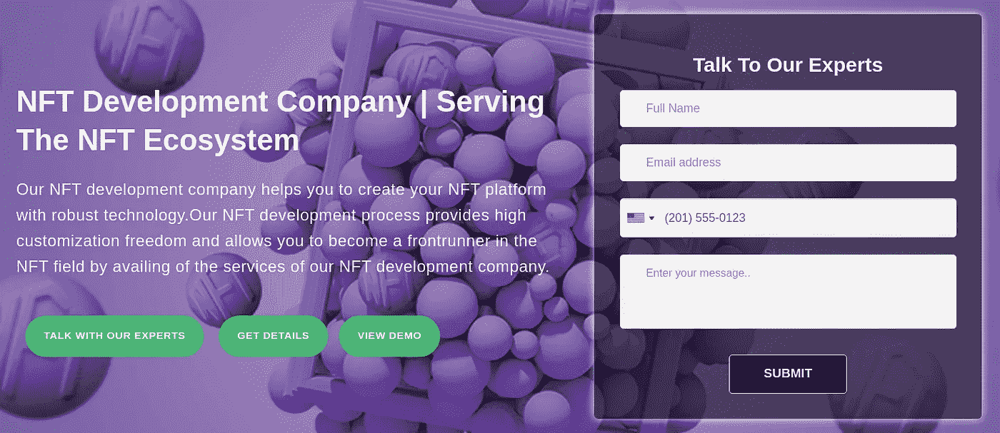
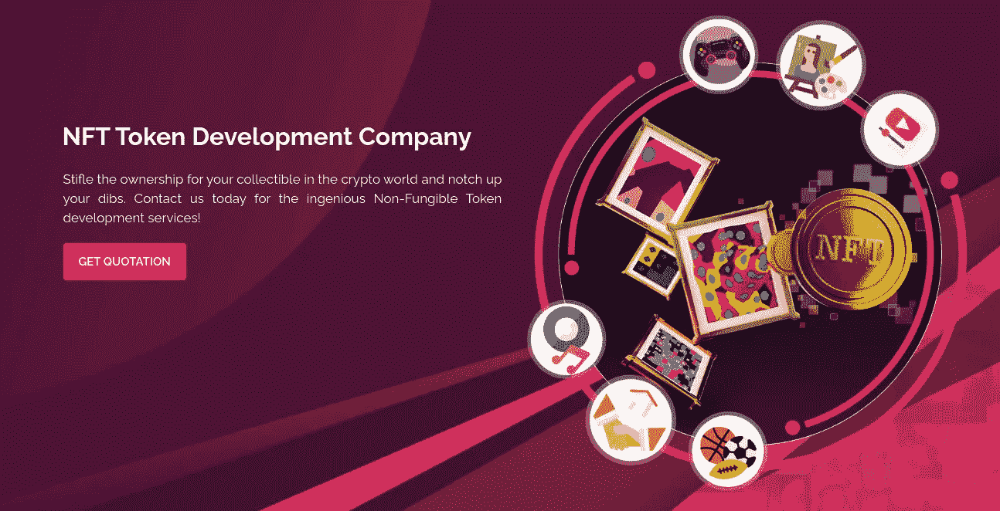
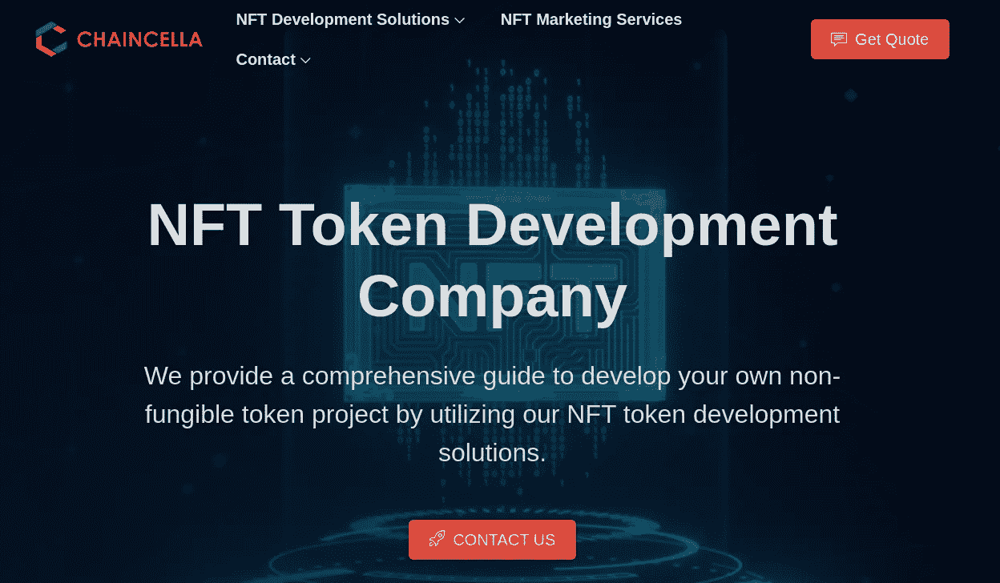
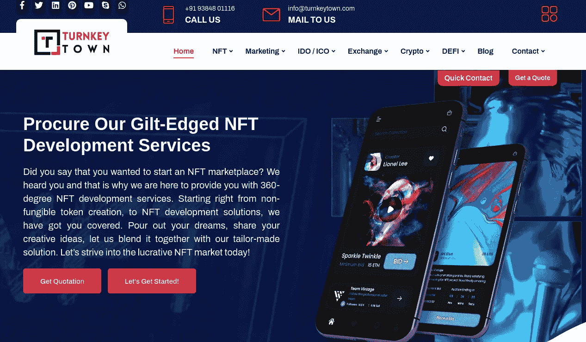
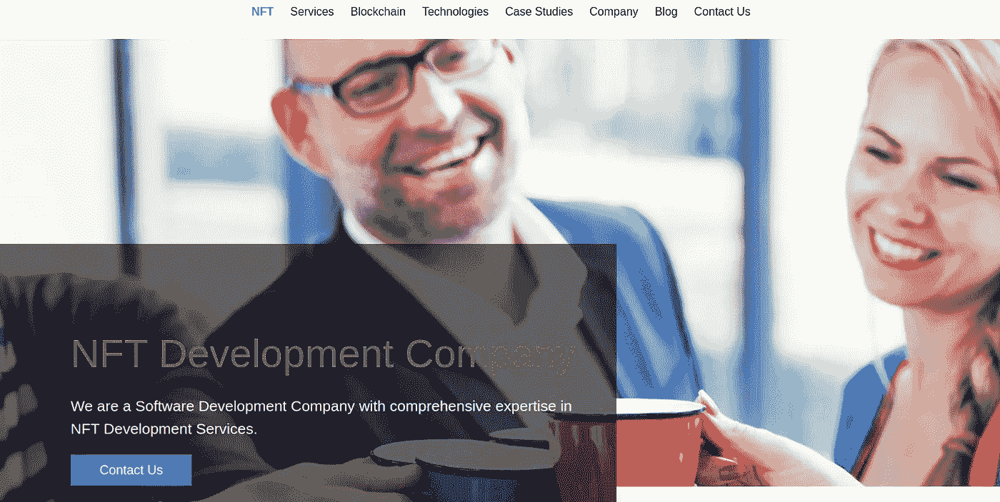
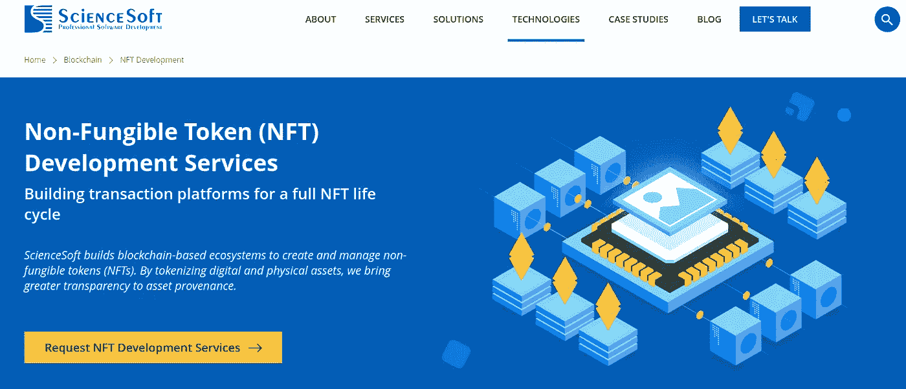
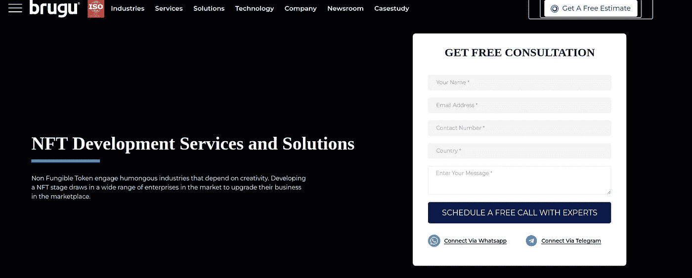
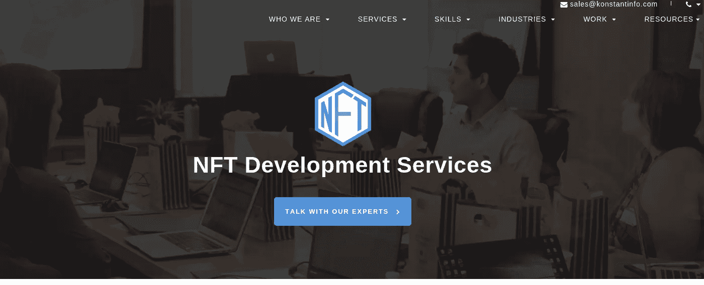
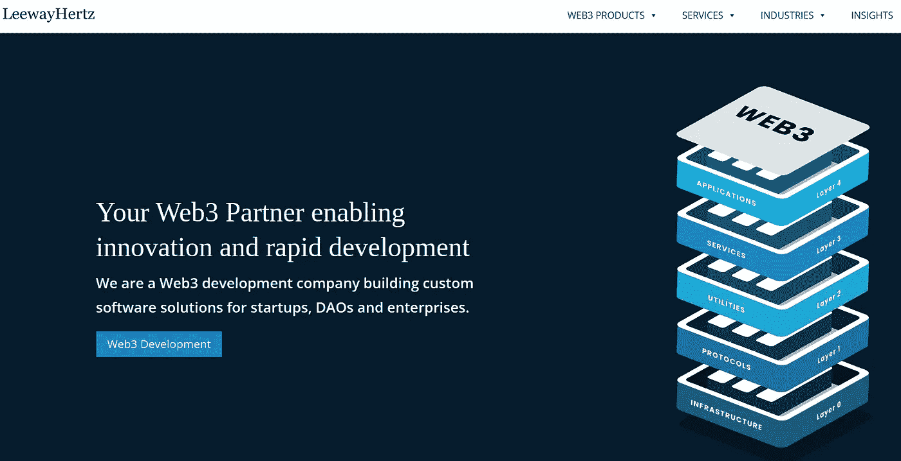

# 2022 年 11 月 10 家最佳 NFT 发展公司

> 原文：<https://medium.com/geekculture/10-best-nft-development-companies-for-2023-b54dec2fba3c?source=collection_archive---------10----------------------->

## 10 大最佳 NFT 发展公司将统治 2023 年

10 Best NFT Development Companies for 2023

NFT 每年都在增长，这就是为什么这里有大量的炒作。他们正在使其在区块链发挥作用，为更安全的未来铺平道路。同样，它们在许多领域都获得了增长，这似乎是对其体系的成功升级。此外，许多企业已经开始提供 NFT 开发，以更好的方式寻找可能性。

[**现在就开始你的 NFTs**](https://www.blockchainappfactory.com/nft-development-services?utm_source=Medium+GC&utm_medium=20/10/22&utm_campaign=senpagapandian)**👈👈**点击这里****

**因此，假设你试图在 NFTs 之外创建一个企业，但却无法进入。在这种情况下，本文展示了顶级 NFT 开发公司使用安全协议在全球范围内创建数字化环境。请按流程进行，找出他们是谁。**

# **【2023 年十大最佳 NFT 发展公司**

## ****1。** [**区块链 App 工厂**](https://bit.ly/3MJ0jMI) **(推荐)****

****

**区块链应用工厂是 NFT 发展的先锋。凭借丰富的实地经验，该公司为许多苦苦挣扎的初创公司提供了机会。他们的工作人员根据需要和他们需要锁定的观众类型制定策略。然而，由于他们进入市场较早，他们对客户需求有着透彻的了解，并已帮助众多客户创建了尖端的解决方案。如果你想爬到顶端，他们是名单上最好的。一定要抓住他们的经验，在充满激烈竞争的市场中做一个榜样。**

## **2. [**INORU**](https://bit.ly/3Dd51zd)**

****

**INORU 是市场上的领军人物。他们用尖端技术让事情变得更好。这些年来，他们做了许多被认为是最好的项目。他们是市场的领跑者，他们用独家的东西创造了例外。作为一家 NFT 开发公司，他们还从事游戏、点播应用以及与加密相关的产品和应用。他们创造了独特的 NFT 元诗句和 NFT 游戏克隆，在其他方面，在 NFT 的发展。他们为那些努力在密码市场取得成功的人开创了最好的未来。一旦你和最优秀的人在一起，你就可以成为一名能力出众的创业者。一个这样的解决方案是，当你带着一份令人难以置信的商业计划来到伊诺鲁。**

## ****3。** [**AppDupe**](https://bit.ly/3eP3iXd)**

****

**根据他们提供的开发标准，AppDupe 被认为是领先的。随着 NFT 的发展，AppDupe 使定制化，以令牌化您的无价的数字收藏品，并将其转换为通用货币。他们将区块链、游戏、智能合约、NFTs 和其他必要的技术整合到业务中。他们的工作包括在不同领域为 DeFi 和 NFT 的发展牵线搭桥，如从游戏到收入的元诗句、生成艺术、NFT 细分和基于社区的品牌推广。他们使用以太坊、卡达诺、币安智能链、创、波尔卡多特、马蒂奇和 NFT 的第二层开发。**

## **4.[切恩塞拉](https://bit.ly/3yZ4EFN)**

****

**Chaincella 是全球顶尖的 NFT 发展公司。他们被认为是 NFT 营销和发展服务的灵魂。他们在各个领域提供这些服务，包括房地产、文化基因、艺术、体育、音乐和游戏。他们有一个白标 NFT 市场解决方案，使他们能够为企业提供全面但个性化的 NFT 平台。为了促进 NFT 的发展，请联系 Chaincella 的专家。**

## **5. [TurnkeyTown](https://bit.ly/3eFxtjS)**

****

**TurnkeyTown 为加密货币、区块链和 NFT 提供代币、生态系统和平台的创建。客户从这些产品在当代潮流生态系统中的推出中受益。公司、企业、团体、组织和人，包括音乐家及其团体、艺术家等。，可以使用。您可以随时联系他们的专家，以独家方式雕刻 NFT 的发展。**

## **6. [Zfort 集团](https://bit.ly/3VJaBk4)**

****

**Zfort 集团专注于 NFT，但也开发一般的区块链技术。除了创建定制产品之外，他们还可以重建和维护定制软件。他们擅长基于以太坊 ERC-721、998、875 和 1155 等标准创建 NFT。区块链开发允许他们管理概念证明和工作证明区块链项目。作为名单上的佼佼者，他们在提供基于 NFT 的解决方案方面有丰富的经验，这就是为什么领先的公司正试图与他们建立更好的未来合作关系。他们在这个数字舞台上发起了一场入侵，让许多加密初创公司从他们所在的位置迈向成功的职业生涯。**

## **7.科学软件**

****

**ScienceSoft 是一个加密领导者，他做密集的项目来吸引观众进入一个良好的经济环境。ScienceSoft 基于区块链开发生态系统，以生产和控制不可替代令牌(NFT)。标记物理和数字资产增加了资产来源的透明度。他们支持的 10+区块链网络包括石墨烯、Solana、Hyperledger Fabric 和以太坊。关于最佳区块链项目网络的定制咨询有助于在市场上实现最低的费用和最快的交易时间。该集团使用 Solidity、Rust 和 Vyper 创建符合 ERC-721 的智能合同。他们还严格测试市场生态系统的每一个元素，以及它是如何整合的，以保证 NFT 市场的稳定性、正常运行和安全性。**

## **8.[布鲁古](https://bit.ly/3scunXI)**

****

**Brugu**

**Brugu 通过提供最佳的 NFT 解决方案而名列榜首。NFT、元宇宙、加密货币、区块链和 web3 开发都是布鲁古擅长的专业领域。然而，他们与 10 个或更多不同的区块链技术栈合作来创建区块链解决方案，如以太坊、Stellar 和 Tezos。此外，他们的服务领域包括 web 开发、移动应用程序开发、质量保证和测试、大数据和分析、物联网和人工智能。**

## ****9。****

********

****Konstant Infosolutions****

****Konstant Infosolutions 是一家市场领先的 NFT 开发公司，它为寻求风险升级的加密初创公司带来了光明。顶级客户根据全球世界的发展，寻求新的服务。他们有一个经验丰富的团队，构思和规划令人兴奋的未来计划。它们包括每一个基于 NFT 的新开发项目，这也是它们在市场上屹立不倒的原因。当你需要冒险时，一定要让他们参与进来。****

## ******10。**[**LeewayHertz**](https://bit.ly/3TfrDon)****

********

****LeewayHertz****

****Leewayheartz 是世界上最好的 NFT 开发区。然而，除了物联网平台、元宇宙解决方案和人工智能平台和应用程序(如智能人脸检测、社交距离警报系统和非接触式考勤解决方案)，这家 NFT 开发公司还创建了 NFT 市场和其他 NFT 产品。他们的区块链产品基于索拉纳、XDC 网络、恒星、以太坊和以太坊区块链。****

## ******结论******

****非功能性测试不仅仅是每个人的小菜一碟。然而，他们因为不同的原因而改变了自己。他们给人们应得的生活质量。如果你想看看他们是如何改变世界的，你可以从名单中找到顶尖的 NFT 开发公司，然后做一个符合你目标和要求的 NFT 项目。****