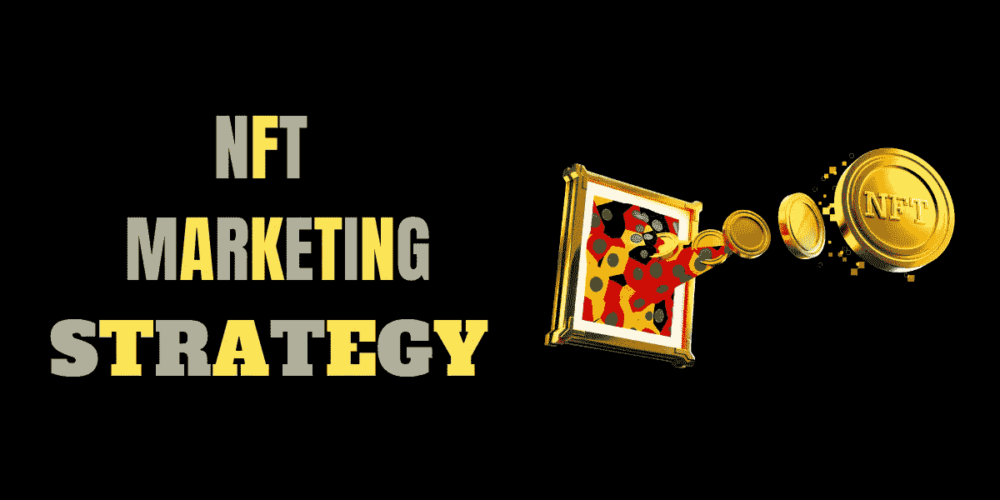
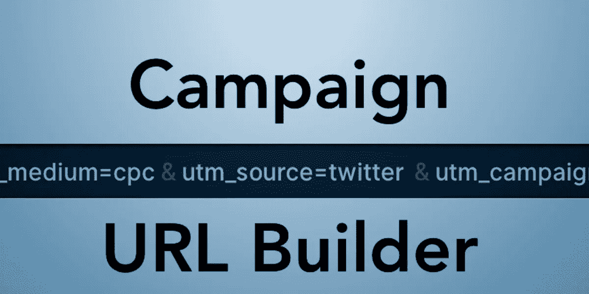

# 2022 年 NFT 十大最佳营销策略

> 原文：<https://medium.com/geekculture/10-best-nft-marketing-strategies-2022-b9a23b06840e?source=collection_archive---------11----------------------->

**10 BEST NFT MARKETING STRATEGIES THAT ALWAYS WORK**

即使你用精英专家培育你的 NFT 企业，人们也应该知道你的项目以获得成功。营销是让你的项目获得全球知名度和投资者吸引力以获得成功的唯一选择。要做更好的营销，你必须找到一个更好的营销机构来有效地滋养和培育你的 NFT 业务。

新兴的加密企业积极参与 NFT 营销服务，为该项目建立品牌价值和声誉。许多项目在战略营销的帮助下取得了巨大的成功。这些营销服务通过让项目接触到主权投资者和慈善家来资助和孵化项目，为项目提供必要的资源和支持。

一些顶级的 NFT 营销策略使你的 NFT 项目到达全球受众

# **1。了解你的受众**

**KNOW YOUR AUDIENCE**

理解你的受众是成功的关键。只有了解你的受众，才能推销出正确的策略来推动销售。了解你的市场所提供的非功能性营销类型，可以让你的企业在市场上找到合适的受众，从而获得成功的销售线索。了解你的受众将有助于你优化你的营销工作，锁定正确的受众，使你的营销更有效率和效果。

# **2。定义你的品牌**

**BRANDING STARTEGIST**

使用品牌指南、USPs 和品牌价值来定义您的品牌对市场的价值及其在线存在，以代表您在市场中的独特比例。这有助于记录您的品牌价值及其在受众心目中的存在，并为您的 [NFT 市场](https://www.cryptocurrencyexchangescript.com/nft-marketplace-development)创造价值和声誉。

# **3。建立你的买家角色**

**CHOOSE BUYER PERSONA — NFT BUSINESS**

通过精确的分析和策略建立您的角色，促使客户选择您的公司。这将为您的 NFT 业务创造声誉，并对您的 NFT 项目的绩效产生积极影响。完美的战略和人口统计将很好地为你的 NFT 业务建立一个有吸引力的角色。

# **4。创建你的目标**

**SUCCEED GOALS**

为实现你的战略设定计算好的、可衡量的目标。制定短期目标将有助于你的企业保持在实现长期目标的轨道上。实现短期目标会给你带来信心和纪律，让你继续前进，取得非凡的成功。

# **5。选择你的 NFT 营销策略**

**NFT MARKETING STRATEGY**

做深入的市场调查和研究，了解当前市场的趋势和更新。创建一个精确的战略，并把它分成小块，这将让你逐步实现你想要的目标，并让你领先于你的竞争对手。与顶级营销机构合作将有助于你制定精确的战略，从而在短时间内获得成功。

# **6。头脑风暴你的策略**

**BRAINSTORM STRATEGY**

通过为您的市场推广活动创建预算，有效地推动您的战略走向成功。与市场专家一起总结你的策略，并利用这些技巧为你的 NFT 业务创造动力。来自利基市场的市场先锋和专家将支持你完善你的营销。

# **7。使用销售线索内容**

**CONTENT IS A KING**

内容是推动任何企业成功的创收因素。专注于内容策略，为博客和网站提供基于知识的内容，将为你的业务营销打下坚实的基础。创建 SEO 丰富、清晰的内容将支持您的网站在搜索引擎中更快地爬行。内容营销还支持将您的业务推向全球受众。

# **8。进行现场会议并使用音频**

**LIVE SESSIONS — PODCASTS**

举办个人活动和现场网络研讨会将创造权威和领导一个组织。这些活动将接触到有价值的联系人，它所创造的信任和权威将为您的业务带来支持。通过播客用声音接触你的听众也将支持你的企业接触你的同行并获得巨大的听众响应。

# **9。打造您的活动**

**CAMPAIGN URL BUILDER**

坚持计划和开展活动将推动销售和牵引你的 NFT 业务。让不和谐的观众参与进来并让他们保持活跃将会增加你的吸引力和参与度。有趣的活动导致了大企业的巨大成功。

# **10。关注结果**

结果驱动营销是任何企业在市场上取得成功的关键。关注结果，并根据结果操纵你的营销策略，将推动企业走向成功。NFTs 是密码市场的轰动，战略营销将推动更好的结果，以达到您的业务到全球市场。

**FOCUS — MARKETING STRATEGY OUTPUT**

将你的 NFT 业务提升到全球市场的最有效方式是与一家开拓性的 NFT 营销机构合作。创业时花费大量的金钱和时间进行营销并不是获得成功的有效途径。雇佣一个**完美的** [**NFT 营销服务**](https://www.cryptocurrencyexchangescript.com/nft-marketing-services?utm_source=medium&utm_medium=guestblog&utm_campaign=vigneshraju) 将帮助你提升你的业务到全球观众面前，用所有上述策略使你的 NFT 业务在加密市场成功。

查看这个关于 NFT 营销服务和策略的 30 秒视频，并访问我们的 NFT 营销机构了解更多信息。