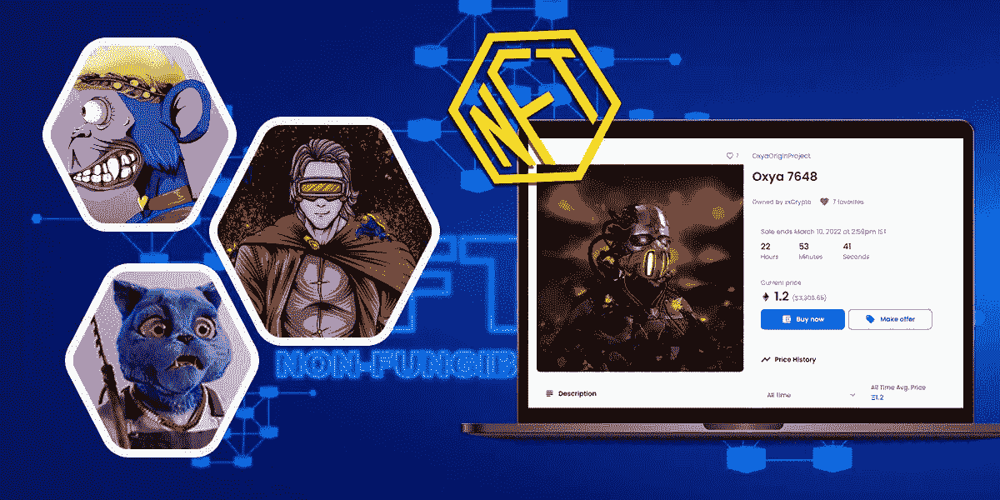
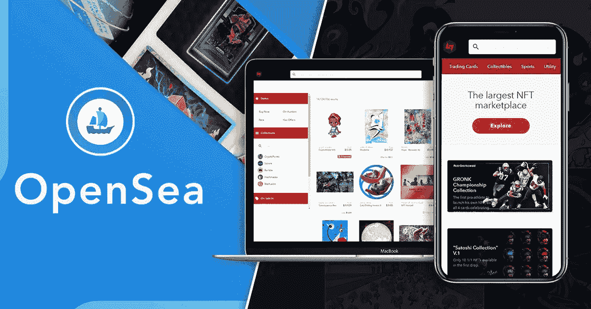
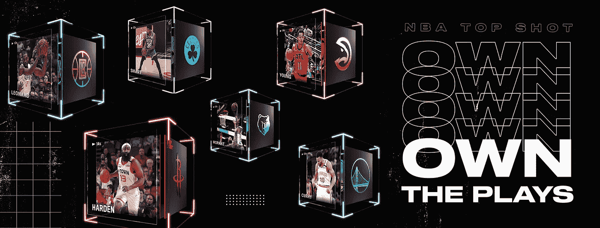
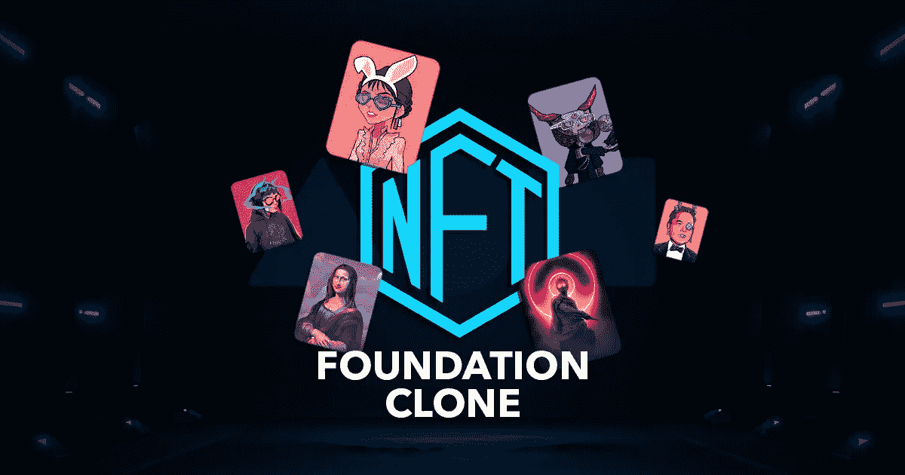
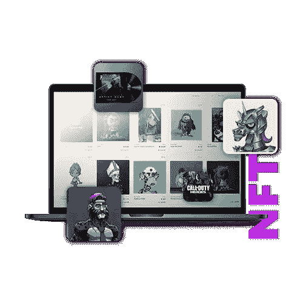
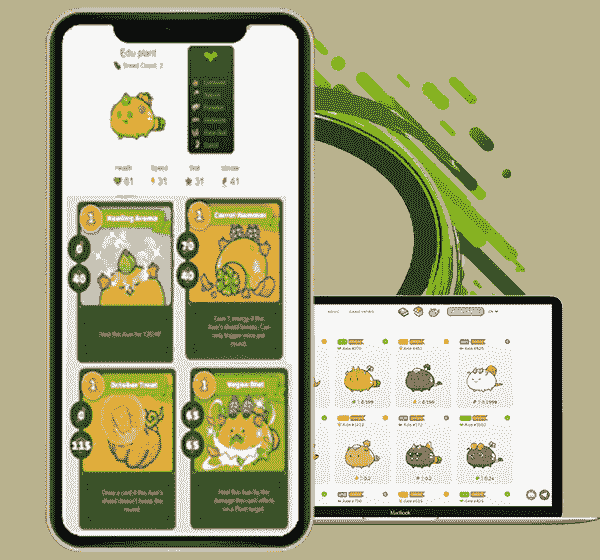

# 2023 年 NFT 10 大最佳白牌市场

> 原文：<https://medium.com/geekculture/10-best-white-label-nft-marketplaces-of-2022-59deb10d9351?source=collection_archive---------8----------------------->

白标 NFT 市场是一个预制的、随时可以推出的解决方案，让像您这样的企业家能够为交易者或用户提供一个购买和销售数字产品的空间。数字物品可以是任何东西，包括艺术、音乐、领域、游戏中的物品、视频、迷因等等。该解决方案由区块链技术支持；它可能是以太坊，币安智能链，创，索拉纳，卡尔达诺，多边形，恒星，泰佐斯等。

作为一个可定制的解决方案，可以根据要注入的特性进行修改，从而定义功能。更重要的是，选择哪种区块链技术来开发 NFT 市场将取决于个人。

谈到白牌 NFT 市场，它有很多好处，因为它最适合预算紧张、愿意在最短的周转时间内进入蓬勃发展的 NFT 市场的企业家。在这篇博客中，我们策划了 10 个受欢迎的 NFT 白标市场。看看这个。

## **以下是 2023 年 NFT 十大白牌市场的列表**

## **OpenSea 克隆人**

你知道 OpenSea 吗？这是第一个也是最大的建立在以太坊上的 NFT 市场。这意味着发现，购买和销售数字项目，如艺术，交易卡，游戏中的资产，头像，等等。它的显著特征包括如下。

*   连接到您的个人资料
*   保存您的收藏夹
*   发现 NFT
*   搜索和过滤 NFTs
*   跟踪收藏

虽然以太坊不支持高汽油费的无障碍交易，但 Polygon 技术的集成使 OpenSea 即使对初学者也能带来用户友好的体验，包括无汽油费或少汽油费的快速交易。

[**OpenSea 克隆**](https://www.inoru.com/opensea-clone) 是一个可定制的解决方案，具有与现有 OpenSea 相似的特性和功能。这无疑将是企业家的首选，当他们打算推出他们的 NFT 市场，并在世界区块链空间的突出存在。由于是定制的，这个解决方案可以根据不同的个人需求进行调整。

## **稀有克隆**

Rarible Clone 拥有创建个性化 feed、浏览和探索收藏、高级过滤器、治理属性和其他 Rarible 中存在的基本功能。Rarible 拥有近 160 万用户和 2.74 亿美元的交易量。当看到它的卓越时，企业家们选择雇佣稀有的克隆人的机会大大增加了。以下是 [**白标稀有克隆**](https://www.inoru.com/rarible-clone) 解决方案不可或缺的特性。

*   分享收藏品
*   分散
*   多设备兼容性
*   钱包整合
*   各种各样的收藏品

它的本土标志是 RARI。持有这些代币的人将有权就与平台发展相关的决策进行投票。这包括管理费、管理平台的规则等等。

## **NBA 顶级射手克隆**

NBA Top Shot 克隆版的核心功能是让用户像 NBA Top Shot 一样交易体育收藏品。核心功能包括去中心化、钱包整合、等候室、指南、验证、NBA 资产跟踪、包裹投放、展示、挑战等。

通过该解决方案，企业家将能够在短时间内启动他们位于 NFT 的体育市场，为体育迷提供一个交易体育收藏品的空间。这包括运动卡、纪念品、时刻和球员配件。现成的 [**NBA 顶级射手克隆**](https://www.inoru.com/nba-top-shot-clone) 解决方案将非常适合那些有兴趣进入 NFT 体育产业的人。

## **超稀有克隆**

超级稀有克隆是由以太坊区块链技术支持的数字 NFT 市场解决方案。这将允许您启动一个类似 SuperRare 的 [**NFT 市场，拥有类似的特性和功能，使用户能够创建自己的数字产品并出售它们。**](https://www.inoru.com/superrare-clone)

这是一个交易不可替代代币的平台，既有利于创造者和投资者，也为企业家带来了巨大的利润和货币化机会。这将通过实施市场费和销售费的各种收入来源来实现。

## **币安 NFT 市场克隆**

[**币安 NFT 市场克隆**](https://www.inoru.com/binance-nft-marketplace-clone) 是一个白色标签解决方案，是币安 NFT 市场的运营再造。用户友好性和安全性使得这个平台对于用户选择交易来说更加可靠。这个平台仅用于不可替换的令牌和神秘盒子。此外，将创作者(如艺术家)和爱好者聚集在一个屋檐下。

## **基础克隆**

Foundation Clone 是一个随时可用的解决方案，具有铸造和购买/销售数字作品的功能。重要功能的融合包括交易资产分类、数字资产列表、交易绩效跟踪、多币种支持、时间限制权衡、铸造、高级搜索过滤器等等。

该解决方案将授权个人或企业家启动一个面向社区的 [**NFT 市场，就像基金会**](https://www.inoru.com/foundation-clone) 。因此，他们可以通过整合销售费、服务费和上市费等收入模式获得大量利益。

## **Sorare 克隆**

Sorare Clone 是一个预先设计的解决方案，允许企业家推出位于 NFT 的梦幻足球游戏平台。与从零开始创建 NFT 市场的方法相比，这似乎是在尽可能短的时间内进入 NFT 博彩业的理想选择，包括设计、开发、&测试。这个平台由以太坊区块链网络支持，并拥有必要的功能。

## **俏皮的网关克隆**

[**Nifty Gateway Clone**](https://www.inoru.com/niftygateway-clone)是一款可定制的 NFT 艺术品拍卖市场解决方案，采用区块链技术。利用这一点，个人可以借助你的平台跃入 NFT 领域。因此，平台用户可以交易数字资产或 NFT，即所谓的 Nifties。这个平台的设计&是为了给艺术家提供一个创作、制作和销售他们的数字艺术品的机会。它的功能是基于注入的功能，其中包括创建 NFT 收藏，资产分类，钱包集成，购买收藏品。

## **Axie Infinity 克隆**

Axie Infinity Clone 是在以太坊上开发的量身定制的解决方案。有了端到端定制的额外好处，像你这样的企业家将能够推出像 Axie Infinity 这样的 NFT 游戏平台。它具有内置的功能，如战斗、繁殖、市场、土地和 AXS。玩家可以创造、繁殖和战斗斧头，甚至在市场上出售它们。一个白色标签的 Axie Infinity 克隆体 会带来权力下放、精彩的游戏体验、安全的交易、获得奖励的机会等好处。

## **金恩克隆**

金恩克隆是一个完全可定制的解决方案，执行数字资产的权衡，功能包括 NFT 铸造，钱包集成，展示，创作者评级，以及许多其他重要的功能。该解决方案是预制的、经过测试的，并在完成个人所需的必要修改后即可部署，目的是像金恩一样在区块链市场推出 NFT 市场。

以太坊是区块链网络的先驱，它在大多数时候是 NFT 市场发展的首选。尽管如此，这是你的决定，选择其他一些区块链网络的 NFT 市场发展。除了以太坊，以下是比较受欢迎的。

*   币安智能连锁
*   创
*   主要的
*   索拉纳
*   波尔卡多特
*   币安智能连锁

## **总结**

预计 NFT 市场在未来几年将会有巨大的增长。预计 NFT 市场规模将在 2021 年至 2026 年间以 35.27%的复合年增长率(CAGR)增长。从今以后，进军 NFT 市场将是最佳选择，也是通过启动 NFT 市场。虽然市场上有几个受欢迎的 NFT 市场，交易量巨大，用户群活跃，但像你这样的企业家仍然有机会利用当前的趋势，推出你的平台。在这样做的同时，采用 [**白色标签 NFT 市场解决方案**](https://www.inoru.com/white-label-nft-marketplace) 将是一个额外的优势。