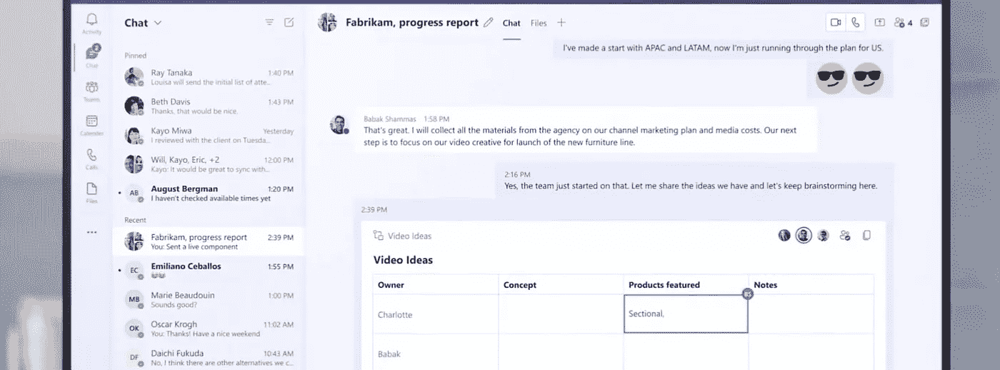
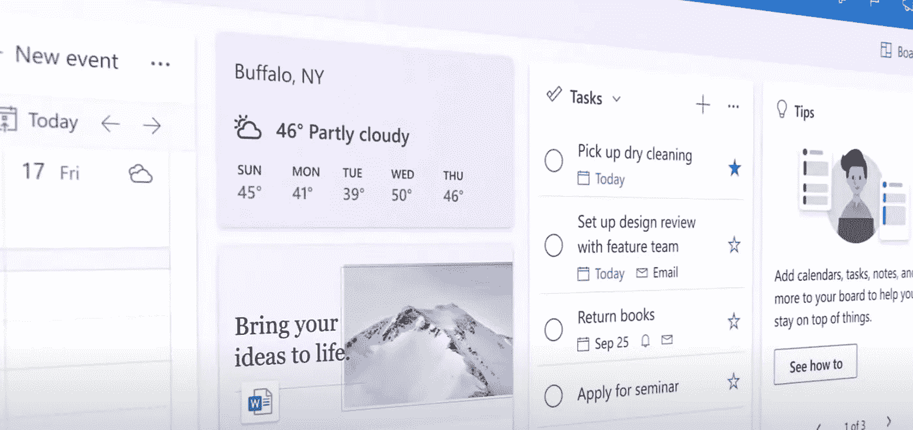
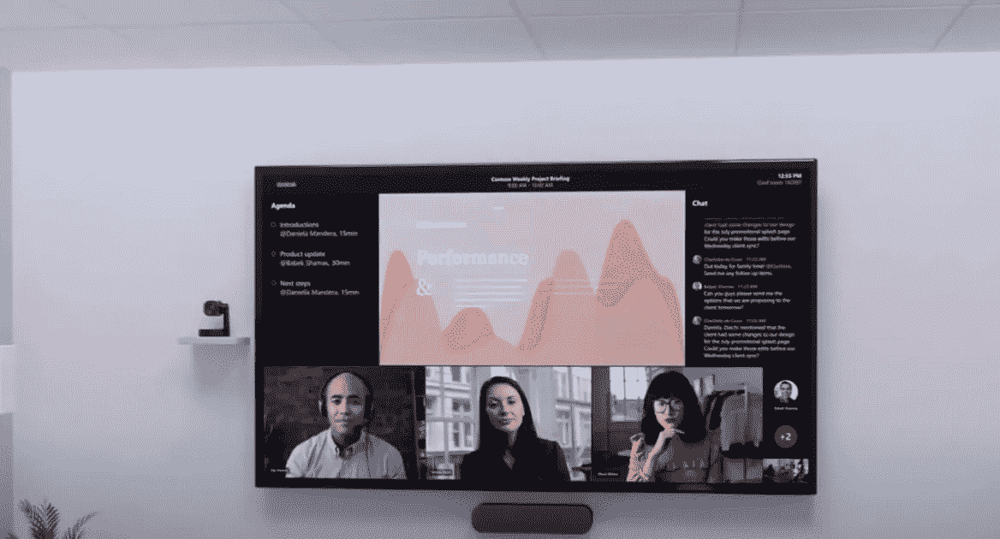
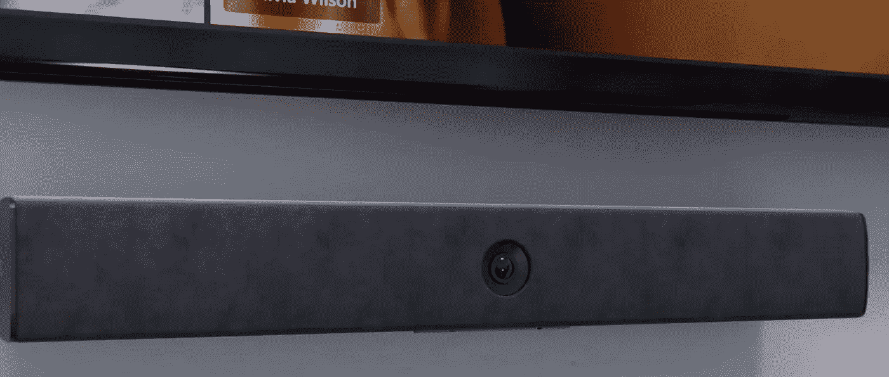
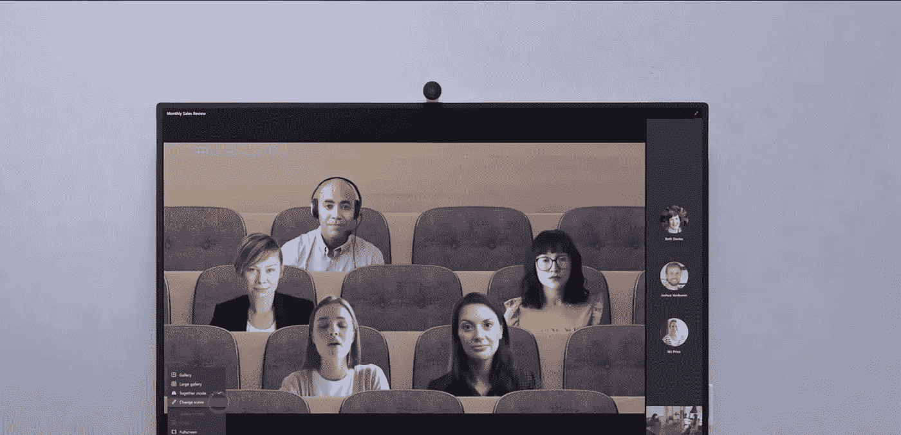
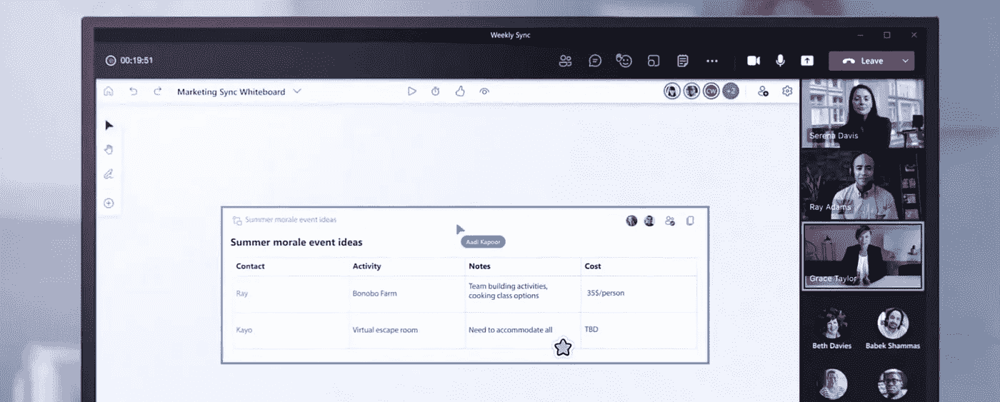

# 微软活动中的 10 大更新

> 原文：<https://medium.com/geekculture/10-biggest-updates-at-microsoft-event-6b760c9e288b?source=collection_archive---------17----------------------->

## 微软 365 体验的最大补充

# 1.流体成分

*   在微软产品中创建“实时”文档的新方法
*   创建它们，然后通过链接与他人共享，供他人实时编辑
*   实时编辑意味着你可以在任何地方分享，并在其中编辑
*   非常适合 Microsoft Teams 和 Outlook 中的团队
*   可嵌入，无需打开即可编辑

# 2.升级的 Outlook 面板

*   现在，您可以将带电组件嵌入电路板
*   Boards 是一个在一个地方管理所有类型元素的地方
*   Outlook 面板随着钉住的能力继续增长

# 3.会议议程

*   在 live 组件中记录会议笔记的新方法
*   您也可以使用 OneNote 扩展笔记
*   这些议程和会议记录也可以实时嵌入到微软团队会议中，非常适合协作

# 4.会议布局

*   会议布局得到了改进
*   现在，您可以在更靠前的位置看到会议的远程与会者
*   这有助于改善办公室和远程员工的会议方式，实现更好的混合
*   您可以向任何团队会议添加更多实时组件

# 5.画廊视图

*   非常适合办公室和远程环境
*   如果你的团队/办公室有两台电脑或电视——你现在可以在两个屏幕上平均分配人员——这是最大化空间的完美选择。

# 6.硬件升级

*   会议摄像技术的改进
*   微软发布了一系列新的版本来帮助会议变得更加流畅和顺畅
*   一个新的“脸书门户”像照相机帮助跟踪人和拉近距离，让你觉得你是在远程会议

# 7.一起模式

*   提供改进的电影院和董事会会议剪贴画
*   微软的目标是通过这一附加功能使会议更加个性化

# 8.白色书写板

*   微软通过新的白板升级与米罗较量
*   非常适合实时体验图表、笔记和线框
*   成员也可以编辑和添加他们自己的元素
*   您也可以添加实时组件进行编辑
*   他们也增加了模板能力

# 9.Recaps

*   会议摘要现在变得更容易了
*   根据您的 MS365 计划，错过会议的与会者现在可以看到所发生事情的回顾和概述、关键笔记，如果需要增加细节，甚至可以看到会议的完整记录。

# 10.聚焦时间

*   微软已经与 Headspace 进一步合作，增加了冥想、分组会议以及关于工作重点的教育
*   一个新的番茄类型模式将被添加，允许人们在他们的日历中集中和设置时间，以免破坏会议