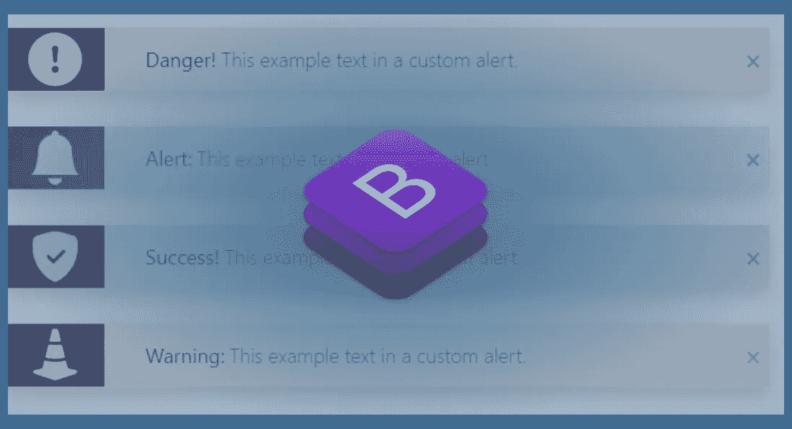

# 10 多个引导警告弹出模板示例

> 原文：<https://medium.com/geekculture/10-bootstrap-alert-popup-template-examples-c140ef7b6b36?source=collection_archive---------10----------------------->

# 什么是引导警告弹出窗口？

Bootstrap alert popup 是一个内置组件，旨在提供对典型用户操作的反馈。

八个上下文类提供了默认的引导颜色。

**你如何使用引导警告弹出窗口？**