# 数据科学中你需要知道的 10 种数据框架方法

> 原文：<https://medium.com/geekculture/10-dataframe-methods-you-need-to-know-for-data-science-c8d91021636a?source=collection_archive---------11----------------------->

操作熊猫数据框架是许多数据项目的基础。我提供了您需要了解的 10 个最重要的数据框架方法和函数。跟着我解释它们，并为体育博彩模型准备一个 NFL 数据集！

任何涉及大量数据的项目的基础都在准备阶段。清理、移动、验证和变形数据将为你以后的成功做好准备。下面列出的 10 种方法不是按等级排列的，而是按照我在这个特定用例中使用它们的顺序排列的。

Can we accurately predict who will cover the spread?

我收集了 10 年的 NFL 比赛数据，最终目标是建立一个数据框架，准备创建一个模型来预测一支球队是否会覆盖价差。

在我们的起始数据中，每一行代表一个队和他们每场比赛各自的分数。为了获得模型的最佳数据，我们将为我们的数据创建几个新属性，然后将每条线上的主队和客场队集合在一起。我在谷歌上快速搜索了一下，收集了过去 10 年这种格式的 excel 文件。

正如你在下面看到的，我们有每场比赛的一些基本信息和一些关于赔率的统计数据。还不错。但是我们可以通过一些简单的函数让它变得更加有用。这是从工作目录中读取数据帧后，起始数据帧最初的样子:

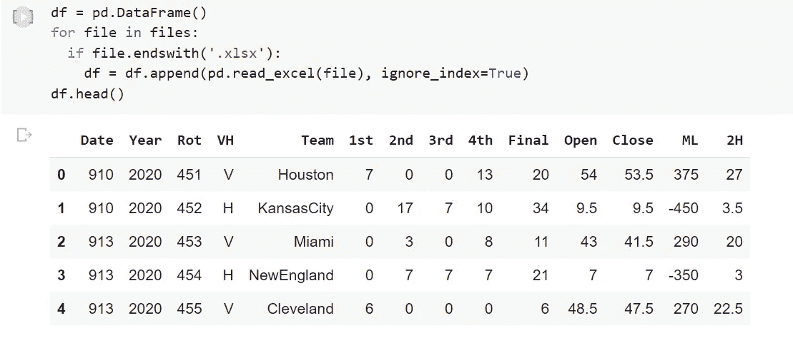

Initial NFL DataFrame

1.  **where()**

其中()是一个 numpy 函数，它允许我们基于另一列中的参数在数据框中创建新列。由于我们数据的格式，我将使用 where 将跨页分隔到它自己的列中。在数据中，价差存储在主队的 Close 列中。它的工作方式类似于 excel 中的 IF()语句。如果条件为真，则将第二个值传递给新列，如果条件为假，则将最终值放入新列。

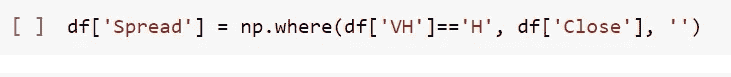

Creating a new Data Frame Column ‘Spread’ with only the spread values

**2。gt()和 lt()**

大于和小于是非常有用的 Pandas 函数，用于将值与基线进行比较或创建供以后使用的指标。它根据比较结果返回一个布尔值。在这里，我创建了一个新的数据框列“Favorite_ML”。如果原始列“ML”小于 0，则新创建的列将显示值 True。热门将有负的货币线值，而冷门将有正的货币线值。使用 lt()我们可以确定在每场比赛中哪一队更受青睐。

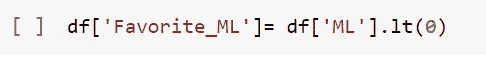

Creating a new Boolean column by using the less than function

**3。diff()**

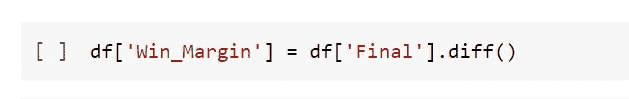

Creating a Win Margin column based on the ‘Final’ differences

diff()函数将从第 1 行减去第 2 行最后一列的值。我正在使用这个功能有效地获得每场比赛的胜率。它从客队得分中减去主队得分。这意味着每一个奇数行将有正确的胜利差额(正或负)，每一个偶数行将有两支参赛队的差额。

我们将通过引用偶数索引列来过滤掉这些值，用这些值创建一个新的数据帧，然后将这些值移回我们的原始数据帧，放在一个新的和最终的 winning margin 列中，奇数索引列用零填充。

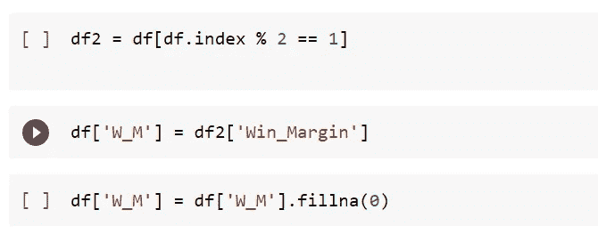

Filtering out the incorrect winning margin columns

**4。drop()**

创建新的成功利润列(“W_M”)后，我们可以删除旧的。您可以一次指定多个列，但我们只是尝试删除“Win_Margin”。

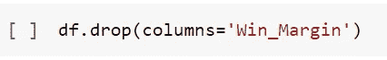

Dropping the old Winning Margin column

准备数据时进行清理对于消除数据中的噪声至关重要。这将使创建模型和使用数据集变得更加容易。这给我们带来了下一个功能:

**5。替换()**

我们使用这个函数将球队名称标准化为相应的吉祥物，以提高我们的数据质量。一些团队在数据的每一年都有不同的排名。例如，纽约喷气机队有几年被列为“NYJets ”,另一年被列为“New York Jets”。正常化这将节省你的时间和困惑，因为你的进步。你可以在下面看到我为所有 32 个团队所做的:

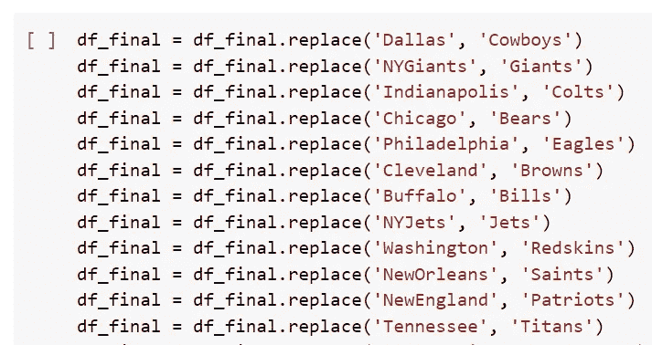

Cleaning the Team Names with replace()

**6。drop_duplicates()**

为了检查我是否修改了所有的团队名称，我创建了一个只包含团队名称的新数据框架。然后，我删除了重复项，以检查两件事:1 .团队名称中有多少个唯一值，以及 2。球队的名字和我预想的一样。NFL 有 32 支球队，我们最终在 df_names 数据帧中有 32 个独特的球队名称。现在，我们可以返回到原始数据帧并继续。

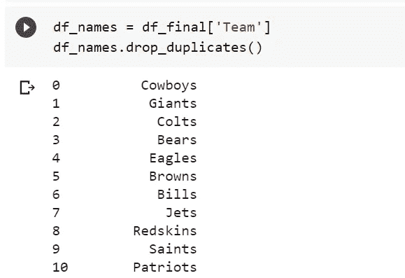

Verifying that we have 32 unique team names

**7 & 8。groupby()和 get_group()**

使用这些函数，我们将根据团队是在家(“H”)还是在外(“V”)来分割数据框。通过按主场或客场分隔数据帧，我们可以稍后合并我们新创建的主场和客场数据帧，以便在每场比赛中让两个队在同一行。

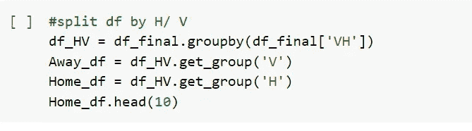

产生的家庭数据帧:

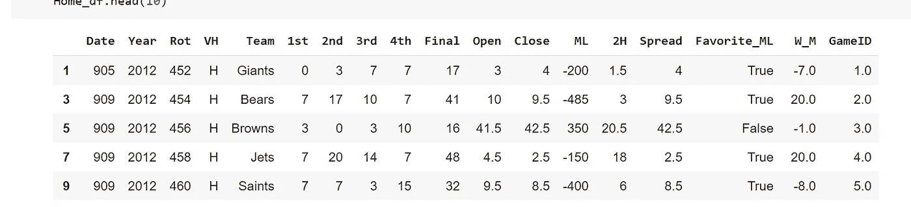

Home_df first five rows

最终的客队数据框架:

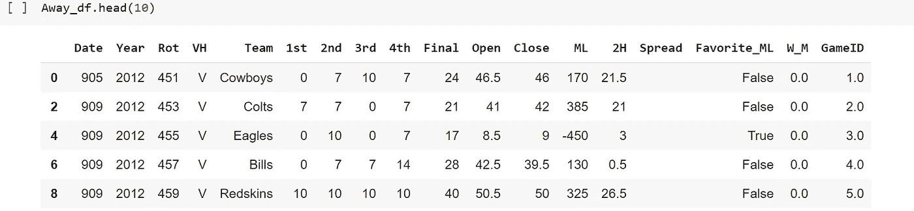

Away_df first five rows:

**9。merge()**

在对上一步中的数据进行分组之前，我在数据帧中添加了一个“游戏 ID”列。现在，在主客场数据帧上，我们将有一个键将它们合并在一起。

对于像这个用例这样的数据源和数据工程的结合，合并是非常有用的。Merge 相当于 SQL 中的 join。要连接的公共键包括日期、id 和其他唯一标识符。一旦连接，我们将把合并数据集的结果称为“最终”。

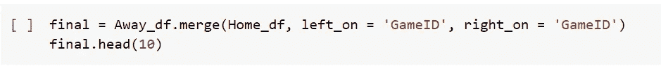

**10。重命名()**

在复杂的工作之后，我们将通过清理属性名来结束。合并后，属性名称以“_x”或“_y”结尾，以区分来自何处。出于我们的目的，我们将 x 改为 home，y 改为 away，以使数据帧更易于阅读。此外，我从合并中删除了一些冗余的列。你可以在同一个专栏中这样做，但是我把它分成了多行，以便于阅读。

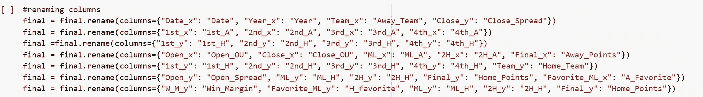

**最终数据帧！**

清除了难以阅读的属性名、不相关的列，并准备在许多不同的模型中使用！粘贴在下面的是最终数据帧的一个剪贴，给那些跟随的人！

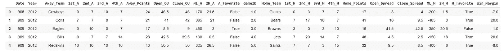

The Final cleaned DataFrame

**后续步骤和跟进:**

在清理和准备我们的数据之后，我们准备好进入下一个层次，创建一个模型。请继续关注我用这些数据预测 NFL 比赛的后续报道。

感谢您的阅读！如有任何问题，请发微博给我@ZachEng1ish 或发电子邮件给我 zach.zlish@gmail.com！