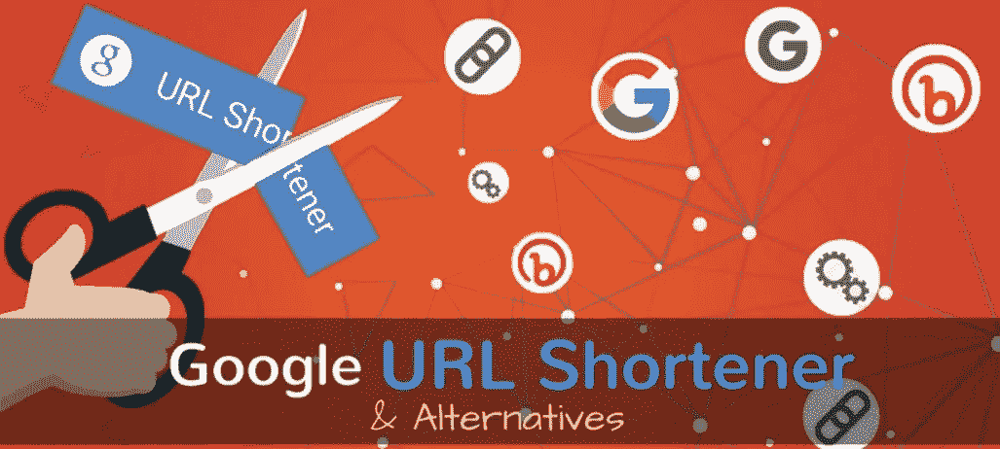

# 谷歌网址缩写的 10 个易于使用的替代品

> 原文：<https://medium.com/geekculture/10-easy-to-use-alternatives-of-google-url-shorteners-db64e18abf81?source=collection_archive---------23----------------------->

你认为那些又长又长又乱的链接还在用户收藏夹列表里吗？嗯！这些混乱的链接真的会扰乱观众的思维，让他们无法集中注意力去点击它们。

当然，这反过来会让品牌/企业失去对其不断上升的搜索次数的掌控&也可能会妨碍参与度。那么，什么有帮助呢？以下是 10 大网址缩写选项，可以让你的品牌建设过程更加顺畅。

但是在阅读谷歌网址缩短器之前，让我们让你明白网址缩短器实际上是什么

# 什么是网址缩写？

因此，考虑一个工具，根据你的选择定制拉长的东西，简化你的过程，更明智地在社交媒体上花费或投资时间。是不是都很神奇？基本上，一个网址缩写做这个类似的功能，就像谷歌网址缩写。

从更广泛的意义上来说，无论是 google URL shortener 还是 google URL shortener 的替代品——每一个都有助于你创建一个更好的、增强的、简洁的、更短版本的旧链接。现在，当我们说“更好”、“增强”、“简洁”和“更短”时，它实际上意味着一个 URL 在这些参数上得到了提升和改进。这是如何-

## 短网址的三大特点

嗯！长链接像一个疼痛的拇指一样突出，并触及扰乱观众舒适度的神经。没有人甚至我们作为别人的观众不会点击单调冗长的链接，这些链接本身并不代表它们的意义。

短链接比长链接更能提高品牌知名度，因为它简洁明了，反过来也容易阅读和记忆。此外，网址缩写在线有宽大为怀，纳入品牌名称，倾向于认证品牌，同时建立更忠实的合作伙伴。

*   它使链接更加定制和难忘
*   有时，网址缩短器会自己跟踪链接
*   增强社交平台的参与度

## **谷歌网址缩写的 10 个简单易用的替代品|营销指南**

1.  **OpenOnApp**

open app 是 dynamcy 最好的链接管理工具，可以满足各方面的需求&对于内容创建者、营销者、品牌、企业或任何其他人来说，它是 google URL shortener 替代方案中最好的一个。它打开了本地应用程序的链接，将长 URL 转换成短的和定制的，有一个方便的界面，并显示详细的分析，同时增加收入。

**2。一点点**

Bitly 是另一个 google URL shortener 替代品，允许访问管理洞察力，并让品牌以更增强的方式与人们联系。每次点击都会给内容带来个性化的触动。

**3。重新划分**

Rebrandly 是继 Openonapp 和 Bitly 之后最常用的平台之一，允许准备自定义域链接和共享所有内容，以实现更好和增强的社交网络和建立品牌连接。

**4。Bl.ink**

Bl.ink deals 是另一个出现在 google URL shortener 在线替代列表中的名字。它还通过提供简短的、品牌化的和属性化的链接来监控洞察力，从而增强了用户的能力。

**5。GoLinks**

google URL shortener 的一个很好的替代品是 GoLinks，它可以自由地创建简短的品牌链接，帮助品牌表现良好，比预期好得多。

**6。T2M 网址缩写**

T2M 网址短站在人群中的一个链接管理平台，提供了一个有价值的创建自定义和品牌链接和 API 的经验。

**7。Lnnkin**

特别是对于那些寻找一个平台来帮助他们通过自定义链接共享进行测量分析的品牌和企业来说，Lnnkin 是他们最好的选择。

**8。杰利尤尔**

这是如此明确，你会搜索一些谷歌网址缩写的替代品，以获得理想的结果范围。JellyURL 是帮助改变 URL 目的地甚至生成二维码的工具之一。

**9。Lnkiy**

Lnkiy 是一个完美的平台，专门致力于商业，通过其功能，如跟踪点击，监测竞争对手等，使您的链接建设和品牌认证更加强大。

**10。重新切割**

Recut 是一款免费的 google URL shortener 替代品，适合企业，同时帮助他们创建自定义链接，以前所未有的方式扩展业务。

## **到底线**

当然，缩短的网址是为了抓住和吸引更多的注意力。因此，无论是任何术语，无论是参与度、测量分析、观看点击率、分享以建立网络，还是任何其他目的，短 URL 都应该是优先选择。

如果你是那些希望寻找谷歌网址缩写替代方案的人之一，那么 Openonapp、Bitly、Rebrandly 和其他上面提到的平台是很好的选择。