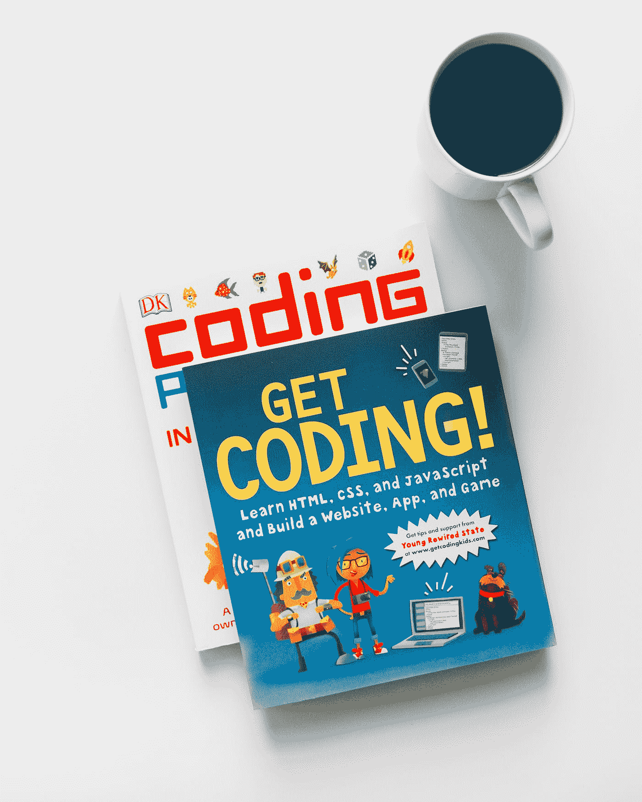

# 每个程序员都应该阅读的 10 本必备书籍

> 原文：<https://medium.com/geekculture/10-essential-books-that-every-coder-should-read-901bf3cbbc71?source=collection_archive---------1----------------------->

# 介绍

如果你是一个程序员，那么你知道阅读是最基本的。虽然您可能了解所有最新的编码趋势和技术，但没有什么比一本好书更能拓宽您的视野并教会您一些新东西了。

Photo by [Rick Muigo](https://unsplash.com/@kimothorick?utm_source=medium&utm_medium=referral) on [Unsplash](https://unsplash.com?utm_source=medium&utm_medium=referral)

这就是为什么我们列出了每个程序员都应该阅读的 10 本基本书籍。来自经典作品，比如…