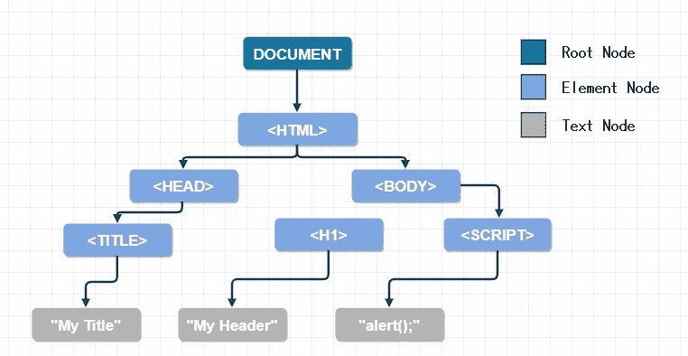
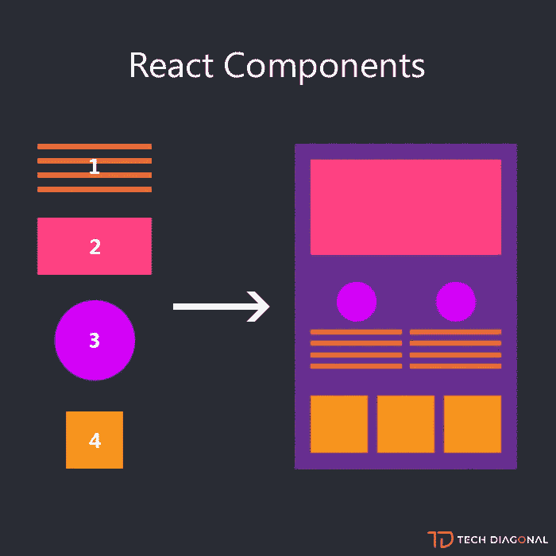
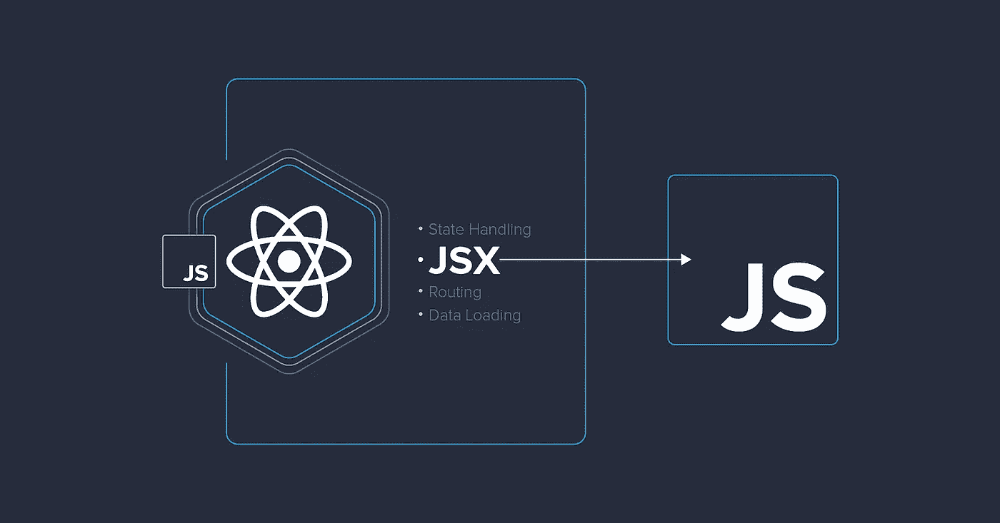
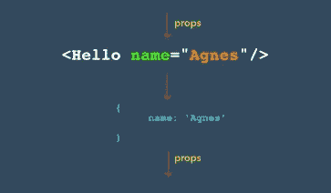
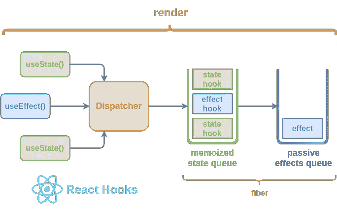
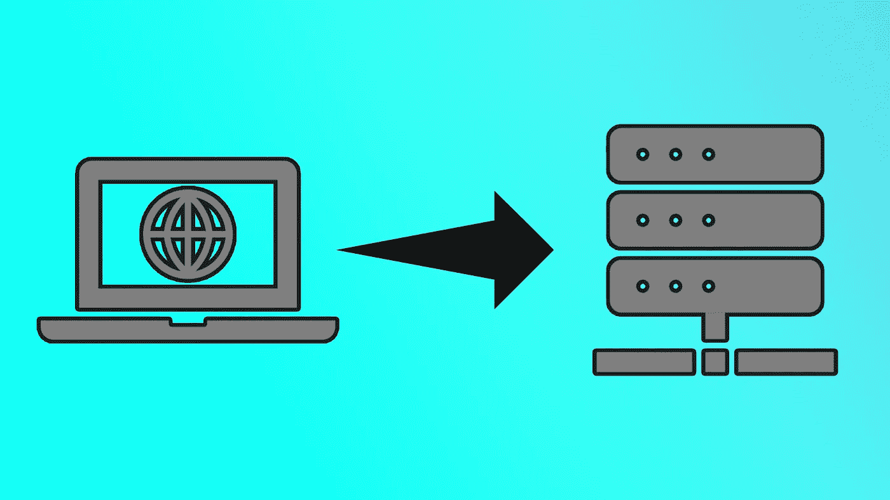

# 反应的 10 个基本事实

> 原文：<https://medium.com/geekculture/10-essential-fact-of-react-a6624842cee5?source=collection_archive---------29----------------------->


React 是前端世界中一个简单、强大、最受欢迎的 Javascript 库。React 使它成为一个不太复杂的 UI 设计，更容易探索和绕过开发人员自己对 DOM 的直接操作。DOM 的快速反应和基于 UI 的语言使得 React 如此受欢迎，以至于开发人员很容易就接受了它，并投入其中。React 基本上是一个交叉的平台，它同时与网络、android 和 ios 兼容。这是以一种好的方式做出反应的时候了

# **虚拟 DOM**

现在是玩 DOM 的时候了，我有一只想成为开发者的宠物猴子，现在他想做一个应用程序，所以这次他不关心 DOM 操作。他只需要更新状态并告诉 React 做什么，剩下的事情就交给 React。重的操作提升 DOM 容易处理的反应。DOM 在内存中管理整个应用程序的虚拟树。当我的猴子因任何事件需要对 DOM 进行任何更改时。它生成一个虚拟树并用另一个树更新。



# 成分

组件就像砖头，你只需要十万块砖头就能砌出一堵墙。组件也类似于此。我们定义小组件，并使它们越来越大，最重要的是组件是可重用的，你可以在这个应用程序的任何地方使用组件。组件只不过是一个可重用的函数，有一些输入参数提供一些输出。在 react 组件中，输入是道具的集合，输出是 UI 的描述。



# JSX

JSX 是一种标记语言，用于表示独立的单个组件或复杂的组件。

在 React 应用中，我们不需要创建 HTML，直接用 HTML 或 Javascript 创建我们自己的元素。JSX 实际上是一个 javascript 扩展。JSX 的创造者想给开发者一个他们习惯的老派工具，JSX 类似于 HTML。
当我们显示图像时，代码如下所示:

```
****
```



我们没有编写 React 组件，而是使用类似 JSX 语法的 HTML，并使用类似 babel 和 typescript 的 transpiler 来翻译成 React.createelement React 组件是一个返回 React 元素的 Javascript 函数。

浏览器不用担心 JSX，react 不用担心编译器，我们把原始的 HTML 和 CSS 推给浏览器

# 小道具



Props 是只读组件，它将一个组件的值传递给另一个组件，就像父组件传递给子组件一样。
HTML 元素被赋予属性的方式，如 id 或 title 元素在呈现时也可以接收属性。

如上所示，Hello 类似于按钮组件，它传递值 name=" Agnes ",另一方面，它可以由另一个组件的 props 接收。名称和值是" Agnes "

# 使用状态

状态组件基本上是一个变化的值语句，比如让我们制作一个按钮组件，响应点击事件，并使它们能够在任何人按下加号按钮时计数。

```
import React, { useState } from 'react';

function Example() {
  // Declare a new state variable, which we'll call "count"  const [count, setCount] = useState(0);
  return (
    <div>
      <p>You clicked {count} times</p>
      <button onClick={() => setCount(count + 1)}>
        Click me
      </button>
    </div>
  );
} 
```

你可以声明一个状态来改变值或者你可以为 set 和 setCount 设置它来完成目标…

# 钩

React 组件中的钩子被称为特殊函数，钩子函数以单词“use”开头，它们中的一些用来为功能组件提供状态元素，如 useState、use effect。



上图用一种非常简单的方式说明了如何使用 Effect 或 state 调度并连接效果钩子和显示效果
钩子函数可以作为一个功能组件使用。

# 使用效果

useEffect 钩子主要用于从服务器或本地主机获取数据。
useEffect 也是一个可以影响服务器站点获取数据的钩子。



useEffect 请求服务器加载数据，然后您必须通过响应获取数据，并使用 useState 钩子来设置此。

# 道具类型

为了提高性能，reason developer 使用了这个 npm，它的导入非常简单，使用这个 npm:

***npm 安装道具类型***

```
import PropTypes from 'prop-types';

class Greeting extends React.Component {
  render() {
    return (
      <h1>Hello, {this.props.name}</h1>
    );
  }
}

Greeting.propTypes = {
  name: PropTypes.string
};
```

当为某个属性提供了无效值时，控制台区域会显示一条警告。仅在开发模式下检查道具类型
要对组件的道具进行类型检查，您可以分配特殊的道具类型属性