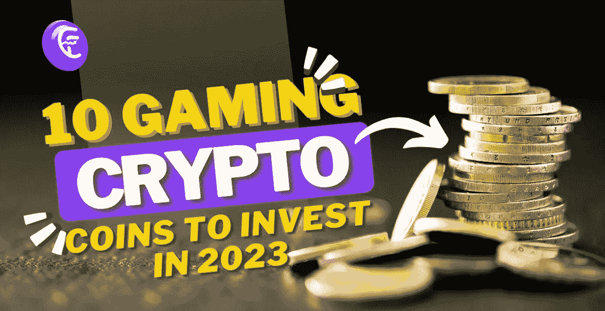
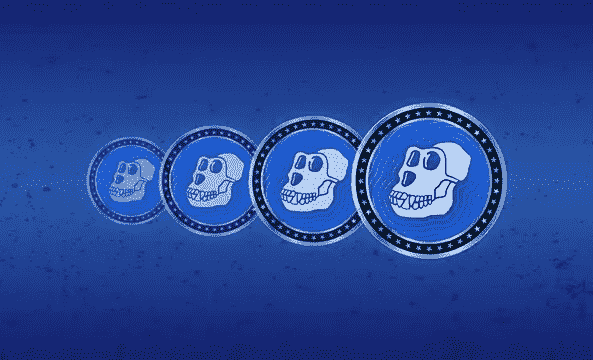
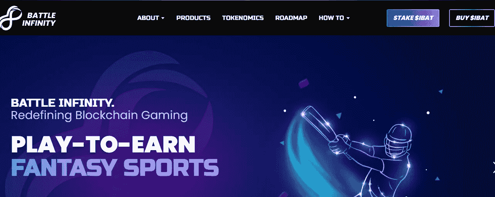
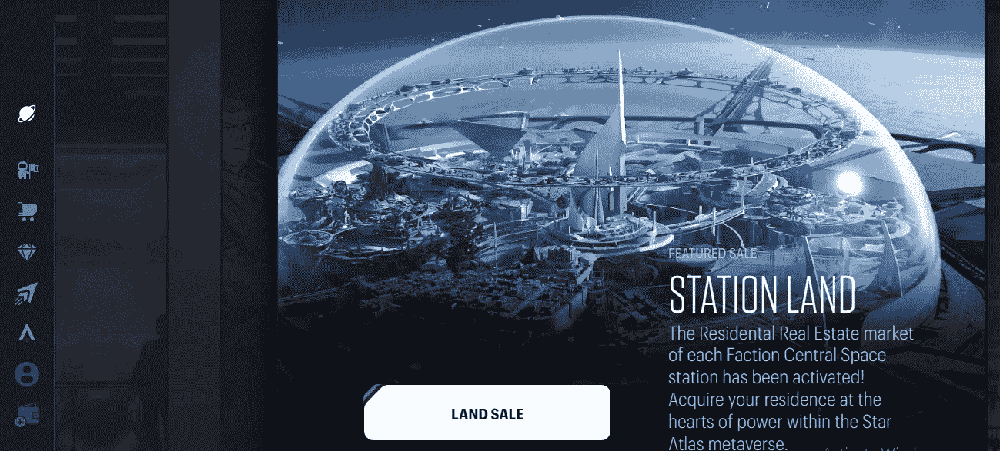
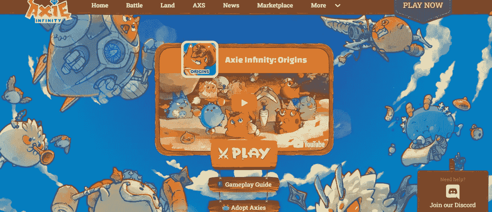
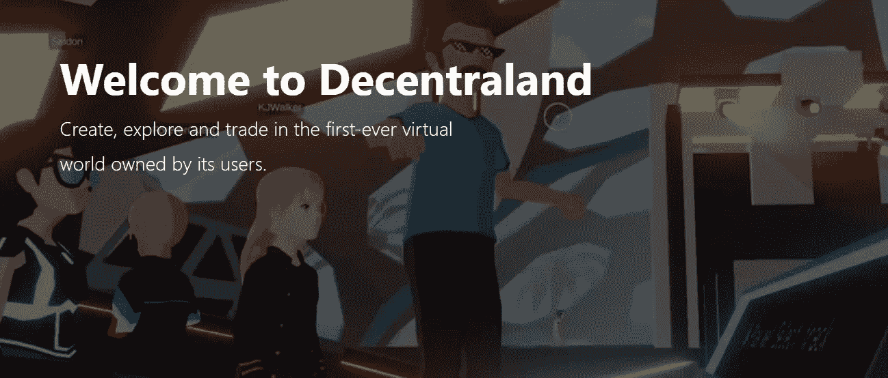
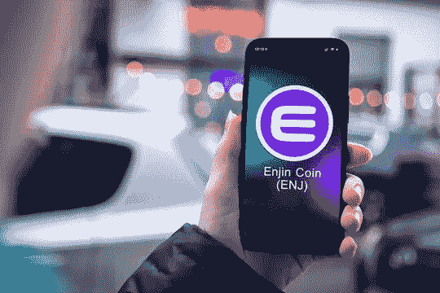
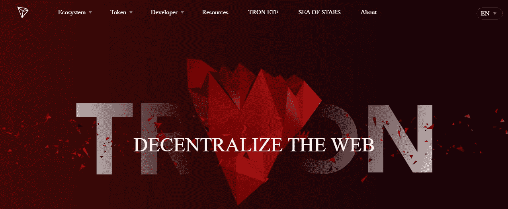
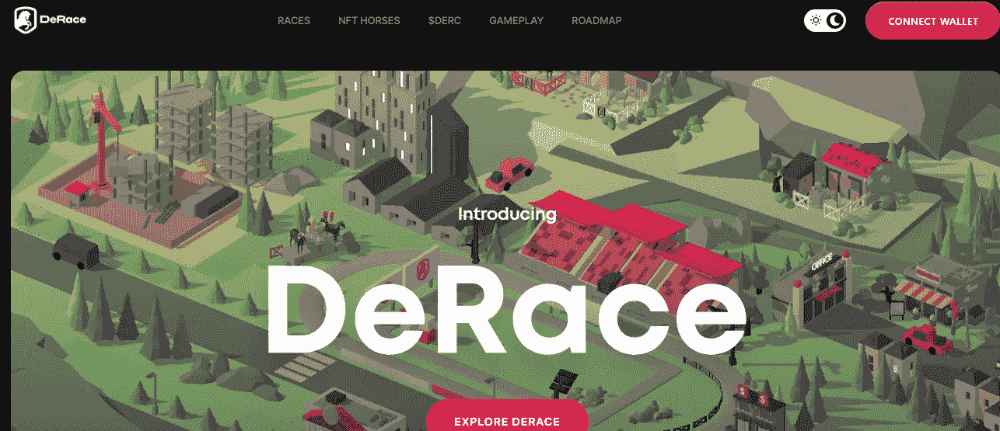
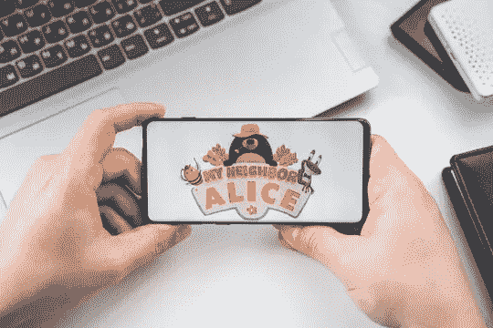

# 2023 年投资 10 个游戏加密硬币

> 原文：<https://medium.com/geekculture/10-gaming-crypto-coins-to-invest-in-2023-bc0ab836af6d?source=collection_archive---------6----------------------->

挑选最好的加密货币选项可能非常具有挑战性，尤其是如果你是初学者，因为已经有超过 10，000 种加密货币可供投资或交易。

最近，Web3 使用区块链取得了进展。投资者正在寻找最好的 GameFi 加密令牌进行交易，因为元宇宙游戏的许多加密项目使玩家能够将他们的体验货币化。

本指南分析了 2023 年十大加密货币游戏项目。

## 2023 年顶级游戏加密硬币！

*以下是一些你可以在 2023 年投资的顶级加密游戏项目:*

## #1.硬币

与 BAYC 联系在一起的一个受欢迎的标志是 ApeCoin。一种名为 ApeCoin (APE)的分散式加密货币是在 Bored Ape 游艇俱乐部(BAYC)生态系统中创建的。就市值而言，由宇迦实验室创建的 BAYC 是 NFT 顶级收藏。在 APE 生态系统中，APE 是一个遵循 ERC 20 标准的治理和实用工具。

由去中心化加密货币 APE 运营的 APE DAO(去中心化自治组织)赋予 ApeCoin 所有者对影响生态系统的问题进行投票的能力。总部位于 NFT 的游戏《彼岸》也将使用硬币。这款 NFT 游戏由宇迦实验室开发；因此，这一消息提高了象征性的价格。

根据[报道](https://decrypt.co/105329/apecoin-surges-22-after-bored-ape-yacht-club-demos-otherside-metaverse)，2022 年 7 月，当一组精选的 BAYC 成员获得另一边游戏演示的独家访问权时，ApeCoin 飙升了 22%。

由于与 BAYC 的联系，ApeCoin 在 2022 年成为顶级 meme 货币之一。2022 年 4 月，代币价格从 7 美元飙升至 39 美元。

## #2.战斗无限

加密货币大战无限——元宇宙与顶级 GameFi 系列。

另一个游戏赚钱平台——战斗无限(IBAT ),提供了一个去中心化的生态系统，在这里游戏可以赚钱。

IBAT 战役掉期是一个由 Battle Infinity 管理的分散式交易所，用户可以通过它买卖 IBAT。通过参加比赛，玩家可以获得 GameFi 机会。

## #3.星图(地图集)

一款名为 Star Atlas 的多人在线游戏在虚拟游戏世界中进行。基于策略的视频游戏融合了几种类型。在这种情况下，玩家必须制定战术行动计划来对付对手。深空探索、战争、建造空间站和宇宙飞船是三个主要的游戏基础。

为了彻底改变以太坊和索拉纳之间的游戏互操作性，Star Atlas 和沙盒联手。ATLAS 是 Star Atlas 发行的代币，被宣传为顶级加密货币游戏代币之一。加密货币 ATLAS 的市值为 3640 万美元，目前交易价格为 0.01 美元。

## #4.无限轴(AXS)

进入加密货币行业的顶级游戏平台之一是 Axie Infinity。这个平台是一个商业和战斗游戏，由区块链提供支持，由其用户运营和部分拥有。

玩家可以在加密货币游戏中购买、收集和交易 Axies 或游戏动物。轴是变体，可以采取多种形式，有 500 多个身体部位可用。

该网络为游戏玩家提供 AXS 代币，现在每枚价值 31.04 美元。Axie Infinity 的市值为 18 亿美元，拥有相当数量的投资者。随着更多投资者加入该平台，这将有助于 AXS 变得稳定。

## #5.分散土地

分散的土地是一个分散的元宇宙，由用户创建、拥有和管理。它建立在区块链以太坊(密码:ETH)之上。像其他虚拟世界一样，它为玩家提供了“土地”地块，让他们购买和使用任何他们喜欢的东西。

玩家在分散游戏中的自由是它与众不同的地方。游戏、艺术品、活动、数字旅游等等都可以在陆地上完成。地区是分散的集中于特定主题的社区。例如，Aetheria，最大的区之一，是以赛博朋克风格设计的。

法力，分散地的原生令牌，用于购买土地等游戏内交易。如果我们说法力目前的市值是 [$571，249，281](https://coinmarketcap.com/currencies/decentraland/) ，你可能不会相信。

## #6.金恩硬币

购买游戏币的另一种方式是使用金恩硬币。它与某个特定的区块链游戏无关。相反，金恩硬币被设计成与各种不同的游戏功能。

创造这枚硬币的组织金恩提供软件开发工具。开发者可以使用这些工具包为他们的区块链游戏制作数字资产，比如游戏中的金钱或独特的商品。玩家可以使用钱包保存与金恩平台相关的游戏清单。

## #7.创

TRON 区块链网络的原生硬币 Tron 结合了坚实的可扩展性、开发人员友好的工具和充满活力的应用生态系统。相比其他加密货币，游戏创作者更喜欢 TRX 是有道理的。

在创区块链上，每秒钟可以便宜地处理多达 2000 笔交易。这使得它成为各种分散应用程序的理想平台，如游戏的 d apps。TRON 因此成为非常受欢迎的游戏代币。

## #8.德拉斯

德莱斯是最有创意的游戏赚取元诗句，因为 DERC，本地令牌，推动育种和报名费。这个新颖的概念可以让你创造具有鲜明特色的 NFT 马，并参与赛马。

除了拥有赛马，DeRace 还在多个社交媒体渠道中拥有广泛的网络，并支持您创建自己的竞技场以产生更多的$DERC。

## #9.爱丽丝

我的邻居爱丽丝是一个多人农业和建筑游戏仍在开发中。玩家可以在六个岛屿上购买土地，培育土地，并在这个动物穿越游戏中从市场上获得动物。

玩家可以通过完成任务获得游戏的原生货币爱丽丝。爱丽丝可以用来在市场上购物。代币持有者可以通过押密码获得奖励。

## #10.STEPN (GMT)

一种尖端的移动赚取加密货币是 STEPN (GMT)。为了增加步数，用户必须购买一双 NFT 运动鞋，然后报告他们每天的慢跑、跑步和散步。通过积累足够的步数，他们最终可以获得 GMT。

STEPN 从几个来源获得资金。该网站通过向用户收取补充能量和通过关卡的费用、出售 NFT 鞋和从 NFT 交易中赚取版税来赚钱。收益是基于 GPS 跟踪的五分钟时间段内的运动量，相当于一个单位的能量，一旦完全耗尽，会随着时间的推移慢慢补充。

## 结束了！

如果 [**投资游戏币**](https://coinfantasy.io/?utm_source=Medium&utm_medium=blog&utm_campaign=Narmatha) s 是你感兴趣的事情，上面的列表是为你精心策划的。它提供了 2023 年顶级游戏相关加密货币硬币的信息，以及你需要了解的硬币信息。

在我们看来，它们是 2023 年最值得购买的游戏加密硬币。他们在过去都表现出色，但更重要的是，预计他们将很快表现出非凡的成就。我们认为它们是目前投资的最佳游戏加密硬币，因为我们预计它们将极大地扩大投资者的范围。