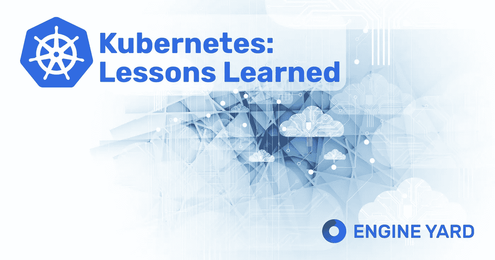
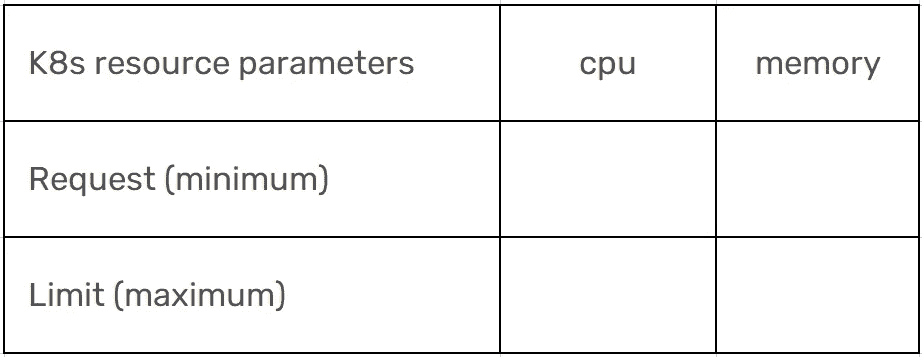
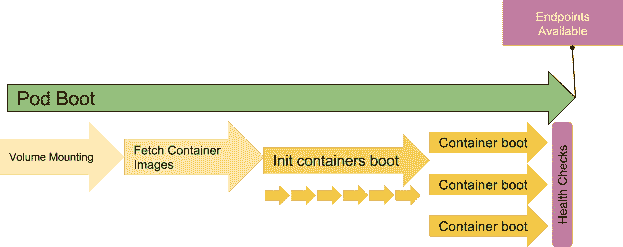
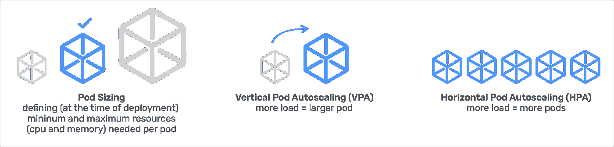

# 在 Kubernetes 上建造 Engine Yard 集装箱平台的 10 个经验教训

> 原文：<https://medium.com/geekculture/10-lessons-learned-from-uilding-engine-yards-container-platform-on-kubernetes-e60cd8cc4440?source=collection_archive---------15----------------------->

Kubernetes 上的容器是在云中部署、管理和扩展应用程序的现代方式。在 Engine Yard，我们一直在开发一些产品，让开发人员可以轻松地在云中部署应用程序，而无需开发云专业知识——换句话说，我们一直在帮助开发人员专注于他们的应用程序；而不是围绕部署、管理和扩展的管道。2021 年初，我们在 Engine Yard 上发布了容器支持(称为 Engine Yard Kontainers，简称 EYK)。我们花了一年多的时间来设计和构建这个产品。很乐意分享我们在这个过程中学到的经验。

Kubernetes lessons learned while building Engine Yard’s container platform

**Kubernetes 就是要走的路:**

> Kubernetes(也称为 K8s)是现代应用程序部署中最棒的东西，尤其是在云上。这是毫无疑问的。

部署 Kubernetes 的一些好处包括提高工程生产率、更快地交付应用程序和可扩展的基础设施。以前每年部署 1-2 个版本的团队可以使用 Kubernetes 每月部署多次！想想“敏捷性”和更快的上市时间。

**库伯内特很复杂:**

好的。那是保守的说法。Kubernetes 非常复杂。这里有一个视觉类比，来说明在期望和现实中的感觉。

*   开箱即用的 Kubernetes 对任何人来说都是远远不够的。指标、日志、服务发现、分布式跟踪、配置和自动扩展都是您的团队需要关注的事情。
*   对于您的团队来说，Kubernetes 有一个陡峭的学习曲线。
*   在 Kubernetes 建立关系网很难。
*   操作和调优 Kubernetes 集群占用了您的团队大量开发时间。

鉴于 Kubernetes 的巨大优势和所涉及的复杂性，选择托管的 Kubernetes 服务几乎总是有益的。请记住——并非所有的托管 Kubernetes 服务都是平等的——我们稍后会谈到这一点。尽管如此，不管你选择 Kubernetes 服务，我们在下面学到的这些经验都是有用的。

以下是 10 课的清单:

1.  了解 Kubernetes 的最新发布
2.  设置资源限制
3.  注意吊舱开始时间
4.  仅有 AWS 负载平衡器是不够的
5.  设置自己的日志记录
6.  设置您自己的监控
7.  正确地调整大小和比例
8.  并非所有受管理的库伯内特人都是平等的
9.  设置工作流以轻松部署和管理应用程序
10.  集装箱化没有你想象的那么难

## #1 了解 Kubernetes 的最新发布

Kubernetes 发展迅速，发布迅速。确保你有一个计划来跟上 Kubernetes 的发布。这将非常耗时，可能会偶尔停机，但请做好升级 Kubernetes 集群的准备。

只要您不更改应用程序的容器映像，Kubernetes 版本本身可能不会对您的应用程序进行大的更改，但是当您升级 Kubernetes 时，集群配置和应用程序管理可能需要更改。

对于 Engine Yard，我们做了以下几件事:

*   针对集群升级和更新进行规划，无需更改应用程序代码，应用程序停机时间最短
*   创建了一个测试计划，每次集群升级或更新时我们都会执行该计划，以确保我们解决了集群管理的所有问题
*   设计产品以运行多个版本的 Kubernetes 集群。我们不想运行多个版本，因为工作量很大，但我们知道我们最终会遇到这样的情况，我们将被迫离开某个特定版本而不进行升级，因为该版本可能会破坏几个客户的应用程序。

## #2 设置资源限制

Kubernetes 旨在应用程序之间共享资源。资源限制定义了应用程序之间如何共享资源。Kubernetes 不提供现成的默认资源限制。这意味着，除非您明确定义限制，否则您的容器可能会消耗无限的 CPU 和内存。

Kubernetes Resource Limits

这些限制有助于 K8s 进行正确的协调— (a) K8s 调度程序为 pod 选择正确的节点(b)限制最大资源分配以避免嘈杂的邻居问题(c)基于资源限制和可用节点容量定义 pod 抢占行为。

以下是对四个资源参数的简要描述:

1.  cpu requested 请求的最小 cpu。K8s 保留此 CPU，即使 pod 没有使用所有请求的 CPU，也不能被其他 pod 使用。
2.  cpu . limit——如果一个 pod 达到为它设置的 CPU 限制，Kubernetes 将对它进行节流，防止它超过限制，但它不会被终止
3.  memory requested 请求的最小内存。K8s 保留此内存，即使 pod 没有使用所有请求的 CPU，也不能被其他 pod 使用。
4.  memory.limit —如果 pod 超过其内存限制，它将被终止

还有其他一些高级概念，比如 ResourceQuota，可以帮助您在名称空间级别设置资源限制，但是一定要至少设置上面列出的这四个参数。

对于 Engine Yard，以下是我们设置资源限制的方式:

1.  我们将这些限制简化为一个称为优化容器单元(OCU)的指标，它等于 1GB 的 RAM 和相应的 CPU。开发者只需要决定焦点的数量(垂直缩放)和容器的数量(水平缩放)。
2.  我们根据 OCU 自动设置和调整 Kubernetes 资源限制
3.  我们开发了一个预测性扩展系统，该系统考虑了资源限制(通过焦点)和使用模式——稍后将详细介绍

## #3 注意 pod 开始时间

无论您的应用程序是标准应用程序、无服务器应用程序还是遵循微服务架构的应用程序，您都需要注意 pod 启动时间。托管 K8s 平台承诺 pod 可用性约为 2 秒，但在启动和运行您的应用程序容器时，这与现实相去甚远——总时间(包括 pod 可用性、提取 docker 映像、启动应用程序等。)可能需要几分钟的时间才能让您的应用程序可用。

Steps involved in pod booting — [courtesy Colt McAnlis](/google-cloud/profiling-gke-startup-time-9052d81e0052)

最好的办法是测试您的应用程序的启动时间，并调整 K8s 配置、docker 映像大小和节点可用性等基础设施。

带发动机场:

1.  我们提供了标准的“应用程序堆栈”,这些堆栈针对特定的运行时环境进行了调整，例如“Ruby v6 堆栈”。这使我们能够调整这些应用程序堆栈，以实现更快的启动时间和卓越的性能。
2.  节点可用性是影响 pod 启动时间的最大因素。我们构建了一个预测性的扩展算法，可以提前扩展底层节点。

## #4 AWS 负载平衡器本身是不够的

Engine Yard 运行在亚马逊网络服务(AWS)上。对于我们的每个 EYK 私有集群，都有一个底层的 AWS EKS 集群和一个相应的弹性负载平衡器(ELB)。我们从经验中了解到，由于 ELB 附带的配置选项有限，仅有 AWS ELB 是不够的。一个关键的限制是它不能处理多个 vhosts。

除了 ELB，你可以使用 HAProxy 或者 NGINX 来解决这个问题。您也可以只使用 HAProxy 或 NGINX(没有 ELB ),但您必须在 DNS 级别上处理动态 AWS IP 地址。

带发动机场:

*   除了弹性 Kubernetes 服务(EKS)集群中的标准 ELB 之外，我们还配置了一个基于 NGINX 的负载平衡器。
*   我们通常更喜欢使用 AWS 托管服务，因为这些服务需要更少的配置就可以更好地扩展，但在这种情况下，ELB 的限制迫使我们使用非托管组件(NGINX)。
*   当您将 NGINX 设置为第二个负载均衡器时，不要忘记配置 NGINX 的自动扩展功能——如果不这样做，NGINX 将成为您扩展应用程序流量的瓶颈。

## #5 设置自己的日志记录

当您在 Kubernetes 上部署应用程序时，这些应用程序运行在一个分布式和容器化的环境中。实现日志聚合对于理解应用程序行为至关重要。Kubernetes 没有提供现成的集中式日志解决方案，但是它提供了实现这种功能所需的所有基本资源。

对于发动机场，我们使用 EFK 进行伐木:

*   我们使用 Fluent Bit 进行分布式日志收集
*   Fluent Bit 将数据聚合到 Elasticsearch 中
*   Kibana 帮助你分析聚集到 Elasticsearch 中的日志

## #6 设置您自己的监控

监控您的应用程序和集群非常重要。Kubernetes 没有开箱即用的内置监控功能。

对于发动机场，我们使用:

*   度量和警报的普罗米修斯
*   Grafana 用于度量可视化

## #7 调整大小和比例

有两种——可能有三种——扩展 K8s 集群的方式。

1.  聚类自动缩放
2.  垂直大小调整和缩放:(a)单元大小调整(b)垂直单元自动缩放
3.  水平 Pod 自动缩放

这些有点棘手，但理解并正确配置它们很重要。

**集群自动缩放器**自动增加或减少集群中的节点数量。在 Kubernetes 中，节点是一个工作机。如果计划执行 pods，Kubernetes Autoscaler 可以增加集群中的节点数量，以避免资源短缺。它还会释放空闲节点，以保持集群处于最佳大小。

向上扩展是一项时间敏感的操作。扩展您的单元和集群所需的平均时间可能是 4 到 12 分钟。

Scaling in Kubernetes: Pod Sizing, Vertical Pod Autoscaling and Horizontal Autoscaling

**pod 规模估算**是在部署时定义您的 Pod 所需的资源量(cpu 和内存)(如果每个容器中有 1 个 Pod，则等于容器的大小)的过程。

正如我们在资源限制中所讨论的，您将使用(1)最小 cpu (2)最大 cpu (3)最小内存(4)最大内存来定义 pod 大小。

最重要的是确保您的 pod 不会小于最低工作负载所需的容量。如果太小，您将不能服务任何流量，因为您的应用程序可能会出现内存不足的错误。如果它太大，您将浪费资源—您最好启用水平扩展。

正确的 pod 大小大约是[最小+ 20%]。然后，您可以对 pod 大小应用水平缩放。

**垂直 pod 自动缩放(VPA)** 允许您根据负载动态调整 Pod 的大小。然而，这并不是 K8s 中自然或常见的扩展方式，因为限制很少。

*   VPA 破坏一个 pod 并重新创建它来垂直自动缩放它。由于 VPA 的中断，这违背了扩大规模的目的
*   您不能将它与水平窗格自动缩放一起使用，通常情况下，水平窗格自动缩放更有益

**水平机架自动缩放(HPA)** 允许您根据负载以预定义的机架尺寸缩放机架数量。HPA 是在 K8s 中扩展应用程序的自然方式。成功的 HPA 需要考虑两个重要因素:

1.  调整 pod 的大小—如果 pod 太小，pod 可能会出现故障，当这种情况发生时，无论水平扩展多少都没有关系。
2.  选择正确的扩展指标— (a)平均 CPU 利用率和(b)平均内存利用率是最常见的指标，但是您也可以使用自定义指标

对于发动机场，我们使用:

*   Engine Yard 为其客户管理集群自动扩展，我们使用定制的*预测集群扩展*来最大限度地减少扩展您的 pod 所需的时间。
*   每个应用程序以 1GB 内存的增量配置其 pod 大小(我们称这些优化的容器单元为 OCU ),这允许细粒度的控制，同时使调整 pod 变得更简单。
*   我们不鼓励垂直 Pod 自动缩放
*   我们完全支持并为我们的客户管理水平 Pod 自动扩展，包括(a)基于 cpu、内存的扩展和(b)基于自定义指标的扩展

## #8 并非所有受管理的 Kubernetes 都是平等的

市场上有几种声称是“托管 Kubernetes”服务的产品。您真正需要了解的是其中每一项提供的托管服务的级别。换句话说，服务为您管理的内容和您自己需要管理的内容。

例如，AWS Elastic Kubernetes Service(EKS)和 Google Kubernetes Engine (GKE)将自己定位为托管 Kubernetes 服务，但是如果没有内部 DevOps 专业知识，您就无法管理这些 K8s 集群。

带发动机场:

*   我们将 EYK 产品设计为 NoOps 平台即服务(PaaS ),让我们的客户可以专注于他们的应用程序，而不需要内部的 DevOps 专业知识。我们的客户只需要使用 *git push* 将他们的代码部署到 EYK，平台会处理剩下的事情。
*   我们还提供卓越的支持(Engine Yard 一直都是这样做的),让客户永远不必担心“运营”

## #9 设置工作流以轻松部署和管理应用程序

如果您不能轻松、持续地将应用程序部署到集群，那么集群还有什么价值？描述应用程序、配置服务、配置入口、设置配置映射等。为每个应用程序进行设置可能会非常困难。确保有一个工作流流程/系统来管理部署在 K8s 集群上的应用程序的生命周期。

带发动机场:

*   我们向 Kubernetes 集群添加了一个开发人员友好的层。这一层使得通过 git push 从源代码部署应用程序、配置应用程序、创建和回滚版本、管理域名和 SSL 证书、提供路由以及与团队共享应用程序变得容易。
*   开发人员可以通过基于 web 的 UI 和 CLI 访问他们的集群和应用程序。

## 集装箱化没有你想象的那么难

为了在 Kubernetes 上运行您的应用程序，您确实需要将它容器化，从头开始容器化是很困难的。好消息是，您不一定需要从头开始集装箱化。您可以从预构建的容器映像开始，并对其进行定制。从 Docker Hub、GitHub Container Registry 等公共容器注册中心开始，寻找合适的映像开始。

带发动机场:

*   我们创建“应用程序堆栈”,这是预构建的容器映像，适合最常见的应用程序模式。
*   根据您的存储库中的代码，Engine Yard 通常能够为您的应用推荐合适的应用堆栈。
*   构建“应用程序堆栈”的另一个好处是，我们可以调整这些堆栈，以获得更快的启动时间、更好的性能和更大的可扩展性。
*   容器化，特别是当你的团队不具备 DevOps 专业知识时，尽管有所有的指导，仍然会很困难。这就是我们的支持团队在流程中帮助客户的原因。

还有一件事！当您设置 Kubernetes 和组件时，最好使用 Terraform 脚本和 Helm charts 来完成，这样您就可以在任何需要的时候重现集群(通过再次运行这些脚本)。

享受 Kubernetes 和容器的所有好处！

*最初发表于*[*【https://blog.engineyard.com】*](https://blog.engineyard.com/10-lessons-learned-from-building-engine-yards-container-platform-on-kubernetes)*。*