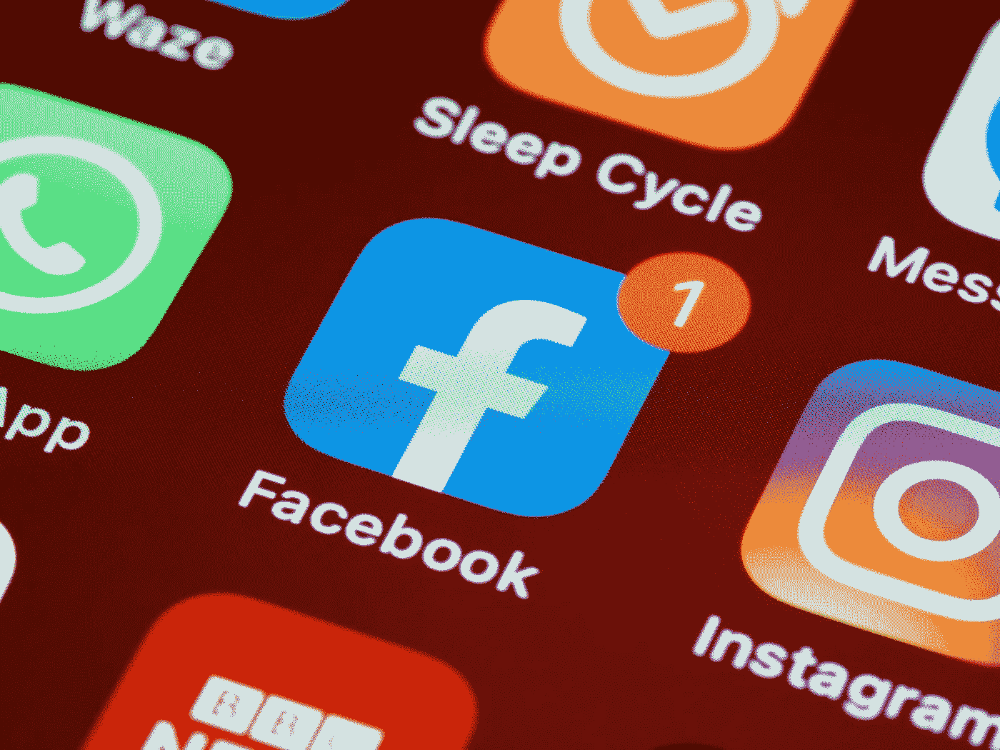

# 2021 年最受欢迎的创业公司的 10 个移动应用类别

> 原文：<https://medium.com/geekculture/10-mobile-app-categories-for-most-popular-startups-in-2021-43997718d1e7?source=collection_archive---------22----------------------->

# 介绍

随着冠状病毒疫情在 2020 年的传播，企业仍在寻找方法来应对消费者的流失以及趋势和消费者行为的普遍变化。灵活和创新的公司一直欣欣向荣，而僵化的公司却一直亏损和衰落。尽管酒店、旅游和零售等几个行业需要一些时间来恢复正常状态，但在家工作、游戏、视频流和电子商务等其他几个行业已经变得非常庞大。他们已经成为疫情时代的救星，所有这些行业的移动应用都在蓬勃发展。

这篇博客重点介绍了 10 大移动应用类别，它们可能会在柯维德·疫情时代幸存下来，并取得胜利。这些移动应用程序越来越受欢迎，并通过减少焦虑来帮助人们变得更加强大和精神稳定。如果你有一个**移动应用开发机构，**这些类别是你可以研究的。

# 将提升您业务的移动应用类别

# 卫生保健

人们被困在家里无事可做，在这个过程中，许多人倾向于忽视他们的身心健康。由于严重缺乏身体运动，像健身应用程序、医疗保健应用程序、冥想和减压以及心理健康应用程序这样的医疗保健应用程序正在以他们的方式帮助人们度过疫情。

# 在线教育

如此多的学生被困在家里，学校和大学因为疫情而关闭。然而，教室的数字化是近几个月来几乎所有人都看到的事情。由于这种数字化，像谷歌教室和安全教室这样的应用程序已经成为新常态。

# 家居装修应用

人们花在家里的时间越来越多，这就是为什么帮助人们装修用品、家居装修和其他家居配件开发的应用程序蓬勃发展的原因。人们试图通过使用这些应用程序让他们的地方变得更加舒适、实用和有吸引力。

# 食品配送

为了遏制疫情病毒的传播，餐馆和咖啡馆纷纷关闭，让人们将食物送到家中的应用程序变得流行起来。无法供应食物的餐馆和其他小吃店已经转而将包装好的食物送到家中。这些应用程序已经成为许多呆在家里不知道如何做饭或已被隔离的人的日常使用必需品。

# 社会化媒体

人民和政府一直在推行社会距离的规范。由于人们呆在家里，没有办法与朋友进行物理联系，人们已经转向 Instagram、Twitter、脸书和 WhatsApp 等社交媒体应用程序，以与家人、朋友和社区保持联系。最近，自疫情传播以来，这些应用的日活跃用户数量出现了大幅增长。人们在社交媒体上越来越投入，因为现在每个人都比以往任何时候都更多地发布、分享和与其他人聊天。

# 电子学习应用

一些人试图让他们在家里的时间更有成效，并试图在空闲时间学习新的学术知识来磨练自己。因此，在 COVID 期间，移动应用程序的电子学习部门变得非常受欢迎。像 Duolingo 这样的在线语言掌握应用程序在 2020 年 3 月在美国经历了 150%的净增长。

# 娱乐

减少人们的厌倦感是他们与没有朋友和被困在家里几个月有关的事情。因此，像 Snapchat、Spotify、YouTube 和网飞这样的移动娱乐应用已经变得非常庞大。他们提供视频和其他内容供人们无聊时消费。无聊透顶，需要一些东西来刺激他们的大脑和思维。

# 食品

人们被困在家里，但他们需要吃饭。对于没有选择或资源每天点菜的人来说，购买食品杂货是不可避免的。但是不出门怎么可能呢？杂货应用。这些应用程序用于将食品杂货送到人们的家中，并且可以通过应用程序下单。

# 金融科技

不稳定的经济和市场的不可预测性促使人们非常谨慎地投资和消费，使得金融科技应用程序不断增加。这些应用程序为人们提供了关于金融和金钱的日常知识，他们可以用这些知识来指导自己做出更好的金融决策。

# 约会

在疫情传播后，约会应用的下载率大幅飙升。由于人们无法认识其他人，他们通过视频电话与网上认识的人进行网上约会和聚会。

# 结论

以下是一些在 COVID 时代变得流行的移动应用类别，它们可以塑造世界各地数百万人的后 COVID 生活。对于**移动应用开发服务，**这些类别是你应该关注并尝试创新的。