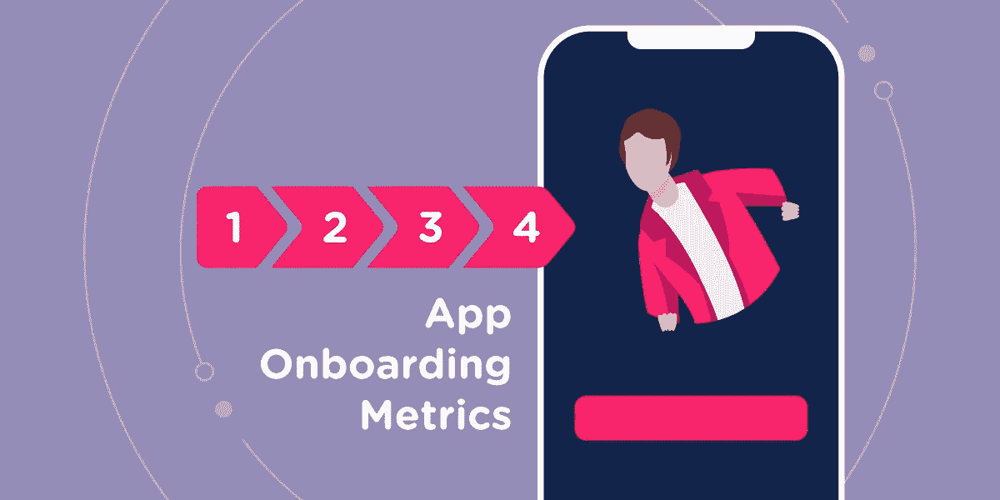
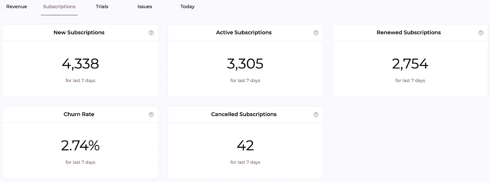

# 您应该跟踪的 10 个移动用户入职指标

> 原文：<https://medium.com/geekculture/10-mobile-user-onboarding-metrics-that-you-should-track-650c3076baa1?source=collection_archive---------13----------------------->

[Mobile User Onboarding Metrics](https://www.appflow.ai/blog/10-app-user-onboarding-metrics-that-you-should-track)

移动应用程序用户入门是在用户第一次打开应用程序时向他们介绍你的应用程序功能的过程，也是给你的移动用户留下的第一印象。通常，用户下载该应用程序是为了获得一些功能。因此，如果他们在短时间内看不到应用程序的价值，他们会很容易[跳槽去寻找另一个替代品](https://www.appflow.ai/blog/churn-for-subscription-apps)。为了达到用户的啊哈时刻并更快地加入他们，整个应用团队做出了更多的努力。那么，问题来了:如何衡量 app 用户入职的有效性？继续寻找答案。

# 十大应用用户入职指标

根据应用公司的目标和他们所处的领域，不同的应用公司可能有一些独特的用户入职指标。但是，无论你的应用程序处于哪个行业，你都应该跟踪以下指标，以深入了解入职流程的效率。

## 价值实现时间(TTV)

价值实现时间是指用户感知应用价值所需的时间。一个道理是，通常情况下，用户的时间和耐心是有限的，所以当用户第一次下载并启动 app 时，就迫切需要通过 onboarding 流程向他们展示 app 的价值。只有当用户发现应用程序可以解决他们的问题时，用户才会采取下一步行动。理论上，TTV 越短，应用用户入职越成功。

## **完成入职的时间**

完成时间是指用户在没有太多指导的情况下独立使用应用程序之前完成入职流程所花费的时间。应用程序用户入职流程旨在教育用户如何正确使用应用程序，以及应用程序如何帮助他们解决问题或改善生活。如果完成入职培训的时间比你想象的要长，你必须重新考虑入职培训流程，因为这可能会给用户带来一些你之前没有注意到的摩擦。找出实际原因，采取针对性措施。试图缩短用户完成入职流程的时间，会带来更多潜在的长期用户。

## 完成率

完成率是完成入职流程的用户的百分比。请记住，那些没有完成入职流程的人很可能不会转变。因此，如果完成率相当低，您应该找出用户经常退出的步骤或特定过程。通过删除不必要的步骤，甚至修复技术问题，尝试使流程更加顺畅。一个令人惊讶的例子是，完成率低的原因是用户在注册时无法收到验证码。

## 用户支持请求率

用户支持请求率是用户从注册到实现应用价值期间所提问题的百分比。在入职过程中，应用程序开发人员、设计人员和营销人员都在尽力确保用户的入职体验顺利而成功。然而，有时候我们认为的事情并没有真正发生。数据总是能说明事实:入职流程中较低的用户支持请求率保证了入职流程的真正效率。

## 应用功能采用率

应用程序功能采用率衡量应用程序中实际使用某个功能的用户的百分比。一个应用程序的设计特点是可以帮助用户解决他们的问题。如果 app 功能采用率低，说明用户没有在使用该功能。原因可能是该功能很难使用，或者用户没有这个需求。前一个问题应该通过优化特征利用来解决。而后者的原因可能是错误的——目标市场营销渠道。

## 激活率

激活率衡量的是达到激活点的用户的百分比，这是转化的重要因素。每个应用程序都有独特的激活点，例如，当用户上传他们的照片时，照片编辑应用程序就会有一个激活点。识别应用中的关键激活点并开始跟踪激活率，将对衡量应用用户加入的有效性产生意想不到的影响。

## 订婚率

参与率是在特定时间段内使用过该应用的用户的百分比。参与度可以用时间、营销渠道、特色来衡量。高参与度是成功的应用程序用户入职流程的关键结果之一。

## 免费试用兑换率

免费试用转换率，也称为试用转换率，是免费试用用户在其试用期内成为付费用户的百分比。这是衡量应用程序用户入职流程成功与否的最重要指标。

## 保留率

在用户使用应用程序的整个过程中，应用程序用户入职应该持续进行。留存率显示了在特定时间段内自首次使用该应用程序以来持续使用该应用程序的用户数量。高留存率与入职流程有很大关系，例如在用户为应用付费后提供优质指导或课程。

## 流失率

流失率与留存率相反。它衡量停止使用该应用程序的用户数量。入职流程对于确保用户真正理解产品的价值非常重要。用户流失的最大原因是没有意识到 app 的价值，所以流失率可以作为 app 用户入职有效性的反映。

# 为什么跟踪入职指标很重要？

用户入职(User onboarding)的意义在于与用户互动，引导他们了解应用的功能，并最终到达用户的啊哈时刻，这是用户首次意识到应用价值的时刻。在这些过程中，用户可能会下载应用程序，启动它，然后在几分钟内卸载它。如果我们不跟踪应用程序用户入职指标，这样的行为是不明显的。因此，跟踪这些指标对于[开发应用业务](https://www.appflow.ai/blog/in-app-marketing-guide-in-2022)至关重要。总的来说，跟踪应用程序用户入职指标有助于缩短用户实现价值的时间，确定设置中的摩擦点，测试改进的 UX，并了解用户从注册到宣传的旅程。

# 如何衡量和改善应用用户入职指标

有很多指标可以用来跟踪应用程序用户入职时的表现。然而，当度量不正确时，并非所有的度量都是有效的。以下是衡量应用用户入职指标的四个步骤。

**第一步:定义对你的应用最重要的指标。**每个应用都有独特的功能。除了一些通用的用户入门指标，你应该定义对你的应用程序最重要的指标，比如为游戏应用程序玩游戏，这可能是一个激活点。

**第二步:开始追踪数据。**要求技术团队建立数据库，以跟踪您想要的所有数据。为所有指标设置和定义所有公式和数据将非常耗时。因此，如果资金允许，您可以使用第三方数据跟踪工具来帮助完成这项工作。通常在数据工具开始跟踪之前，将工具 SDK 安装到您的应用程序中是您唯一要做的事情。例如， [appflow.ai](https://www.appflow.ai/) 可以开始跟踪数据，如保留率、流失率、用户漏斗等，当其 SDK 安装到通过订阅赚钱的应用程序中时。

**第三步:分析数据。**查看数据，找出用户入职过程中出现的问题和摩擦。有两个重要的分析方法你应该知道:队列分析和漏斗分析。群组分析帮助你观察用户在不同群体中的行为。漏斗分析有助于更好地了解用户旅程。您可以手动设置群组，并自己找出用户旅程，或者您可以依靠数据分析工具来帮助完成这项工作。对了，上面提到的数据工具 appflow.ai，既可以进行[队列分析](https://www.appflow.ai/blog/5-types-of-app-cohort-analysis)也可以进行漏斗分析。

第四步:认识问题并找出解决方案。跟踪应用用户入职指标的目的是识别问题。当你发现应用程序有问题时，你可以对它进行修改。如果您不确定是否是这个问题，那么先执行 A/B 测试并跟踪数据。最后你会确定到底是哪里出了问题，并找出解决办法。

**第五步:持续跟踪数据，保证 app 用户更好的入职表现。**有时我们从数据中得出的解决方案可能只是一个假设，所以我们需要通过调整和跟踪数据来验证假设。持续优化 app 用户入职流程，确保 app 健康发展。

# 最终想法

应用程序用户入门指标可以提供对用户旅程的洞察，因此您可以识别不明显的问题并修复它们。有许多指标[可以跟踪入职流程的有效性](https://www.appflow.ai/blog/10-app-user-onboarding-metrics-that-you-should-track)。但是一定要选择最适合你 app 的。优化这些指标将对应用业务的发展产生有益的影响。