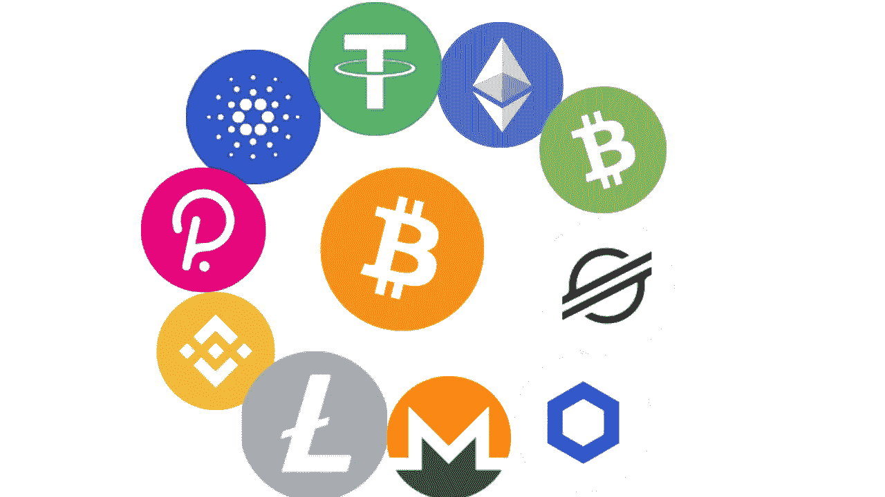

# 比特币之外的 10 种最重要的加密货币。

> 原文：<https://medium.com/geekculture/10-most-important-cryptocurrencies-other-than-bitcoin-6cd174841105?source=collection_archive---------2----------------------->

Photo source: By author

自 2018 年以来，比特币可能是讨论最多的加密货币之一，自 2021 年初[价格飙升以来更是如此。现在似乎每个人都想购买这种密码，以避免错过的恐惧(FOMO)。](https://www.coindesk.com/price/bitcoin/)

下面将让你了解比特币自 2009 年在[问世以来增值了多少。](https://time.com/nextadvisor/investing/cryptocurrency/what-is-bitcoin/#:~:text=Bitcoin%20was%20created%20in%202009,value%20currency%2C%20comparable%20to%20gold.)