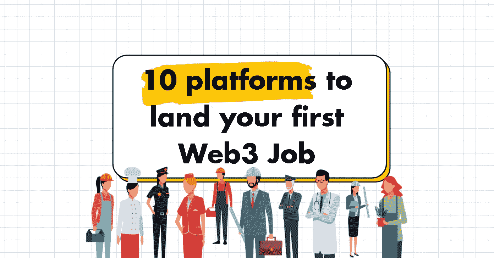
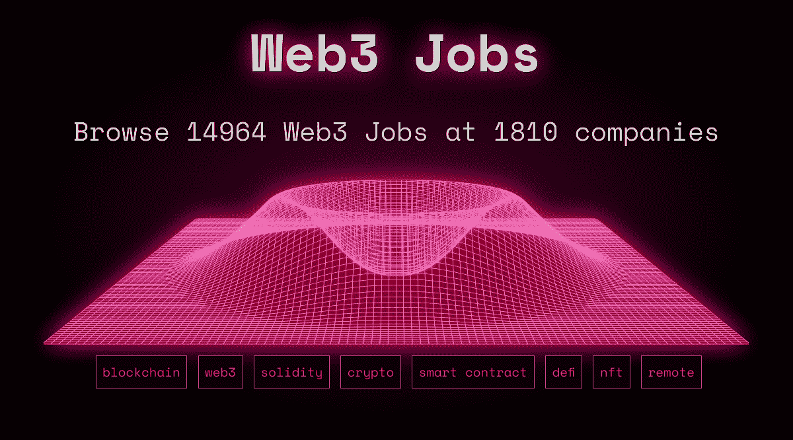
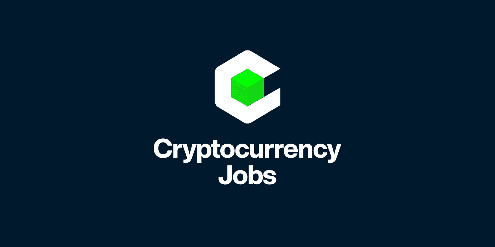
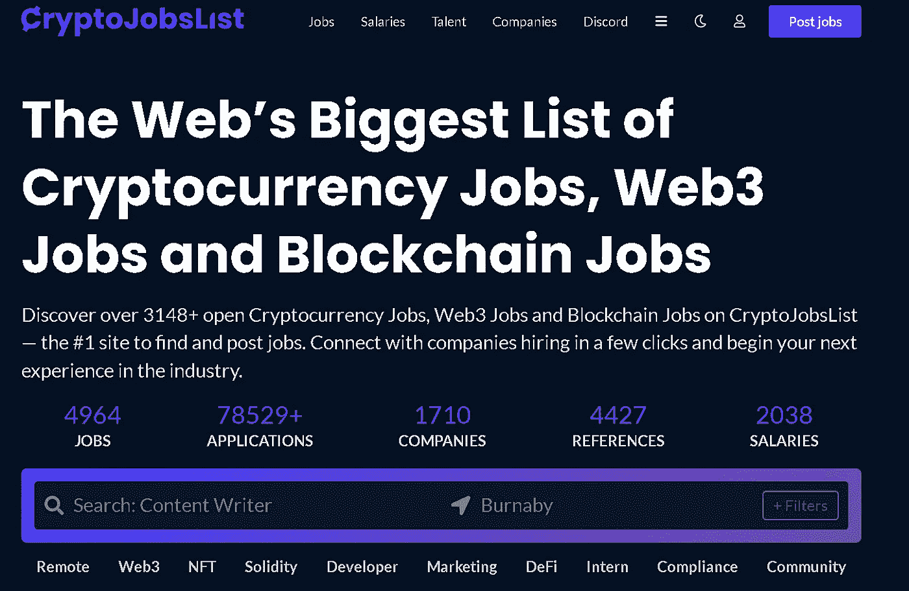
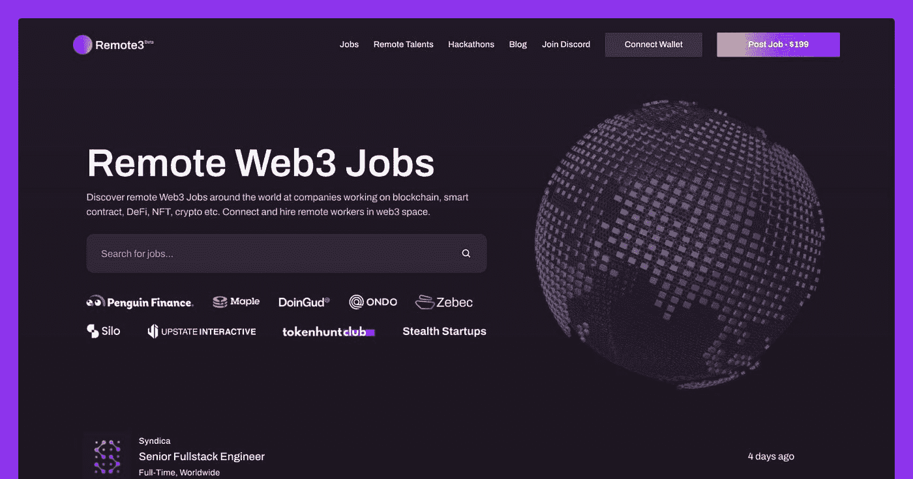
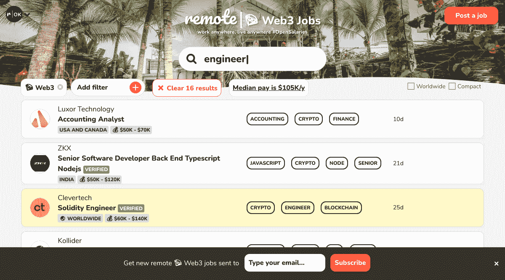
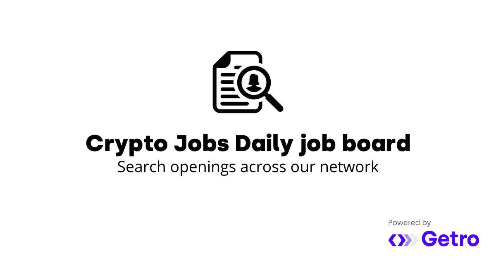
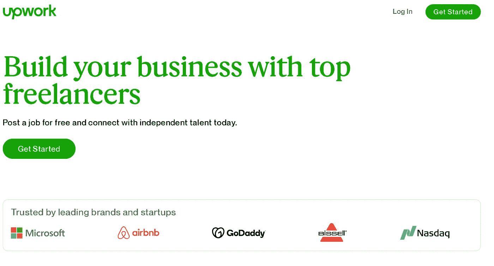

# 获得第一份 Web3 工作的 10 个平台

> 原文：<https://medium.com/geekculture/10-platforms-to-land-your-first-web3-job-9ee629576ae6?source=collection_archive---------1----------------------->

Web3 公司正在疯狂招聘！🔥

By me :)

有很多工作可以做，不仅仅是像 Solidity developer 这样的技术性工作，还有像技术作家、产品经理、营销人员等非技术性工作…

> 这种新的自由职业经济不同于零工经济，因为没有中央集权的公司创造这些工作岗位——从事工作的人拥有最终结果的所有权。“在零工经济中，收入是线性的——大多数人挣的是时薪或零工工资，”利普顿解释道。“在 Web3 中，收入是非线性的，因为自由职业者将拥有部分市场。此外，为 Web3 项目工作的自由职业者可以获得稳定的硬币和代币的组合，这些代币可以提供不封顶的上涨空间。
> 
> ——[来自福布斯](https://www.forbes.com/sites/rebekahbastian/2021/12/22/2022-prediction-the-influence-of-web3-on-the-future-of-work/?sh=65d04cb34ce4)

# 👇获得第一份 web3 工作的 10 个平台

## 1.Web3 职业

你可以在这个网站上找到区块链、Web3 和 Crytpo 领域的顶级公司的大部分内容。过滤系统很有用，响应时间也很快。

[网站](https://web3.career/)

## 2.加密货币工作

主要集中在加密和开发工作，但它肯定是一个很好的起点，开始扩展到 Web3。

[网站](https://cryptocurrencyjobs.co/web3/)

## 3.加密作业列表

我个人广泛使用的一个平台，它展示了详细的工作描述，并显示了他们在 Web3 中发布的工作数量和类型的良好统计数据。

[网站](https://cryptojobslist.com/)

## 4.远程 Web3 作业

在 Web3 的世界里，来自全球各地的团队聚集在一起，远程工作是第一位的，这是一个很好的平台，让 Web3 中的公司远程招聘。

[网站](https://remote3.co/)

## 5.远程正常

虽然不是一个专门的 Web3 工作平台，但 RemoteOk 是一个全球最佳远程工作目录，他们背后有一个伟大的社区。

[网站](https://remoteok.com/remote-web3-jobs)

## 6.每日加密作业

通过每日精选的工作，该平台是在 Web3 中寻找工作的门户，并有助于将您的个人资料与正确的工作相匹配。

[网站](https://careers.cryptojobsdaily.com/jobs)

## 7.使用 Web3 作业

虽然不是一个专门的工作平台，但对于任何想进入 web3 的人来说，useweb3 是必不可少的。他们这里也有很棒的列表。

[网站](https://useweb3.xyz/)

## 8.稀有宝石

虽然不是一个专门的工作平台，一个类似于 Web3 的风投集团，但 Rarestone 在他们的投资组合中拥有很好的职位——必须结帐。

[网站](https://rarestone.capital/)

## 9.加密作业

这里没有什么特别的，只是又一个工作板，做了它承诺要做的事情，只是没有 UI 混乱。这里的帖子几乎肯定可以在其他地方找到，但在这里快速浏览是值得的。

[网站](https://crypto.jobs/)

## 10.向上工作

如果微软和大的领先品牌信任 [Upwork](https://medium.com/u/b38dba53b069?source=post_page-----9ee629576ae6--------------------------------) ，我看没有理由你不能有一个大的自由职业者社区来承担任何项目，即使竞争激烈，考虑到新兴市场，对于 Web3 工作来说，这是一个探索的好地方。

[网站](https://www.upwork.com/hire/landing/?utm_campaign=SEM_GGL_DOMESTIC_Brand_Marketplace_Core_Exact&utm_medium=cpc&utm_content=124555474489&utm_term=upwork&campaignid=12964345678&matchtype=e&device=c&partnerId=Cj0KCQiAjc2QBhDgARIsAMc3SqR488Ro5U2mxquD4YIu9bnrlODs8Z-7SsA7lZaGomHcBBfzpjVQxycaAnVrEALw_wcB&utm_source=google&gclid=Cj0KCQiAjc2QBhDgARIsAMc3SqR488Ro5U2mxquD4YIu9bnrlODs8Z-7SsA7lZaGomHcBBfzpjVQxycaAnVrEALw_wcB)

# 结论

Web3 是一个后发行业，有很多机会让个人以自由职业者或全职管家的身份加入十年来最令人兴奋的创业公司和项目。上面的工作平台是一个起点，但和往常一样，Twitter、Discord 社区和与该领域的人建立关系才是让你得到这份工作的关键！正如我想说的，在 Web3 中你可以完全从零开始做你自己的工作！

## 👇评论你还推荐哪些平台来寻找 Web3 工作

> 👋**在[媒体](/@pooriaarab)—[LinkedIn](https://www.instagram.com/pooria.arab/)—[Twitter](https://twitter.com/pooria_arab)—[insta gram](https://www.instagram.com/pooria.arab/)—[抖音](https://www.tiktok.com/@pooria.arab)**
> 
> 更多关于 Web3，Crypto，NFTs，DeFi 等的好东西…
> 
> 点击获取 NFT 发布战略