# 10 个 Postgresql 命令——值得探索

> 原文：<https://medium.com/geekculture/10-postgresql-commands-worth-explore-c92cbf8c9a93?source=collection_archive---------12----------------------->

PostgreSQL 是一个强大的开源对象关系数据库系统，经过 30 多年的积极开发，它在稳定性、功能健壮性和性能方面享有盛誉。PostgreSQL 用于存储、操作和显示应用程序中的数据。PostgreSQL 被用作许多 web 和移动应用程序的主要数据库。在这里，我要告诉你 10 个 PostgreSQL 命令，它们值得记住，并让你听起来更聪明。这些是-

1.  **\timing:** 在 PostgreSQL 中，timing 是接受布尔值的标志。下面的命令将设置定时标志，因为 **1** 被设置，它将告诉你关于你将执行的每个查询的执行时间。如果您想关闭计时，请在下面的命令中提供' 0 '而不是' 1'。

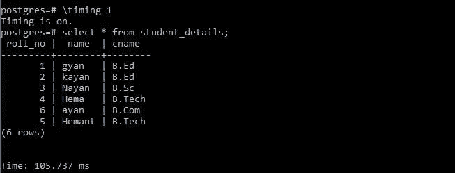

**This is an example of setting a timing flag.**

**2。explain:**explain 命令告诉 PostgreSQL 规划器生成的查询的执行计划。它显示了如何扫描表，无论是顺序扫描还是二进制扫描，还显示了如果查询中有多个表，如何连接表。

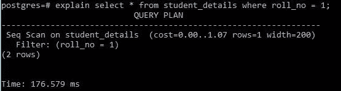

**Syntax: explain (query);**

**3。创建索引:**创建索引命令允许你在表格的列上创建索引，你也可以选择索引方法。默认情况下，PostgreSQL 使用 B 树索引。

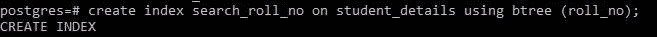

**create an index on the student_details table on the roll_no field.**

**4。复制自/到**假设你有一个记录文件(如 CSV 格式)，你想把它存储在数据库中。Postgresql 提供了一个复制命令，通过该命令可以直接从 CSV 导入数据，也可以使用复制到命令将表格数据导出为 CSV 格式。

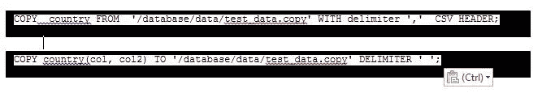

**COPY FROM and COPY TO command**

**5。Pg_dump:** 它在 shell 脚本或 windows 命令提示符下执行，而不是在 psql 命令模式下。pg_dump 命令允许您创建整个数据库的转储，或其模式或部分内容的转储。

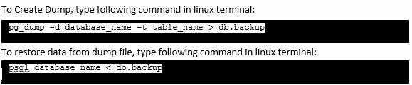

**Command for creating a backup and restoring from backup**

**6。\d table_name** :用于描述给定表名的模式。

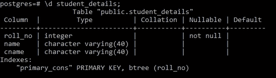

**Syntax: \d student_details**

**7。\c database_name** :如果您想在 psql 命令 shell 中连接到一个不同的数据库，那么可以使用这个命令。

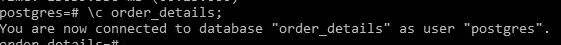

**Syntax: \c database_name**

**8。pg_relation_size:** 在 PostgreSQL 中，我们还可以知道一个表的大小，以字节为单位。

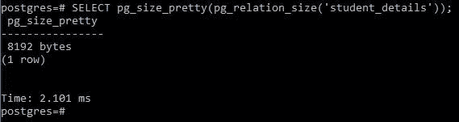

**Syntax: SELECT pg_size_pretty(pg_relation_size(‘table_name’));**

**9。\conninfo:** 该命令显示连接信息。

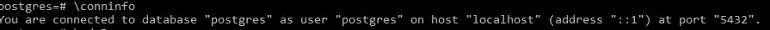

**Syntax: \conninfo**

10。\set: \set 命令显示 PostgreSQL 的内部变量。使用 set 命令，还可以修改 PostgreSQL 的内部变量。

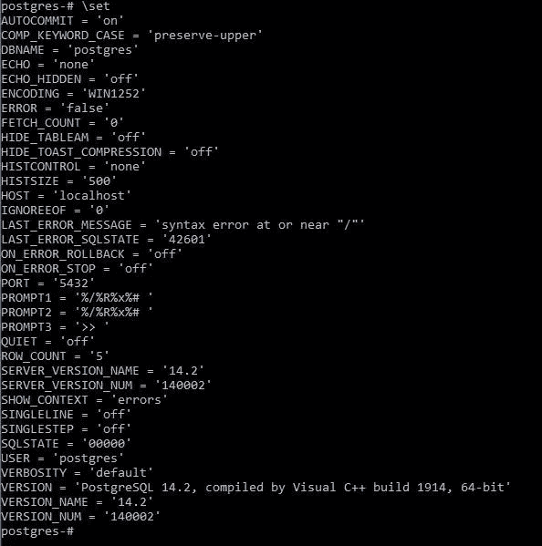

**Syntax: \set**

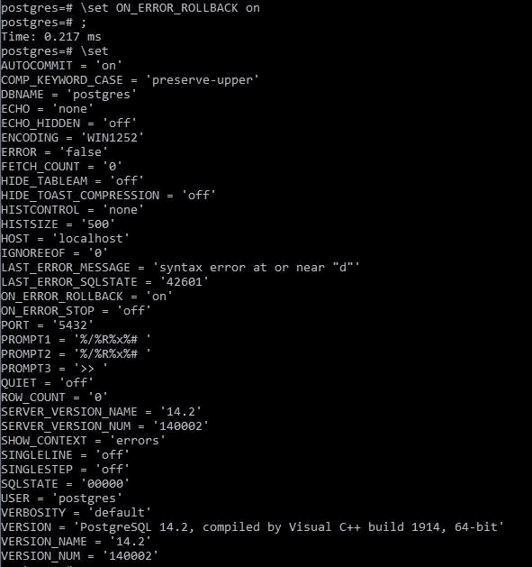

**Syntax: ON_ERROR_ROLLBACK on, for modifying the internal variable.**

这些是一些基本的命令，对开发人员的日常工作非常有帮助。

谢了。