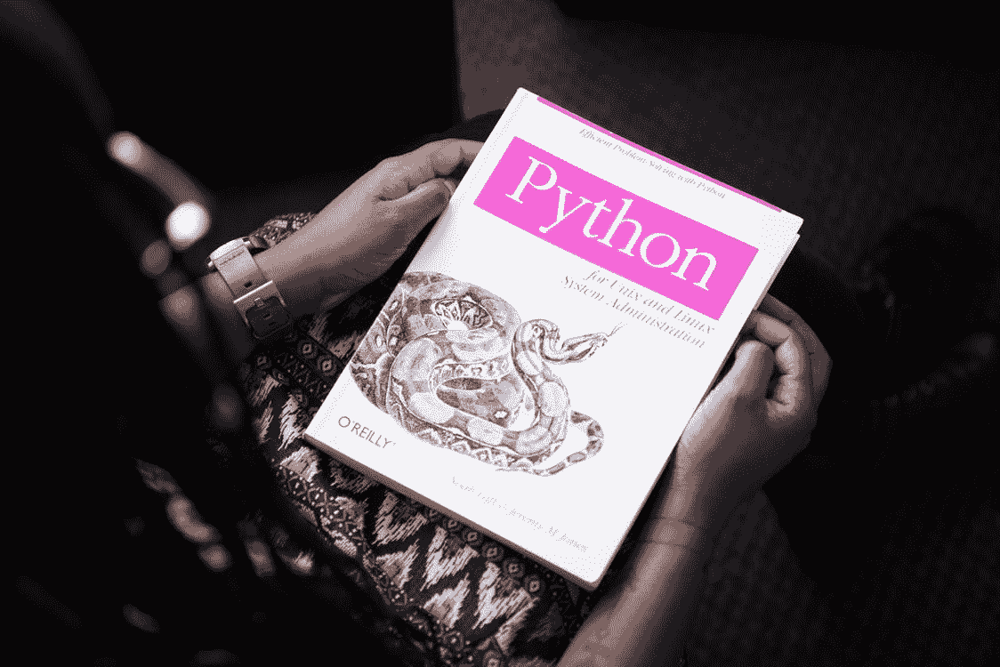

# 10 个 Python Gem 概念和片段，加快您的工作流程

> 原文：<https://medium.com/geekculture/10-python-gem-concepts-and-snippets-to-expedite-your-work-flow-773ee02277ef?source=collection_archive---------14----------------------->

## 保存它们并在需要时使用，而不必在 Stackoverflow 上搜索

Source: Free for use photo from [Pixels](https://www.pexels.com/ko-kr/photo/1181671/)

在这篇文章中，我将向您介绍 10 个 Python gem 概念和片段，这些概念和片段没有被很好地提及，但在我们的日常工作流程中非常有用。

# 1.名称元组