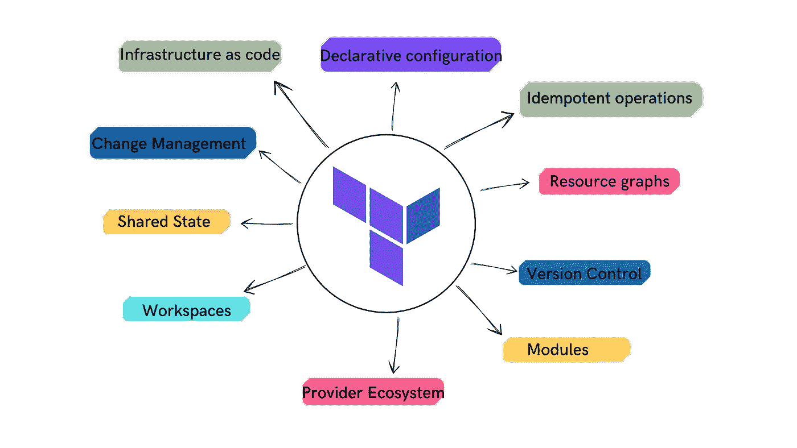

# 使用 Terraform 作为 DevOps 工程师的 10 个理由

> 原文：<https://medium.com/geekculture/10-reasons-to-use-terraform-as-devops-engineer-81d89069ede1?source=collection_archive---------15----------------------->

## Terraform 是 DevOps 工程师实现工作流程自动化的强大工具。

Created by the author using Canva

我以前写过许多与 Terraform 及其工具相关的文章，DevOps 工程师可以使用它们来轻松优化和自动化他们的工作流。