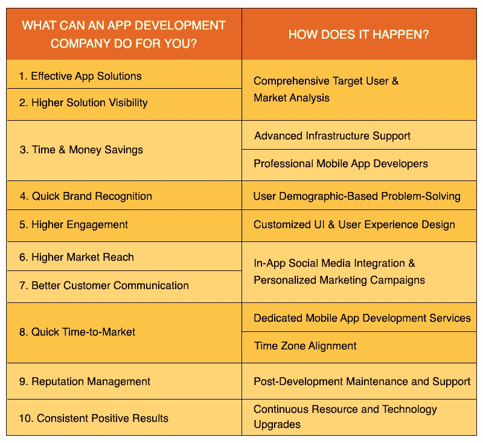

# 你的企业需要移动应用开发公司的 10 个理由

> 原文：<https://medium.com/geekculture/10-reasons-why-your-business-needs-a-mobile-app-development-company-3c3cdc0eb273?source=collection_archive---------15----------------------->

## App 开发公司能为你的企业做些什么？

*app 开发公司都是做什么的？它们能给你的企业带来什么好处？为什么您应该选择外部* [***移动应用程序开发服务***](https://www.suntecindia.com/mobile-app-development-services.html) *提供商，而不是您的内部团队？以下是你的答案！*

移动应用程序是一个公认的收入来源，无论一个企业是大是小，是地方性的还是广泛建立的。《2021 年全球移动应用行业报告》轻松证明了这一点。

*   [价值 3.8 万亿](https://www.data.ai/en/insights/market-data/state-of-mobile-2022/)小时的移动应用使用量
*   2300 亿次新应用下载
*   价值 1700 亿美元的应用商店购买

从这三个数字中，我们至少可以从移动应用开发领域的现状中吸取三个教训——快速增长、巨大的利润潜力和日益激烈的竞争。

在击败竞争对手的同时利用这种增长和利润的一种方法是 [**从第三方应用程序开发公司雇佣专门的移动应用程序开发人员**](https://www.suntecindia.com/hire-mobile-app-developers.html) 。

让我们一个一个来了解一下一个 app 开发公司能为你的企业做些什么。

## 1.有效的应用解决方案

一个强大的移动应用有三个主要特征。

1.  瞄准明确的用户群
2.  解决主要用户问题
3.  以任何形式产生投资回报

以 WhatsApp Messenger 为例。它是安卓用户中下载量最大的社交媒体/信使应用。它通过其业务 API 和支付模块连接人们，简化沟通，并产生回报。

你的前提可能没有那么大。

然而，要点仍然是对目标受众、市场、用户痛点和适当的商业模式的透彻理解构成了成功的移动应用程序的基础。

应用程序开发公司通过一个内置的研究部门来促进知识库的发展。

如果它是一个知名的供应商，你可以期待找到具有特定行业专长的市场研究员。此外，为了维持该部门，他们维护基础设施，购买工具，并使用升级的技术。(想想谷歌研究工具、公司 Statista 订阅、专有角色创建者、商业智能软件等。)

这些机制的总和是一个数据库，可以帮助你了解不同应用创意在你的市场中的潜力，并相应地评估它们的盈利能力，或者将它们设计为具有解决实际问题和满足实际用户需求的功能。

这能在内部完成吗？

当然，只要你愿意为如此生动的 RND 投入时间、金钱和资源，并为这项工作投资合适的工具！

## 2.更高的解决方案可见性

我们刚刚讨论了应用程序开发公司如何利用全面的受众和目标市场研究来设计有效的移动应用程序解决方案。

这项研究的另一个好处是，你可以了解你的用户群的趋势。

即什么吸引了他们的注意力？

*   短或长的应用程序名称
*   社交媒体广告
*   影响者
*   YouTube 视频广告
*   应用内广告
*   动画或任何其他设计元素
*   任何特殊功能(生物识别应用锁或应用内集成)
*   品牌互动
*   视觉的
*   刷新率
*   App 美学

鼓励用户与移动应用程序解决方案进行交互的例子可能有上百个。这项调查为你提供了在设计、推广或营销应用程序甚至其原型时可以使用的见解。

最终，由于你的移动应用程序解决方案已经根据用户的喜好进行了调整，你的应用程序很有可能获得更大的影响力和更高的可见性。

因此，企业应用程序开发公司提供的专门研究为开发和发布成功的应用程序创建了一个坚实的平台。

> **亦读:**[**2022 年打造自己的优步 App:综合指南**](https://www.suntecindia.com/blog/how-to-make-an-app-like-uber/)

## 3.节省时间和金钱

当你从外部服务提供商那里雇佣专门的移动应用开发者时，这是最明显的优势。

你变得-

*   专业的技术专长
*   高级基础设施支持
*   应用理念概念化
*   营销和推广
*   开发后支持
*   品牌声誉和延伸管理

你只需要监控进度。供应商会处理所有其他事情，并节省您大量的时间。此外，您的内部团队可以自由地处理其他关键的业务增长问题。

然后，就是成本因素！

通常，像这样的产品包会附带一个灵活的参与模型。你有很多选择。

*   按小时或作为兼职或全职资源雇佣移动应用程序开发人员
*   自定义服务集，仅保留您需要的应用解决方案
*   精心挑选合适的技术组合

有了应用程序开发公司，您可以自由地在服务包中添加和删除元素。您可以根据自己的预算做出并修改这个决定。

> **所以，一言以蔽之，App 开发公司能为你做什么？**

最终，任何商业决策都归结于时间、金钱和努力。

一个应用程序开发公司可以为你优化这三者，并确保一个有利可图的项目。

## 4.快速品牌识别

一个品牌可以因为很多事情而出名。例如，客户支持、社交媒体或视觉效果！

但是，尽管如此，USP 仍然是一个品牌最突出的倡导者。

你的企业解决的问题(以及它解决的有多好)形成了你的品牌在任何市场的可信度和声誉。

大多数优秀的企业移动应用程序开发服务在设计时都考虑到了这一点。这些公司致力于通过挖掘客户的问题并将应用原型概念化为解决方案来为客户提供价值。用一种不偏不倚的方法，首先弄清楚你的产品或服务如何对不同的用户有帮助，然后据此设计一个应用程序。

另外，移动应用开发公司通常通过技术来维持团队。这有助于他们为多个用户群和偏好创建业务解决方案。

因此，如果你的潜在盈利客户群体中有一个主要是 iOS 用户，而另一个主要是 Android 用户，你就可以同时瞄准这两个群体。

最终，这种解决问题和人口友好型服务的结合将会提高你的品牌的影响力、认知度和认知度。

> **也可阅读:** [**我如何创建一个类似 UberEats 或 Deliveroo 的 App？【2022 年更新】**](https://www.suntecindia.com/blog/create-food-delivery-app-like-uber-eats/)

## 5.更高的参与度

移动应用的参与度和后续的用户留存取决于几个因素。它们中的大多数都可以通过引人注目的用户界面设计进行积极的调整。

> 这里有一些大多数应用程序都有的用户界面/UX 功能。

*   简化的入职流程
*   步骤最少的登录或注册流程
*   用户友好的应用程序演示
*   手势教程
*   用户配置文件
*   推送通知
*   精细导航
*   深层链接
*   社交媒体整合

但是，简单地了解这些或将它们包含在你的应用程序中对提高参与度没有任何帮助。

例如，你可以在应用程序中添加推送通知。但是，专业的 UI/UX 设计者也会建议对推送通知进行编程，以提供个性化的用户体验。提醒和推动应该是富有成效的，而不是令人讨厌的。只有了解利用推送通知的最佳实践，才有可能实现这一点。

同样，要充分利用 UI/UX 元素并通过它们提升品牌参与度，也需要谨慎的实施；一个企业 app 开发公司通常擅长的事情。

此外，由于他们广泛和根深蒂固的用户界面/UX 设计经验，好的应用程序开发公司可以在不需要太多时间的情况下构建合适的用户界面。

## 6.更高的市场占有率& 7。更好的客户沟通

到目前为止，我们所讨论的一切——用户界面、浏览体验、基于 USP 的解决方案、人口统计研究、市场研究、用户角色创建——如果你的目标用户无法在线找到你的应用，什么都不会有帮助。或者，如果他们找到你，但却受到你的冷遇。

这就是企业积极致力于客户沟通和市场拓展的原因。

> **客户如何在网上找到一家企业？**

*   社会化媒体
*   有机搜索
*   博客
*   论坛
*   网站(全球资讯网的主机站)
*   上市平台
*   品牌推荐

> **企业如何保持与客户的持续沟通？**

*   时事通讯
*   个性化营销信息
*   电子邮件
*   社会化媒体
*   反馈响应
*   社交倾听

建立适当的市场覆盖面就是与你的消费者群建立关系网。去他们想去的地方。出现在他们面前。参与他们的谈话。引导他们与你的品牌互动。然后以这样或那样的方式引导他们进入你的销售渠道。

而且，严格地说，你不能雇佣专门的软件开发人员来拓展市场或提高与客户的沟通渠道利用率。这部分你需要一个营销专家。

幸运的是，大多数企业 app 开发公司都为此维护了一个团队。

因此，通过选择第三方应用程序开发服务提供商，您可以设置您的移动解决方案以获得更大的成功机会。

# 8.快速上市

与应用程序开发公司合作有几个好处。

*   [**雇佣专门的软件开发人员**](https://www.suntecindia.com/hire-dedicated-developers.html) ，设计师，测试人员，QA，研究人员，营销人员，以及支持服务主管
*   找一个专门的经理来监控所有资源并报告进度
*   利用最新的工具、技术和基础架构
*   无需担心数据安全或资源授权
*   在你这边控制团队并引导他们的方法
*   具有最低限度的监控和维护职责
*   在选择的应用程序市场上发布开发良好的应用程序

此外，如果您选择远程/离岸应用程序开发公司，他们会管理时区并创建适合您组织时间表的时间表。许多供应商还提供两班倒的服务，以确保不间断的开发。

所有这些优势汇集在一起，大大缩短了您的应用解决方案的上市时间。

# 9.声誉管理

品牌形象管理的很大一部分在于你为安装你的移动应用的用户提供的服务。

如果他们提出应用内投诉，在应用商店给出负面评价，或者在网上(社交媒体、列表、论坛)联系你的品牌，几乎所有人都希望迅速解决问题。

移动应用程序开发服务提供商提供开发后维护和支持，以监控此类问题并及时解决。这样做，他们通过在市场上创造正面形象来帮助你的生意。

# 10.一致的积极结果

最新的技术基础设施、持续的进步、专用资源、维护支持和全面的监控相结合，最大限度地减少了错误。

所以，把整个 app 开发过程交给一个厂商，就给了你一个 360 度的解决方案。你得到了一个潜在的有利可图的移动应用程序，扩大了覆盖面，提高了参与度，并在网络上保持了一致的品牌形象。

# 但是，我如何知道哪个是最好的移动应用程序开发公司呢？

规则一:在这种情况下，没有最好！

专注于寻找一家能够在移动应用开发服务、时间表、安全性、灵活性和价格之间实现平衡的应用开发公司。

这里有一些建议可以帮助你。

1.  回顾他们的投资组合
2.  检查客户反馈
3.  检查市场声誉和记录
4.  讨论开发生命周期
5.  讨论通信和安全协议
6.  要求一份样品工作
7.  审查定价

就是这样！

现在，继续寻找一个移动应用程序开发服务提供商，可以把你的业务带到更好的地方。

> *因此，如果您有任何想法，想要实现技术、特性和功能的正确融合，那么您可以* [***联系我们***](https://www.suntecindia.com/contactus.htm) *或提出疑问。*

**也读:**[**2022 年为什么选择 ReactJS 做前端 Web 开发？**](https://www.suntecindia.com/blog/reactjs-web-development-for-frontend-web-development/)