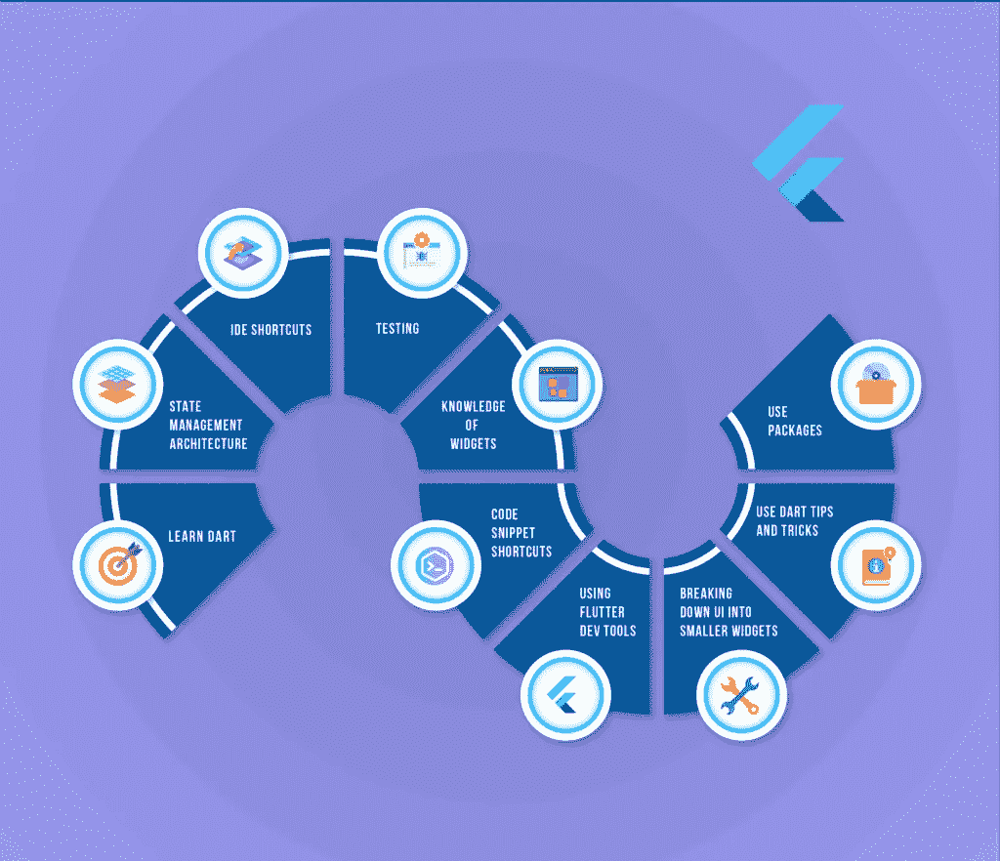

# 每个 Flutter 开发者应该知道的 10 件令人惊讶的事情

> 原文：<https://medium.com/geekculture/10-surprising-things-every-flutter-developer-should-know-f60ef41711bd?source=collection_archive---------3----------------------->

学习一门新的编程语言可能会很棘手。这需要大量的耐心、练习、训练营和自学。但是只要付出足够的努力，你就可以学习任何被设计出来的编程语言，包括 Flutter。

Flutter 是谷歌的开源框架，其专长是使用单一代码库开发多平台应用的能力。该语言于 2017 年 5 月发布，由于其多功能性和开源性，迅速受到欢迎。如今，Google Ads、Reflectly 和 PostMuse 等热门应用都是使用 Flutter 开发的。

作为一个工程团队，我们已经对 Flutter 进行了相当长时间的修补，这里有一些我们认为每个 Flutter 开发者都应该知道的经验。

1.  **学习 Dart** : Flutter 作用于编程语言 Dart。所以在你深入学习颤振概念之前，你一定要花些时间学习 Dart。Dart 使用面向对象编程(OOP)。你应该掌握编程语言，当你作为一个 Flutter 开发者工作时，它会帮你很多时间
2.  **状态管理架构**:当你探索 Flutter 时，有时你需要在你的应用程序的屏幕之间共享应用程序状态。有许多方法可以采用，也有许多问题需要思考。您可以使用不同的方法，它们都提供相同的功能，但具有不同的体系结构。作为一名 Flutter 开发人员，您应该探索不同的可用状态管理架构，并决定哪一个最适合您的需求。
3.  **IDE 快捷方式**:——在开发 Flutter 应用的时候，了解你的 IDE 是如何工作的，以及如何让自己更有效率是很重要的。IDE 快捷方式有助于提高工作效率。当你可以从键盘上做任何事情的时候，这将会节省你大量的编码时间。
4.  测试:对于开发来说，测试是非常重要的。为了确保你的应用程序运行完美，你必须有很好的测试知识。使用“debugPrint”方法会使它更容易，因为它比普通的 Print 语句提供了更多的信息。
5.  小工具的知识:相信我，如果你很好地掌握了在什么情况下使用什么小工具，那将是救命的。Flutter SDK 有自己的一套小部件。从创建一个简单的容器，到做一些高级的事情，比如异步调用或者打开相机，小部件会让你的生活变得更容易。因此，请务必探索内置的 Flutter 小部件以及互联网上的一些开源小部件。
6.  **代码片段快捷方式**:如果你正在使用 VS 代码编写 Dart 代码，代码片段快捷方式将把你的生产力提升到一个新的水平。编写样板代码非常耗时，所以如果你学会使用代码片段快捷方式，你就不必担心编写样板代码。它将帮助你用几个字母写多行代码。你也可以配置你自己的 snippers，只需在 VS 代码中搜索“配置用户片段”即可。
7.  **使用 Flutter 开发工具**:就像你可以在 Chrome 中检查网页一样，你可以通过 VS 代码中的开发工具菜单来检查你的 Flutter 应用。如果你使用的是 Android Studio，它有一个名为 Flutter inspector 的内置功能。您可以检查您的小部件。
8.  **将 UI 分解成更小的部件**:你可能会遇到这样的情况，你正在设计你的应用程序的 UI，而你的代码看起来非常混乱，有很多嵌套的代码。这里的最佳实践是将代码分解成小部件。你可以简单地通过右击代码块并点击“用小部件包装”来完成。这将创建一个新的代码小部件，可以重用。您可以在应用程序的不同位置使用相同的小部件。
9.  **使用飞镖技巧和招数**:我们已经告诉过你，为了掌握飞镖，你需要熟悉飞镖。但是请注意，当您开始使用 Flutter 进行开发时，有一些 Dart 提示和技巧肯定会派上用场。

这里有一些你应该熟悉的飞镖技巧:

*   Dart 支持字符串乘法。
*   您可以使用构造函数和初始化列表来实现更流畅的 API。
*   对于未使用的函数参数，可以使用下划线。
*   Dart 支持使用函数作为参数和匿名函数。
*   使用 Dart，您可以实现对 Dart 类的“调用”方法。这使您能够作为一个函数调用它们。

**10。使用包:**相比 Java，Flutter 是一种相对较新的编程语言，如果你想快速构建一个应用程序，你可以使用你需要的所有帮助。这就是 Dart 包出现的原因。包是其他开发人员创建的开源代码库，您可以将它们合并到自己的项目中。你可以在你的网站上添加一个 Flutter 包，只需访问 pub.dartlang.org 并搜索你需要的包。如果您对某个特定的软件包有任何疑问，您需要做的就是联系开发人员，他们的电子邮件 id 可以在网站上找到。或者，您也可以编写自己的包并在网站上发布，从而为开源社区做出贡献。

声明:最初发表于[https://www.kommunicate.io/](https://www.kommunicate.io/blog/10-things-every-flutter-developer-should-know/)