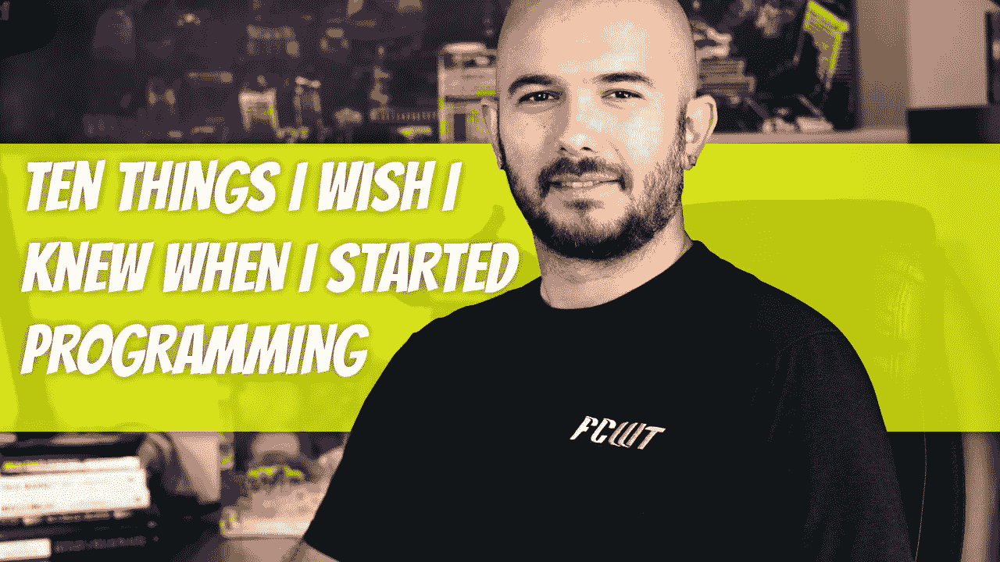

# 开始编程时我希望知道的 10 件事

> 原文：<https://medium.com/geekculture/10-things-i-wish-i-knew-when-i-started-programming-d2080ad390eb?source=collection_archive---------16----------------------->

当你第一次开发的时候，所有的事情都是令人兴奋和害怕的。你看着你的高级软件工程同行，想知道你是否能达到那个水平。理解这个行业的来龙去脉需要几年时间，但是一旦你到了那里，你就会意识到你实际上对自己有多苛刻。

## 1.你不可能学会所有的东西