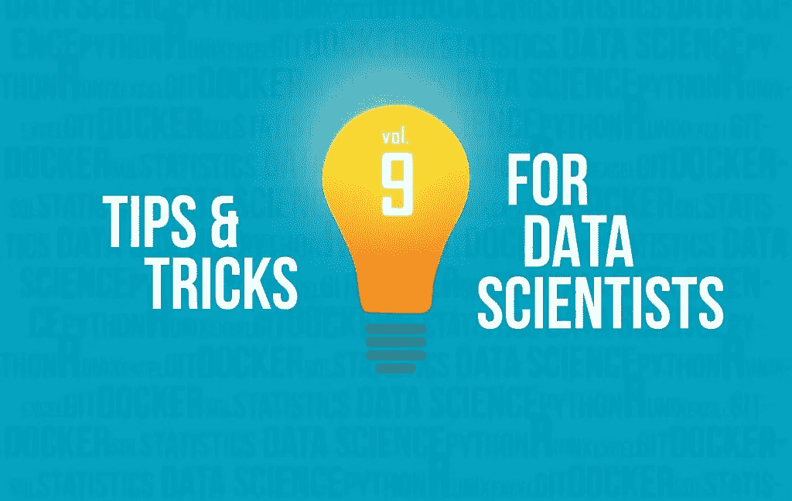

# 数据科学家的 10 个技巧和诀窍

> 原文：<https://medium.com/geekculture/10-tips-and-tricks-for-data-scientists-4ed90e525167?source=collection_archive---------70----------------------->

## 面向数据科学家和数据工程师的 R 和 Python 技巧

Image by [Predictive Hacks](https://predictivehacks.com/wp-content/uploads/2021/05/D-Graphics-2021-predictivehacks-psd-Untitled-1_9-2048x1298.jpg)

我们已经开始为数据科学家撰写一系列关于技巧和诀窍的文章(主要在 **Python** 和 **R** 中)。如果你错过了:

*   [第一卷](https://predictivehacks.com/10-tips-and-tricks-for-data-scientists-vol-1/)
*   [第二卷](https://predictivehacks.com/10-tips-and-tricks-for-data-scientists-vol-2/)
*   [第三卷](https://predictivehacks.com/10-tips-and-tricks-for-data-scientists-vol-3/)
*   [第四卷](https://predictivehacks.com/10-tips-and-tricks-for-data-scientists-vol-4/)
*   [第五卷](https://predictivehacks.com/10-tips-and-tricks-for-data-scientists-vol-5/)