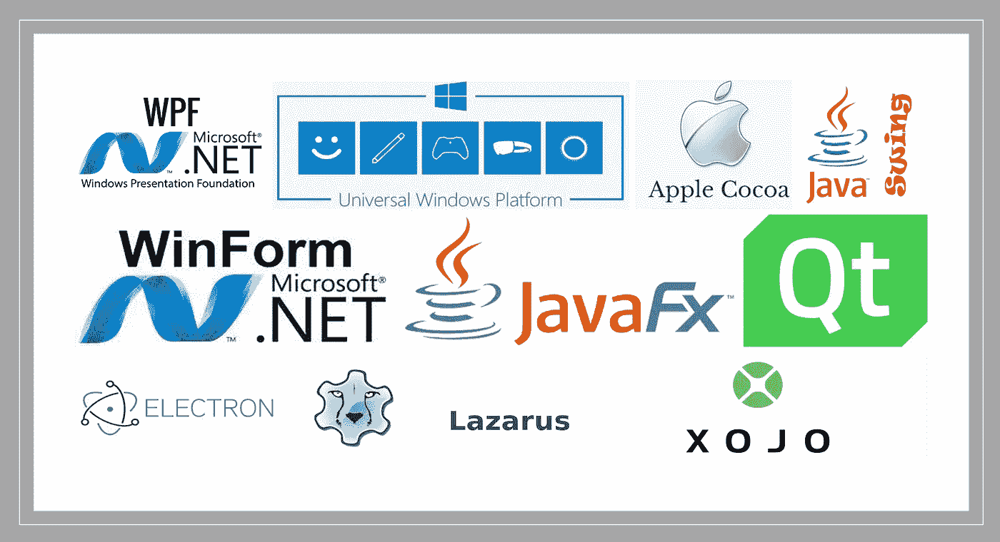

# 开发带有用户界面的桌面应用程序的 10 个工具

> 原文：<https://medium.com/geekculture/10-tools-for-developing-desktop-applications-with-user-interfaces-f3806ef0d841?source=collection_archive---------0----------------------->

桌面应用程序框架、库、工具包、编程语言、ide 等的概述。

如今，网络和移动应用主宰了市场。主导思维是网络或移动优先(友好)。但这并不意味着对桌面应用的需求消失了。我们仍然需要我们心爱的桌面应用程序。