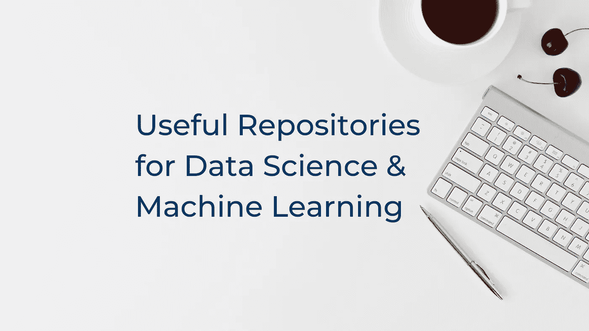

# 数据科学和机器学习的 10 个有用存储库

> 原文：<https://medium.com/geekculture/10-useful-repositories-for-data-science-machine-learning-791f3c8bff78?source=collection_archive---------2----------------------->

## 10 个有用的 Github 库，适合每个使用 DS 和 ML 的人

BG Image — Unsplash

GitHub 是 Instagram、脸书、Snapchat，基本上是程序员的一切。它不仅是最流行的代码管理工具之一，也是推广开源文化的最大贡献者。它…