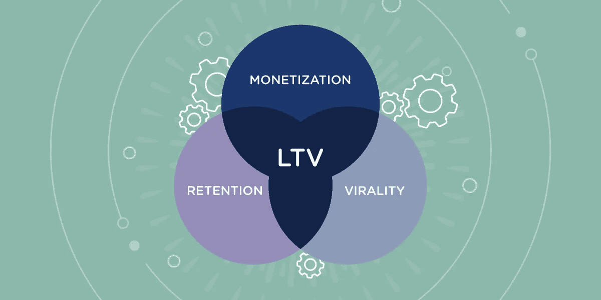
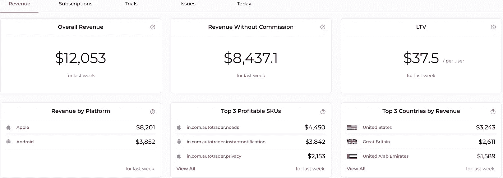
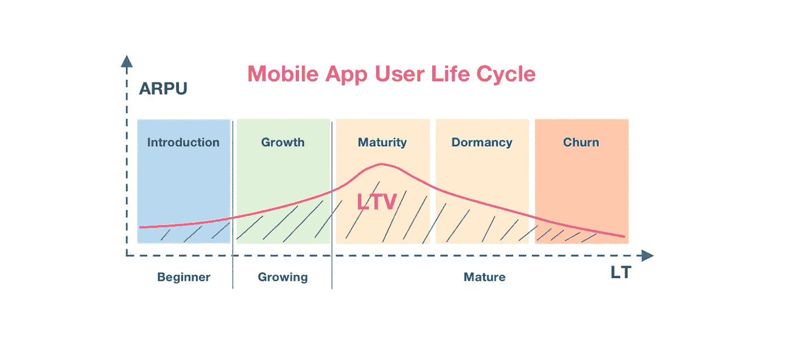

# 提升订阅应用 LTV 的 10 种方法

> 原文：<https://medium.com/geekculture/10-ways-to-boost-ltv-for-subscription-apps-5df2d6b37c62?source=collection_archive---------12----------------------->

应用程序在日常生活中越来越普遍。这些应用程序提供的服务是提高效率和可访问性的重要因素，从而提高了生活的整体质量。作为应用程序开发人员，我们的目标是在订阅的基础上提供这样的服务。我们必须采取适当的措施来确保订阅期限的长久性，同时拥有合理的收入和覆盖范围。为了达到同样的目的，有必要了解 LTV(终生价值)以及如何改进其参数以最大化期望的产出。

# 订阅应用的 LTV 是什么？

LTV 或终身价值是一个参数，用于衡量客户或客户在使用其产品期间对组织的价值。正如在[移动应用指标综合指南](https://www.appflow.ai/blog/mobile-app-metrics-comprehensive-guide)中所述，LTV 是衡量和预测移动应用收入的关键指标。通过对特定时间段内移动应用用户 LTV 的清晰评估，应用营销人员可以更好地估计其营销活动的投资回报，并相应地调整营销预算。

熟练理解和使用 LTV 可以改善收入渠道，如应用内购买、应用内广告和用户群。通过采用数据驱动的决策，可以遵循一种最佳方法来提高用户获取率，同时仍然保持盈利。

LTV 有三个关键因素:

*   货币铸造
*   保留
*   病毒式

[Boost LTV for Subscription Apps](https://www.appflow.ai/blog/ten-ways-to-boost-LTV-for-subscription-apps)

货币化指的是用户在其订阅生命周期内支付的金额。保留是指在给定的时间范围内，应用程序被重新访问的次数。病毒式传播指的是应用的传播范围。病毒式传播衡量的是现有用户吸引的新用户(大部分是免费的)数量。

# 我们如何计算订阅应用的 LTV？

Appflow.ai 通过以下方式计算生命周期值(LTV)。

***【LTV 】=每个用户每月的平均付费÷该期间的流失率***

[Appflow.ai — Subscription Dashboard](https://demo.appflow.ai/#/dashboard/revenue?app_id=$_all&time=now-6d&time=now&environment=prod&project=61dfef44440a4a5550d07ffd)

首先，Appflow.ai 计算每个月每个用户的平均付费。Appflow.ai.ai 然后用这个值除以[流失率](https://www.appflow.ai/blog/churn-for-subscription-apps)。流失率是指在一定时间内退订或停止付费的用户数量。Appflow.ai 执行以下操作来计算流失率。

***流失率=期初流失率÷期初用户数× 100%***

Appflow.ai 允许用户使用其时间过滤器计算不同时间段的 LTV。此选项有助于了解用户在不同时间段对您的订阅应用程序的价值。Appflow.ai 还提供基于数据的建议功能，提供提示和反馈以提高 LTV。

# 提升订阅应用 LTV 的 10 种方法

既然 LTV 扮演着重要角色，我们就需要采用适当的策略和方法来提高 LTV 的应用。从 LTV =生命周期+价值的组合可以理解，提升订阅应用的 LTV 就是延长应用用户的生命周期，提高应用用户在每个订阅周期的价值。

这里我们列出了 10 种方法来做到这一点:

*   **客户体验(CX):** 客户被视为成败的关键。确保无缝和完美的客户体验可以增加更多客户重新订购服务的几率。这也有助于客户撰写积极的评论，提高应用商店的评级。
*   **介绍推荐和折扣:**折扣已被证明是一种确保留住客户的方法。向客户提供额外的激励，从而提高客户满意度。推荐是一种吸引新用户的低投入方法。现有用户向新客户推荐增加了应用程序的用户基础和新老用户的满意度。
*   **强大的社交媒体影响力:**大多数人在社交媒体上花费很长时间。在这样的空间里表现出强大的存在感是至关重要的。拥有一个活跃的社交媒体账户将有助于促进有吸引力的交易，以吸引新用户。
*   **提升产品的价值:**提升产品的功能给客户带来独一无二的完美体验。这使我们在竞争中脱颖而出，并最大限度地减少客户流失。
*   **鼓励追加销售:**吸引新客户购买我们的产品远比说服现有客户升级其现有方案昂贵。必须采取适当的措施，让当前用户了解升级的优势，为客户增加价值，为我们增加收入。
*   **利用深度链接:**研究显示，相比网络用户，应用用户更有可能选择订阅。让一些功能 app 独占，会激励用户下载 app 以获得更好的体验；这使得他们更容易订阅。
*   **改进的 onboarding:** 刚接触应用程序的用户通常很难理解 UI。应用程序必须有适当的指令，并且同时是交互式的，以增强用户体验。
*   **收集客户反馈:**应用程序必须不断发展。这项服务必须适应顾客的需求。适当的客户反馈有助于理解应用程序的期望和缺点，这些在测试阶段是看不到的。
*   **经常性支付模式:**经常性模式是改善 LTV 的最有效方式之一。这确保了持续稳定的收入流，同时影响客户停留更长时间。客户还受益于不需要在每个账单周期处理他们的发票。
*   **瞄准合适的人口统计:**选择合适的目标受众极其重要。开发的应用程序必须满足大量人口的需求。当满足上述条件时，该应用将具有巨大的市场需求。

# 最终想法

开发应用程序花费了大量的精力。即使应用程序在技术上是合理的，持续的收入和坚实的用户基础也被认为是绝对必要的。理解 LTV 的概念对于满足上述条件至关重要。在计算不同时间段的 LTV 时，Appflow.ai 是一个真正的救命稻草。Appflow.ai 还提供数据驱动的建议，帮助我们更好地把握客户的心态，从而能够更好地满足他们的需求。我希望这篇文章能为你的订阅应用提供一个提升 LTV 的好方法。

## 关于 Appflow.ai

[Appflow.ai](https://www.appflow.ai/) 是一款应用内订阅分析工具，可以帮助你轻松进行移动订阅跟踪和付费墙实验。它从你的应用中收集数据，如试用、安装、购买、收入、退款等，以产生相关的订阅分析。为了改进销售业绩模型并增加每月订阅收入，我们使用多种数据关系对各种数据状态和订户组进行了比较和评估。

 [## 应用内订阅分析和管理工具- Appflow

### 在一个地方管理 iOS 和 Android 应用内订阅数据、付费墙 A/B 测试和推送通知。转换…

www.appflow.ai](https://www.appflow.ai/)