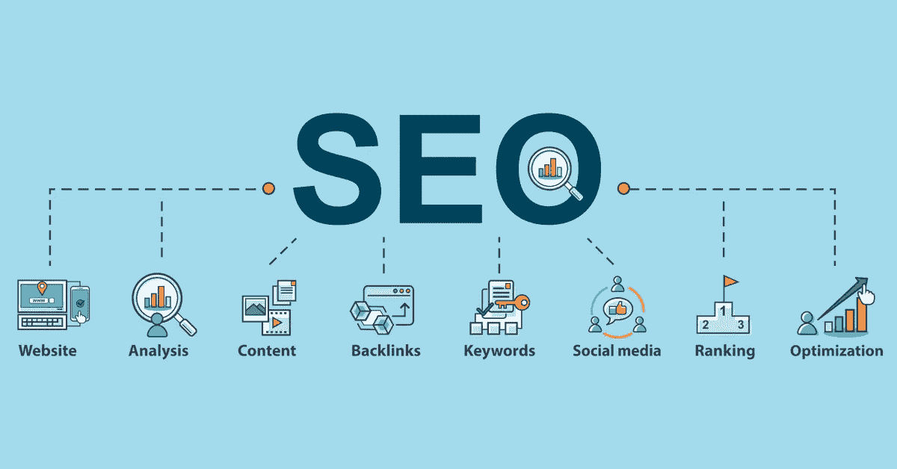

# 作为开发人员，提高搜索引擎优化(SEO)的 10 种方法

> 原文：<https://medium.com/geekculture/10-ways-to-improve-search-engine-optimization-seo-as-a-developer-a548ef936b22?source=collection_archive---------11----------------------->

Search Engine Optimization

# 首先，什么是 SEO？

> SEO 代表“搜索引擎优化”简单来说，它意味着当人们在 Google、Bing 和其他搜索引擎中搜索与您的业务相关的产品或服务时，改进您的网站以增加其可见性的过程。你的网页在搜索结果中的可见度越高，你就越有可能吸引潜在的和现有的客户。

# 作为一名开发者，这里有 10 种方法可以改善你的网站的搜索引擎优化，提高你的页面覆盖率和搜索结果。

## 1.研究你的关键词

了解用户在找什么。研究你的竞争对手，选择你希望你的网页排名的关键字。永远记住**更长的关键词**意味着**更少的竞争**。

## 2.内容永远是王道

你应该比任何人都了解你的目标受众。写内容时要考虑用户的需求。教育你的用户并保持相关性。更好的是，**不要超过 600 个单词**，但是不要用关键词塞满你的文本——使用同义词。

## 3.使用元标记和开放图形类型

元标签有助于搜索引擎理解你的内容。重要的是将它们包含在 *<标题>* 标签中，并描述你的页面标题、页面描述和内容、社交媒体外观等等。

## 4.组织你的标题并使用语义

在你的页面主体中，观察你的页眉层次。规则很简单，使用上 *< h1 >* 表头，下半 *< h2 >* 表头，以及*<H3><H4>*表头可以无限使用。为了可读性，格式化你的内容，明智地使用标题。

## 5.给你的 URL 一个目的

网页 URL 受益于关键字，给它们有意义的路径。如果您已经发布了一个带有错误 URL 的页面，请确保更新它并重定向用户。

## 6.内部链接

使用**锚文本**！如果你想提高爬虫索引你的网站页面的能力和提高 UX 给你的页面部分上下文，内部链接是至关重要的。使用有意义和相关的文本来链接你的网站页面。

## 7.在图像上使用替代文本

替代文本由视障人士使用的屏幕阅读器阅读。使用替代文本不仅可以提高可访问性，还可以帮助搜索引擎理解你的图片是关于什么的。

## 8.手机友好型设计

越来越多的用户通过智能手机和平板电脑消费网站。确保您的网站在桌面和移动设备上都运行良好。**媒体查询**极大地有助于响应。

## 9.页面速度和用户体验

最近谷歌推出了**Web Essentials**——一组关于用户现场体验的评估点。评估和遵循这些要点，以提高您的网页的性能，并减少您的网页跳出率。

## 12.限制重复内容

搜索引擎和用户喜欢新鲜、新颖和独特的内容。尽量避免在不同的 URL 上创建重复的内容。如果需要复制内容:将 ***rel="canonical"*** 添加到您网站内容的索引页面。

就这样，你的网站搜索引擎优化就一飞冲天了。

> "只有当所有人都先爱你的时候，欧格才会爱你."温迪·皮索