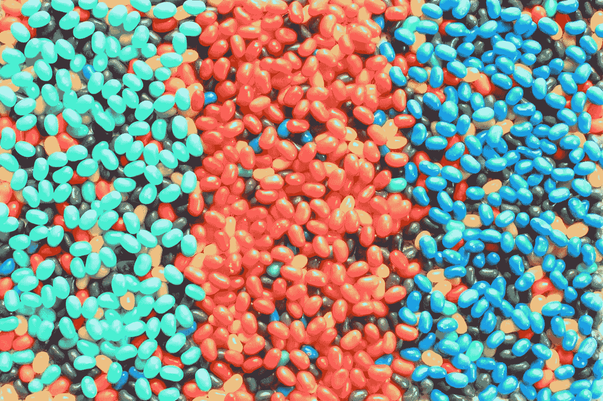

# 100 多种优先排序技巧和我学到的东西

> 原文：<https://medium.com/geekculture/100-prioritization-techniques-and-what-i-learned-be5a67b64bb0?source=collection_archive---------14----------------------->

## 不是一般的优先排序文章——我研究并筛选了大量的优先排序技术。以下是我的要点。

[morguefile.com](https://morguefile.com/p/1001815)

# 摘要

*   有比你想象的更多的方法来区分轻重缓急
*   优先顺序框架不是…