# 在快节奏的 ProductHunt 发布后，在 Google 上获得了 10 万多的浏览量和第一名

> 原文：<https://medium.com/geekculture/100k-impressions-and-1-on-google-after-a-fast-paced-producthunt-launch-f95bb72175b4?source=collection_archive---------9----------------------->

如何建立和执行一个围绕你的产品搜索的社会活动与无代码和咖啡☕️24 小时。

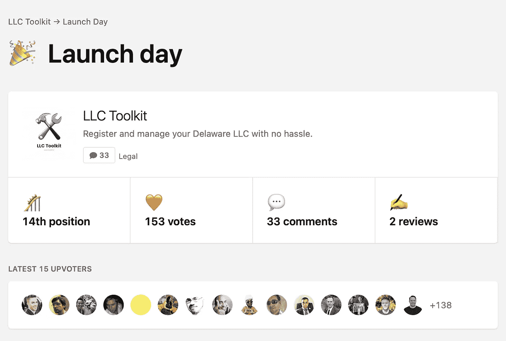

[ProductHunt](https://www.producthunt.com/posts/llc-toolkit) launch

## TL；速度三角形定位法(dead reckoning)

4 个小时的执行。2 个人。12 小时的炒作+巨大的社区支持。

## 动机

作为创始人，注册和经营你的企业是至关重要的。在过去的 15 年里，我经营了 6 家企业，并帮助数百名其他创始人经营和创办了自己的公司。

该产品是我们团队在黑客马拉松周期间从一个简单的包中提炼出来的知识的成果。

本着#buildinpublic 的精神，我将此公开，但也是为了与更多的创始人交流，帮助他们简化注册和做生意的第一步。

## 介绍

在#GlobalBuildWeekend 期间，我们与其他一些 [OnDeck](https://beondeck.com/r/EugeneHauptmann) 的成员组建了一个团队。我们有一两天的计划，然后在周中开始。

我们中的六个人在创业、法律、营销和无代码方面有着不同的背景。这是一个足够好的混合物，让我们继续前进。罗柏、奥亚、山姆、特蕾莎、苏海尔和我自己。只有苏海尔和我参与了 ProductHunt 活动。

通常，做任何东西都需要几个月的时间，你还需要确认你的产品是否适合市场。然后你迭代，修复错误，做大量的工程，大量的营销，最后如果你足够幸运的话——客户支持。

那么我们如何在不到一周的时间内完成所有这些呢？

## 登录页面

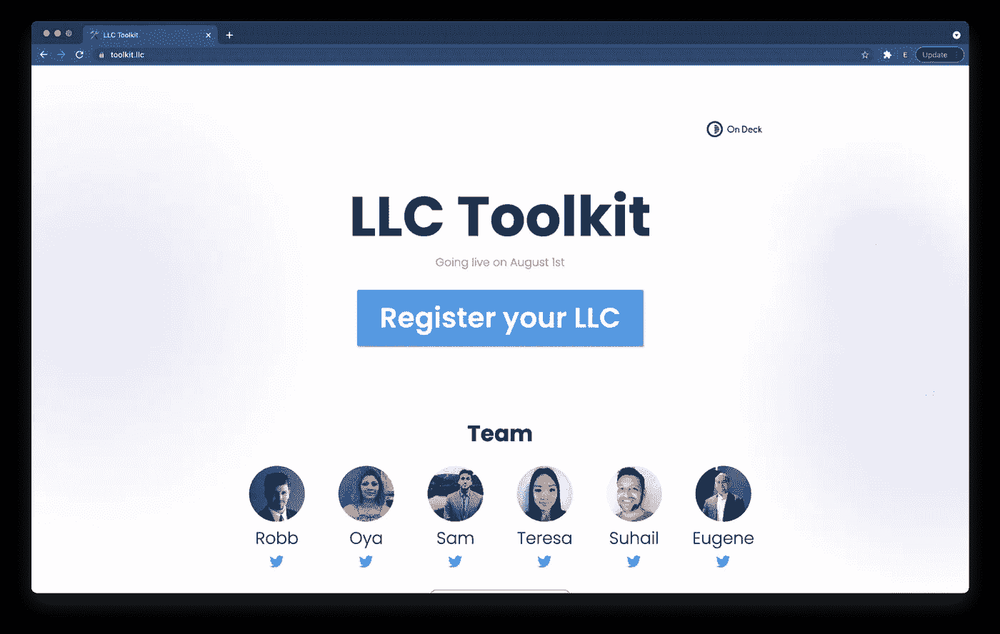

Landing page

每一个你想花钱花时间的想法都会首先经过验证过程。通过许多加速器教会了我一件事——创建一个非常简单、低保真度的登录页面来确认你的想法。

首先构建一个低保真度版本有助于将注意力转移到想法本身，而不是想法的执行。

这正是我们所做的。我们使用 WebFlow 在不到一个小时的时间内构建了一个基本版本的登录页面和注册表单。我们又花了一个小时左右润色了登陆页面。

是时候得到一些反馈了！

## 早期分布

那么我们在哪里可以找到一些早期的反馈呢？

因为我们在全球构建周末期间启动了这个项目，所以我们已经有了一个由大约 250 名构建者组成的活跃的 OnDeck 社区。

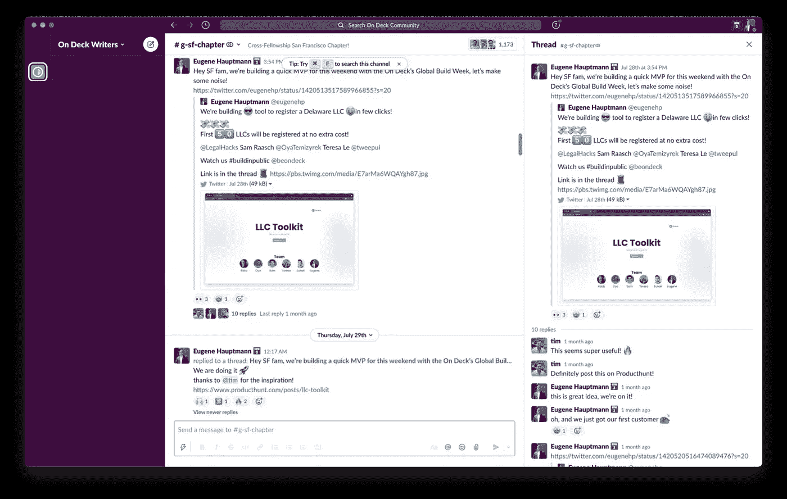

OnDeck’s Slack

我设法与不同城市的几个 OnDeck 分会分享了登陆页面，并获得了初步的积极反馈。

一个朋友甚至建议我们做一个产品搜索发布会。💡

哦，我们在 Slack 社区上发布登陆页面的第一个小时内就有了第一批注册。🙌

## 准备

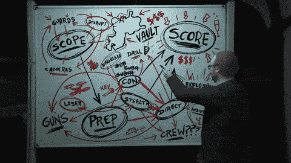

Explaining to the team why we need to do ProductHunt launch

在几个时区的团队成员进行了一些内部讨论后，我们决定推出 ProductHunt。

什么时候？明天！

为什么？因为我们周六有一个项目，我们想尽快确认我们的项目解决了一个真正的需求。

回到绘图板。现在是太平洋标准时间晚上 7 点，离准备发射还有不到 5 个小时。

## 一个快速的计划出现了:

*   修改登录页面
*   编辑注册页面
*   添加谷歌分析指标
*   创建一个专用的 [LLC 工具包 Twitter](https://twitter.com/llctoolkit) 账户
*   创建一个解释我们产品功能的屏幕
*   创建仍在开发中的产品的截图
*   创建视频
*   为 ProductHunt 页面创建交互式徽标
*   创建项目的一行程序及其描述
*   创建第一个制作人的评论

以上大部分我们的成就都要归功于无代码、草图，以及来自那些还没睡的朋友们的大量反馈。

我们计划在太平洋标准时间第二天上午 00:01 发布。

## 大肆宣传

How we want early-stage founders to feel about our product

公平地说，我已经在寻找产品上花了很多时间，与其他制造商接触，建立关系和联系。在过去的几个月里有不到 500 名粉丝。推特也一样。归结起来就是每天花 10-15 分钟投票选出你喜欢的产品，并与创始人讨论他们的产品和问题。

启动发布的策略是在发布后的前半小时内解决现有在线社区的问题:

*   产品搜索
*   IndieHackers
*   Reddit
*   黑客新闻

**时机决定一切。**

我还有 4-5 个小时的时间来准备一切。

ProductHunt 是一个全球社区，所以新的一天从太平洋标准时间午夜开始。所以加州的午夜在欧洲和以色列是凌晨，在印度是中午。因此，能够乘风破浪，吸引全球观众是关键。

幸运的是，我的 ProductHunt following 大约有一半是在印度的时区。

接下来的步骤是保持持久性和一致性:为 ProductHunt 页面准备所有资源，用新的注册表单测试更新的登录页面，并为在线社区和社交媒体创建一个副本。

## 午夜

We have a lift-off!

该走了！在 ProductHunt 页面上线后，我在社交媒体和在线社区以及 Slack/Discord 组发布了一些准备好的内容。

我发短信给我在美国、欧盟和以色列的朋友，请他们帮助我们进行初步投票，我们在第一个小时内就获得了一半的页面。我们排在第 40 位，很快就排到了第 20 位。🙌

在那之后，发射变成了一场艰苦的战斗。在接下来的 20 个小时里，我们爬到了第 15 名。

OnDeck 社区对我们很感兴趣，无代码社区也给了我们很多 Twitter 的支持。ProductHunt 社区成员帮助我们参与整个平台和 Twitter 上的相关对话。

午夜过后几个小时，该睡觉了。

幸运的是， [Suhail](https://twitter.com/tweepul) ，我们在印度的团队成员之一，重新上线并接管了工作。他帮助维持 Twitter 的炒作，并在社交媒体和 Slack 团体中传播。

## 醒来

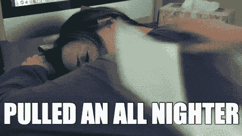

Exactly the feeling when you wake up

这是一个很大的惊喜，在一个小时内启动了一个登录页面后就获得了第一个注册。

想象一下，一觉醒来就有 100 多个注册！这是一种奇妙的感觉，一个通宵的努力让我们取得了如此大的成绩！

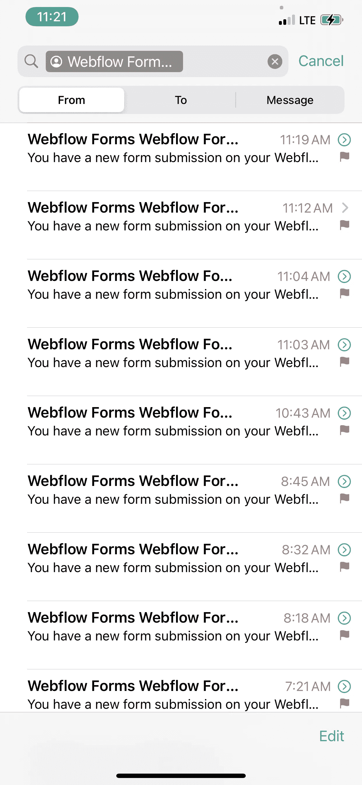

New signups

那天，我们在 ProductHunt 上徘徊在第 13 位，被算法取消了十几票(我想是因为人们创建了新的账户)。第一名有将近 500 张选票。

在 ProductHunt、Slack 和 Twitter 上，我们的注册人数很多，反馈和问题也很多。

在我们昨天完成了所有的工作之后，我们在一天结束之前还有大约 12 个小时。

## 约会

Making time to answer each comment and tweet

我和团队在所有现有平台上加倍努力，让尽可能多的人看到我们的产品。

我们为 GlobalBuildWeekend 做了一个很棒的产品。每个人最终都有了一个有趣的想法，并走上了继续打造产品和业务的轨道，每个人都需要融入其中。

周四晚些时候，我们在 ProductHunt 上获得了 100 多张投票，Google Analytics 在我们的网站上展示了全球数百名用户的实况。

很难想象我们花了 48 小时才得到这么多关注。

我们一直在努力。

## 课程

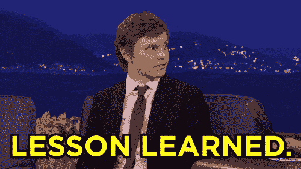

Lessons learned

在周四推出 ProductHunt 是艰难的，会带来很多竞争，因为我们的产品在周五或周六推出会让我们更容易获得第一名，但也会给我们带来更少的流量。

在 HackerNews 和 Reddit 上发布失败了，因为我们还没有在那里建立一个社区，很难在那里达到任何重要的参与水平。

一开始我们在 Twitter 上做得很好，然后在晚上和夜间。我们可以在一天当中做得更好，通过参与在线社区，在 Twitter 和媒体/indie hacker 上创建更多内容。

我们从一个简单的注册表格开始，然后添加了更多关于我们的客户经营哪种业务的问题。这有助于我们在不同的层面上进行有意义的对话。

必须有不止一个人参与发布工作。在相同的时间框架内，分享相同的策略，你可以获得更多。

我们有几个团队成员跨平台参与，但如果我们先花一些时间建立受众和社区，我们会有 10 倍的影响力。

我们错过了 Quora，那里有很多我们的潜在客户。虽然 Quora 通常需要一个长期的游戏才能成功。

LinkedIn 产生的结果更少，因为我们在那里的受众参与度更低。此外，李算法显示一个人的职位更少。

通过现有的 Twitter DM 对话进行接触也可能是一个额外的驱动因素。

## 周末推销

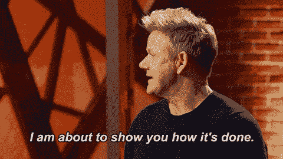

We got overexcited with the external validations we got!

我们惊人的无编码人员和法律专家团队在发布之前、发布期间和发布之后一直在努力。构建早期产品所付出的努力是疯狂的，如果没有代码和我们团队以前的大量经验，这是不可能的。😎

感谢我们的发布和团队的努力，我们能够将一个漂亮的幻灯片放在一起，并有资格参加最后一场比赛。✨

我们也开始了连锁反应，其他几个团队也在第二天和第三天推出了 ProductHunt。🤯

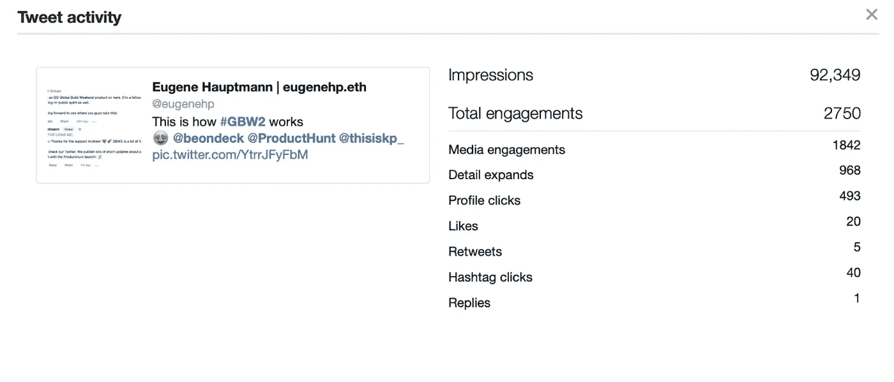

Some of the tweets went viral too

我们每天都有新的注册，太棒了！

## 最终音高

周日早上，几乎没有睡觉，之后是大量的幻灯片和代码行…

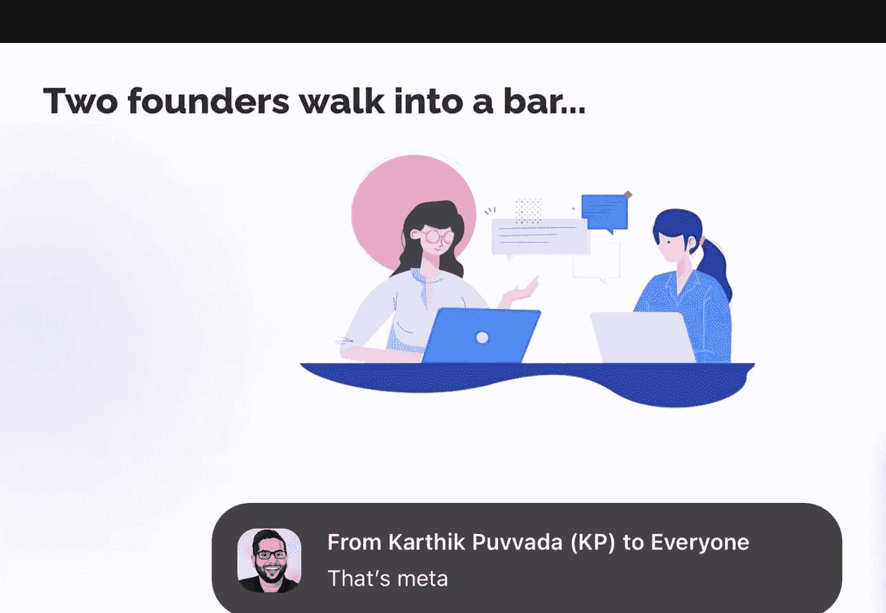

Zoom love during our final pitch

我们重申我们从 OnDeck 评委那里得到的反馈:风险投资人、天使投资人、科技企业家。

我们发现在过去的 48 小时内，我们的登陆页面在谷歌上排名第四。特拉华州的第一名。我们凭借数百万的广告预算击败了历史悠久的竞争对手！

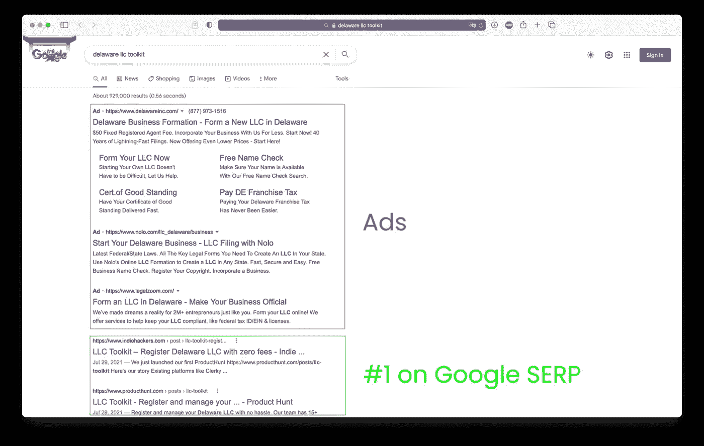

#1 on Google

我们与十几个其他优秀的团队和想法竞争。

几个小时后，在连续几个小时的激烈讨论后，我们听到了评委们的反馈结果。

而且……我们失去了最后的机会，但我们赢得了早期客户和早期采用者。

回想起来，前 3 名团队都有很棒的社会和社区驱动的想法，每个团队背后都有很棒的团队。

哦，我们有新的签约，在比赛期间，比赛之后，第二天也是如此。😍

## 一周时间充电

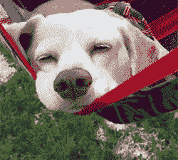

Getting some time to rest

在短暂地聚在一起参加了全球建设周末之后，每个人都需要好好休息一下。🥂

毕竟，我们在不到 72 小时的时间里推出并验证了我们的产品，在 ProductHunt 上获得了 150 多张选票，在 Google 上排名第一，并在社交媒体渠道上获得了 10 万次展示。📣

## 下一步是什么

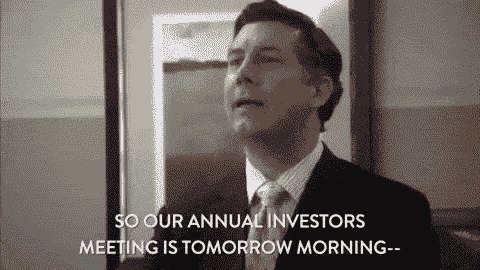

Our next board meeting

休息一段时间后重新上线，让我们看到了 200 多名客户和创始人的惊人名单，等待我们帮助他们实现自己的想法。

我们已经和你们中的一些人谈过了，并计划和所有报名的人安排一对一的谈话。

同时，我们希望[邀请](https://llctoolkit.substack.com/embed)您加入💌由 200 多名像你一样的早期创始人组成的社区，帮助我们在公共场合为你开发产品。

我们将为下一百名[加入](https://llctoolkit.substack.com/embed)我们的社区的创始人提供一年的免费注册代理服务。

请在您的下一封电子邮件中查看促销代码。

## 谢谢你

没有团队的努力和第一批客户的支持，这个产品是不可能实现的。我们感谢所有让我们保持动力和前进的人。感谢您对我们的创始人和朋友以及我妻子的所有反馈！

Thank you

## 支持

如果你觉得这个故事有用，请向这个 Twitter 帖子表达你的爱。