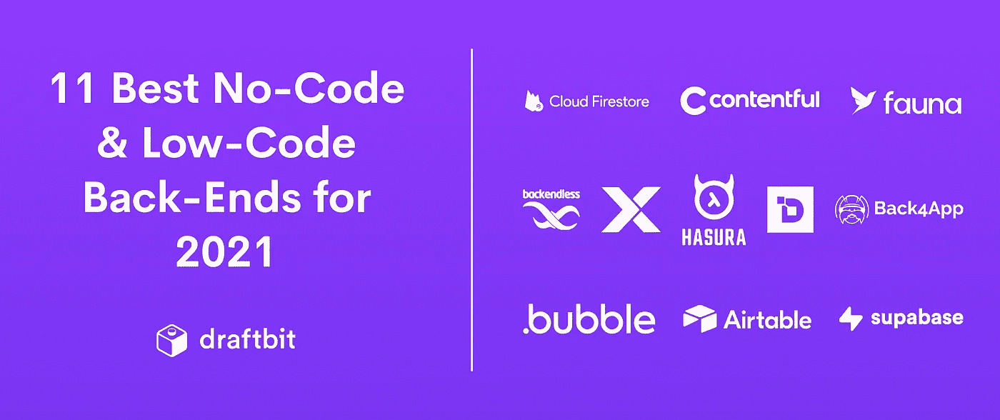
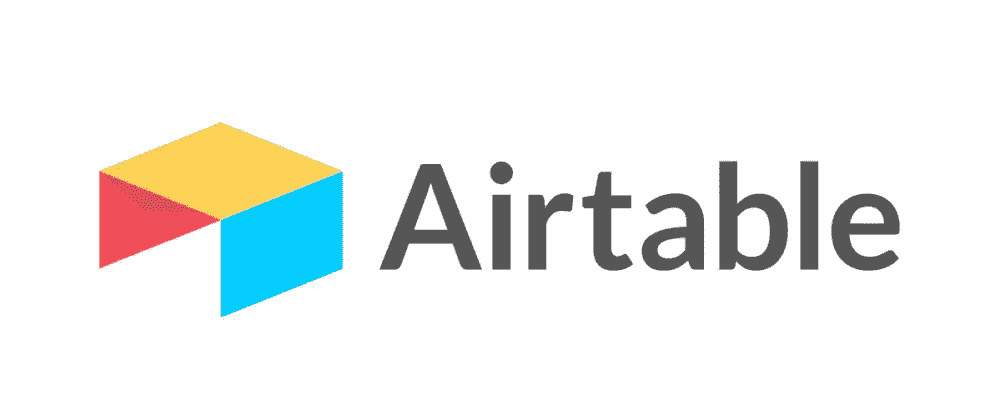
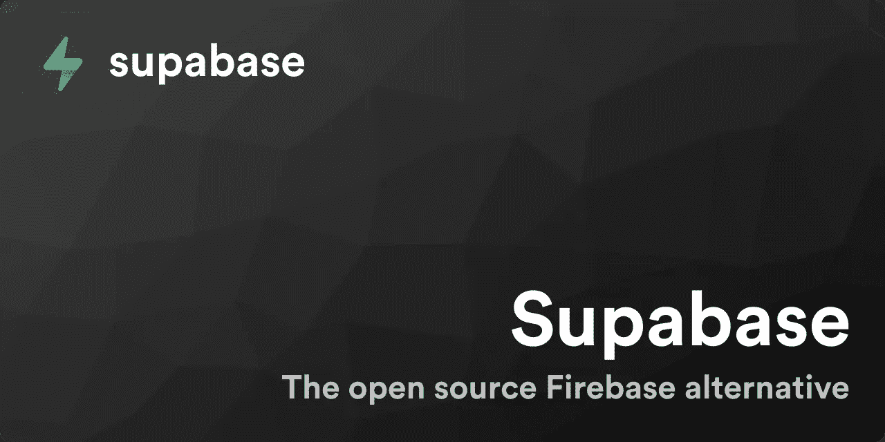
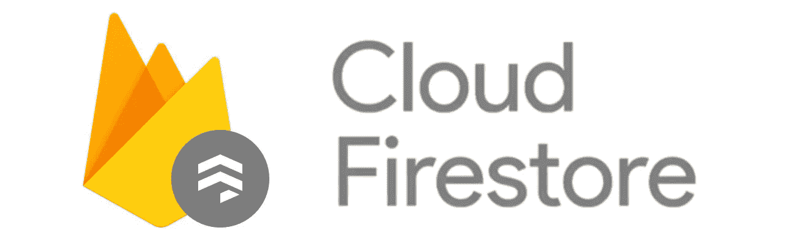
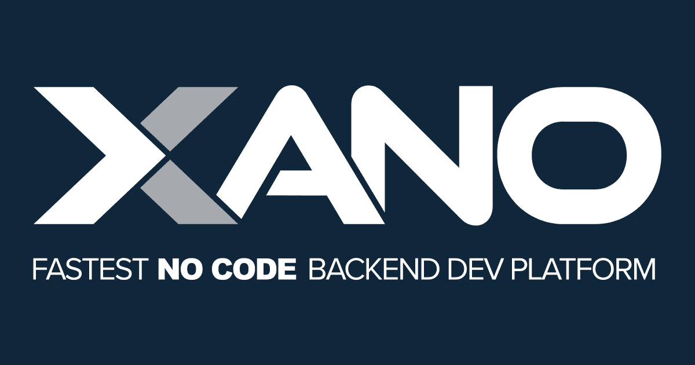
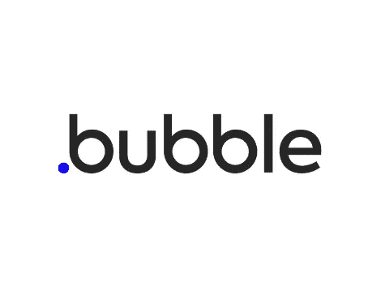
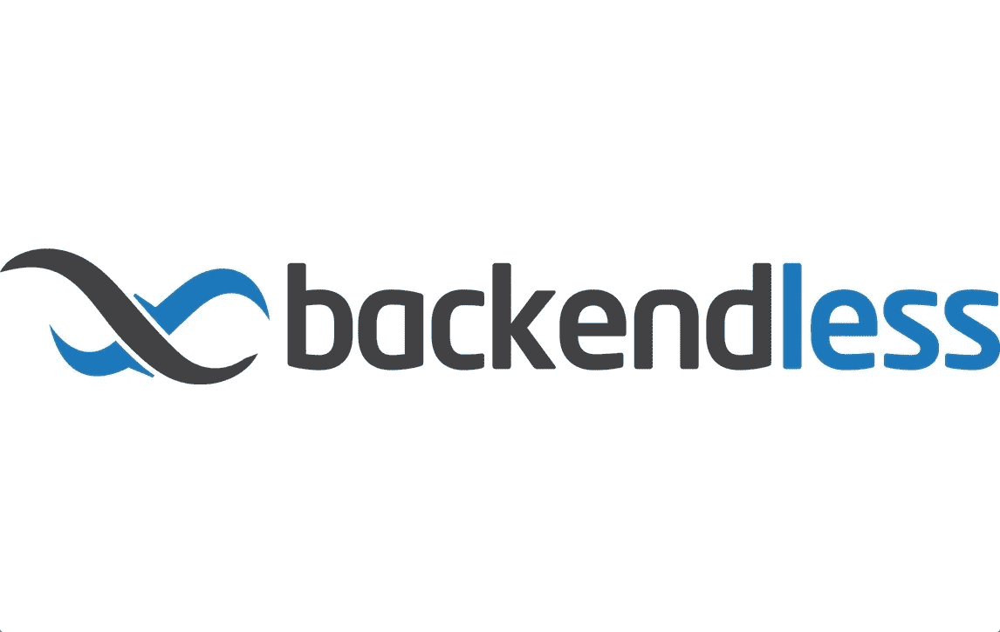
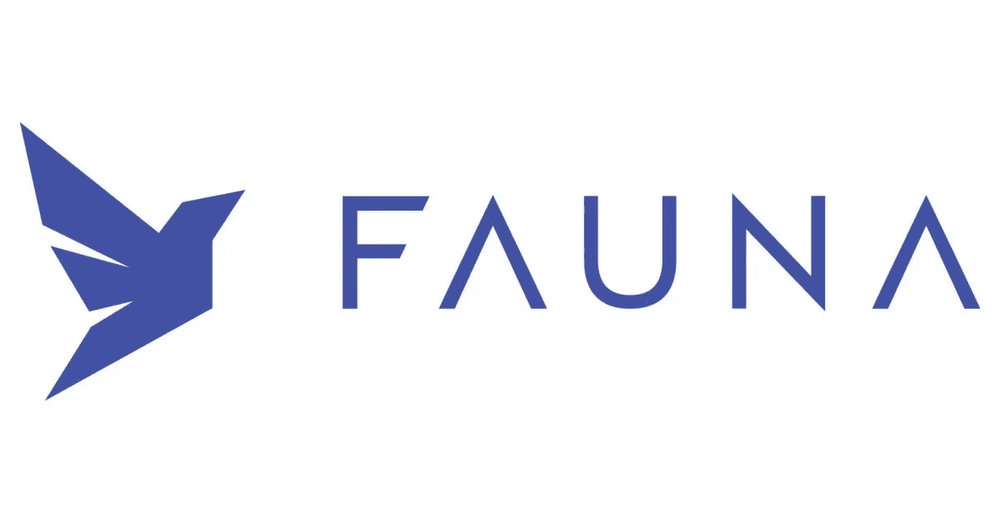
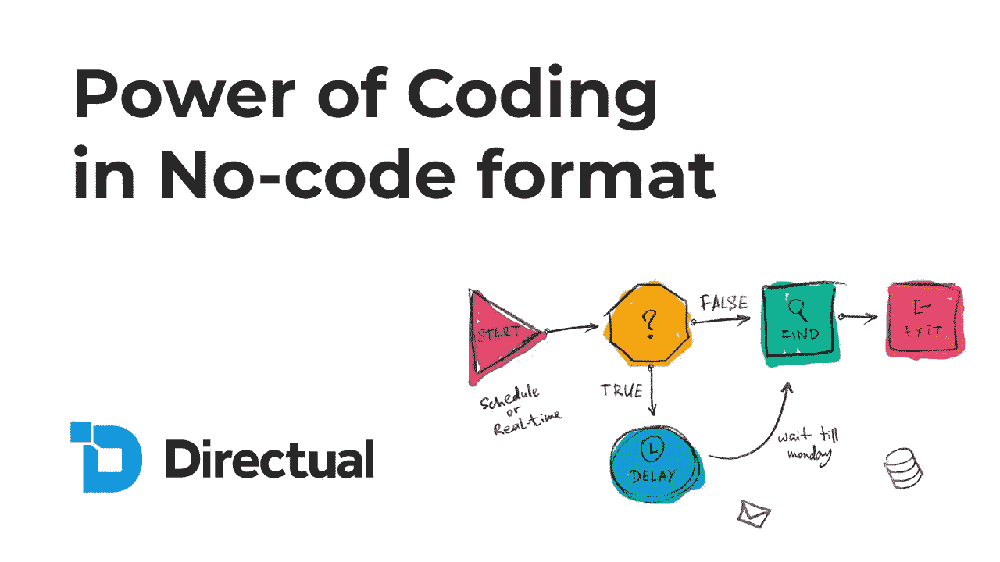
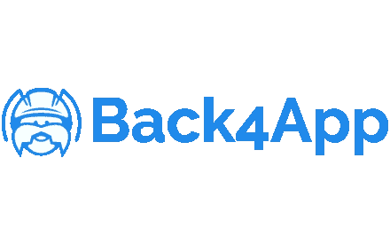

# 2021 年 11 个最佳无代码和低代码后端

> 原文：<https://medium.com/geekculture/11-best-no-code-and-low-code-back-ends-for-2021-138066ca81f6?source=collection_archive---------2----------------------->

无代码和低代码开发平台让世界各地的人们无需编写代码就可以构建自己的业务和应用程序。根据 Forrester 的预测，到 2021 年，无代码/低代码类别将增长到 212 亿美元。

在这些平台出现之前，为企业构建应用程序需要雇佣经验丰富的软件开发人员。但现在已经不是这样了。今天，许多无代码/低代码平台使得独立创作者、艺术家和企业家能够自己构建应用程序。

尽管从编写代码到使用可视化开发工具似乎有了范式的转变，但是后端和前端的基本概念仍然是一样的。要为您的企业构建一个应用程序，您需要一种连接后端和前端的方法。称为应用编程接口(API)的通信信道用于从一个计算机系统向另一个计算机系统请求信息。开发应用程序时，通常会在后端和前端之间来回调用 API。

[Draftbit](https://draftbit.com/) 是一个构建原生移动应用的可视化开发平台。它是后端不可知的。使用 Draftbit 构建的移动应用可以通过 REST API 连接到几乎任何后端即服务(BaaS)平台。我们庞大的用户群使用不同的后端服务将他们的应用程序与数据库连接起来。

这让我们可以看到集成在 Draftbit 中的最流行的后端。例如，Xano、Supabase、Firestore、Airtable 等旨在提供更好的整体用户体验的网站。我们也是[应用程序开发专家](https://draftbit.com/experts)，可以指导您找到正确的后端以及需要寻找的内容。

本文旨在为您重点介绍一些最好的无代码/低代码后端平台，供您在 2021 年使用。如果该工具提供可伸缩性，以及它是否足够灵活，我们将突出它们的独特特性。最后，对于每种工具，都有一个窥探其定价计划的窗口。下面列出的许多后端工具都提供了一个 API 网关，用于从平台提供的托管后端连接前端。

# 充气台

> **最适合想要一个可视化、灵活的后端并且刚刚开始理解 API 的初学者。**

[**Airtable**](https://airtable.com/) 是 Google Sheets 的增强版，或者说是典型的电子表格。然而，它提供的不止这些。入门简单，有丰富的 API 支持。它允许创建一个基于电子表格的数据库，而没有编写代码的麻烦。此外，它还是一种快速灵活的组织数据表的方式(称为*基*)。

它包含计算字段等功能。它们是特殊的字段类型，Airtable 在其中处理值的计算。自动化重复的任务节省了大量的时间，减少了误差。在 Airtable 库中构建自动化工作流是通过使用自定义操作来触发事件来完成的。最终，这个动作被整合到一个可飞行的底座中。

Airtable 还为每个 base 生成一个 REST API。前端开发工具可以直接使用 API。使用由 Airtable 生成的不同端点来执行各种操作。读取、写入、更新、排序和过滤数据等操作都是可用的。

虽然 Airtable 可能不是传统的后端，但它给团队和个人组织任务的自由。此外，它提供了 50 多个内置应用程序，可以轻松地与 G Suite、Outlook、Sendgrid、Slack、吉拉等一系列其他应用程序集成。

**定价:**

*   免费:不限基数，每个基数限制为 1200 条记录和 2 GB 的附件。
*   另外:每月 12 美元，每个数据库 5000 条记录，快照历史，每个数据库 5 GB 的附件。
*   Pro:每月 24 美元，无限量应用，每库 50000 条记录，每库 20 GB 附件。

# Supabase

> **最适合构建生产级应用程序、熟悉 SQL 查询、重视开源并从一开始就想要可扩展解决方案的专家。**

[**Supabase**](https://supabase.io/) 是一款开源的 Firebase 替代后端。它提供了一个基于 Postgres 的专用数据库。它还支持导入现有的数据库。此外，还有内置的支持，通过集成的 JWT 身份验证来发出经过身份验证的 API 请求。这允许您控制您的应用程序用户可以访问的内容。它公开了一个 WebSocket 端点，支持任何前端应用进行实时通信。使用关系数据库的好处是它可以帮助您始终保持一致。

关系数据库或 SQL 数据库是基于表的数据库。它们有预定义的模式，并使用结构化查询语言( *SQL* )来定义和操作数据。非关系数据库或 NoSQL 数据库具有动态模式。它们以一个或多个文档集合的形式存储数据。

当使用 Supabase 时，你会花大部分时间在它的图形用户界面( *GUI* )里面。它还提供了一个 SQL 编辑器，您可以用它来编写定制的 SQL 查询来操作表中的数据。

最受欢迎的特性之一是，一旦创建了数据库，它就提供了一个现成的 REST API。它与前端无关，可以用于任何前端工具构建应用程序。它让你选择自己托管一个 Supabase 或者使用他们的云服务来托管一个。

**定价:**

*   免费:每月 0 美元，无限制的 API 请求，实时功能，数据库空间高达 500 MB。
*   Pro:每月 25 美元无限制 API 请求，实时功能，数据库空间高达 8 GB，支持自动备份和日志保留长达 7 天。
*   现收现付:起价为每月 25 美元，外加数据库空间、存储和传输限制等服务的使用费。

# Firebase Firestore

> **最适合希望快速构建、希望将安全性和用户管理委托给后端服务，并且能够应对一些学习曲线的中间用户。**

[**Firebase Firestore**](https://firebase.google.com/docs/firestore)是谷歌的数据库服务。尽管 Firestore 两年前才推出测试版，但它有一个庞大的社区。它是一个托管数据库，旨在支持无服务器应用程序开发。它提供了一套固执己见的功能，并以 NoSQL 为基础。

NoSQL 范式允许您以集合和文档的形式存储数据。每个文档都包含字段。每个字段都有其唯一的数据类型。这种数据库类型的优点是，它有助于您在构建应用程序时快速移动。

Firestore 有自己的内置安全系统。它可以帮助您定义规则，以允许应用程序用户基于其已验证的状态访问数据。它支持使用电子邮件/密码的传统签名提供商。社交提供商，如谷歌、脸书、苹果、推特等等。

将 Firebase 与前端开发平台集成在一起有点固执己见。这通常意味着无代码或低代码平台必须为 Firebase 提供开箱即用的集成，以便在其平台内使用。

**定价:**

*   星火计划(免费):Firestore 中存储的数据总量为 1 GiB
*   火焰计划(现收现付):总共 1 GiB，Firestore 中存储的每多一个 GiB 数据加 0.108 美元

# Xano

> **最适合希望快速移动、需要带有内置 API 网关的可扩展数据库的低编码人员。**

[**Xano**](https://www.xano.com/) 是一个前端不可知的可伸缩后端。它提供了一个基于 Postgres 的托管和灵活的数据库。它支持 REST API 范式将数据消费到前端工具。它会根据创建的模式为每个数据表自动生成现成的 REST API 端点。Xano 生成的每个端点都可以使用其无代码 API 构建器进行定制。

开始使用 Xano 很容易。登录后，不需要太多配置。它在很大程度上抽象了后端。然而，这种抽象并不会牺牲数据库的性能和能力。Xano 包含的另一个特性是它支持经过身份验证的 API 请求。它还提供了创建自定义函数来查询数据库的能力，而无需编写一行代码。这种平台的灵活性和可伸缩性使其成为最简单的后端之一。

**定价:**

*   免费:限于一个总共有 1000 条记录的工作空间和一个速率受限的 API。
*   启动:每月花费 67 美元，包括五个工作区，每个工作区有 100，000 条记录，对 API 没有速率限制。
*   规模:每月成本 225 美元，包括 10 个工作区，存储总量为 1，000，000 条记录。

# 泡泡 CMS

> 最适合已经用 Bubble 构建了 web 应用程序和数据库的非编码人员。

[**Bubble**](https://bubble.io/) 是一个托管的 web 应用程序“all in one”构建器，为用户提供完全的设计自由，无需编写代码。它允许你在没有任何 CSS 或 HTML 知识的情况下创建 web 应用程序布局。传统的 web 应用程序要求您管理代码，并设置 web 服务器的部署流程。该平台为您管理部署流程和网站托管。

尽管 Bubble 是一个一体化工具，但他们强大的 Bubble CMS 也很容易连接到任何其他前端开发工具。因此，您可以使用在 Bubble CMS 中创建的相同数据表，将它与任何其他前端工具连接起来，例如，开发本地应用程序。

**定价:**

*   免费:不能访问 API
*   个人:每月 29 美元，可访问 API
*   专业:每月花费 129 美元
*   制作:每月花费 529 美元

# 无尽的

**最适合寻找在云中托管数据库的解决方案以及寻找文件存储等集成服务的低代码人员。**

[**Backendless**](https://backendless.com/) 是一个云后端平台，无需编写任何服务器端代码即可创建应用。它提供提供标准服务器功能的可编程服务。此外，它还支持经过身份验证的用户管理、经过身份验证的 API 请求、关系数据、推送通知、发布/订阅消息、地理定位、视频/音频录制、服务器上的实时流、文件服务等。

Backendless 通过 REST API 的实现使这些服务可用。它提供了对可用于任何前端工具的 REST API 的访问。除了 REST API 支持之外，它还支持 iOS、Android、JavaScript 应用程序等的原生 SDK。

**定价:**

*   跳板:每月花费 0 美元，每月无限制的 API 调用
*   Cloud9:每月花费 35 美元，每月调用 10，000，000 个 API
*   Cloud99:每月花费 149 美元，每月有 40，000，000 个 API 调用

# 满足的

> **最适合寻求内容管理平台的中间用户，该平台提供 API 网关来创建媒体密集型应用程序。**

[**Contentful**](https://www.contentful.com/) 是一个 API 第一的内容管理平台，用于创建、管理内容并将其发布到任何数字频道。它是一个现代的内容管理系统(CMS ),内容模型是独立于任何表示层而创建的。它将内容组织到空间中，允许您将项目的所有相关资源分组在一起，包括内容条目、媒体资产和将内容本地化为不同语言的设置。

**定价:**

*   社区:全功能无头 CMS 的费用为 0 美元
*   团队:每月花费 489 美元，非常适合一个团队开发更多的数字产品

# 哈苏拉

> **最适合寻找快速的基于 GraphQL 的解决方案并希望向后兼容 REST 的专家。**

[**Hasura**](https://hasura.io/) 是一个即时实时的 GraphQL APIs 引擎。它使您的数据可以通过 GraphQL API 或 REST API 立即访问。这有助于您更快地专注于构建和发布应用程序。

Hasura 使用 Postgres 连接来连接数据库。它可以水平扩展并为缓存查询保存状态。基于 JSON Web 令牌(JWT)的身份验证可用于添加权限或基于角色的系统。

**定价:**

*   免费:费用为 0 美元，包括 1 GB 数据直通
*   标准:每月 99 美元，包括 20 GB 数据直通

# 动物群

> **最适合那些能够应对一点点学习曲线并且正在寻找一个事务性、无服务器数据库的专家。**

[**动物群**](https://fauna.com/) 是一种数据库即服务，可以很好地与无服务器应用程序配合使用。它不是传统的数据库。它有自己的查询语言，叫做 FQL。它提供了灵活的数据建模，并支持消除数据异常的 ACID 事务。

虽然《动物群》更像是一个完整的数据库解决方案，但通常要生成一个 API，你必须使用像 NoCodeApi.com[这样的工具。](https://nocodeapi.com/)

**定价:**

*   个人:每月花费 25 美元
*   团队:每月 150 美元

# 直接的

> **最适合寻求支持高级 API 配置(如身份验证)的可扩展 NoSQL 数据库的低编码人员。**

[**Directual**](https://www.directual.com/) 提供云托管的可扩展 NoSQL 数据库。它提供了在数据结构和对象字段的支持下配置数据库的工具。它还支持绝大多数数据类型，比如字符串、数字、文件等等。

它有一个内置的网页生成器界面，可以自由连接到任何其他低代码或无代码工具。此外，您可以在任何前端平台上使用其 RESTful API 特性创建 web 或移动界面。

它提供了一个 API 构建器，支持配置高级 API 设置，以便在不设置基础设施的情况下进行经过身份验证的 API 请求、用户管理和事件处理。它还包括过滤、验证、排序和自定义查询参数处理。

**定价:**

*   免费:包括一个 3k 操作的开发者席位。
*   启动:每月花费 39 美元，三个开发者席位和 30k 操作。
*   Pro:每月花费 129 美元，有五个开发者席位和 50 万个操作。
*   商务:每月 439 美元，有 10 个开发人员席位和 2M 业务。

# Back4App

> **最适合需要支持身份验证、文件存储、REST 和 GraphQL 的高级解决方案的专家，以及重视开源的专家。**

[**Back4App**](https://www.back4app.com/) 是一个开发现代应用的开源低代码平台。它支持创建类似电子表格的数据库。它包括数据存储、RESTful 和 GraphQL APIs、文件存储、认证和推送通知。

它提供了将 GDPR 合规性集成到您的应用中的解决方案。它还提供了两个托管选项。如果您正在寻找经济高效的解决方案，您可以选择共享，也可以选择专用于扩展和大型应用程序。

**定价:**

Back4app 比这个列表中的任何其他后端平台都有最活跃和最广泛的定价选择。

*   免费:每月高达 10k 个请求
*   Solo:起价 5 美元，每月 5 万个请求
*   基本:每月 50 万次请求，起价 25 美元
*   标准:2M 请求每月 50 美元起
*   银牌:起价 200 美元，每月不限次数

# 结论

考虑到最近对无代码和低代码应用程序的需求，为应用程序创建后端有多种选择就不足为奇了。

根据您的需求，这些工具中的任何一个都将帮助您快速开发低代码应用程序。然而，这个列表中描述的每个后端平台都有其优点和局限性。因此，考虑哪个最适合你的需求是至关重要的。

## 后续步骤

如果您有兴趣了解更多关于无代码/低代码开发或可视化构建原生移动应用的信息，请查看以下资源:

*   推特上的 draft bit—[@ draft bit](https://twitter.com/draftbit)
*   [用 Draftbit](https://docs.draftbit.com/docs/rest-api-integrations) 指导使用上述后端
*   推特上的阿曼—[@阿曼本人](https://twitter.com/amanhimself)

如果您需要帮助或有疑问，请访问 [Draftbit 社区](https://community.draftbit.com/)论坛。