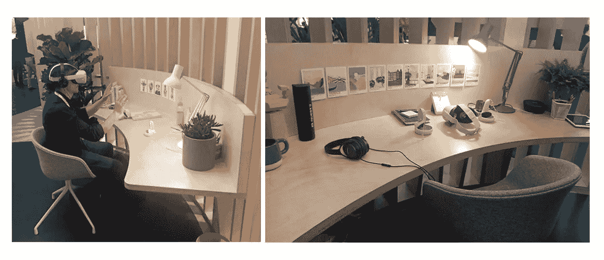
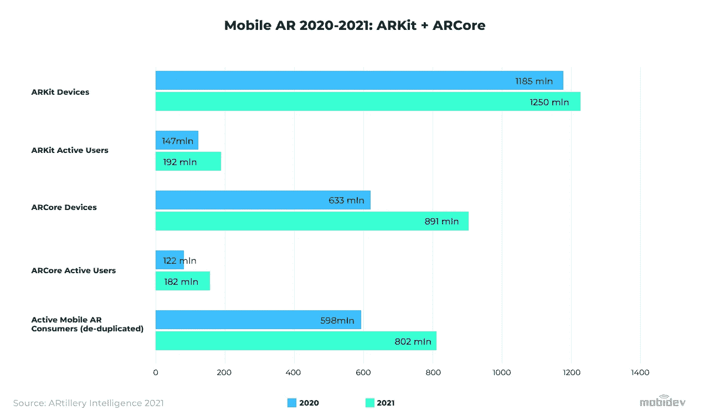
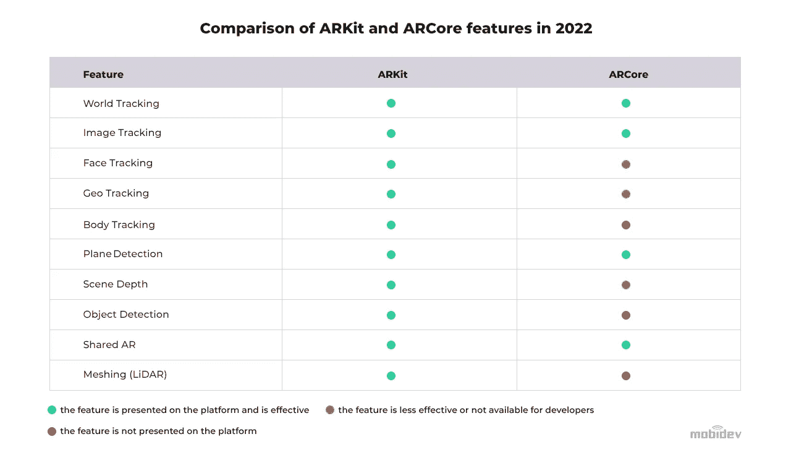
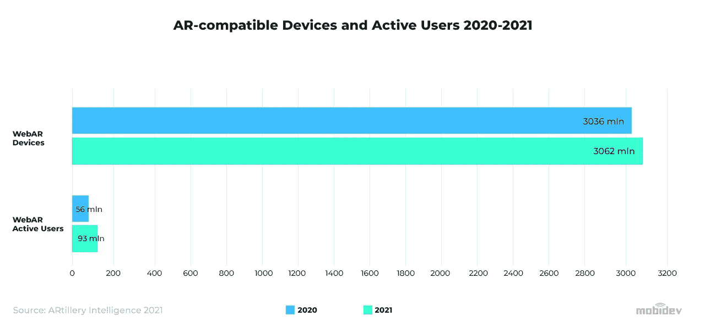
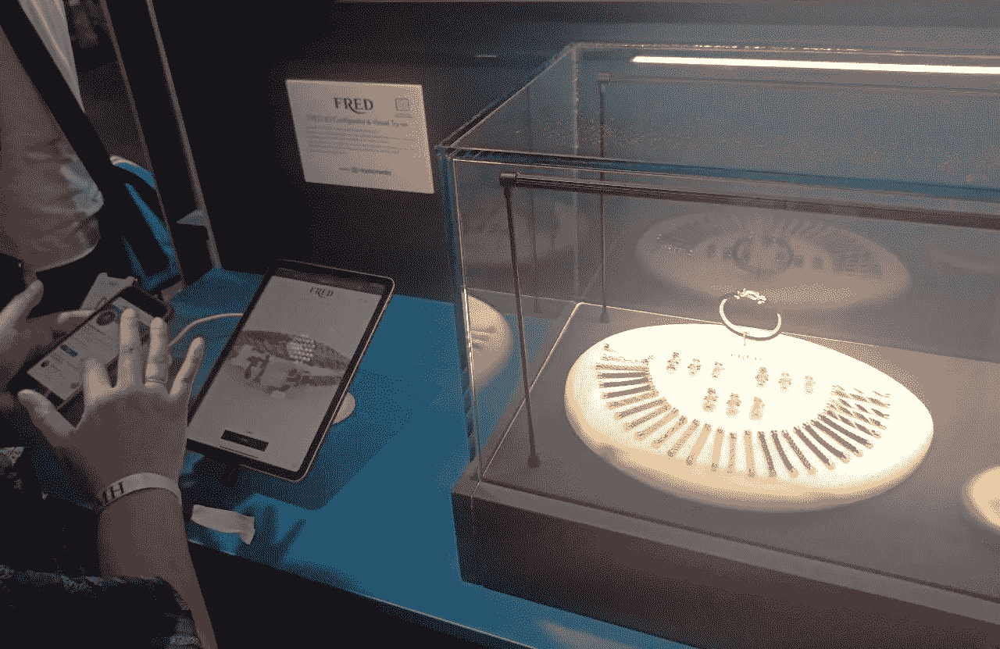
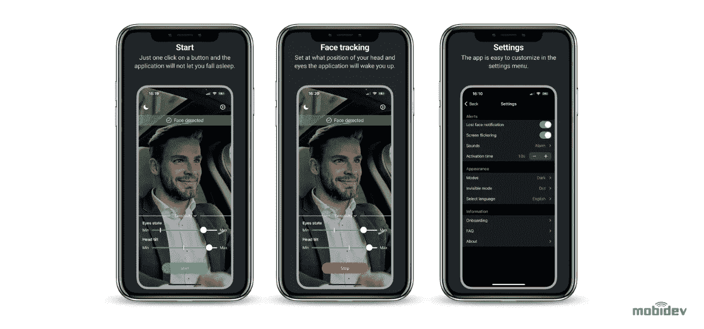

# 12 增强现实趋势 2023:沉浸式技术的新里程碑

> 原文：<https://medium.com/geekculture/12-augmented-reality-trends-2023-new-milestones-in-immersive-technologies-753d65475664?source=collection_archive---------18----------------------->

创新技术将科幻变为现实，AR 无疑是其中之一。全息图，就像在星球大战和漫威电影中一样，现在在现实世界中围绕着我们，带来了一种新的身临其境的体验，它不仅仅是娱乐。今天，增强现实是一种有效的商业工具。

在许多不同的行业，如零售、商业、游戏、医疗保健甚至军事，增强现实被用于解决各种商业挑战。关注这些技术以了解行业的发展方向是非常重要的。当我们讨论这 12 个增强现实趋势在 2023 年取得进展时，请思考这些解决方案将如何惠及您自己的企业。

# 趋势 1:跳进元宇宙

你可能不会感到惊讶，增强现实正在与其他元宇宙技术一起使用。自从脸书的“元”更名以来，元宇宙在过去的一年里炮轰新闻媒体。然而，这不仅仅是营销废话。元宇宙科技公司的目标之一是打破数字世界和现实世界之间的壁垒。由于增强现实可以显示嵌入我们现实世界的虚拟对象，因此企业和消费者都有各种机会。

# 神使

如果我们要将数字体验带入现实世界，AR 是一个很好的开始。使用身体和面部跟踪，以及先进的场景深度感测，公司已经在研究实现这一目标的相机过滤器。Geenee AR 和 Ready Player Me 携手合作，让这一体验成为现实。通过将你的头像插入 Geenee 的 WebAR Builder 软件，你可以有效地在镜头前“佩戴”你的头像。该软件还考虑到了你的准备好的玩家角色身上的装饰物品，包括非功能物品形式的配件。

这项技术并不新鲜。它已经在 Snapchat 和 Instagram 等应用程序中使用了很长时间。然而，创新的元素是该应用程序如何允许用户将他们在其他平台上使用的头像放到应用程序中，并在 ar 中使用。在未来，这项技术可以用来更好地混合虚拟会议。如果您团队中的一个人使用 VR 头戴设备参加会议，而您没有使用 VR 头戴设备，则此人的 AR 头像可以在您的会议上代表他们。

*Horizon Workrooms, the “metaverted” meeting rooms, presented by Meta group on VivaTech 2022*

制造更具成本效益和功能更强大的 AR 耳机是这里的头号进入壁垒。时间会告诉我们技术是如何发展的。

# 空间音频

虽然表面上看起来可能不像是增强现实技术，但空间音频对于增强 AR 体验的沉浸感非常重要。元宇宙的技术人员痴迷于将我们所有的五种感官都纳入其中，我们的听觉也不例外。为了让 VR 和 AR 体验更具沉浸感，需要 3D 音频。用户应该能够根据自己的位置判断声音在 3D 空间中的来源。

Meta 最近为其 AR Spark Studio 添加了一个高级引擎，通过混合多种声音来创建声音效果。这允许创作者创建多感官效果，允许人们使用视觉和声音来更加沉浸在增强现实体验中。通过这种方式，我们可以使用 AR 效果来播放声音，以响应人类的交互。

# 将数字产品带入现实世界

元宇宙迷喜欢将数字世界的东西带入现实世界，反之亦然。这项技术实际上在元宇宙热之前就已经存在了。例如，Meta 正在致力于在 AR 中展示[数字收藏品。所有创作者需要做的就是将他们的 NFT 作为 2D 虚拟对象导入 Instagram Stories，并将它们与“在 AR 中查看”功能相结合。这将为收藏家和创作者打开新的机会，让他们能够在钱包之外访问和分享他们的 NFT，这肯定会迅速成为 2023 年增强现实市场的主要趋势之一。](https://sparkar.facebook.com/blog/introducing-digital-collectibles-in-ar/)

也有一些关于虚拟艺术，或来自现实世界的艺术作为 AR 体验提供的嗡嗡声。例如，世界上第四古老的拍卖行苏富比已经开始通过 Instagram 过滤器向投标人提供 AR 体验，允许他们近距离亲自观看拍卖的艺术品。苏富比利用这项技术在[以 1.212 亿美元](https://www.the-outlet.com/posts/sothebys-instagram-filter)卖出了一幅画。

# 趋势 2:增强现实遇上人工智能

人工智能有两种方式可以很好地与增强现实结合:

1.  人工智能为 AR 发挥作用所需的面部和空间识别软件提供动力。
2.  AR 和 AI 解决方案可以共同提供创新的解决方案。

这些角色不一定是排他的。他们很容易融合在一起。

# AI 让 AR 工作得更好

增强现实和人工智能是独立的技术。然而，由于 AR 的需求，AI 和 AR 合作得很好也不足为奇。必须使用复杂的算法来理解环境的传感器数据。人工智能可以简化这一过程，并使其比完全由人类制作的模型更准确。

实践中的一个例子是应用程序 ClipDrop。该应用程序允许用户快速将现实世界中的项目数字化为 3D 对象，用于 PowerPoint、Photoshop、Google Docs 等程序。3D 扫描也可以用于将真实世界的物体导入元宇宙环境。3D 扫描也可能是企业加快虚拟试用体验产品供应的一个好方法。

自动设计是 AR 和 AI 结合的另一个用例。一个名为 SketchAR 的应用程序就是这种技术的一个例子。用户可以使用这款应用在 AR 中自由绘制。然而，他们也可以使用人工智能来为他们画画。人工智能可以快速创建结构。这表明人工智能程序有可能使用真实世界作为源环境来设计 3D 空间中的对象。在未来，这可能意味着人工智能将能够设计和创建用于现实世界的结构。

# 趋势#3:移动增强现实正在发展

移动设备是提供增强现实体验的主要工具之一。大多数消费者都有某种移动设备，AR 耳机尚未成为消费者使用的主流。正因为如此，企业发现了许多利用移动设备进行增强现实的机会。这些年来，这项技术也有了显著的进步。

# ARCORE 的地理空间 API

2022 年，谷歌推出了新的地理空间体验 API。这允许开发者创建与空间中特定位置相关的体验。在过去，AR 体验完全与用户相关，或者在用户设置的任意位置。

地理空间 API 允许开发者为 AR 内容设置经纬度坐标。扫描物理空间也没有必要。它的工作原理与苹果 ARKit 定位锚非常相似，将周围区域的图像与谷歌街景图像进行比较，几乎可以瞬间确定具体位置。

# ARKIT 6 增强功能

苹果公司在 2022 年 WWDC 发布的 [ARKit 6 升级版](https://developer.apple.com/augmented-reality/arkit/)中引入了几项新功能。其中一个是 ARKit 内容被使用时的 4K 视频记录。深度 API 也获得了升级，使场景遮挡和其他体验更加真实。苹果的激光雷达扫描仪可以快速准备 AR 体验，他们将这项技术称为“即时 AR”。

苹果还改进了动作捕捉功能。当相机聚焦于另一个人时，可以从他们的运动中获取运动捕捉数据，并应用于 3D 模型。另一个最新的升级是人物遮挡，它允许虚拟物体在场景中的人的前面和后面通过。

ARKit 6 增强功能的一个主要例子是通过 [RoomPlan](https://gamingsym.in/ios-16-roomplan-api-creates-3d-floor-plans-using-lidar/) ，这是一种利用激光雷达扫描快速创建房屋或其他结构平面图的解决方案。

# ARCORE VS ARKIT

苹果和谷歌在增强现实领域的竞争在过去几年中或多或少是相同的。像往常一样，这两种技术在软件方面并驾齐驱。

然而，硬件是事情变得更有趣的地方。苹果的激光雷达扫描仪和三星高端设备上的类似技术可以利用最高质量的 AR 体验。然而，Android 设备之间存在各种各样的硬件差异。许多 Android 设备根本不够强大，无法处理更高端的 AR。

正因为如此，企业需要对他们想要提供的 AR 体验的种类进行战略规划。如果他们想用能处理高质量体验的设备为更小、更富有的观众提供高质量的体验，他们可以尽情发挥想象力。然而，如果一家企业正在寻求更多设备的无障碍体验，他们需要用一个更简单的应用程序来缓和一下。

# 趋势#4: WebAR:折衷的更好的可访问性

增强现实的另一个重要趋势是 WebAR。WebAR 由网络浏览器驱动，不需要用户下载额外的软件。这是可访问性的最佳情况。然而，这是有代价的——WebAR 提供了最基本的 AR 体验，缺乏原生 AR 在移动设备上可以提供的许多功能。

然而，在某些情况下，WebAR 对于简单的体验非常有用。比如给脸加滤镜，改变头发或者物体的颜色，背景替换，简单的 3D 物体。有了 WebAR，更简单的虚拟试穿体验成为可能。欧莱雅和[美宝莲](https://www.maybelline.com/virtual-try-on-makeup-tools)等许多企业都在化妆品中使用这些成分。

[来自世界领先的 WebAR 开发平台第八墙](https://youtu.be/XwGNsdIbLbA)的 Tom Emrich 指出，WebAR 是弥合虚拟世界和现实世界之间差距的关键。虽然 WebAR 目前还不是很强大，但 WebAR 的发展可能是未来参与互联网的最重要的方式之一。第八墙正在继续改进 WebAR 技术，以实现这一愿景。

# 趋势#5:跨平台增强现实日益突出

开发 AR 的一个主要挑战是让应用程序跨平台。还有一个不幸的事实是，跨平台应用程序很可能不如本地应用程序的全部潜力好。然而，如果采取正确的步骤，跨平台的应用程序可以有很高的质量。跨平台 AR 更容易编码，并可以加快上市时间。但是，性能和演示可能会受到影响。

一般来说，如果一个应用程序非常复杂，需要充分发挥原生功能的潜力，那么最好保持原生。然而，如果应用程序更简单，不需要极高的性能，跨平台就可以了。

例如，如果您正在创建一个在线商店，其中 90%的功能不依赖于平台，不需要最大性能，并且在 AR 中有一个简单的产品预览模块，那么您可以选择跨平台 AR。但是如果我们处理的应用程序的功能需要最高的性能或者依赖于平台，那么本地选项更好。这适用于 3D 扫描或 AR 导航等项目。

# 趋势#6: AR 眼镜，未来还是虚构？

似乎随着时间的推移，舒适且对消费者友好的 ar 眼镜就在眼前。最新的设备之一是 Meta 计划中的混合现实耳机，目前名为 [Cambria](https://mixed-news.com/en/metas-next-vr-ar-headset-cambria-all-you-need-to-know/) 。这是一个新的产品线，独立于他们成功的 Meta Quest 2。

然而，Cambria 耳机似乎更适合那些希望提前体验 AR 未来的富裕观众。因此，坎布里亚似乎不是每个人都希望的灵丹妙药。然而，这可能是朝着正确方向迈出的一步。

另一个需要注意的重要事情是苹果激光雷达扫描仪的演变。苹果是预计未来将推出以消费者为中心的 AR 耳机或眼镜的顶级公司之一。2020 年，他们先进的深度传感器被配备在 iPad Pro 上，后来又被配备在 iPhone 12 Pro 上。这项技术和处理越是小型化，我们就越有可能在未来舒适地佩戴“苹果眼镜”。

除了 AR 眼镜，还有更多创新设备有望在增强现实未来趋势中占据突出位置。2022 年 6 月，加州萨拉托加的 Mojo Vision 实验室举办了首次增强现实智能隐形眼镜演示。依靠眼球跟踪、通信和软件，AR 镜头与用户界面相集成，以实现增强现实体验。Mojo Lens 有一个定制的加速度计、陀螺仪和磁力计，可以持续跟踪眼睛的运动，以确保 AR 图像在眼睛运动时保持静止。

# 趋势#7:营销中的 AR

AR 在营销行业中有许多不同的应用。例如，名片是一种流行而简单的选择，可以与简单的 ar 解决方案配合使用。通过在营销材料(如名片)中添加交互性，您可以从竞争中脱颖而出，并为潜在客户提供全新而激动人心的体验来了解您的公司。

下面的 MobiDev 演示展示了如何使用 ARKit 实现这一商业理念。

AR 手册也是希望为客户提供更详细、功能更丰富的说明和文档的企业的热门选择。AR 不仅允许以一种引人入胜的方式传递信息，而且还显著改善了用户体验，而无需迫使购买者花费大量精力来掌握一种或另一种机制。

**下面的 MobiDev 演示展示了咖啡机的虚拟用户指令，以展示 AR 虚拟手册的实际应用。**

AR 在广告中也有很多运用的机会。这些年来，网络横幅广告在用户中的受欢迎程度显著下降。横幅广告的点击率从 2016 年的 [0.72%下降到 2019 年的 0.35%。](https://www.spaceback.com/post/how-banner-blindness-is-forcing-brands-to-shift-their-display-ad-strategies)出现这种情况的一个原因是，这些横幅广告会破坏用户试图访问的内容。然而，AR 广告可以提供更无缝的内容访问，减少对内容的阻碍。例如，通过脸书新的增强现实广告，用户可以从他们的时间线访问具有各种功能的特殊广告的 AR 体验。其中一些功能包括虚拟试穿、在家中放置虚拟物品等。

# 趋势#8:为室内和室外导航供电

2022 年， [AR 导航](https://mobidev.biz/blog/augmented-reality-indoor-navigation-app-developement-arkit)变得比以往任何时候都更加流畅和可实现。最重要的是，蓝牙低能量(BLE)天线、Wi-Fi RTT 和超宽带(UWB)等技术的兴起，使得室内导航比往年更加可行。这项技术最有用的应用之一是在大型室内场所显示 AR 方向，如配送中心、购物中心和机场。

**观看下面的演示，了解 MobiDev 如何实现企业园区导航的移动 AR**。

不应该忽视的一点是，消费者和企业用户都可以使用这项技术。正如商店中的客人可能会使用 AR 室内导航来找到他们正在寻找的产品一样，配送中心的工作人员可能会使用它来找到他们仓库中的特定商品。虽然具有增强现实功能的舒适和负担得起的眼镜还没有出现，但增强现实在配送中心、商店和其他部门的商业应用能力已经存在。

有了室内导航，网上购物店内提货(BOPIS)服务可以变得更加高效。负责在商店中“挑选”商品以完成订单的团队成员可以使用 AR 方向直接导航以找到商品，而不是遵循坐标方向来找到商品。这就省去了浏览许多类似商品并找到正确的商店通道和区域的时间。团队成员所要做的就是举起他们的设备，在屏幕上看到方向。

但是，也有一些限制需要考虑在内，比如在商店里被放错地方的物品。如果他们被客人移动或错误地登录到系统，团队成员可能会在他们的设备上使用 AR 导航来到达货架上的空白位置。

# 趋势 9:医疗保健和增强现实

根据 [Deloitte Research，](https://www2.deloitte.com/global/en/pages/life-sciences-and-healthcare/articles/global-health-care-sector-outlook.html)增强现实和人工智能将通过提供支持 AR/MR 的免提解决方案和基于人工智能的诊断工具，改变传统的医疗保健业务模式。例如，微软 Hololens 2 可以向外科医生提供信息，同时允许他们在手术过程中使用双手。

随着与新冠肺炎相关的持续限制，增强现实解决方案的使用对于解决远程患者支持的复杂性和医院负担的增加等问题变得越来越重要。这包括远程手术解决方案和心理健康应用程序，帮助人们在这些困难时期保持心理平衡。例如，在 3D 屏幕上绘图和注释等功能可以使医生和患者之间的交流更加容易和清晰。远程协助工具还可以帮助临床医生支持他们的患者，同时减少停机时间。

结合[机器学习算法](https://mobidev.biz/blog/5-essential-machine-learning-techniques)，AR 技术可以成为疾病检测的高效选项。早在 2020 年，谷歌宣布为国防部(DoD)开发一种基于 AR 的显微镜，以提高癌症诊断和治疗的准确性。这种混合设备使用摄像机实时捕捉图像，然后使用计算机诊断进行处理，以立即显示结果并在早期诊断疾病。

# 趋势#10:增强现实购物体验

新冠肺炎疫情的出现需要大量的创新来帮助扩展网上购物者的体验。增强现实是从这场颠覆中受益最大的技术之一。这导致了[虚拟试衣间](https://mobidev.biz/blog/ar-ai-technologies-virtual-fitting-room-development)和虚拟试穿方案的爆炸式增长。

品牌正在积极采用 AR 技术来改善用户在网上购物时的体验。例如，迪奥多次推出 AR 鞋体验，让顾客在购买前虚拟试穿鞋子。早在 2020 年，迪奥就与 Snapchat 合作，首次发起了这样的倡议。

FRED Jewelry 使用 AR 让客户在公司网站上用 3D 配置器定制手镯，并虚拟试戴。

*FRED Jewelry Virtual Try-On Presented on Viva Tech 2022*

# 智能镜子

随着隔离封锁即将结束，实体店已经看到顾客回归，ar 仍然有机会帮助改善店内体验。智能镜子是丰富店内体验和减轻试衣间负担的好方法。顾客可以走到智能镜子前，用智能手机上没有的先进 AR 技术在店内试穿衣服。

在商店里没有特定尺寸的衣服需要运送给顾客的情况下，智能镜子也很有帮助。智能镜子和虚拟试衣间技术可以帮助满足这些需求。

# 趋势#11:制造业中的增强现实

许多 AR 应用程序都是以消费者为中心的。然而，AR 在制造业等行业有很大的应用潜力。例如，工人培训可以通过由 CAD 数据支持的 [AR 体验来增强。](https://www.automationworld.com/process/iiot/article/21259479/how-augmented-reality-became-a-serious-tool-for-manufacturing) AR 还可以协助技术人员完成日常维护流程。AR 应用程序可以突出正在工作的设备的元素，以指导技术人员完成手头的过程。这通常通过头戴式解决方案比通过移动应用程序更容易实现。

在更简单的应用程序中，如果设置得当，AR 可以帮助工人获得工厂中对象的更多上下文信息。通过使用移动设备突出显示某个对象，工作人员可以了解有关该对象的更多信息，以及是否需要采取任何措施，如维护。

AR 还有望实现远程故障排除。远程支持代理可以在屏幕上放置虚拟标记，以便工作人员在电话的另一端进行跟踪。这可以在工厂提供更丰富、更有价值的远程支持。

# 趋势#12:汽车行业的增强现实

增强现实有许多不同的应用，可以用于汽车行业。在这个领域出现的一项更具未来感和有趣的技术是通过使用[平视显示器(HUD)来突出道路上的物体。](https://www.thevirtualreport.biz/feature/65274/augmented-reality-expected-to-disrupt-the-automotive-sector/)这可以让驾驶员意识到危险和 GPS 方向，而不需要他们将视线从道路上移开。AR 还用于娱乐和信息，如 3D 汽车手册和其他应用程序。

# 5G 和停车

AR 在汽车行业的一个有趣应用是停车辅助。在 5G 连接的帮助下，空闲的停车位可以在司机的平视显示器上突出显示。这还可以提供大量数据，这些数据对于优化停车场和车库等停车设施的布局和操作非常有用。

# MOBIDEV 唤醒应用程序:驾驶员感知辅助

由 MobiDev 开发的[唤醒应用](https://apps.apple.com/ru/app/wakeup-by-mobidev/id1633075969)也可以成为在汽车行业使用增强现实的一个很好的例子。“唤醒”的目的是通过使用 ARKit 面部识别技术来检测驾驶员何时闭上眼睛或倾斜头部，从而帮助驾驶员保持清醒。如果眼睛一直闭着或者头歪得太久，这个装置就会发出警报，帮助司机醒来。

这项技术有发展的空间。例如，具有红外感应的原深感摄像头可以帮助在完全黑暗的情况下进行头部和眼睛跟踪。此外，人工智能可以检测到司机的行为，这些行为表明他们可能会昏昏欲睡，并在为时已晚之前提醒司机。这些是我们未来开发这些产品的方向。

# 增强现实的未来

随着时间的推移，增强现实市场将继续增长，特别是随着消费者越来越容易接触到技术。随着对元宇宙技术关注的显著增长，AR 是许多企业的下一步。那些玩长线游戏的人可能想早一点进入这个领域。

然而，那些寻求应对更直接的增长和变化的人可能会在零售和移动应用程序中获得更大的成功。支持 AR 的智能手机和平板电脑无处不在，是向用户宣传和扩展转化驱动体验的绝佳机会。

随着市场预计在 2028 年达到[977.6 亿美元，](https://www.fortunebusinessinsights.com/augmented-reality-ar-market-102553)很明显，增强现实是许多行业的未来。这种未来将由那些以创新方式适应当今挑战的企业来决定。为客户提供丰富 AR 体验的公司将更有能力在竞争中立于不败之地。

由[安德鲁·马卡罗夫](https://mobidev.biz/our-team/andrew-makarov)撰写，他是 [MobiDev](https://mobidev.biz/services/mobile-application-development) 的移动开发主管。

*全文原载于*[*https://mobidev . biz*](https://mobidev.biz/blog/augmented-reality-trends-future-ar-technologies)*，基于 mobi dev 技术研究。*