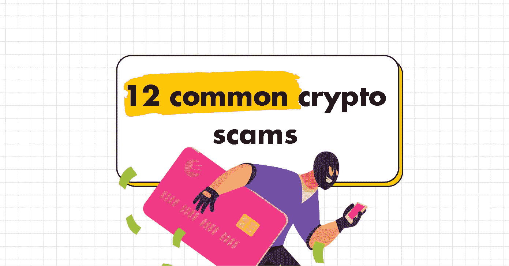

# 12 种常见的加密骗局

> 原文：<https://medium.com/geekculture/12-common-crypto-scams-a4bb59dcf62a?source=collection_archive---------19----------------------->

By me :)

# **1。勒索**

受害者收到一封电子邮件，声称他们的电脑被“黑客”入侵，黑客劫持了他们的网络摄像头，并记录下了“亲密”时刻。然后，骗子威胁要在网上发布视频，除非向他们支付一些比特币。

**2。假交易所**

“假”交易所通过以极低的价格提供比特币或其他密码来欺骗投资者。然后他们偷你的钱！

**3。免费赠品**

骗子提供免费的密码，以换取少量的“注册费”。一旦你付了费用，他们就消失了！

**4。冒名顶替**

骗子创建假冒名人的虚假社交媒体账户。这些账户被用来实施各种欺诈。

**5。恶意软件**

许多受害者最终会下载恶意软件和应用程序。这些应用程序可以在从受害者的剪贴板复制粘贴时更改加密地址。结果——你最终会把密码发送到骗子的地址，而不是你真正想要付款的人。

**6。面对面攻击**

永远不要亲自去见任何人购买密码。你可能会被抢劫，甚至被谋杀！骗子也可能用假币支付你，以换取你的密码。

**7。网络钓鱼邮件**

永远不要参与要求您提供种子短语、私钥或密码的电子邮件。这些电子邮件可能看起来可信，但请记住，任何人都没有合法的理由要求您提供种子短语、私钥或密码。

**8。钓鱼网站**

人们通过点击虚假电子邮件中的链接，有时甚至通过搜索引擎结果，登陆钓鱼网站。这些网站可以窃取你的密码，甚至欺骗你安装恶意软件。

**9。庞氏骗局**

当心那些以少量存款换取高额保证回报的计划。

**10。传销**

当心“金字塔计划”,它根据你邀请加入加密网络的人数向你承诺高额回报。

11。泵和转储

在泵和转储计划中，骗子人为地“泵”出密码的价格，并将其出售给不知情的受害者。一旦有足够多的人购买了密码，骗子就会消失，密码的价值就会暴跌至接近于零。

12。诈骗硬币和地毯拉

虽然有许多伟大的密码，也有许多骗局硬币。投资新密码时要小心。在投资之前，仔细查看团队、白皮书、网站和其他可用信息。

**结论**

有很多骗局正在进行，但这并不意味着所有的加密是一个骗局。有很多令人兴奋的创新正在进行，你不可能拥有所有的好处而没有坏处。保持警惕！

# 👇评论一下我们还需要提防什么样的骗局。

> 👋**在[媒体](/@pooriaarab)—[LinkedIn](https://www.instagram.com/pooria.arab/)—[Twitter](https://twitter.com/pooria_arab)—[insta gram](https://www.instagram.com/pooria.arab/)—[抖音](https://www.tiktok.com/@pooria.arab)**
> 
> 更多关于 Web3，Crypto，NFTs，DeFi 等的好东西…
> 
> 点击获取 NFT 发布战略