# 12 因素应用程序

> 原文：<https://medium.com/geekculture/12-factor-app-3ef4c61ddecd?source=collection_archive---------12----------------------->

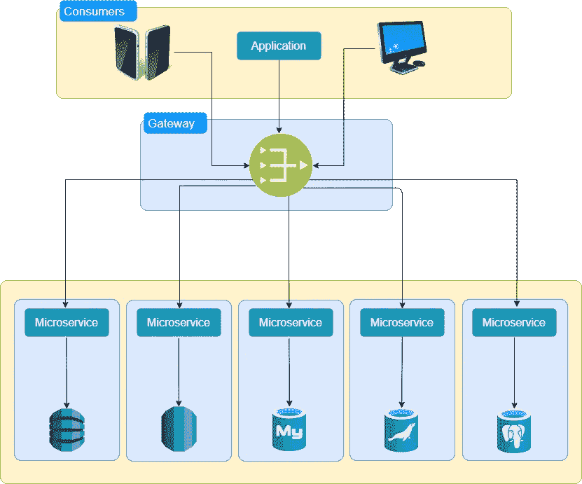

随着微服务的出现，人们不断需要考虑如何管理大量应用、存储库管理、开发备份、独立部署、弹性、扩展、跟踪和监控。

12 因素应用程序是一套指导原则，有助于创建可伸缩、有弹性、独立和高性能的应用程序。这些原则最初是在开发 Heroku 平台时使用的。

以下是一些原则:

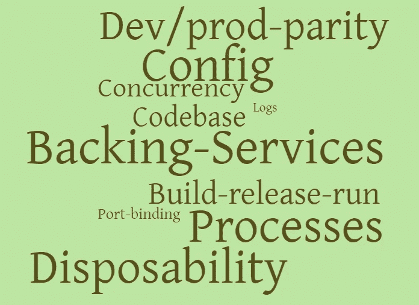

1.  **代码库**:

> 在修订控制中跟踪一个代码库，部署多个

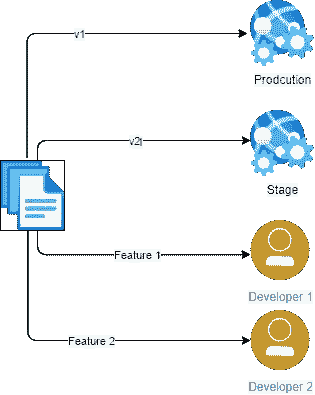

应该有一个可以独立部署和测试的单一代码库。代码库应该签入到一个源代码控制系统中，比如 git、svn 等。可能有多个开发人员同时在同一个代码库上工作，源代码控制特性分支可以用于此。不同的版本可以部署在测试环境中。

**2。依赖关系:**

> 显式声明和隔离依赖项

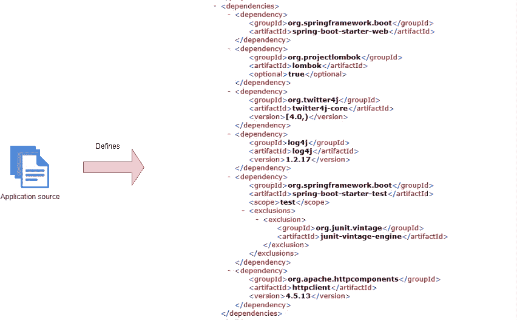

应该从外部跟踪和管理应用程序的所有外部依赖项。应该有一个依赖项管理工具，它应该列出系统所需的所有依赖项。像 Maven 和 Gradle 这样的依赖管理工具可以帮助定义这些。

**3。配置**

> 在环境中存储配置

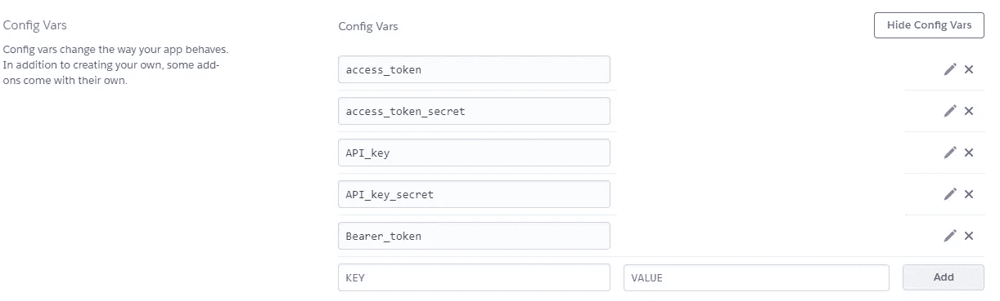

Configuration properties in Environment

应用程序将依赖于许多特定于环境的属性。这些属性不应该是代码库的一部分，也不应该硬编码在代码本身中。

因为这些可以根据环境进行验证，所以应该从外部将它们注入到代码中。它可以在环境属性中配置，像 spring config server 这样的配置服务器可以用于此目的。它还有助于在不更改代码库的情况下更改属性，并且不需要重新构建。

**4。后台服务**

> 将后台服务视为附属资源

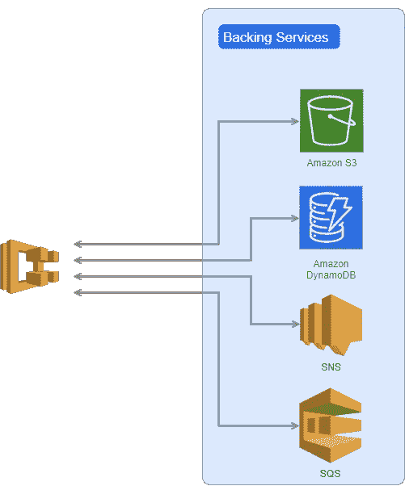

您的应用程序需要大量的服务，可能是数据库、任何消息传递系统等等。这些资源应被视为附属资源。

理想的状态是这些服务可以很容易地与其他提供者的服务交换，而不需要修改代码。它应该是变化应该被限制的配置。

**5。构建、发布和运行。**

> 严格分离构建和运行阶段

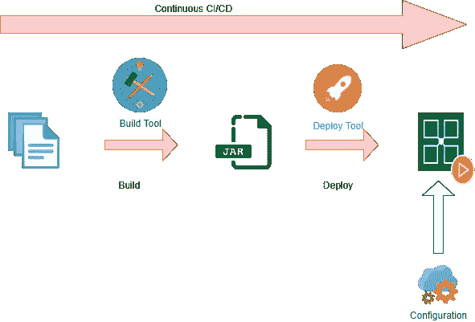

构建、发布和运行的三个阶段应该相互分离。

*   构建阶段是构建代码和创建可执行文件的阶段
*   发布是指可执行文件与特定于环境的配置相结合，并准备好运行的时候
*   运行阶段是指应用程序正在运行并执行一些任务。

CI/CD 工具可以用来实现持续的构建、质量检查和部署。

**6。流程**

> 将应用程序作为一个或多个无状态进程执行

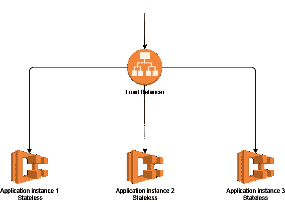

应用程序可以作为一个进程在一个环境中执行。它可能有多个实例，并且不应该在应用程序中保存状态。它通常应该保存在底层的附属服务中，如数据库。这有助于应用程序按需扩展，而不会丢失信息。

如果需要，可以使用 Redis 这样的共享和分布式缓存技术来存储信息。在初始请求后帮助请求到达同一实例的粘性会话违反了 12 因素应用程序的原则。

7 .**。端口绑定**

> 通过端口绑定导出服务

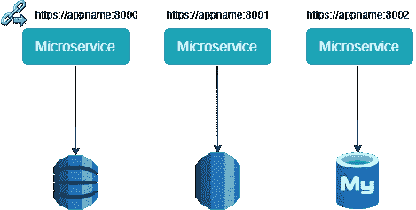

十二要素应用程序是完全独立的，不依赖于在运行时将 web 服务器注入执行环境来创建面向 web 的服务。该 web 应用程序通过绑定到一个端口，并侦听来自该端口的请求，将 HTTP 作为服务导出。

Spring Boot 是这个原则的一个很好的例子。它可以帮助在应用程序中嵌入像 tomcat 这样的应用服务器，并且不需要外部服务器注入就可以在任何环境中运行。依赖性是通过 Maven 这样的依赖性管理工具提到的。

**8。并发**

> 通过流程模型向外扩展

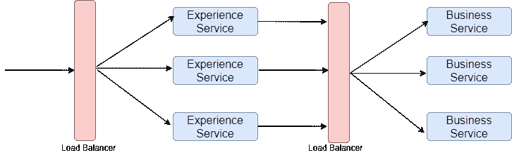

这一原则表明，随着应用程序负载的增加，应用程序应该能够水平扩展(即添加更多的应用程序实例)。这也有助于在负载降低时缩小应用程序的规模，从而节省成本。

这也应该在多个层上完成，以便每个层可以独立扩展。可以使用负载平衡器管理多个实例上的负载分布。

**9。一次性**

> 快速启动和平稳关闭，最大限度地提高稳定性

应用程序的设计应该尽量减少启动时间。这使得应用程序能够快速伸缩。

根据需要添加新实例或删除现有实例时，系统不会受到影响。这也称为系统一次性。

10。开发/生产奇偶校验

> 让开发、试运行和生产尽可能相似

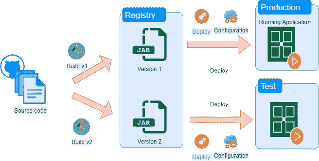

该原则指出，非生产环境和生产环境之间的差异应该最小化。这可以通过减少发布周期的时间来实现。

目的是频繁发布，以便不同分支的代码库保持同步。在所有环境中，后台服务应该保持相似。这使我们避免了特定环境的缺陷。

持续集成和部署是实现这一目标的途径。测试阶段应该尽可能自动化，这样可以更快地运送产品。

**11。日志**

> 将日志视为事件流

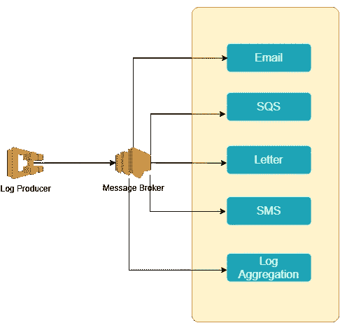

Logs 原则提倡以流的形式发送日志数据。可能对这种数据感兴趣的消费者可以订阅这种数据流。它可以是日志聚合系统、警报系统或审计系统。消费者可以根据他们的日程日志采取行动。

**12。管理进程**

> 作为一次性流程运行行政/管理任务

有许多流程需要运行一次。这些可能是从一个提供商到另一个提供商的数据库迁移，第一次加载数据。

这样的脚本应该是代码库本身的一部分。这些也应该在与系统中任何其他进程相似的环境中运行。此类流程的执行应使用与主流程类似的工具实现自动化，并应遵循 CI/CD。

如果你喜欢这篇文章，请跟随我阅读更多这样的内容。你也可以在推特上关注我

 [## 安基塔加瓦尔

### 解决方案架构师| Java 开发人员|金融技术|技术顾问|

twitter.com](https://twitter.com/techie_ankit)