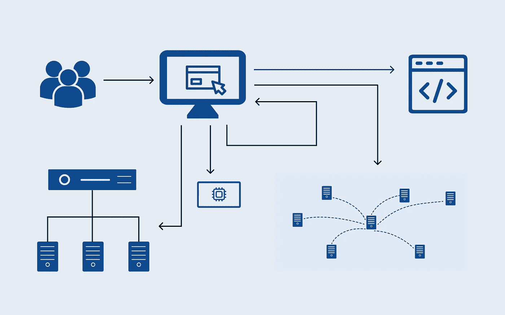

# 您需要了解的 12 种前端性能模式

> 原文：<https://medium.com/geekculture/12-front-end-performance-patterns-you-need-to-know-def550620464?source=collection_archive---------0----------------------->

## 使用这些性能解决方案减少页面加载时间

Front End Performance Diagram Illustration | Created by Author

> 从 1 秒的加载时间增加到 5 秒的加载时间会使你的跳出率增加 90% ( [Google](https://www.thinkwithgoogle.com/marketing-strategies/app-and-mobile/mobile-page-speed-new-industry-benchmarks/) ，2017)。