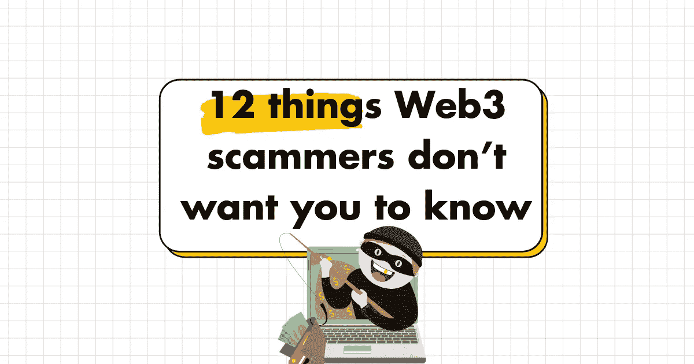
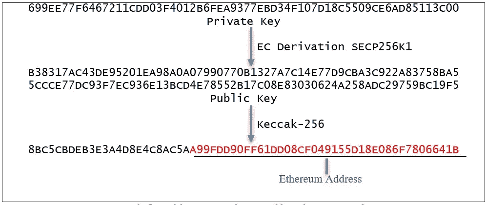
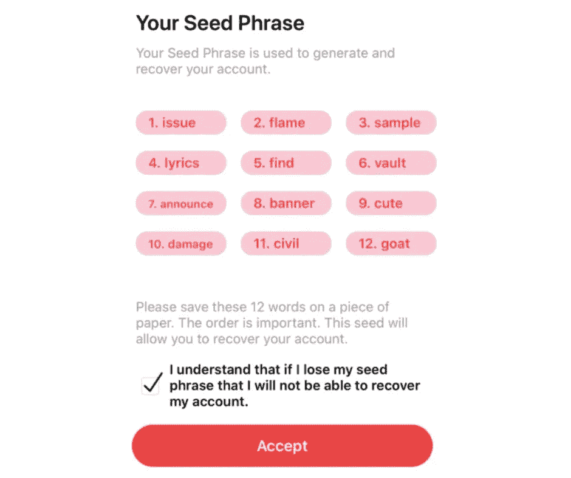
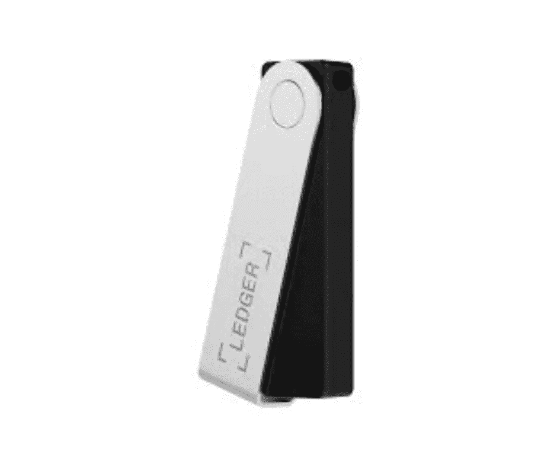
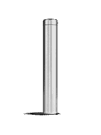

# Web3 骗子不想让你知道的 12 件事

> 原文：<https://medium.com/geekculture/12-things-web3-scammers-dont-want-you-to-know-24a79a02c8f8?source=collection_archive---------3----------------------->

## 保证 NFTs 和加密资产的安全似乎是不可能的。

让我们改变这一点。

> TLDR:
> 
> 1.基本术语和概念
> 2。选择你的钱包
> 3。该做的事
> 4。不要做的事情。保护你的种子短语
> 6。避免 NFT 骗局
> 7。网络钓鱼攻击
> 8。不和谐的骗局
> 9。盲人签名问题
> 10。OpenSea 黑客课程
> 11。新的 Web3 思维模式
> 12。在骗子的脑袋里

# 1.基本术语和概念

**地址** —代表可以收发加密货币的钱包的字符串

这就像现实生活中的地址或电子邮件。

每个地址都是独一无二的，并且标记了区块链上一个钱包的位置。

**公钥** —允许您接收加密货币交易的字符串

它配有一把私人钥匙。

任何人都可以向您的公钥发送交易。

你需要私人钥匙来打开它们。

您的地址是您的公钥的缩写形式。

**私钥** —让您能够证明所有权并解锁与您的公共地址相关联的资产

而你的公钥对交易进行加密。

您的私钥解密交易。

以太坊私钥是 64 个随机十六进制字符或 32 个随机字节。

**种子短语** —链接到您的私钥的一系列单词

您的种子短语就像您的银行账号、社会保险号、出生日期、家庭住址和 ATM pin 码——集于一身。

如果有人得到它，他们可以拿走你所有的加密资产。

可能看起来像👇

**热门钱包** —或软件钱包

一种用于存储您的私钥的数字存储形式，您可以在您的计算机或手机上访问它，并连接到互联网。

由于互联网的连接，热钱包不如冷钱包那样安全。

**冷钱包**——还是五金钱包

脱机存储您的私钥的物理设备。

加密货币从不存储在硬件钱包本身中。他们总是住在区块链。

硬件钱包存储您的私钥。

这种形式的存储没有备份。

如果你把冰冷的钱包放错了地方，你就失去了投资的机会。

冷钱包的价格在 60 到 200 美元之间。

它们看起来像一个 u 盘。

# 2.选择你的钱包

你需要一个热/在线钱包和冷/离线钱包。

**对于以太坊交易:**

对在线事务使用元掩码。
然后用 Ledger 离线存储密钥。

[阅读](https://www.ledger.com/academy/security/the-safest-way-to-use-metamask)如何在分类帐中使用元掩码。

**对于索拉纳交易:**

使用虚拟系统进行在线交易。
然后用 Ledger 离线存储密钥。

[阅读](https://www.ledger.com/academy/the-safest-way-to-use-phantom-with-ledger-hardware-wallet)如何将 Phantom 与 Ledger 一起使用。👇

# 3.DO 的

✅DO 从小额交易开始，只有当你掌握了窍门后才会增加规模。

✅:在任何交易之前，你都要做好自己的调查。

✅通过使用隔离你的账户——硬币的长期存储，免费空投，铸造非功能性食物等等。

✅一定要把你的种子短语离线储存在纸上，或者安全的钢板或胶囊上(下面会有更多相关内容)。

✅一定要使用你钱包里的手机应用程序版本。手机比笔记本电脑更安全。

# 4.禁忌

❌不要发送资产到不支持你的密码的钱包。你会失去它。例如:不要把索拉纳的资产存入比特币基地的钱包。

❌不要把你贵重资产的钥匙放在一个热的(在线)钱包里，而是把它们转移到一个冷的(离线)钱包里。

❌不要在你的谷歌硬盘或 iCloud 上备份你的种子短语。这是可以破解的。离线存储您的种子短语。

❌不要给你的种子短语拍照。

❌不要点击通过 DMs 或电子邮件发送给你的链接。永远不会。

# 5.保护您的种子短语

> 不要与任何人分享你的种子短语！你妈妈也不知道

这让他们完全控制你的资产。

将你的种子短语离线储存在纸上，或者最好储存在一个[隐钢胶囊](https://shop.ledger.com/products/cryptosteel-capsule-solo)里。

骗子的主要目标是窃取您的种子短语或您的加密钱包的私钥。

有了它，他们可以从自己的设备登录到您的钱包，并将您所有的资金和非功能性交易转移到他们自己的钱包。

一旦发生这种情况，就绝对没有办法挽回了。

确保 seed 短语的安全，不与任何人或在任何网站上共享它，这一点至关重要。

在任何交易中，您永远都不需要您的种子短语或私钥。

如果有任何网站或个人向你索要，请立即离开！
此处阅读更多

# 6.避免 NFT 骗局

在购买一个系列之前，做好你的尽职调查。

在 NFT 铸造期间，请确保您连接到正确的网站。

骗子经常通过对原始域名进行轻微更改来克隆网站。

**双重检查项目名称。**

始终寻找经过验证的徽章。

核对物品数量、体积和底价。

在谷歌上使用反向图像搜索来检测假货。

# 7.网络钓鱼攻击

骗子瞄准 NFT 收藏家最常见的方式之一是通过网络钓鱼攻击。

他们可能会用虚假空投引诱你，诱骗你申领代币或与代币互动。

当您继续索赔时，您会与一个恶意的智能合同进行交互，该合同会秘密地寻求获取您的资产的许可。

如果你无意中批准了合同，它会耗尽你钱包里的资产。

不要相信——核实一切！

# 8.不和谐的骗局

不和谐对信息和社区来说很重要，但也有风险。

当心:
带有假冒 NFT 项目的服务器。
带链接的 DMs。
任何说他们需要你的种子短语的人。
免费不和谐硝基订阅。

此处深入

# 9.盲签问题

当您在没有完全提取和显示关键合同细节的情况下签署智能合同时，这就是盲签。

这是一个可以被利用的漏洞。

点击了解更多

# 10.open sea Hack:web 3 安全性的关键要点

撤销权限
避免盲签名
不混淆 web3 和电子邮件

点击阅读更多

# 11.加密安全和新的 Web3 思维模式

与 [@eddylazzarin](https://twitter.com/eddylazzarin) 和 [@ZoranBasich](https://twitter.com/ZoranBasich) 的 [@a16z](https://twitter.com/a16z) 播客 Ep 639

保护加密的最佳实践和选项，包括从密码到加密钱包等实用方法。

在这里阅读更多

# 👇你还有什么 Web3 安全提示？

> 👋**在[媒体](/@pooriaarab)—[LinkedIn](https://www.instagram.com/pooria.arab/)—[Twitter](https://twitter.com/pooria_arab)—[insta gram](https://www.instagram.com/pooria.arab/)—[抖音](https://www.tiktok.com/@pooria.arab)**
> 
> 更多关于 Web3，Crypto，NFTs，DeFi 等的好东西…
> 
> 点击获取 NFT 发布战略