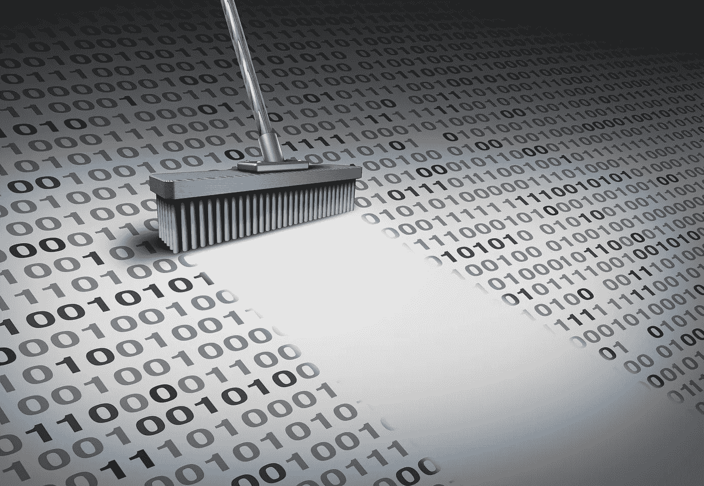

# 数据科学家(至少)60%的时间使用 14 个熊猫函数

> 原文：<https://medium.com/geekculture/14-pandas-functions-that-data-scientists-use-60-of-the-time-ce8fe78924?source=collection_archive---------0----------------------->

## 数据科学中常用的熊猫函数。

Image via Shutterstock under license to Frank Andrade

据[福布斯](https://www.forbes.com/sites/gilpress/2016/03/23/data-preparation-most-time-consuming-least-enjoyable-data-science-task-survey-says/?sh=387220e36f63)报道，数据科学家 60%的时间花在清理和组织数据上。这表明数据清理和数据争论在数据科学项目中是多么重要。