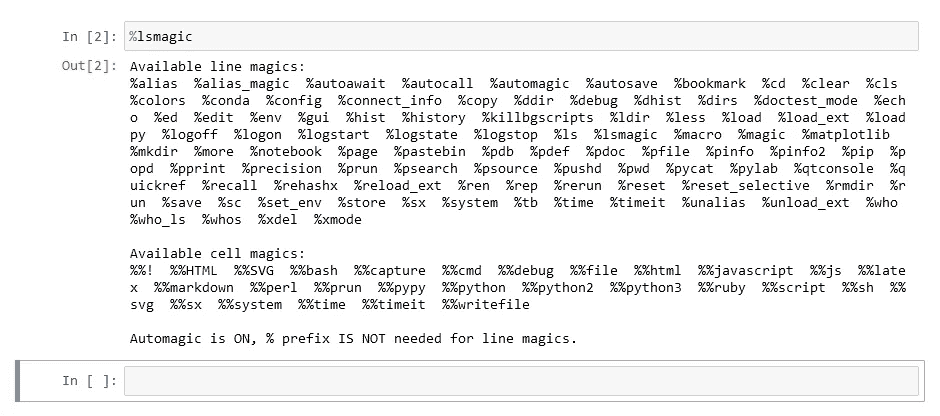
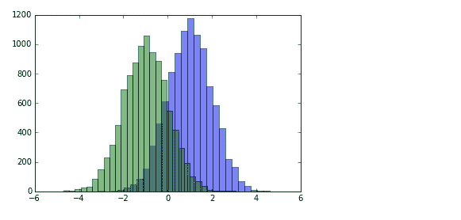
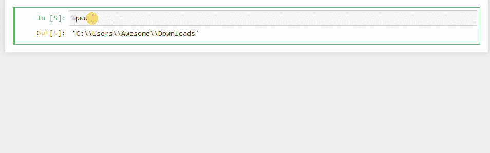
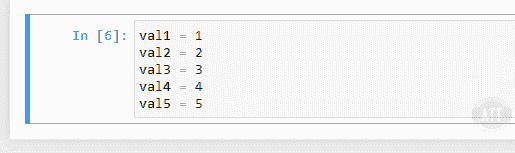
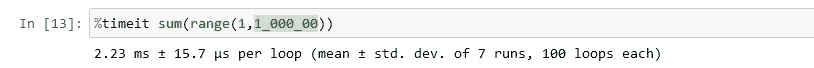
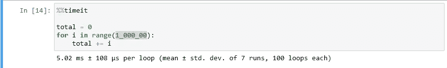
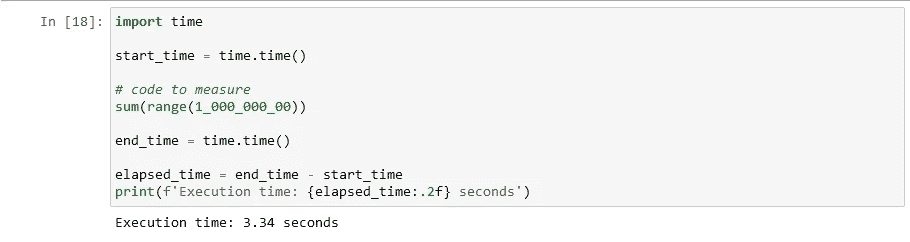
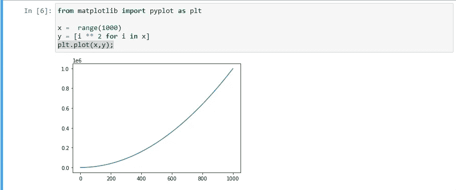
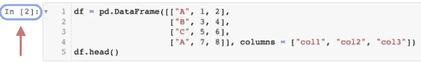

# 15 个黑仔·朱庇特的小窍门，保证为你节省时间

> 原文：<https://medium.com/geekculture/15-best-jupyter-tips-tricks-754831bba408?source=collection_archive---------0----------------------->

## 当你开始使用它们的时候


Image by the author.

作为数据科学家，我们几乎每天都在使用 Jupyter 笔记本，从加载数据到用它创建和部署模型。

我喜欢 Jupyter 笔记本，因为它们简单、流线型的设计对于任何面向 python 的任务都是不可或缺的。尤其是，只要内核是活动的，就用数据的子集运行和测试脚本对我来说是改变人生的。

然而，由于这个工具的简单性，我们经常会犯一些错误，浪费时间和计算成本。这两者都是项目的基本支柱。

在本文中，我们将讨论每个数据科学家都必须知道的一些惊人的技巧和诀窍。这可以节省时间，降低计算成本。

我们开始吧！🔥

# 1.魔法命令🪄

在 Jupyter 笔记本中，“魔法命令”是特殊的命令，不是 Python 语言的一部分，但是让你的生活更容易。这些命令前面有一个`%`符号。

神奇的命令可能很有用，可以直接嵌入 python 代码中，解决常见问题，比如列出当前目录中的所有文件，或者更改当前工作目录。

以下是一些常见的魔法命令:

*   `%run`:在当前内核中运行 Python 脚本。
*   `%load`:从脚本中加载代码，并在当前内核中运行。
*   `%who`:列出所有变量。
*   `%timeit`:计时单行代码的执行时间。
*   `%debug`:在异常点进入调试器。
*   `%matplotlib inline`:显示笔记本内的图形。
*   `%load_ext`:加载一个扩展，比如 IPython 扩展。
*   `%pwd`:打印当前工作目录。
*   `%ls`:显示当前目录下的所有文件。

## 查看所有神奇的命令

您可以通过在单元格中运行`%lsmagic`来查看所有神奇命令的列表。



Jupyter cell (Image by Author)

要获得关于特定魔术命令的更多信息，您可以使用`?`操作符，例如`%run?`。

# 2.执行另一个 Jupyter 笔记本文件

你可以使用魔法命令做一些有趣的事情。例如，从执行 python 代码。py 文件或 jupyter 笔记本从。ipynb 文件。

`%run`将执行一个 jupyter 记事本并显示输出，这与导入 python 模块不同。

我们可以运行双直方图笔记本，并得到如下输出:

`%run ./two-histograms.ipynb`



# 3.查看方法或神奇命令的文档📓

您可以通过高亮显示并按下`Shift + Tab`来轻松查看方法的文档。它将显示在编写函数时编写的 docstring。您也可以通过按右上角的+按钮来展开模式。

您也可以通过高亮显示并按下`Shift + Tab`来获得关于每个魔法命令的更多信息。



Jupyter cell (Image by Author)

# 4.添加多个光标🖱

我知道有一天你会遇到这样的情况，你需要给写在几个地方的变量重新命名，或者在编辑代码的时候，你希望有多个游标。

在 Jupyter 笔记本中，可以使用多个光标同时编辑文本。如果您想要一次对多行文本进行相同的更改，这将非常有用。

要在 Jupyter 笔记本中使用多个光标，您可以按住`Alt`键并点击所需的位置。这将在每个单击的位置创建一个光标。然后，您可以像往常一样进行编辑，更改将同时应用到所有位置。

*   Windows:按住`alt` +左键拖动光标。
*   Mac:按住`option` +左键拖动光标。

您也可以使用`Shift` + `Alt` + `Up/Down arrow`组合键选择多行文本，并在每一行的开头创建一个光标。



Jupyter cell (Image by Author)

请记住，使用多个光标可能有点棘手，因此在使用此功能之前保存您的笔记本是一个好主意，以防您做出任何意外的更改。

# 5.从另一个外部 python 脚本🗃插入代码

使用这个技巧，您可以用外部 python 脚本替换单元格的内容。您可以使用计算机上的任何 python 文件，也可以使用 URL 作为源代码。

```
# Before Running
%load ./hello_world.py
```

```
# After Running
# %load ./hello_world.py
if __name__ == "__main__":
 print("Hello World!")

Output
Hello World!
```

# 6.运行 CMD/Shell 命令⌨

*您是否退出笔记本运行 shell 命令？*

您可以在 Jupyter 笔记本中运行 shell 命令，方法是在命令前使用前缀`!`。例如，要列出当前目录中的文件，可以使用`ls`命令:

```
!ls
```

您也可以通过在命令后添加参数来传递参数。例如，要列出特定目录中的文件，可以使用`-l`选项以长格式显示文件，并将目录路径指定为参数:

```
!ls -l /path/to/directory
```

您还可以将命令的输出赋给一个变量，并在代码中使用它。例如:

```
files = !ls
print(files)
```

这将把当前目录中的文件列表分配给`files`变量并打印出来。

您可以使用这种技术在 Jupyter 笔记本中运行任何 shell 命令，只要该命令在运行该笔记本的系统上可用。

# 7.为程序完成设置警报⏰

当模型完成训练或任何任务时，收到通知总是很有帮助的。

## Windows 操作系统

我们可以使用 [win10toast](https://pypi.org/project/win10toast/) 模块在 windows 10 中轻松设置它。

```
pip install win10toast
```

现在您可以使用这段代码显示完成。

```
from win10toast import ToastNotifier
toaster = ToastNotifier()

#Your program

toaster.show_toast("Execution complete",
                   "Your calculation completed",
                   duration=10)
```

您也可以在程序执行完毕时发出警报。

```
import winsound

# set an alarm of 440HZ for one second (1000ms)
duration = 1000
freq = 440

winsound.Beep(freq, duration)
```

## Mac 和 Linux

要在 Jupyter 笔记本中设置程序完成时的闹铃，您可以使用`os`模块通过`afplay`命令(在 macOS 上)或`aplay`命令(在 Linux 上)播放声音。

下面是一个如何做到这一点的示例:

```
import os

# Run your program here
# Play a sound when the program completes
os.system("afplay /path/to/sound.mp3")  # macOS
# os.system("aplay /path/to/sound.wav")  # Linux
```

您可以将`/path/to/sound.mp3`替换为您想要播放的声音文件的路径。这可以是任何受`afplay`或`aplay`命令支持的音频文件，如 MP3、WAV 或 AIFF。

请记住，只有在运行 Jupyter 笔记本的系统上有`afplay`或`aplay`命令时，这个方法才有效。

在 Mac 中，你也可以使用内置命令`say`在程序完成时说话。

```
import os

os.system('say "Your program has now finished"')
```

# 8.测量单元执行时间⏱️

要测量 Jupyter 笔记本中一个单元格的执行时间，可以使用`%timeit` magic 命令。该命令将多次执行该单元，并返回平均执行时间。这将记录`sum`函数的执行时间，并返回执行该函数所用的平均时间。

这里有一个如何使用`%timeit`的例子:

```
%timeit sum(range(100))
```

这将记录执行`sum`功能的时间，并返回执行该功能所用的平均时间。



Jupyter cell (Image by Author)

您还可以使用`%%timeit`单元魔术来测量整个单元的执行时间:

```
%%timeit

total = 0
for i in range(1000):
    total += i
```



Jupyter cell (Image by Author)

如果你想要更多关于执行时间的详细信息，你可以使用 Python 中的`time`模块。这里有一个如何使用它的例子:

```
import time

start_time = time.time()

# code to measure
sum(range(100))

end_time = time.time()

elapsed_time = end_time - start_time
print(f'Execution time: {elapsed_time:.2f} seconds')
```



Jupyter cell (Image by Author)

> 注意:这些方法将只测量单元中代码的执行时间。如果单元依赖于其他单元或外部资源，执行时间将不包括执行这些依赖项所需的时间。

# 9.在笔记本之间传递变量

在 Jupyter 笔记本中，`%store` magic 命令允许您在笔记本之间传递变量。

这里有一个如何使用它的例子:

```
# In the first notebook
var1 = 10
%store var1
```

```
# In the second notebook
%store -r var1
print(var1)
```

```
# Now you can use the variable 'var1' in the second notebook as if it was defined in the second notebook
```

`%store`魔法命令有几个选项:

*   `%store var1`:存储变量`var1`
*   `%store -r var1`:检索存储的变量`var1`，并将其赋给当前笔记本中的同名变量
*   `%store -d var1`:删除存储的变量`var1`
*   `%store -z`:删除所有存储的变量

您也可以使用一个`%store`命令存储多个值。

`%store var1 var2`

> 注意:`%store` magic 命令只在同一个 Jupyter 会话中起作用，所以你需要在同一个会话中打开笔记本以使变量可用。

您还可以使用 store magic 命令获得独特的解决方案。如果你想保存一个变量的值，即使你因为某种原因重启了内核。


The demonstration of store command even after kernal restart.

# 10.列出所有键盘快捷键⌨

学习键盘快捷键会让你成为超级用户，并且会节省你很多时间。这些快捷方式的列表是巨大的，你只能通过把它们添加到你的工作流程中来记住它们。您可以在顶部的菜单下轻松查看它们:*帮助>键盘快捷键，或者在命令模式下按 H 键。*

以下是 Jupyter 笔记本中一些常用的键盘快捷键列表:

*   `Enter`:进入当前单元格的编辑模式
*   `Esc`:进入当前单元格的命令模式
*   `Shift + Enter`:运行当前单元格，移动到下一个单元格
*   `Ctrl + Enter`:运行当前单元格
*   `Alt + Enter`:运行当前单元格，并在下方插入一个新单元格
*   `Shift + Tab`:显示当前功能或对象的文档
*   `Ctrl + S`:保存当前笔记本
*   `A`:在当前单元格上方插入一个新单元格(在命令模式下)
*   `B`:在当前单元格下插入一个新单元格(在命令模式下)
*   `M`:将当前单元格改为减价单元格(在命令模式下)
*   `Y`:将当前单元格改为代码单元格(在命令模式下)
*   `D + D`:删除当前单元格(在命令模式下)
*   `Z`:撤销最后一次单元格删除(在命令模式下)
*   `X`:剪切选中的单元格(在命令模式下)
*   `C`:复制选中的单元格(在命令模式下)
*   `V`:粘贴选中的单元格(在命令模式下)
*   `Ctrl + Shift + -`:从光标所在位置将当前单元格一分为二。(在命令模式下)
*   找到并替换你的代码，但不替换输出。(在命令模式下)
*   `Esc + O`:切换单元输出(在命令模式下)
*   `Select Multiple Cells:
    Shift + Down`向下选择下一个单元格。
    `Shift + Up`向上选择下一个单元格。(在命令模式下)
*   `Shift + M`:合并多个选中的单元格。(在命令模式下)

您也可以通过进入`Help`菜单并选择`Keyboard Shortcuts`来访问所有键盘快捷键的列表。这将打开一个对话框，列出所有可用的键盘快捷键。

要查看 Jupyter 笔记本中的键盘快捷键列表，您可以进入`Help`菜单并选择`Keyboard Shortcuts`。这将打开一个对话框，列出所有可用的键盘快捷键。

或者，您可以使用`%shortcuts` magic 命令在当前单元格的输出区域查看键盘快捷键列表:

```
%shortcuts
```

这将显示所有键盘快捷键及其相应操作的列表。

# 11.隐藏不必要的输出

当您在 Jupyter 笔记本上创建报告时，看到不必要的内存代码或对象 id 是很烦人的。要在笔记本单元格中隐藏这个不必要的输出，可以在一行代码的末尾使用`;`字符。这将抑制该行的输出。

例如，考虑以下代码:


如果要禁止 matplotlib 行的输出，可以在绘图语句的末尾使用`;`字符:

```
plt.plot(x,y);
```



# 12.用 python 之外的其他语言编写函数

如果你正在处理大量的大型数据集，并且 numpy 的速度不够快，那么你可以直接从你的 python 代码里面写一些 c 和 fortran 代码。

其背后的原理是，当你用 cpython 或 fortain 编写一个函数时，它可以在动态库中编译，并将其用作 python 包装器。

## 用 python 写 c 程序

如果你想开始用 c 写函数，那么你需要 cython 库。您可以使用新单元轻松安装，

```
!pip install Cython
```

```
%load_ext Cython

%%cython
def myltiply_by_2(float x):
return 2.0 * x

myltiply_by_2(23.)
```

## 用 python 编写 Fortran 程序

要编写一个 fortran 函数，我们需要一个名为 fortrain-magic 的不同的库。您可以使用新单元轻松安装，

```
!pip install fortran-magic
```

```
%load_ext fortranmagic

%%fortran subroutine compute_fortran(x, y, z)
real, intent(in) :: x(:), y(:)
real, intent(out) :: z(size(x, 1))
z = sin(x + y)
end subroutine compute_fortran

compute_fortran([1, 2, 3], [4, 5, 6])
```

# 13.扩展 pandas 输出中显示的列数和行数

默认情况下，panda 的 dataframe 只能显示有限数量的行和列。然而，我们可以改变默认值。

有几种方法可以扩展 Jupyter 笔记本中熊猫数据框中显示的行数和列数。

## 选项 1:

您可以使用`pd.options.display.max_rows`和`pd.options.display.max_columns`选项。

例如，要显示多达 100 行和 50 列，可以使用以下代码:

```
import pandas as pd

pd.options.display.max_rows = 100
pd.options.display.max_columns = 50
```

## 选项 2:

您也可以使用`pd.set_option`功能来设置这些选项。例如:

```
pd.set_option("display.max_rows", 100)
pd.set_option("display.max_columns", 50)
```

这些选项将应用于 Jupyter 笔记本中显示的所有熊猫数据框。

或者，您可以使用`head`和`tail`方法来显示数据帧的前几行或后几行。例如:

```
df.head(10)  # displays the first 10 rows of the DataFrame
df.tail(5)   # displays the last 5 rows of the DataFrame
```

## 选项 3:

您也可以使用`IPython.display`模块中的`display`功能来控制数据帧的显示。例如:

```
from IPython.display import display

display(df, max_rows=100, max_columns=50)
```

这将显示多达 100 行和 50 列的数据帧。

# 14.提取输入和输出像元数据

如果你遇到过这样的情况，当你执行一个单元，在它完成执行后，你意识到你忘记了给一个变量赋值？

我去过那里，有一个切肉刀解决这个问题。但是不要在你的管道中使用它，就好像你的执行号改变了一样。这会打破你的逻辑。

当我们在 jupyter 笔记本中执行一个单元格时，它会分配一个行号为 ln:



Jupyter cell (Image by Author)

`In`一个列表，存储所有执行的代码。我们可以通过将执行号作为索引来轻松访问它。

类似地，当一个单元完成执行时，我们得到一些调用。


Jupyter cell (Image by Author)

`Out`是一个存储所有单元输出的 python 字典。我们可以通过使用执行号作为键来访问输出。

# 15.导出单元格的内容/显示外部脚本的内容📝

您可能遇到过需要从 jupyter 单元格创建 python 文件的情况。我们可以创建一个. py 文件并复制、粘贴代码。但是有更好的解决办法。

`%%writefile`是一个 Jupyter Notebook 的神奇命令，允许你将单元格的内容保存为 Python 文件。例如，如果单元格中有以下代码:

```
%%writefile example.py
def add(a, b):
    return a + b
print(add(3, 4))
```

然后，您可以运行该单元格，它将在 Jupyter 笔记本所在的目录下创建一个名为`example.py`的文件，单元格的内容将被写入该文件。

`%pycat`是一个 Jupyter 笔记本魔术命令，在笔记本的一个单元格中显示 Python 文件的内容。例如，如果单元格中有以下代码:

```
%pycat example.py
```

它将在单元输出中显示`example.py`文件的内容。这对于快速查看 Python 文件的内容非常有用，无需切换到单独的文本编辑器或终端窗口。

## 结论

列表到此结束，我们的博客到此结束。我希望你发现了一些有趣的新东西。

**非常感谢您阅读文章**。😇

*别忘了把这篇文章分享给所有 Jupyter 笔记本用户；* ***分享是关爱*** *。*

我很想知道你是谁，请随时在 Linkedin 上与我联系。