# 15 🎄圣诞礼物和礼物🎁AndroidDev 的想法

> 原文：<https://medium.com/geekculture/15-christmas-gift-and-present-ideas-for-androiddev-4450fb564c81?source=collection_archive---------6----------------------->

## 让 Android 开发者开心指南，🎅吼吼吼

假期即将来临，随之而来的是为你的朋友、爱人、同事寻找合适礼物的焦虑。今年我为你准备了 15 个礼物和礼物创意，涵盖所有预算，从 10 美元到 2000 美元以上。我们开始吧！

注意:所有价格均以美元为单位

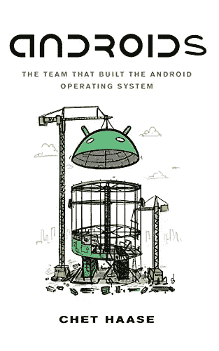

Front cover of Androids by Chet Haase

## 📗切特·哈斯的《机器人》——20 美元

谁不喜欢好故事？这本书将带你了解 Android 核心团队的旅程。这本书由切特·哈斯撰写，基于对早期参与 Android 项目的工程师的大量采访，将带你了解 Android 操作系统的起源。Chet Haase 在社区中非常有名，并且已经是几本书的作者。[更多详情](https://www.amazon.com/gp/product/1737354810/ref=as_li_tl?ie=UTF8&tag=sonique6784-20&camp=1789&creative=9325&linkCode=as2&creativeASIN=1737354810&linkId=d66d0a9b4c7138bb89fe0a798ff70469)

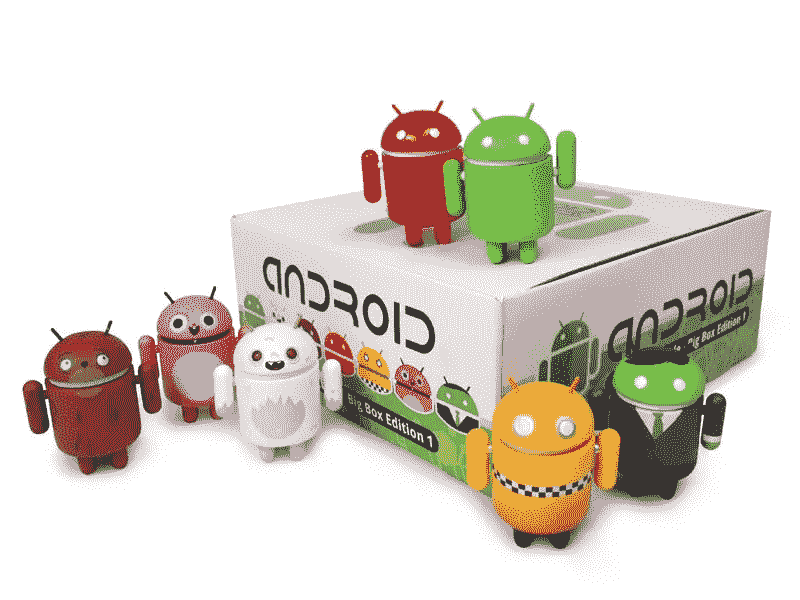

Android mini figures Edition 1 by Deadzebra

## 安卓迷你人偶——起价 10 美元

一些艺术家绘制了 Android 吉祥物并创造了迷你人物，他们在桌子或架子上看起来非常好，你可以肯定 Android 开发者会喜欢有一对夫妇。你可以找到一个代表你可爱的开发者😊。[更多详情](https://shop.deadzebra.com/categories/Android)

Keychron Q1

## ⌨️·奇龙 Q1——起价 160 美元

Android 开发者需要一个漂亮的键盘。机械键盘提供了精确的打字，同时提供了许多很酷的外形。我推荐 Q1，这是一个精简的键盘，有全尺寸箭头、功能键、带热插拔键的 RGB 背光，并支持 [QMK](https://qmk.fm) 来完全定制你的键盘。[更多详情](https://www.keychron.com/products/keychron-q1)

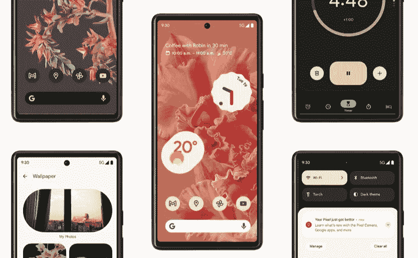

## 📱谷歌像素 6——820 美元

正如谷歌团队喜欢说的，Pixel 手机在这里向业界展示了 Android 操作系统可以做什么。在这个新版本 6 中，谷歌选择了一个非常容易识别的设计，同时集成了自己的芯片，以实现最佳的人工智能和相机性能。这是唯一支持你的手机。Pixel phone 非常适合开发，因为它们拥有谷歌的最佳功能。[更多详情](https://www.amazon.com/gp/product/B09HJZPFDD/ref=as_li_tl?ie=UTF8&tag=sonique6784-20&camp=1789&creative=9325&linkCode=as2&creativeASIN=B09HJZPFDD&linkId=0948762e58ba3b40a0b9f693c2a11477)

Brillant, learn science related things

## 🧠订阅辉煌

Android 开发者喜欢被刺激，学习新的东西，挑战自己。Brilant 提供学习科学，数学，物理，化学和其他主题，在你的手掌。课程很短，感觉像在玩游戏。这是一个很好的学习方法！[更多详情](https://brilliant.org/)

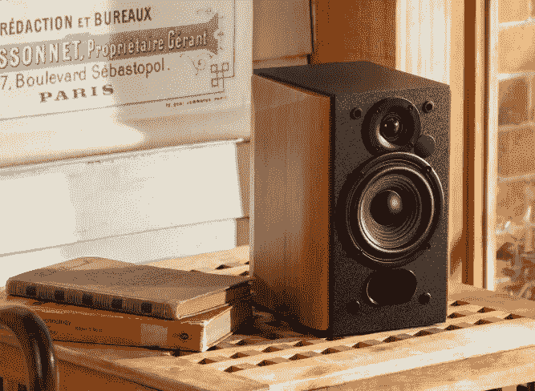

## 🔊Edifier R1380DB:书架扬声器——100 美元

好的曲调有助于开发者集中注意力并进入状态。这些书架音箱虽小，但功能强大。它们能发出很好的声音，放在桌子上看起来也很棒。它们配备了 Android 手机很好支持的 APTX，用于快速配对和改善带宽和延迟。[更多详情](https://www.edifier.com/int/product-r1380db.html)

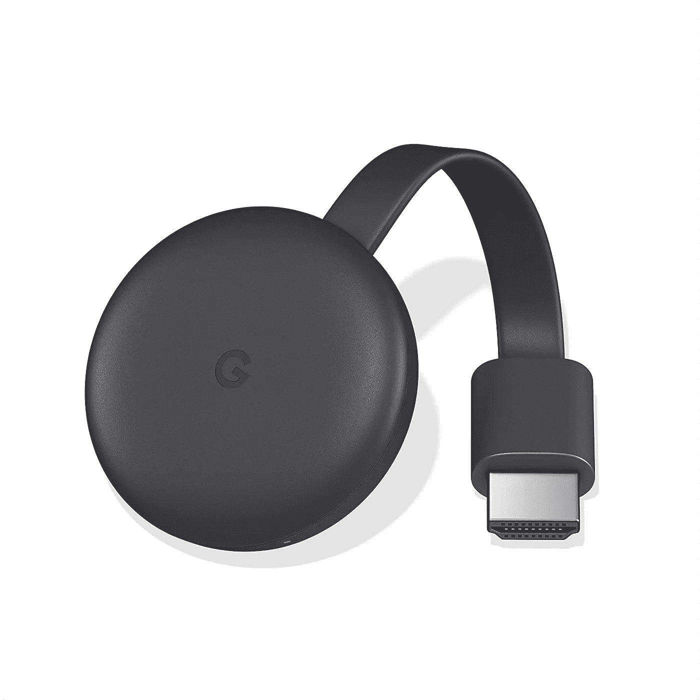

Chrome Cast by Google

## 镀铬铸件——30 美元

自推出以来，Chrome Cast 走过了漫长的道路，但它仍然是谷歌最好的产品之一。它将帮助 Android 开发者通过无线和 Android 手机将内容传输到电视、视频投影仪或其他显示器上。[更多详情](https://store.google.com/us/product/chromecast?hl=en-GB)

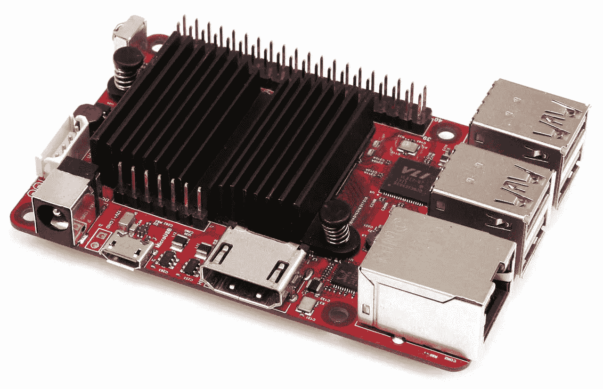

Ocroid C4 by Hardkernel

## 🤖奥德罗 C4——80 美元

这是打了类固醇的树莓派。虽然外形相对相似，但 Odroid 计算机具有更好的处理器和更多的 RAM。此外，他们配备了 Android 操作系统或 Linux，因此 Android Dev 可以将他们最好的项目带入生活！[更多详情](https://www.amazon.com/gp/product/B088CYXK6W/ref=as_li_tl?ie=UTF8&tag=sonique6784-20&camp=1789&creative=9325&linkCode=as2&creativeASIN=B088CYXK6W&linkId=9f1c530ecf8688deebc2682a40d402a8)

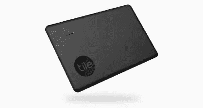

Tile keyring and card

## ◻️瓷砖——24 美元起

这个小设备将防止 Android 开发人员丢失他们的珍贵物品，钥匙，包，笔记本电脑…这些设备有不同的形状，所以你可以把它们放在你的钱包，钥匙圈或包里，它们还带有可更换的电池，所以它们更可持续，你永远不会再丢失任何东西！[更多详情](https://www.amazon.com/gp/product/B08BNQ9GS1/ref=as_li_tl?ie=UTF8&tag=sonique6784-20&camp=1789&creative=9325&linkCode=as2&creativeASIN=B08BNQ9GS1&linkId=70635d861b0ee761993666c628925dd2)

Sony WH-1000XM4

## 🎧索尼 WH-1000XM4

Android 开发人员喜欢安静的环境，因此他们可以专注于编写最好的 kotlin 代码。这些索尼耳机具有同类最佳的主动噪音消除功能，并且配有无线电源！[更多详情](https://www.amazon.com/gp/product/B08GKWXRF4/ref=as_li_tl?ie=UTF8&tag=sonique6784-20&camp=1789&creative=9325&linkCode=as2&creativeASIN=B08GKWXRF4&linkId=b735590d84b089043d5b667fe0e18df2)

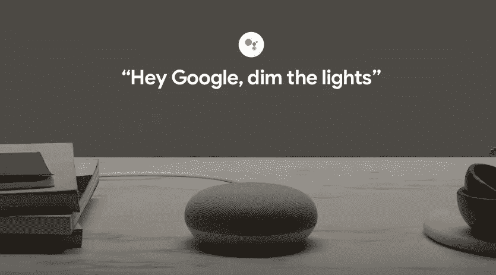

Google Nest Mini

## 谷歌巢迷你——49 美元

语音助手无处不在，谷歌 Nest Mini 是入门的理想产品，它有多种颜色，可以让 Android 设备与房间的其余部分相匹配。[更多详情](https://store.google.com/us/config/google_nest_mini?sku=_google_nest_mini_chalk&gclid=CjwKCAiA7dKMBhBCEiwAO_crFH0UWeh6WJvFUsnoIVPpLrOH21QWTOFXZ5DJXmYCBzuPV09uZ-uwhhoCFtwQAvD_BwE&gclsrc=aw.ds&hl=en-GB)

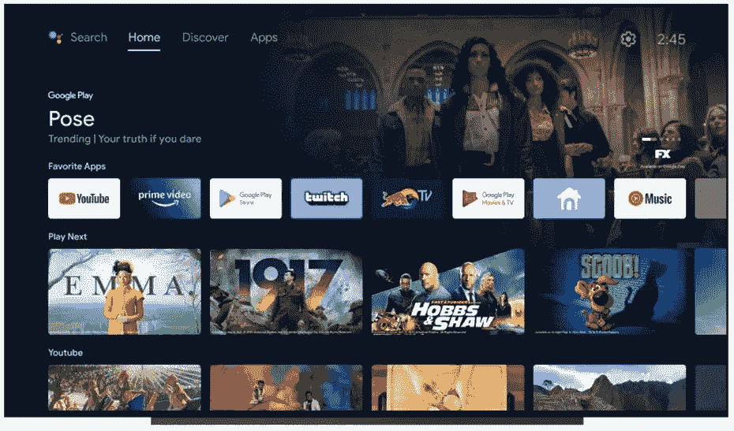

## 📺索尼 X900:安卓电视——1200 美元

他们是许多在电视中嵌入 Android 电视操作系统的制造商，但索尼是其中的佼佼者。它们从 65 英寸到 85 英寸不等，提供了出色图像和声音。他们允许整个家庭在大屏幕上享受 Android 应用程序和游戏，而 Android Dev 也可以使用该设备来测试他们的应用程序！[更多详情](https://www.amazon.com/gp/product/B084KQLVFH/ref=as_li_tl?ie=UTF8&camp=1789&creative=9325&creativeASIN=B084KQLVFH&linkCode=as2&tag=sonique6784-20&linkId=0ac3cf762e9e1b6b7086a960105bdcd4)

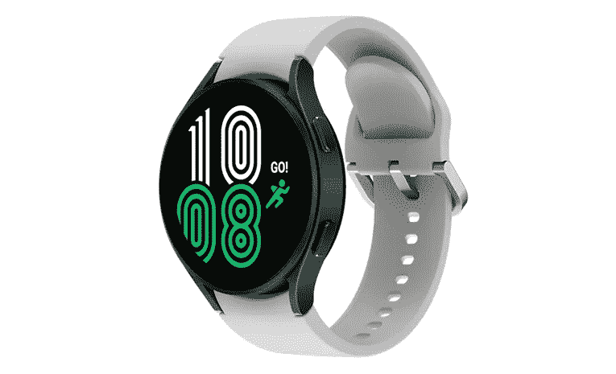

Samsung Galaxy Watch 4 — Green aluminium

## ⌚️三星 galaxy watch 4——249 美元

Galaxy Watch 4 时尚且可定制，是理想的伴侣。这是激励 Android 开发人员积极参与的好方法，也是进入 WearOS 并在物联网上试用 Jetpack Compose 的好方法！[更多详情](https://www.amazon.com/gp/product/B096BHLJ7V/ref=as_li_tl?ie=UTF8&camp=1789&creative=9325&creativeASIN=B096BHLJ7V&linkCode=as2&tag=sonique6784-20&linkId=f01379c26f72701536ec35e4d32418fb)

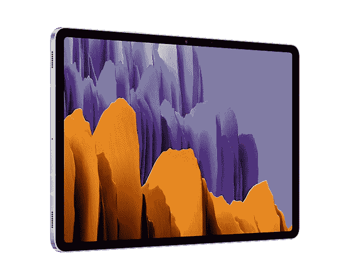

Samsung Galaxy Tab S7

## 三星 Galaxy Tab S7——550 美元

三星 Galaxy Tabs 是同类产品中最好的，拥有强大的处理器、Ram 负载、漂亮的屏幕，并配有手写笔，非常适合记笔记。对于 Android 开发人员来说，这是一个测试 Android 12L 大屏版本的绝佳设备。[更多详情](https://www.amazon.com/gp/product/B08FBN5STQ/ref=as_li_tl?ie=UTF8&camp=1789&creative=9325&creativeASIN=B08FBN5STQ&linkCode=as2&tag=sonique6784-20&linkId=801f52a0ac0d90f1bb1bf2061d28026e)

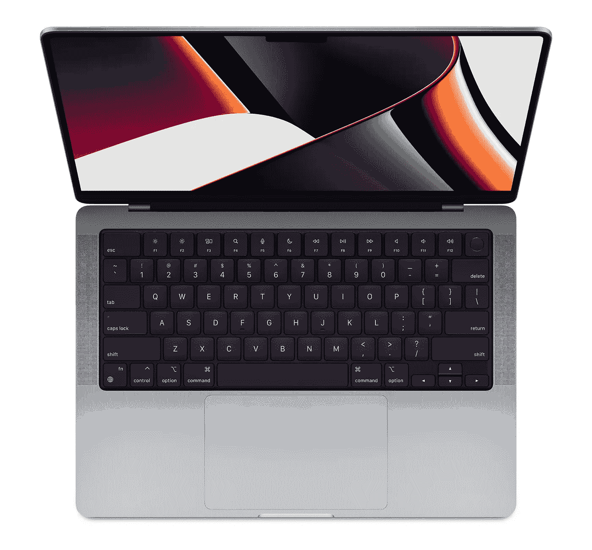

Apple Macbook Pro 14"

## 💻MacBook Pro M1Pro & MAX——2000 美元以上

苹果公司最近发布的新款 Macbook Pro 在性能方面堪称一流。Android Studio 大黄蜂🐝支持 [M1 Mac](https://gpeal.medium.com/the-m1-pro-for-android-engineers-a144093aa1ec) 的这台电脑将极大地加快升级速度。唯一的缺点是冬天你不能用那台电脑当取暖器😜。[更多详情](https://www.amazon.com/gp/product/B09JQSLL92/ref=as_li_qf_asin_il_tl?ie=UTF8&tag=sonique6784-20&creative=9325&linkCode=as2&creativeASIN=B09JQSLL92&linkId=bae97f88a6d6379d9c1d5ec9b267483c)

# 结论

这就是今年，我希望你能为对你有价值的人找到一些有趣的东西。我相信在圣诞树下找到这些礼物会是一个惊喜。节日快乐！