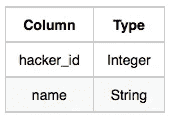
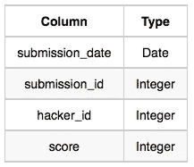
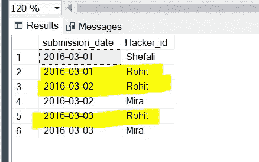
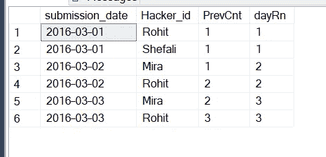
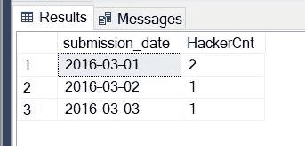
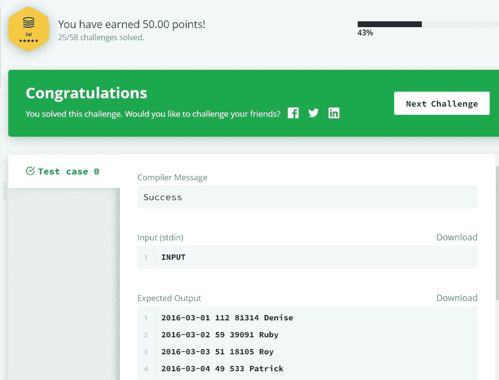

# 15 天学习 SQL : HackerRank

> 原文：<https://medium.com/geekculture/15-days-of-learning-sql-hackerrank-a40ab17ae462?source=collection_archive---------1----------------------->

硬连接:高级 SQL 连接


***问题陈述:*** Julia 进行了一天的学习 SQL 大赛。大赛开始日期为 2016 年 3 月 1 日，结束日期为 2016 年 3 月 15 日。
编写一个查询来打印每天至少提交了一次的独特黑客的总数(从比赛的第一天开始)，并找到每天提交次数最多的黑客的 hacker_id 和名称。如果不止一个这样的黑客有最大数量的提交，打印最小的 hacker_id。该查询应该打印比赛每一天的信息，按日期排序。

**输入格式:**以下表格保存比赛数据:

*   黑客:hacker_id 是黑客的 id，name 是黑客的名字。



*   提交:submission_date 是提交的日期，submission_id 是提交的 id，hacker_id 是提交的黑客的 id，score 是提交的分数。



下面是[链接](https://www.hackerrank.com/challenges/15-days-of-learning-sql/problem)到原 HackerRank 问题。

## 让我们把这个问题分成两部分

第 1 部分:找到每天提交数量最多的黑客的 hacker_id。

第 2 部分:获得每天至少提交一次的独特黑客的列表(从比赛的第一天开始)

**对于第 1 部分:**首先，我们将查询以获得 submission_date 和 hacker_id 的唯一组合，从而给出每个黑客在某一天提交的数量。

查询:-

```
select submission_date, hacker_id, count(1) as SubCount
from submissions
group by submission_date, hacker_id
```

然而，我们希望获得每天提交数量最多的 Hacker_id。所以我们将使用 RANK()窗口函数添加一个名为**‘Rn’的列。**

**OVER(按 SubCount desc，hacker_id 排序):**提交次数最多的 hacker_id，在不止一个 Hacker 提交次数最多的情况下，将给出最低的 hacker_id。

```
with MaxSubEachDay as (
    select submission_date,
           hacker_id,
           RANK() OVER(partition by submission_date order by SubCount desc, hacker_id) as Rn
    FROM
    (select submission_date, hacker_id, count(1) as SubCount 
     from submissions
     group by submission_date, hacker_id
     ) subQuery
)
```

**对于第二部分:**获得每天至少提交一份文件的独特黑客的名单(从比赛的第一天开始)

这部分相当棘手和复杂。我们需要一步一步钻过去。

例如，让我们为我们的提交采取以下输入。这里只有 Rohit 制造的..



**步骤 1 :** 创建一个 cte 来添加一个新列，该列将跟踪日期序列。也就是说，所有“2016-03-01”的提交将具有 dayRn = 1，“2016-03-02”的提交将具有 dayRn = 2，“2016-03-03”的提交将具有 dayRn = 3，以此类推..

```
DayWiseRank as (
    select submission_date,
           hacker_id,
           DENSE_RANK() OVER(order by submission_date) as dayRn
    from submissions
)
```


**步骤 2 :** 现在我们将逐行迭代，并将检查是否有任何 hacker_id 在前几天有提交。
例如，如果一条记录的 submission_date 是“2016–03–03”，我们将检查黑客是否在所有早于“2016–03–03”的日期中至少有一次提交。即“2016 年 3 月 2 日”和“2016 年 3 月 1 日”

```
HackerCntTillDate as (
select outtr.submission_date,
       outtr.hacker_id,
       case when outtr.submission_date='2016-03-01' then 1
            else 1+(select count(distinct a.submission_date)                         from submissions a where a.hacker_id = outtr.hacker_id and                              a.submission_date<outtr.submission_date)
        end as PrevCnt,
        outtr.dayRn
from DayWiseRank outtr
)
```



当 submission _ date = ' 2016–03–01 '或 dayRn = 1 时，我们将设置默认值 PrevCnt=1，因为第一天至少提交一次的所有黑客都将被计算在内。

**第三步:**现在我们将计算每天唯一的 hacker_id。
注意:我们使用了一个 where 条件‘where prev CNT = day rn’。
原因是，要将黑客视为“每天至少提交一份文件的黑客”，不同“提交日期”的计数应与当前提交日期相匹配。
在我们的示例中，对于日期“2016–03–03”，“Mira”已经提交了一份材料。虽然她也在 2016-03-02 年提交了，但她在 2016-03-01 年没有提交。因此，她不具备“每天至少提交一份文件的黑客”的资格。

```
HackerSubEachDay as (
    select submission_date,
    count(distinct hacker_id) HackerCnt
from HackerCntTillDate
  where PrevCnt = dayRn
group by submission_date
)
```



# 是时候把第一部分和第二部分结合起来了(Phewwww！！)

我们将把所有的 cte 放在一起，并将 HackerSubEachDay、MaxSubEachDay 与 Hackers 表连接起来，以获得相应的名称。

> 记住:我们必须应用' where MaxSubEachDay。“Rn=1 ”,因为我们只想要排名=1 的黑客，即在特定的一天提交数量最多的黑客。

```
with MaxSubEachDay as (
    select submission_date,
           hacker_id,
           RANK() OVER(partition by submission_date order by SubCount desc, hacker_id) as Rn
    FROM
    (select submission_date, hacker_id, count(1) as SubCount 
     from submissions
     group by submission_date, hacker_id
     ) subQuery
), DayWiseRank as (
    select submission_date,
           hacker_id,
           DENSE_RANK() OVER(order by submission_date) as dayRn
    from submissions
), HackerCntTillDate as (
select outtr.submission_date,
       outtr.hacker_id,
       case when outtr.submission_date='2016-03-01' then 1
            else 1+(select count(distinct a.submission_date)                         from submissions a where a.hacker_id = outtr.hacker_id and                              a.submission_date<outtr.submission_date)
        end as PrevCnt,
        outtr.dayRn
from DayWiseRank outtr
), HackerSubEachDay as (
    select submission_date,
    count(distinct hacker_id) HackerCnt
from HackerCntTillDate
  where PrevCnt = dayRn
group by submission_date
)
select HackerSubEachDay.submission_date,
       HackerSubEachDay.HackerCnt,
       MaxSubEachDay.hacker_id,
       Hackers.name
from HackerSubEachDay
inner join MaxSubEachDay
 on HackerSubEachDay.submission_date = MaxSubEachDay.submission_date
inner join Hackers
 on Hackers.hacker_id = MaxSubEachDay.hacker_id
where MaxSubEachDay.Rn=1
```

我们期待已久的时刻终于到来了…..



如果你觉得这篇文章有帮助，请与你的朋友和同事分享。如果还有其他问题，可以在[*Linkedin*](https://www.linkedin.com/in/shefali-bisht/)*上找我。*