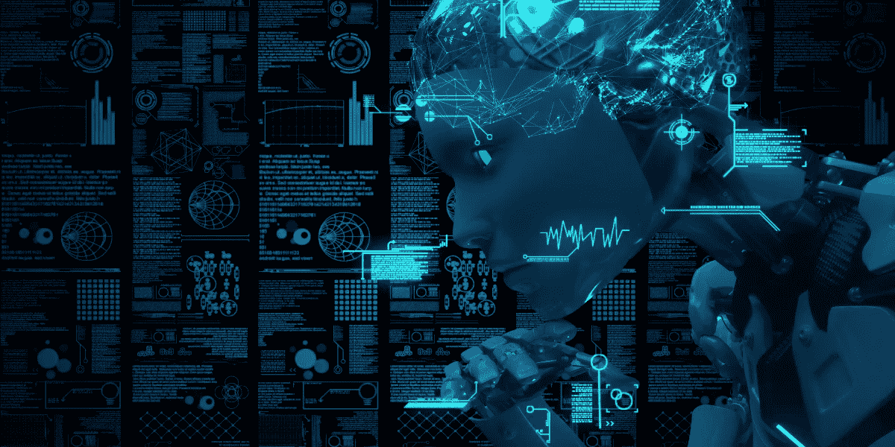
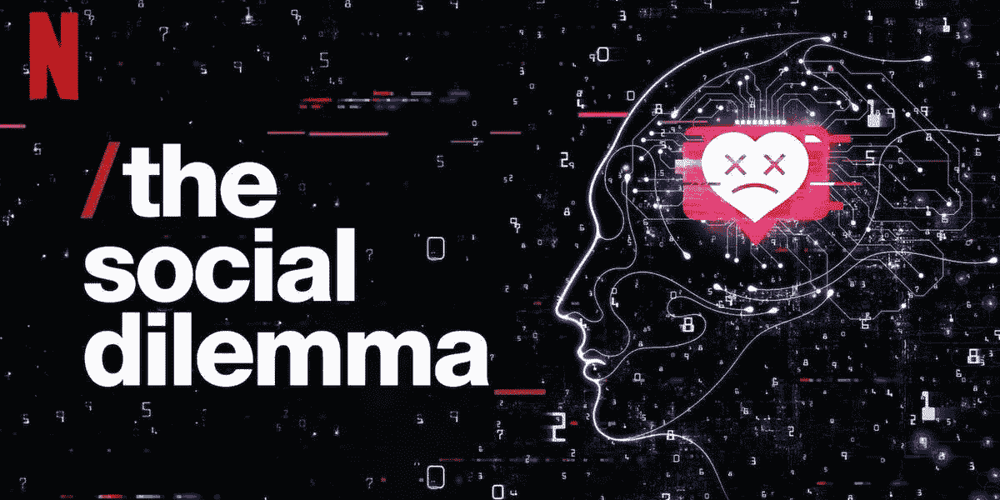
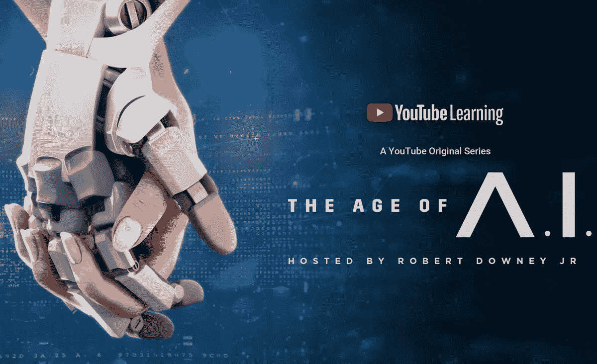
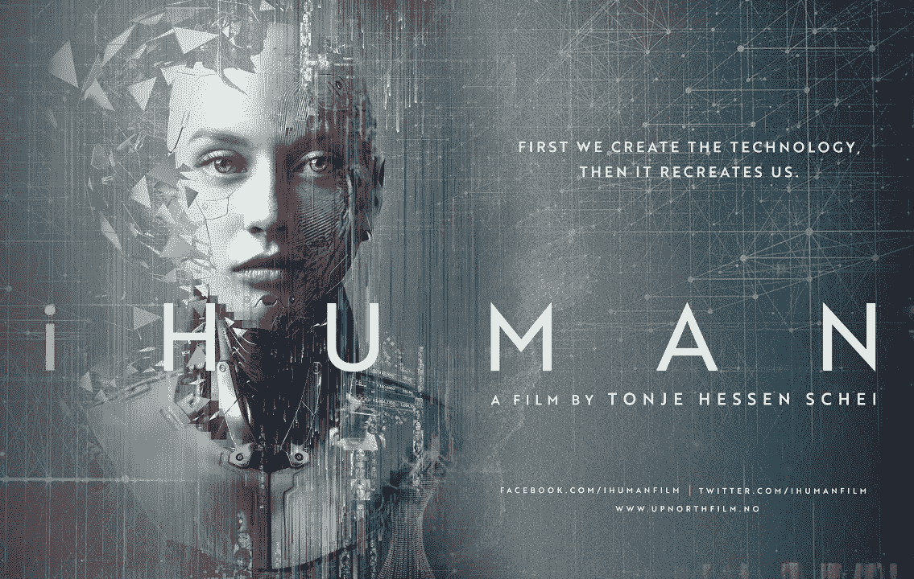

# 关于人工智能 UX 的 15 大资源

> 原文：<https://medium.com/geekculture/15-great-resources-about-the-ux-of-a-i-212fdee301fe?source=collection_archive---------23----------------------->

## 探索人工智能和机器学习如何影响我们日常体验的书籍、纪录片和播客。

Photo credit: Chunumunu, Getty Images

技术正在快速发展，我们看到人工智能(AI)和机器学习(ML)正在用于汽车、医疗保健和医药、营销、农业、生物识别和许多其他行业。这些技术的一些应用对社会负责，并极大地改善了日常生活，而其他应用则导致歧视和有害的用户体验。

这份书籍、纪录片和播客的列表将提供关于人工智能和人工智能如何影响人类体验的宝贵见解。

# 书

**1。** [**压迫的算法**](https://safiyaunoble.com/research-writing/)*作者萨菲亚·诺布尔博士*
发人深省地审视了搜索引擎和算法的不平等，因为数量有限的互联网搜索引擎和疏忽设计的算法导致搜索结果偏向白人，歧视有色人种，特别是有色人种妇女。基于对在线搜索和付费在线广告的研究和分析，作者揭示了搜索引擎如何延续污名。

**2。** [**科技之后的种族**](https://www.ruhabenjamin.com/race-after-technology)*鲁哈·本杰明博士*
深刻审视算法如何强化和加深社会不平等。作者展示了歧视性的设计，虽然看起来是中性的，但往往编码了不平等并放大了种族等级，她称之为“新吉姆代码”。对技术的追逐促使我们质疑技术和我们自己。

**3。** [**你的电脑着火了**](https://mitpress.mit.edu/contributors/mar-hicks)*作者 Mar Hicks*
这是一本散文集，突出了技术的负面影响，并展示了不平等、边缘化和偏见是如何融入技术和算法的。这本书是对行动的呼吁；去理解和解决这些技术问题，尽管这些问题有着非常真实的社会后果，但却经常被忽视。

**4。** [**人工怂**](https://www.amazon.com/gp/product/B08BT23822/)*作者梅雷迪思·布鲁萨德*
这本书让人们注意到技术可以解决一切的集体天真。作者是一名软件开发人员和记者，他通过一系列生动的个人故事指出了技术的局限性，这些故事讲述了人工智能在修复美国竞选财务系统、调查标准化测试问题以及无人驾驶汽车方面的经历。Broussard 断言，如果我们能够更好地选择什么可以用技术解决，什么不能用技术解决，那么我们就可以为每个人创造一个更美好的世界。

**5。** [**数学毁灭的武器**](https://www.amazon.com/Weapons-Math-Destruction-Increases-Inequality/dp/0553418815)*作者凯茜·奥尼尔，博士*
令人信服地审视了算法是如何在我们生活的每一个部分中被使用的，并假设技术是公平和公正的，但不幸的是，事实并非如此。它暴露了大数据的阴暗面，以及不受监管的黑盒算法如何被用于不计后果地做出有关民生的决策。作者呼吁政策制定者实施立法，呼吁算法工程师负起责任，呼吁我们要求改变。

# 纪录片

The Social Dilemma | 2020 | 2hr 35m

**6。** [**社交困境**](https://www.netflix.com/title/81254224)一部揭露社交媒体公司如何利用算法操纵人类行为的纪录片。它揭示了当我们不断滚动、点击、轻击和检查我们的应用程序时，我们是如何滑入的“T33”漩涡的。通过跟踪和测量我们采取的每一个行动，他们可以使用有说服力的算法设计模式，如垃圾邮件通知，虚假的稀缺信息，并提供确认偏差的内容，以有效地刺激，戳和戳我们。正如你将在这部电影中看到的，数字成瘾是一个日益严重的问题，它让我们不断渴望更多，永远无法满足。

Coded Bias | 2020 | 1h 25m

7 .**。** [**编码偏见**](https://www.netflix.com/title/81328723)由 Shalini Kantayyamit 执导，这部纪录片跟随麻省理工学院研究员 Joy Buolamwini 博士在面部识别算法中发现种族和性别偏见后的旅程。Buolamwini 博士研究了有偏见的算法，这些算法不能准确地检测出肤色较深的面部，或者对女性的面部进行了错误分类。她继续提高意识，并推动美国立法来治理算法偏见。乔伊现在是[算法正义联盟(AJL)](https://www.ajl.org/) 的创始人，呼吁研究人员、政策制定者和行业从业者采取行动，减轻人工智能的伤害和偏见。

Do You Trust This Computer? | 2018 | 1h 30m

**8。** [**你信任这台电脑吗**](https://doyoutrustthiscomputer.org/watch) 这部纪录片由包括吴恩达、石黑一雄、埃隆马斯克在内的专家评论，讨论了人工智能的进化。从超人的好处到潜在的危险和风险，这部电影探索了人工智能过去和现在的应用，包括人工智能驱动的假新闻，机器人伴侣，无人机和机器人辅助手术。这一篇有点悲观，但它绝对是有见地的，并提出了许多关于疏忽设计和使用人工智能的结果的有效关注。

The Age of A.I. | 2019 | 8 episode docuseries

**9。** [**人工智能时代**](https://youtube.com/playlist?list=PLjq6DwYksrzz_fsWIpPcf6V7p2RNAneKc)由小罗伯特·唐尼讲述，这部纪录片展示了人工智能和机器学习的许多惊人好处。与警告人工智能疏忽和滥用的电影引发的恐惧相反，这个系列给了我这么多希望。这部电影展示了许多关于人工智能在医疗保健和医学中的好处的故事，其中有一些真正突破性的研究和创新，正在改善人们的生活。

iHuman | 2019 | 1h 39m

10。一部真正的政治惊悚纪录片。它专注于人工智能技术可能对我们的社会产生负面影响的方式。它讨论了不道德和不负责任的人工智能工程如何加剧现有的系统性不平等和不公正，以及对有关数据收集、监控和生物识别技术使用的监管政策的需求。

# 播客

**11。** [**激进的人工智能播客**](https://www.radicalai.org/)由 Dylan Doyle-Burke 和 Jess Smith 主持，激进的人工智能播客中心在工业界和学术界就人工智能伦理领域以及人类和机器学习之间的关系进行对话、合作和辩论。

**12。** [**由 Sam Charrington 主持的 TWIML AI 播客**](https://twimlai.com/)TWIML AI 播客将来自 ML 和 AI 领域的顶级思想和想法带到了一个由 ML/AI 研究人员、数据科学家、工程师和精通技术的业务和 IT 领导者组成的广泛而有影响力的社区。

**13。** [**你是机器人吗？由 Demetrios Brinkmann 主持的《你是机器人吗》通过采访专家和思想领袖，探讨了围绕技术的伦理问题以及技术给人类带来的挑战和机遇。**](https://www.areyouarobot.co.uk/episodes)

14。在詹妮弗·斯特朗主持的《我们信任的机器》中，我们通过研究人工智能对我们日常生活的深远影响，并通过人们对技术力量的思考来探索人工智能的崛起，来审视将我们最敏感的决策委托给人工智能意味着什么。

15。 [**机器伦理播客**](https://www.machine-ethics.net/podcast/)由本·拜福德主持，机器伦理播客采访了学者、作者、商业领袖、设计师和工程师，主题是自主算法、人工智能、机器学习和技术对社会的影响。

# 最后的想法

人工智能有可能改善人类的体验，也有可能摧毁它。人工智能的一些使用导致了排斥甚至悲剧——人脸识别中的[算法偏差](http://gendershades.org/)和特斯拉驾驶辅助功能中的[过度自信](https://www.theguardian.com/technology/2016/jul/02/elon-musk-self-driving-tesla-autopilot-joshua-brown-risks)就是这样的例子。而人工智能的其他应用对社会负责，并创造了生活增强技术，如[大脑控制的机器人假肢](https://medicalfuturist.com/the-future-of-prosthetics-depends-on-a-i/)。

为了最大限度地减少人工智能的疏忽使用，我们需要企业在 STEM(科学、技术、工程和医学)招聘和晋升中致力于多样性、公平和包容性，主动寻求第三方审计，并确保他们使用包容性的培训数据集。还需要更多的公众意识到疏忽设计的人工智能的风险，因为公众监督和请愿是政策变化的强大催化剂，以加强算法问责制。

> 我们可以使用人工智能来治疗疾病，应对气候变化，让每个人摆脱贫困……但是，我们可以使用完全相同的技术来创建一个残酷的全球独裁政权，带来前所未有的监控、不平等和痛苦。
> —最大泰格马克

# 谢谢你

如果你喜欢这篇文章，关注我:[Medium](/@itsuxforthewin)|[insta gram](https://www.instagram.com/ux.forthewin)|[Twitter](https://twitter.com/uxforthewin)

如果你喜欢看这样的文章，想支持我这个作家，可以考虑报名[成为媒介会员](/@itsuxforthewin/membership)。每月 5 美元，可以无限制地访问所有媒体文章，加上支持我的写作，因为我将赚取一小笔佣金。

 [## 通过我的推荐链接加入 Medium-Trina Moore per wall

### 作为一个媒体会员，你的会员费的一部分会给你阅读的作家，你可以完全接触到每一个故事…

medium.com](/@itsuxforthewin/membership)