# ML 项目中产品经理的 15 条关键经验

> 原文：<https://medium.com/geekculture/15-key-learnings-for-product-managers-in-ml-engagements-75eb8d92f4bc?source=collection_archive---------11----------------------->

> 分享从 ML 产品管理的世界中学到的一些关键知识。

Credit : Arseny Togulev on Unsplash.com ([https://unsplash.com/@tetrakiss](https://unsplash.com/@tetrakiss))

你知道吗，亚马逊 35%的销售额来自产品推荐。

你知道吗，Spotify 的 Discover Weekly 和 Release Radar 播放列表是机器生成的，占该平台所有收听量的 [31%](https://digital.hbs.edu/platform-rctom/submission/spotify-the-machine-using-machine-learning-to-create-value-and-competitive-advantage/) ？

此外，你知道吗，令人印象深刻的[网飞 80%](https://www.wired.co.uk/article/how-do-netflixs-algorithms-work-machine-learning-helps-to-predict-what-viewers-will-like#:~:text=More%20than%2080%20per%20cent,black%20box%20of%20an%20algorithm.) 的流媒体播放时间是通过其推荐系统获得的，这相当于节省了 1B 美元的客户获取成本。

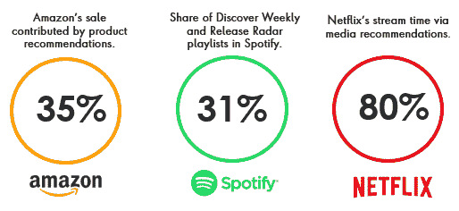

嗯，这些科技公司有一个共同的特点，那就是强大的数据驱动文化，这种文化利用了人工智能、机器学习和深度学习等最新技术，你一定不会感到惊讶。

当 Gartner 在今年早些时候发表的[“Gartner 对新兴技术的炒作周期，2020”](https://www.gartner.com/smarterwithgartner/5-trends-drive-the-gartner-hype-cycle-for-emerging-technologies-2020/)中扩大其对人工智能技术的报道时，这一点就很明显。它还提到，到 2021 年，80%的新兴技术将拥有人工智能基础。

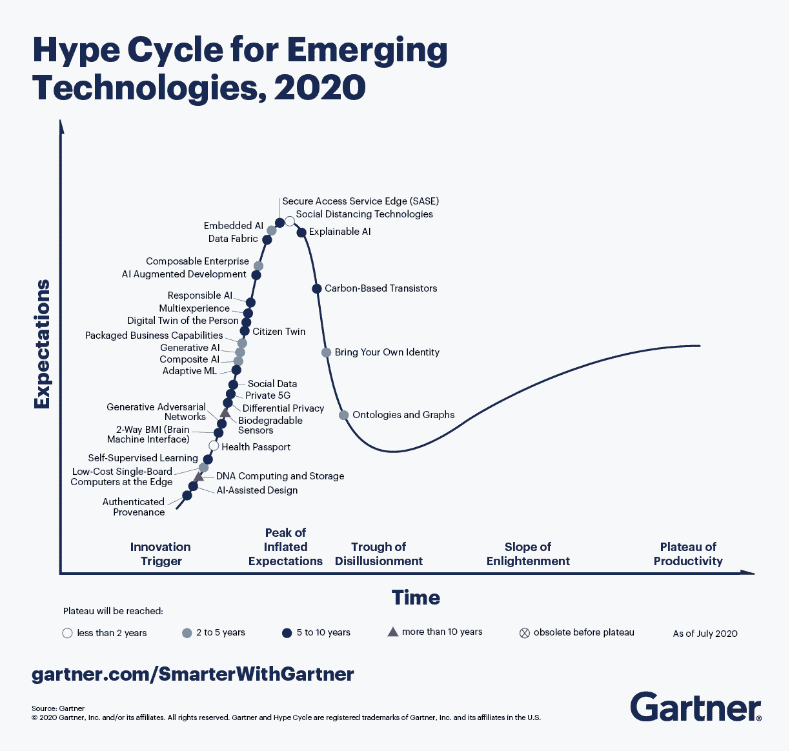

Source : Gartner

尽管头条新闻堪称典范，但全球许多组织仍在努力利用这些颠覆性技术获取可观的商业价值。根据 IDC 的报告，全球 25%已经在使用人工智能解决方案的组织报告了高达 50%的失败率。调查还显示，不切实际的期望和缺乏技术人员是失败的主要原因。

对于成功的公司来说，“数据优先”或“人工智能优先”，文化不仅帮助他们调整了人员和流程，还调整了他们的目标。他们在开发 AI/ML 平台方面表现出色，这些平台随着业务优先级的变化而不断调整，以保持高效。

我和 Nithin Subhakar (@nithin subhaka)会试着把它分解成 15 个简单的步骤。

# **前言**

根据我们的经验，产品经理不仅需要在协调商业价值交付方面发挥关键作用，还需要与 ML 工程师、数据科学家和数据工程师广泛合作，了解 ML 项目的实验性质。

我们很高兴分享我们从 ML 项目中获得的一些重要经验，我们希望开始 ML 之旅的产品经理会发现这些经验非常有用。

在我们学习关键知识之前，让我们先了解什么是 ML 产品开发生命周期。

# **ML 产品开发生命周期**

典型的 ML 产品开发生命周期概述了产品开发的主要阶段，产品经理了解他们的职责以及这些阶段所需的核心技能是至关重要的。重要的是，这些阶段的循环性质描述了每一个 ML 项目的真正 DNA 实验性的和持续的改进。

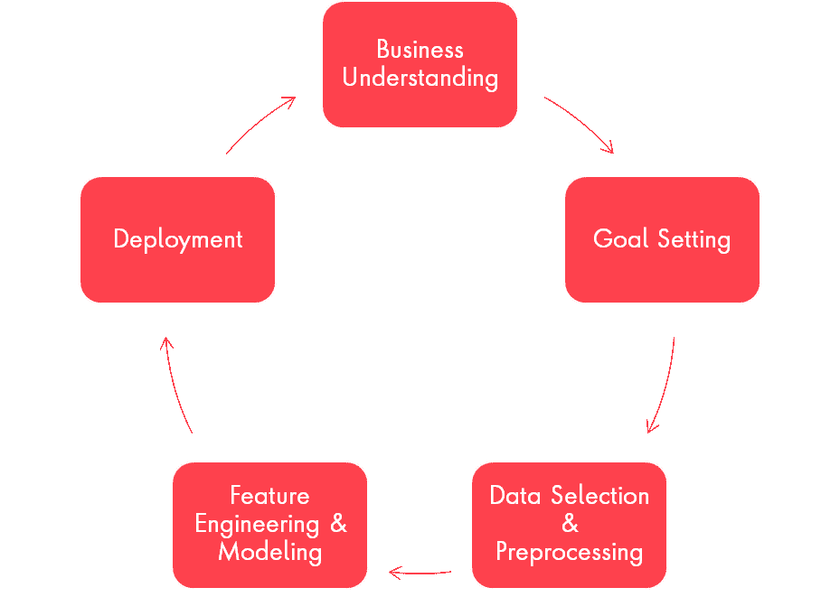

现在，让我们在下面的小节中详细了解这些阶段。每个部分都以一个表格结束，该表格记录了关键的学习内容，并指明了产品经理在各个阶段的预期参与程度。

> **业务理解**

理解业务背景和战略要求是产品成功的关键，产品经理需要与所有相关利益相关者密切合作，以建立对产品的“*”*和“*为什么*”的牢固理解。

***恰当的例子:*** *根据 CyberSource 的全球欺诈* [*报告*](https://www.cybersource.com/content/dam/cybs2019/documents/global-fraud-report-2019.pdf) *，相当大比例的全球电子商务企业将其年度电子商务欺诈管理预算分配给订单审查人员以及系统自动化。对于正在增长的电子商务企业，依赖于审查人员和/或基于规则的交易审查系统最终会造成一个问题，即随着交易量的增长，假阳性会增加。在这种情况下，机器学习是一种明确的策略，因为它可以处理大型数据集，并以合理的精度检测大规模模式。*

根据经验，当您的业务目标属于需要实现复杂逻辑、高级个性化、更快的业务流程扩展或实时规则生成的类别时，ML 通常是一个明确的策略。

看待这个问题的另一种方式是今天的商业决策是如何制定的。比方说，如果人类的预测或多或少是准确的，而一个 ML 模型在同样的水平上运行，那么你最好以人类的方式做决定。然而，当预测精度不是边际的，并且在部署基于 ML 的决策支持系统时有显著的改进时，那么 ML 就有明确的商业案例。例如，在一家玩具制造公司，一位经验丰富的销售经理很有可能是一个很好的需求预测代理，根据这种经验和直觉，偏差为+/- 30%,这种偏差必然会转化为组织的库存成本增加或销售收入损失。一个基于 ML 的需求预测系统，可以在偏差+/- 10%的情况下进行预测，从而增加商业价值。

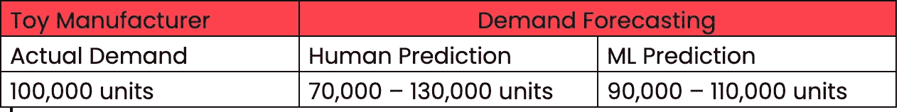

可以想象，即使单位成本为 20-25 美元，即使预测略有改善(5%、10%、15%……)，对业务绩效的影响也是巨大的。

对于产品经理来说，这(业务理解阶段)是确保成功的生命周期中最重要的阶段之一。

> **目标设定**

在这个阶段，业务目标转化为产品目标。鉴于 ML 项目的实验性质，ML 目标由可观察的可量化成功指标及其目标值(成功的定义)组成。常见的成功指标包括准确度、精确度和 F1 分数(精确度与召回率)等等。例如，成功的衡量标准可以是你的电子商务业务的产品推荐准确性，或者是信贷业务中违约预测的准确性。

在没有之前的性能报告可用的情况下，产品经理需要与 ML 工程师合作执行预期的模型性能练习，这类似于无需花费太多时间和精力即可完成的技术高峰，而不是基于定性信息或简单的启发式方法来设定目标。这一步对于获得领导层的初步认同至关重要，尤其是在刚刚开始 ML 之旅的组织中。

强烈建议产品经理在持续的基础上重新审视 ML 目标，以评估模型随着时间的推移表现如何。它还作为一种反馈机制，用于在适当的时候重新审视业务目标。

下图展示了目标设定过程以及验证目标在成功交付优秀产品中的重要性。

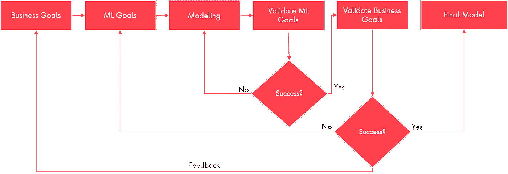

***典型案例:我*** *在最近与一家汽车客户的合作中，业务目标是将他们的产品开发研究周期从 3 个月缩短到 1 个月(周期时间减少了 66%)。我们交付的基于 ML 的产品是一个文章推荐工具，它将为研究人员提供上下文搜索功能，以检索最相关的文章。从目标设置的角度来看，成功度量是前 100 篇列出的文章中相关文章的百分比，成功被定义为 95%的相关性(即前 100 篇文章中的 95 篇必须与用户搜索的主题相关)。*

*另一个例子是，一家零售商设定了总销售额增长 20%的目标。在许多适用的基于 ML 的策略中，一个可能的策略是细化个性化产品推荐，这将导致更多的转化。如果目前的成功率是 10%，那么我们可以考虑设定 15%的目标。通常，倾向于设置更高的值，例如本例中的 50%，但我们不建议这样做。*

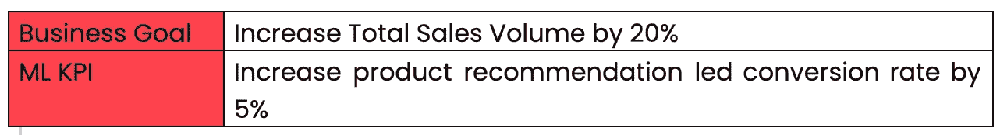

目标设定练习还有助于评估我们是否有使用 ML 的有效商业案例。如果预期的模型性能与业务预期不一致，ML 可能不是理想的策略。比方说，如果您正在开发一个天气预测模型，并且在多次建模迭代结束时您可以达到的最佳精确度为 70%，那么它仍然没有达到接近精确预测的目标。

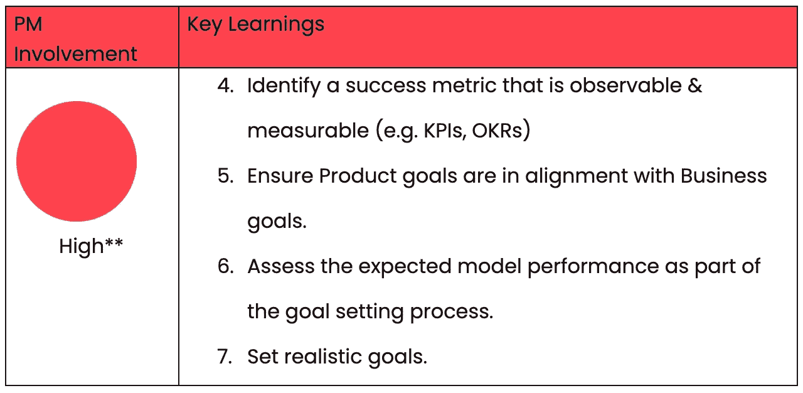

> **数据选择&预处理**

在数据选择上，产品经理需要识别各种数据源(文件、数据库、web 等。)以及评估哪些数据集是可用的、缺失的和不相关的。他们还需要评估数据集的数量和质量。根据经验，数据越多，预测就越准确。

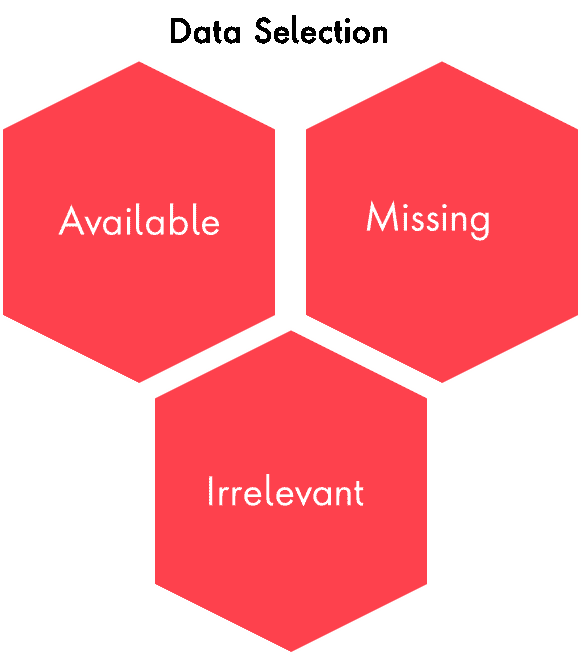

产品经理需要与数据工程师密切合作，对数据进行预处理。预处理就是让数据符合目的，一些关键技术包括:

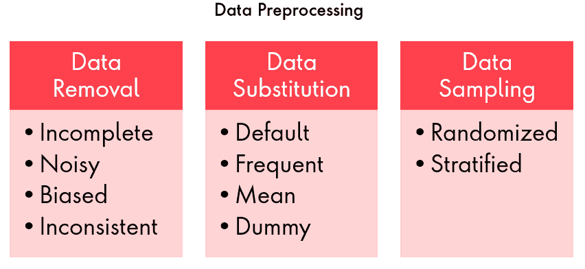

***恰当的例子:*** *一家活动管理公司希望增加即将举办的活动的客户人数，并计划通过电子邮件活动锁定合适的客户群。他们可以部署一个 ML 模型来预测最有可能参加活动的客户。产品经理需要确定用于收集客户订单历史、客户人口统计数据等的数据源。需要验证可用的数据集，以发现缺失、重复和不一致的条目。需要时，产品经理需要与数据工程师合作，将原始数据转换成可用的格式。*

*为了在这种情况下开发逻辑回归模型，因变量可以是 y =客户是否会参加活动，自变量可以是 x1-活动参加历史，x2-年龄，x3-职业，x4-支付方式，X5-位置，X6-推荐和 x7-收入。作为一名产品经理，您应该能够丢弃与支付方式(x4)相关的数据集，因为它们不相关；丢弃与收入(x7)相关的数据集，因为它们不可靠、不完整，尽管它们很重要。*

我们还想列举一些数据选择的其他关键方面。

**偏见的作用**

需要注意的一个关键点是，作为产品经理，我们在开始构建产品之前，会有自己的偏见。一个多样化的数据集本身无法帮助你从正在建立的技术中摆脱人类偏见，因为从本质上来说，机器学习试图模仿人类行为，因此产生了诸如交互偏见、潜在偏见和选择偏见等偏见。这里有一个来自[谷歌](https://www.youtube.com/watch?v=59bMh59JQDo&ab_channel=Google)的简单解释。有时，偏见的范围可以从从屏幕上选择鞋子类型的琐碎话题到包括性别不平衡在内的敏感话题。我相信我们大多数人都知道这个臭名昭著的故事。我们知道一个理想的状态是不可能的，但是我们应该试着在更短的时间内做出比人更好的决定。强烈建议从选择正确的数据集开始，然后不断检查相同的数据集。

**因果关系&关联关系**

这里我们想提到的另一个相关点来自经济学和统计学领域——因果关系和相关性。通常，我们倾向于得出一个错误的结论，即使它纯粹是基于数据。虽然这个话题太长，无法在这里涵盖，但我们强烈建议你浏览一下这篇[文章](https://www.youtube.com/watch?v=GtV-VYdNt_g)，它不仅能让你对这个话题有足够的敏感，还能以一种有趣的方式解释这个问题。您可以在上面的例子中联系到这一点，其中 PM 可能不得不丢弃 x4 和 x7。
变量之间可能存在线性关系，但证据可能证明并非如此。

产品经理可能还需要与数据工程师合作，确定高可用性和可靠性的数据管道，并且可以无缝地处理可伸缩的数据流入。

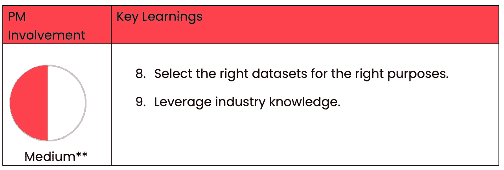

> **特征工程&造型**

产品经理需要有一种实验的心态。他们应该能够考虑到产品目标的认知，然后思考有哪些可能的建模技术，比如有监督的或无监督的 ML，可以帮助他们实现目标。这在本质上是实验的手艺。

大多数情况下，产品经理参与执行不同的实验，如 A/B 测试或多变量测试，以测试基于他们所做的初始用户研究的假设。这包括对统计学和设计原则的理解。

然而，构建 ML 产品所需的实验可能会有所不同。产品经理需要指导 ML 工程师提出不同的模型，并帮助他们选择最佳模型以确保成功。

***例子:*** *这里指的是我们过去与一家汽车客户的合作。我们和一个 ML 工程师团队合作建立了一个文档排名模型。从为 Word2Vec 模型定义主题 n-grams 的角度来看，我们的角色派上了用场。我们不断地与团队一起开发模型，持续地部署和评估它。同样，结果在本质上不是二元的，达到可接受的水平需要时间。我们能够利用名为* [*KaaS*](https://www.publicissapient.com/solutions/kaas) *的内部基于 ML 的产品，该产品通过利用现成的服务(如语义排名和释义检测)帮助我们减少了模型训练工作。*

***典型案例:*** *在与一家全球 CPG 客户的另一项合作中，业务目标是提高其网站的访客参与度。这里的策略是首先确定访问者的需求，然后为他们提供最相关的内容。在这种情况下，产品线是一种护发产品和配套内容，旨在帮助顾客找到适合他们特定头发问题的产品——卷曲的头发、油性头发、稀疏的头发。ML 无疑是通过个性化产品推荐来改善这种体验的最佳策略。设计的解决方案是一个基于 NLP 的 ML 模型，它通过 tf-idf、LDA、textRank 等算法对产品描述数据进行分类，以提取最突出的关键字，然后是另一个 ML 模型，该模型根据这些关键字和访问者传递的组合输入(通过在线测验)预测产品得分。我们能够看到访客参与度的大幅提升，因为访客能够找到与他们需求最相关的产品。*

类似地，ML 团队可以提出 n 种模型，产品经理应该通过给出重要的输入和交流预期的输出来指导他们。

下图最好地解释了这一循环:

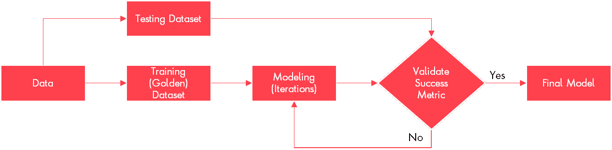

本质上，产品经理应该帮助团队找到最佳模型，这可能涉及以下活动:

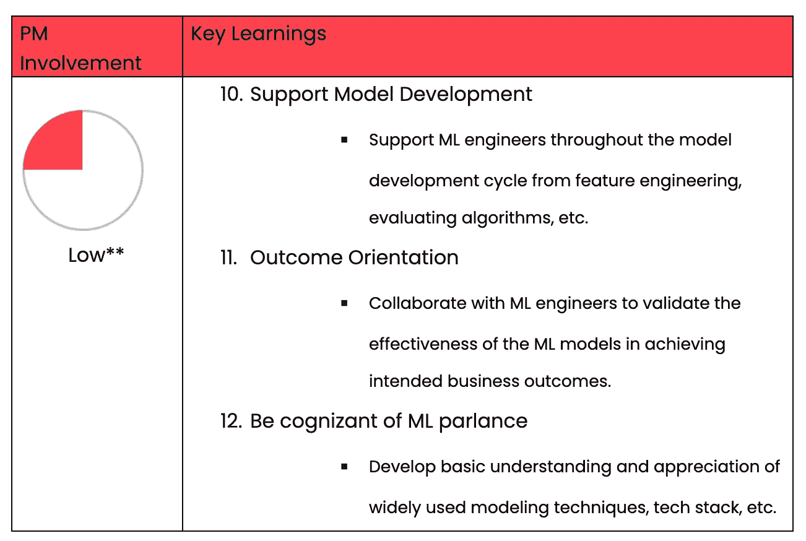

> **部署**

部署是 ML 模型的最佳版本上线的最后一步。产品经理需要对照 ML 目标(ML KPIs)评估模型的性能，并评估任何偏差。

同样值得注意的是，模型性能需要根据不断变化的业务需求进行评估。产品经理必须依靠透明的沟通，以防模型性能和制定推广战略出现偏差。产品经理需要与所有相关的利益相关者密切合作，以设定部署节奏，比如每天、每周、每月、每季度等等。

如果出现延迟问题，产品经理需要与 ML 工程师合作，改善机器学习模型的性能(输出滞后)。

***典型的例子:*** *基于用户活动模式以及新内容创建的速度，可以说对于社交媒体平台来说，模型部署的步调千差万别。脸书和 YouTube 等平台一直遵循实时部署节奏。*

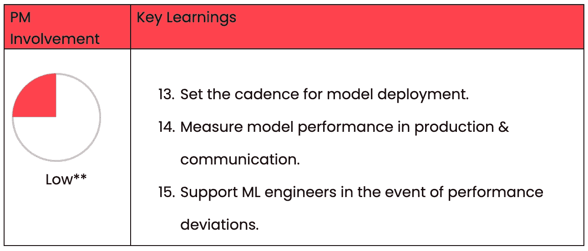

这些是我们的主要收获！在我们结束之前，还值得分享一下在 ML 项目中工作时软技能的重要性。通常情况下，团队成员是硕士或博士，我们必须了解他们的观点才能进行有意义的对话。从科学或统计的角度来看待事物确实需要一种新的思维方式。说到这里，我们想打破产品经理需要像数据科学家一样技术过硬的神话。今天，产品经理可以通过利用开源应用程序，如 Google Colab、Jupyter Notebook 和最近推出的亚马逊 ML 大学，获得人工智能和 Ml 的最低水平。同样，一个人的学习没有限制，越多越好，然而产品经理的最终目标是通过交付商业价值来确保项目的成功。

虽然它非常令人兴奋，同时也非常复杂，但 ML 旅程每天都在向我们展示新的知识和挑战。我们希望这些知识对您有所帮助，并希望听到您对自己的体验和喜爱的 ML 产品的看法。

谢谢大家！

舒巴姆·特里帕蒂

[https://www.linkedin.com/in/shubhamtripathi-iimb/](https://www.linkedin.com/in/shubhamtripathi-iimb/)或
shubham5strings@yahoo.in

请在下面写下你的意见，如果有任何反馈，请通过 LinkedIn 联系我。让我们一起增长知识。