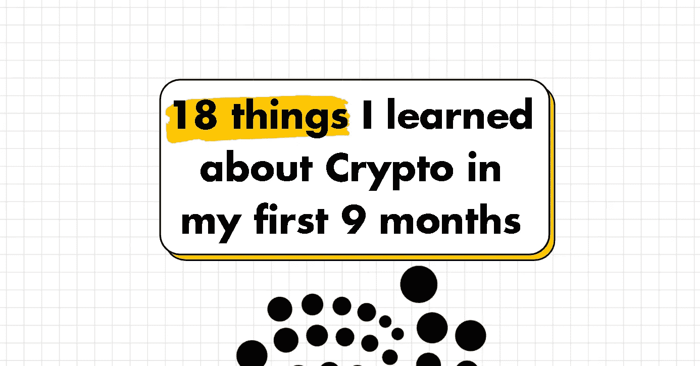
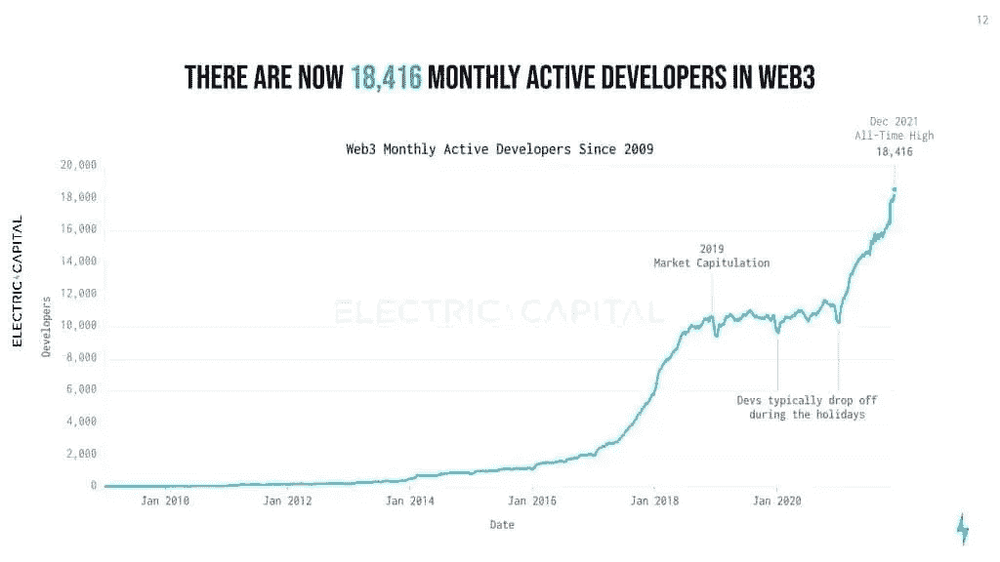
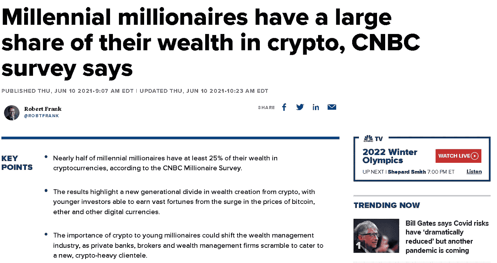
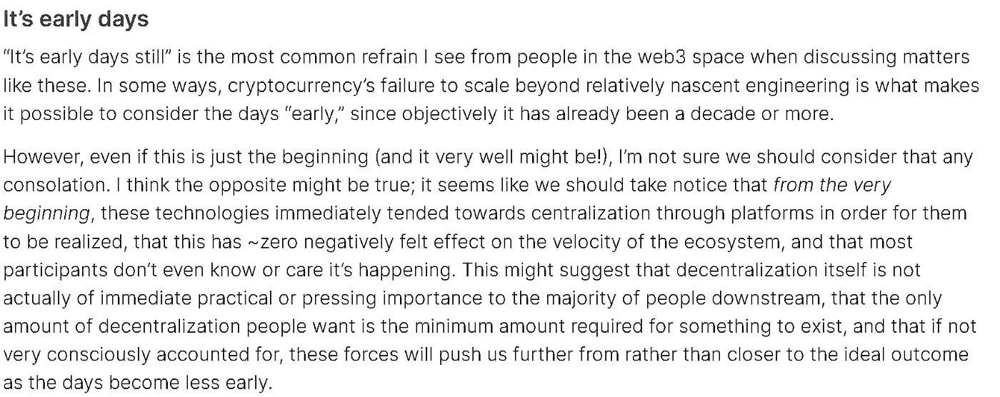

# 我在头 9 个月学到的关于加密的 18 件事

> 原文：<https://medium.com/geekculture/18-things-i-learned-about-crypto-in-my-first-9-months-9540e9280d75?source=collection_archive---------14----------------------->

By me :)

# 在你 100%准备好之前做事

加密速度很快。几年前，整个行业都暴露出来了。每个人都还在学习，没有专家，很多机会就在那里。最好的开始方式就是开始！

你可能永远不会 100%准备好。停止等待那一天，开始吧。你会学到比等待更多的东西。

# 你会感受到 FOMO

你会错过一些项目。没事的。还会有其他的机会。有时我在夜里醒来，心想“如果我加入了无聊猿游艇俱乐部或者 T2 帕克 NFT 项目会怎么样？”。嗯，我没有，但是外面还有很多事。

正常化 OMO(可以忽略)

> “FOMO(害怕错过)是珍惜自己时间的敌人”
> 
> —杨安泽

# 建立关系

Crypto 拥有最支持它的社区。你会惊讶于你交了多少朋友。找到你可以信任和支持的人。

*(提示:多使用 Twitter 和 LinkedIn 的 DMs)*

> “我相信，只要你愿意帮助足够多的人得到他们想要的东西，你就能得到生活中你想要的一切。”
> 
> ——金克拉

# 相信你的直觉

如果事情看起来是对的，那就去做吧。如果有什么不对劲，走开。不要只是随大流。我自己参与了很多项目，失去了很多，但直到今天我都不后悔。此时此刻，感觉很好，我也做了一些很好的动作。

# 跟不上也没关系

加密速度很快。你会错过很多。现实中，没有人什么都跟上。

按你自己的步调做事。

# 建筑工人来了。

下一代创业公司将出现在 web3 中。

# 思想开放

密码是新的。有些事情一开始听起来会很疯狂。所以不要急于判断/驳回事情。

要有“我们怎样才能让它工作”的心态，而不是“它不会工作”。毕竟最好的创新都是从“疯狂”开始的。

# 有不懂的地方没关系。

这些点最终会连接起来。直到今天，我还在学习很多东西。每天都有一个新的项目，一个新的术语，一个新的 DAO，一个新的密码…

# 加密将创造百万富翁

像这样的机会一生只有几次。

我们很幸运能经历这一切。

充分利用它。

From [CNBC](https://www.cnbc.com/2021/06/10/millennial-millionaires-have-large-share-of-wealth-in-crypto-cnbc-survey-.html)

# 你会搞砸的

这是必然的。深呼吸。没事的。我们都会犯错。

但这就是我们如何学习并为下次做得更好💪

# 不对称上行

如果你输了，你就输了 1x。但如果你赢了，上升空间是无限的。

找到最好的然后拿走。

# 要耐心

ETH 跌至 400 美元以下已经两年多了。如果你真的相信什么，给它时间。

并且考虑长远。

# 写内容

99%的人消费内容。1%创建内容。写作迫使你学习和表达你的想法。

Twitter 是一个很好的起点。Reddit 和 LinkedIn 也有他们的特权。

# 忽略那些小事。

不要浪费时间试图将 NFT 从 0.1 ETH 转换到 0.2 ETH。想想火箭🚀

胸怀大志。

# 欣赏创造力

crypto 里有很多模仿者。他们有时称之为“衍生品”。找到跳出框框思考的人。

(尤其是艺术家)

# 互相帮助。

鼓掌的费用是 0 美元。评论费用为 0 美元。
关注的费用为 0 美元。

此外，分享一路走来的收获！

# 人们不会理解你的。

*“我为什么要买 JPEG？”*

对于你周围的人来说，加密听起来就像胡言乱语。耐心点。在他们最终需要你帮助的时候出现在他们身边。

From Visualize Value

# 东西还是坏的

但情况正在好转。就像任何新的创新一样。起初，事情会杂乱无章，效率低下。有时也充满了骗局。

相信我，一切都会好起来的。

By [Moxie](https://moxie.org/2022/01/07/web3-first-impressions.html)

## 结论

我们来早了，lol，其他人也是。没有专家，有很多机会。

## 👇评论一下你开始下兔子洞的时候学到了什么？

> *👋* ***跟我来*** *上* [*中*](/@pooriaarab)*——*[*领英*](https://www.instagram.com/pooria.arab/)*——*[*推特*](https://twitter.com/pooria_arab)*——*[*insta gram*](https://www.instagram.com/pooria.arab/)*——*[*抖音*](https://www.tiktok.com/@pooria.arab)
> 
> 更多关于 Web3，Crypto，NFTs，DeFi 等的好东西…